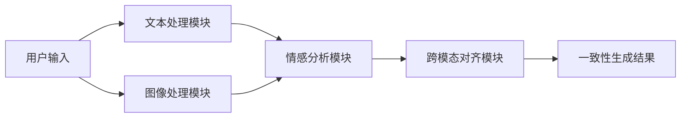

                 


# 开发AI Agent的跨模态情感一致性生成

**关键词：** 跨模态情感一致性生成、AI Agent、多模态数据、情感分析、对比学习、注意力机制

**摘要：** 跨模态情感一致性生成是AI Agent领域的重要研究方向，旨在解决多模态数据中情感一致性的生成问题。本文从理论基础、算法原理、系统设计到项目实战，全面探讨如何实现跨模态情感一致性生成，结合对比学习和注意力机制，通过详细的代码示例和数学模型，为读者提供一个完整的解决方案。

---

## 正文部分

### 第一部分: 背景与核心概念

#### 第1章: 跨模态情感一致性生成的背景与问题定义

##### 1.1 跨模态情感一致性生成的背景
- **多模态AI的发展现状：** 当前AI技术正向多模态方向发展，整合文本、图像、语音等多种数据形式，提升AI的感知能力。
- **情感一致性生成的重要性：** 在AI Agent与用户交互中，情感一致性生成能够提升用户体验，使交互更加自然。
- **问题背景：** 在多模态数据中，不同模态之间的情感信息可能存在不一致，如何生成一致的情感表达是关键问题。

##### 1.2 跨模态情感一致性生成的定义与问题描述
- **定义：** 跨模态情感一致性生成是指在处理多模态数据时，确保不同模态之间情感信息的一致性。
- **问题描述：** 在AI Agent中，用户输入可能包含文本和图像，如何使生成的文本和图像情感一致是核心问题。

#### 第2章: 跨模态情感一致性生成的核心概念与联系

##### 2.1 跨模态数据处理的核心原理
- **多模态数据的表示方法：** 使用向量表示不同模态的数据，如文本向量和图像向量。
- **情感分析的基本原理：** 通过自然语言处理技术分析文本的情感，通过计算机视觉技术分析图像的情感。
- **跨模态对齐的实现方式：** 使用对比学习或注意力机制，使不同模态的情感信息对齐。

##### 2.2 核心概念的属性特征对比
- **不同模态数据的特征分析：** 文本数据具有语义丰富性，图像数据具有视觉丰富性。
- **情感一致性生成的指标对比：** 基于相似度、基于分类、基于生成等不同方法的对比。

##### 2.3 ER实体关系图与流程图


---

### 第二部分: 算法原理与数学模型

#### 第3章: 跨模态情感一致性生成的算法原理

##### 3.1 对比学习算法
- **对比学习的基本原理：** 通过最大化正样本的相似度和最小化负样本的相似度，学习数据的表征。
- **跨模态对比学习的实现步骤：**
  1. 将文本和图像分别编码为向量。
  2. 使用对比损失函数优化模型。
- **对比学习的数学模型：**
  $$ L = \text{log}(\frac{1}{1 + e^{-\text{sim}(x,y)}}) $$
  其中，sim(x,y)表示两个模态数据之间的相似度计算。

##### 3.2 注意力机制
- **注意力机制的基本原理：** 通过计算不同位置的权重，关注重要的信息。
- **跨模态注意力机制的实现：**
  1. 将文本和图像分别编码为向量。
  2. 使用注意力机制计算跨模态的权重。
  3. 根据权重生成一致的情感表达。

---

### 第三部分: 系统分析与架构设计

#### 第4章: 跨模态情感一致性生成的系统架构

##### 4.1 系统功能设计
- **领域模型：** 文本处理模块、图像处理模块、情感分析模块、跨模态对齐模块。
- **系统架构设计：** 使用微服务架构，分别处理文本、图像和情感分析。
- **系统接口设计：** 提供RESTful API接口，接收输入数据，返回一致性生成结果。

##### 4.2 系统架构图


---

### 第四部分: 项目实战

#### 第5章: 跨模态情感一致性生成的项目实战

##### 5.1 环境安装
- **Python 3.8以上版本**
- **深度学习框架：TensorFlow或PyTorch**
- **自然语言处理库：spaCy或NLTK**
- **计算机视觉库：OpenCV或 Pillow**

##### 5.2 系统核心实现源代码
```python
import tensorflow as tf
from tensorflow.keras import layers

def contrastive_loss(x, y, temperature=0.1):
    # 计算相似度
    similarity = tf.reduce_sum(x * y, axis=-1) / (tf.norm(x) * tf.norm(y))
    similarity = similarity / temperature
    loss = tf.nn.softmax_cross_entropy_with_logits(labels=tf.ones_like(similarity), logits=similarity)
    return loss

# 示例代码：跨模态对比学习
text_vector = layers.Dense(512, activation='relu')(input_text)
image_vector = layers.Dense(512, activation='relu')(input_image)
contrastive_loss = contrastive_loss(text_vector, image_vector)
model = tf.keras.Model(inputs=[input_text, input_image], outputs=[])
model.add_loss(contrastive_loss)
model.compile(optimizer='adam')
```

---

### 第五部分: 最佳实践

#### 第6章: 跨模态情感一致性生成的最佳实践

##### 6.1 小结
- 跨模态情感一致性生成是AI Agent的重要能力，通过对比学习和注意力机制可以有效实现。

##### 6.2 注意事项
- 数据质量：多模态数据需要清洗和预处理。
- 模型调优：需要多次实验，调整超参数。
- 应用场景：根据不同场景选择合适的算法。

##### 6.3 拓展阅读
- 《多模态学习的前沿研究》
- 《对比学习的最新进展》
- 《注意力机制的深度解析》

---

**作者：AI天才研究院/AI Genius Institute & 禅与计算机程序设计艺术 /Zen And The Art of Computer Programming**

