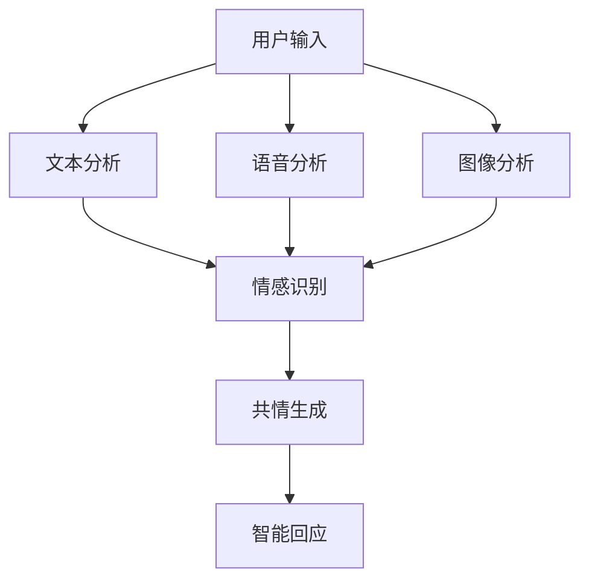
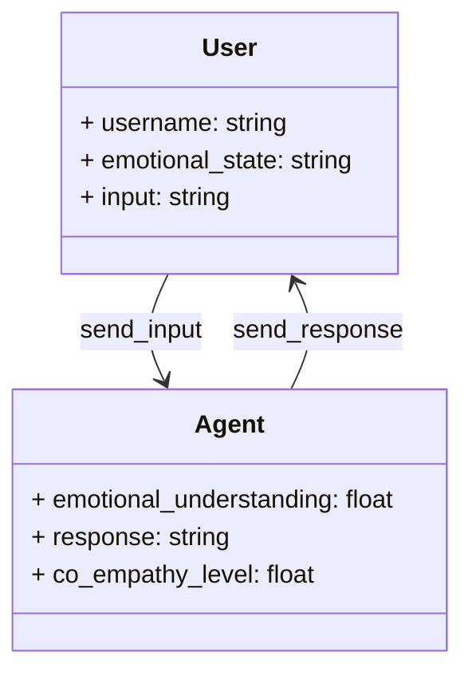
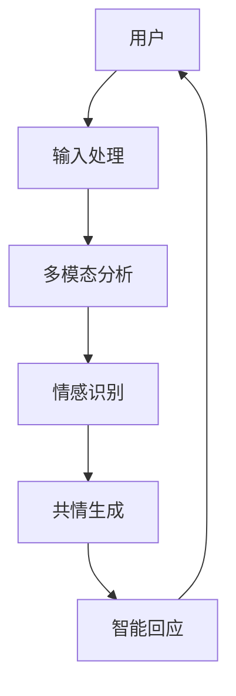

                 


# 开发AI Agent的跨模态情感共情能力

> 关键词：AI Agent, 跨模态情感共情, 情感计算, 跨模态数据, 情感分析, 人工智能, 人机交互

> 摘要：本文详细探讨了开发具备跨模态情感共情能力的AI Agent的关键技术，从背景、核心概念、算法原理到系统设计和项目实战，全面解析如何实现AI Agent在多模态数据下的情感理解和共情生成能力，为实现更自然、更智能的人机交互提供技术支撑。

---

# 第一部分: 背景介绍

## 第1章: 跨模态情感共情的定义与背景

### 1.1 问题背景

#### 1.1.1 从单模态到跨模态的情感理解
传统的AI情感分析主要基于单一模态（如文本或语音），难以捕捉复杂的情感信息。例如，文本情感分析可以识别情感极性，但无法结合语音的语调或图像的表情信息来更准确地理解情感。

#### 1.1.2 情感共情在人机交互中的重要性
人与人之间的有效沟通不仅依赖于语言，还包括面部表情、语气和肢体语言等多方面的信息。AI Agent如果能像人类一样综合理解这些信息，就能更好地实现情感共情，提升用户体验。

#### 1.1.3 当前AI Agent的局限性与改进方向
现有的AI Agent大多基于单一模态进行情感分析，难以处理复杂的情感表达。改进方向包括多模态数据的融合、情感共情机制的实现以及实时交互能力的提升。

### 1.2 跨模态情感共情的定义

#### 1.2.1 跨模态数据的定义
跨模态数据是指来自不同感官渠道的信息，如文本、语音、图像和视频等。这些数据可以互补地提供信息，帮助AI更好地理解用户的情感状态。

#### 1.2.2 情感共情的核心概念
情感共情是指AI Agent能够理解并回应用户的情感状态，不仅仅是识别情感，还包括生成情感相关的回应，使交互更加自然和人性化。

#### 1.2.3 跨模态情感共情的实现目标
通过整合多模态数据，AI Agent能够更准确地识别用户情感，并生成相应的回应，从而提升用户体验。

### 1.3 跨模态情感共情的实现边界

#### 1.3.1 情感共情的边界条件
情感共情的能力受限于数据质量和模型的准确性。此外，隐私和伦理问题也需考虑。

#### 1.3.2 跨模态数据处理的边界
数据处理能力受限于计算资源和算法复杂度，需权衡处理效率与准确性。

#### 1.3.3 AI Agent能力的边界与外延
AI Agent的情感共情能力目前主要集中在理解和回应阶段，未来可能扩展到更复杂的社交理解和长期记忆。

### 1.4 跨模态情感共情的核心要素

#### 1.4.1 情感理解的核心要素
- 多模态数据的采集与预处理
- 情感特征的提取与融合

#### 1.4.2 跨模态数据处理的核心要素
- 数据对齐与融合
- 跨模态信息的关联与推理

#### 1.4.3 AI Agent共情能力的核心要素
- 情感状态的识别与预测
- 情感驱动的决策与回应

### 1.5 本章小结

---

# 第二部分: 跨模态情感共情的核心概念与联系

## 第2章: 跨模态情感共情的核心概念

### 2.1 情感计算与跨模态理解

#### 2.1.1 情感计算的基本原理
情感计算涉及从多源数据中提取情感信息，并通过模型进行情感分类和预测。

#### 2.1.2 跨模态数据的理解方法
- 文本分析：使用NLP技术提取情感特征。
- 语音分析：通过声学特征提取情感信息。
- 图像分析：利用计算机视觉技术识别表情和情绪。

#### 2.1.3 情感共情的实现机制
通过融合多模态数据，AI Agent可以更准确地理解用户情感，并生成相应的回应。

### 2.2 跨模态数据的特征对比

#### 2.2.1 文本、语音、图像的特征对比
| 特征维度 | 文本 | 语音 | 图像 |
|----------|------|------|------|
| 信息来源 | 文字内容 | 音调、语速 | 面部表情、肢体语言 |
| 优点 | 精确表达意图 | 传递情感色彩 | 提供丰富的非语言信息 |
| 缺点 | 非语言情感信息缺失 | 易受环境干扰 | 数据获取复杂 |

#### 2.2.2 不同模态数据的情感表达能力
- 文本：适合复杂情感表达，但缺乏非语言信息。
- 语音：情感表达细腻，但受环境影响大。
- 图像：视觉信息丰富，但数据处理复杂。

#### 2.2.3 跨模态数据融合的优势与挑战
优势：互补性信息提升情感识别准确率。挑战：数据异构性和计算复杂度。

### 2.3 跨模态情感共情的实体关系图



### 2.4 本章小结

---

# 第三部分: 跨模态情感共情的算法原理

## 第3章: 跨模态情感共情算法原理

### 3.1 情感分析算法

#### 3.1.1 基于文本的情感分析
- 使用词袋模型或词嵌入（如Word2Vec、GloVe）提取文本特征。
- 通过CNN、RNN或LSTM进行情感分类。
- 示例代码：
  ```python
  import tensorflow as tf
  model = tf.keras.Sequential([
      tf.keras.layers.Embedding(vocab_size, embedding_dim),
      tf.keras.layers.Conv1D(filters, kernel_size),
      tf.keras.layers.MaxPooling1D(),
      tf.keras.layers.Dense(1, activation='sigmoid')
  ])
  ```

#### 3.1.2 基于语音的情感分析
- 使用声学特征（如MFCC）提取语音特征。
- 通过深度学习模型（如CNN、LSTM）进行情感分类。
- 示例代码：
  ```python
  import librosa
  y, sr = librosa.load(audio_file)
  mfccs = librosa.feature.mfcc(y, sr)
  ```

#### 3.1.3 基于图像的情感分析
- 使用CNN（如ResNet、VGG）提取图像特征。
- 通过分类器（如SVM、随机森林）进行情感分类。
- 示例代码：
  ```python
  import cv2
  img = cv2.imread(image_file)
  features = model.predict(cv2.resize(img, (224, 224)))
  ```

### 3.2 跨模态数据对齐算法

#### 3.2.1 跨模态数据对齐的
- 使用注意力机制对齐不同模态的特征。
- 示例代码：
  ```python
  import torch
  encoder_layer = nn.TransformerEncoderLayer(d_model=512, nhead=8)
  decoder_layer = nn.TransformerDecoderLayer(d_model=512, nhead=8)
  transformer = nn.Transformer(encoder_layer, decoder_layer)
  ```

### 3.3 跨模态情感共情生成算法

#### 3.3.1 基于多模态融合的情感共情生成
- 使用融合模型（如多模态Transformer）生成情感共情的回应。
- 示例代码：
  ```python
  import torch
  model = MultiModalTransformer(n_token=10000, d_model=512, nhead=8)
  output = model(text_input, audio_input, image_input)
  ```

#### 3.3.2 情感共情生成的数学模型
- 情感评分函数：
  $$ \text{score} = \alpha \cdot \text{text\_score} + \beta \cdot \text{audio\_score} + \gamma \cdot \text{image\_score} $$
- 注意力机制：
  $$ \text{attention} = \text{softmax}(\frac{QK^T}{\sqrt{d_k}}) $$

### 3.4 本章小结

---

# 第四部分: 系统分析与架构设计

## 第4章: 跨模态情感共情系统的架构设计

### 4.1 项目场景介绍

#### 4.1.1 情感共情AI Agent的应用场景
- 智能客服：提供更贴心的服务体验。
- 智能助手：增强用户交互的自然性。
- 智能教育：根据学生情绪调整教学策略。

### 4.2 系统功能设计

#### 4.2.1 领域模型设计


#### 4.2.2 系统架构设计


#### 4.2.3 接口和交互流程
- 接口设计：RESTful API，支持文本、语音和图像输入。
- 交互流程：用户输入 -> 数据预处理 -> 多模态分析 -> 情感识别 -> 共情生成 -> 智能回应。

### 4.3 系统实现

#### 4.3.1 环境安装
- 安装必要的库：TensorFlow、PyTorch、Librosa、OpenCV。
  ```bash
  pip install tensorflow pytorch librosa opencv-python
  ```

#### 4.3.2 核心代码实现
- 情感分析模块：
  ```python
  def analyze_emotion(text, audio, image):
      text_score = text_analyzer.predict(text)
      audio_score = audio_analyzer.predict(audio)
      image_score = image_analyzer.predict(image)
      return (text_score + audio_score + image_score) / 3
  ```

- 共情生成模块：
  ```python
  def generate_response(emotion_score):
      response = co_empathy_model.generate_response(emotion_score)
      return response
  ```

#### 4.3.3 案例分析
- 输入：用户输入文本“我感到很生气”，并带有愤怒的表情图像和高音调语音。
- 输出：AI Agent生成共情回应：“听起来你遇到了一些困难，我能帮到你吗？”

#### 4.3.4 项目小结

---

# 第五部分: 最佳实践与小结

## 第5章: 跨模态情感共情能力的优化与展望

### 5.1 最佳实践

#### 5.1.1 数据处理的注意事项
- 数据清洗：去除噪声，确保数据质量。
- 数据增强：通过数据增强技术提升模型的泛化能力。

#### 5.1.2 模型优化的技巧
- 使用预训练模型迁移学习。
- 调整超参数，优化模型性能。

#### 5.1.3 系统部署的建议
- 使用云服务部署模型，确保高可用性和扩展性。
- 定期更新模型，保持其性能。

### 5.2 本章小结

---

# 结语

## 作者信息

作者：AI天才研究院/AI Genius Institute & 禅与计算机程序设计艺术 /Zen And The Art of Computer Programming

---

这篇文章详细探讨了开发具备跨模态情感共情能力的AI Agent的关键技术，从背景、核心概念、算法原理到系统设计和项目实战，为实现更自然、更智能的人机交互提供了技术支撑。通过本文的学习，读者可以掌握跨模态情感共情的核心概念和实现方法，为未来的AI Agent开发奠定坚实基础。

