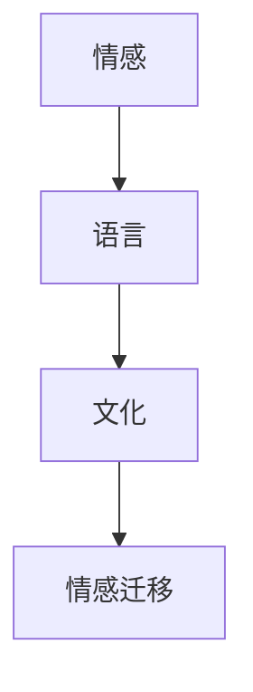
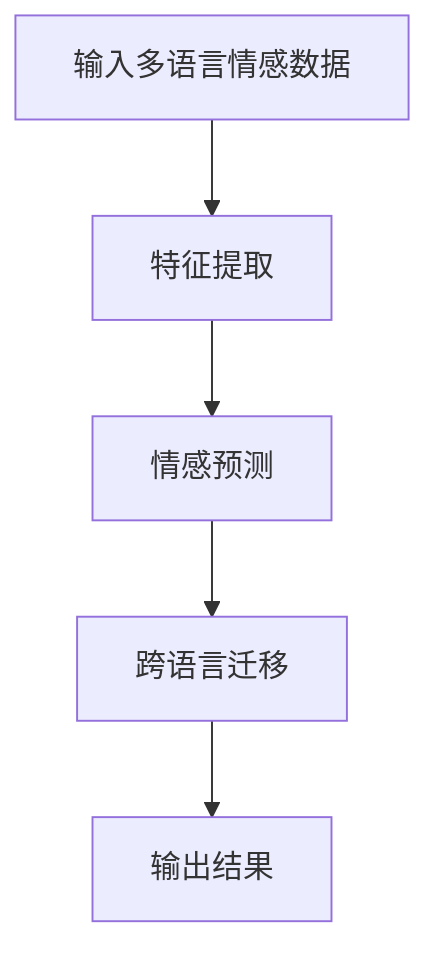
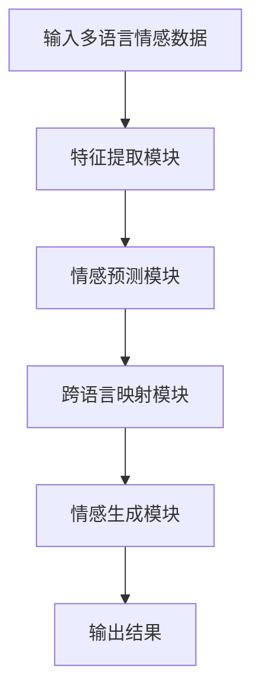
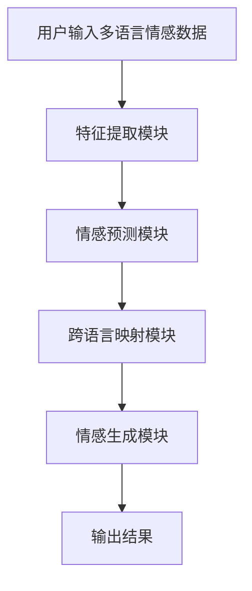

                 


# 开发AI Agent的跨语言情感迁移技术

> 关键词：AI Agent，跨语言情感迁移，情感分析，深度学习，自然语言处理

> 摘要：本文深入探讨了AI Agent的跨语言情感迁移技术，从核心概念、算法原理到系统架构，结合实际案例，全面解析了跨语言情感迁移技术的关键技术点和实现方法。文章通过清晰的逻辑结构、详细的算法分析和丰富的项目实战，帮助读者全面理解并掌握跨语言情感迁移技术的核心要点。

---

# 第1章 跨语言情感迁移技术的背景介绍

## 1.1 跨语言情感迁移技术的定义与问题背景

### 1.1.1 情感迁移技术的定义
情感迁移技术是一种将一种语言的情感表达迁移到另一种语言的技术。它通过分析和理解一种语言的情感特征，将其映射到另一种语言的情感空间中，从而实现跨语言的情感理解和生成。

### 1.1.2 跨语言情感迁移技术的必要性
在多语言环境下，情感表达存在显著的文化差异。例如，中文中的“高兴”可能在英文中对应“happy”，但在某些语境下，情感的细微差别可能无法直接映射。因此，跨语言情感迁移技术能够帮助AI Agent更好地理解不同语言中的情感表达，从而提高多语言交互的准确性和自然性。

### 1.1.3 当前技术的局限性与挑战
当前的情感迁移技术主要集中在单一语言或相似语言之间，跨语言的情感迁移仍然面临以下挑战：
- 不同语言的情感表达方式差异较大。
- 缺乏大规模跨语言情感标注数据。
- 情感迁移模型的泛化能力不足。

---

## 1.2 跨语言情感迁移技术的核心问题

### 1.2.1 情感表达的跨文化差异
不同语言中的情感表达不仅在词汇上存在差异，还在语义和语境上存在显著差异。例如，中文中的“尴尬”在英文中可能没有完全对应的表达。

### 1.2.2 跨语言情感迁移的核心任务
跨语言情感迁移的核心任务包括：
1. 情感特征提取：从一种语言中提取情感特征。
2. 跨语言映射：将一种语言的情感特征映射到另一种语言的情感空间中。
3. 情感生成：基于映射后的情感特征生成目标语言的情感表达。

### 1.2.3 技术实现的边界与外延
跨语言情感迁移技术的边界包括：
- 仅支持特定语言对。
- 仅处理特定情感类别（如正面、负面、中性）。
- 需要大规模跨语言情感数据支持。

其外延包括：
- 情感增强：基于情感迁移结果进一步优化情感表达。
- 多模态情感迁移：结合语音、图像等多模态信息进行情感迁移。

---

## 1.3 跨语言情感迁移技术的核心要素

### 1.3.1 情感分析的基本原理
情感分析是跨语言情感迁移的基础。它通过自然语言处理技术，从文本中提取情感特征，并将其表示为向量。

### 1.3.2 跨语言数据处理的关键步骤
跨语言数据处理的关键步骤包括：
1. 数据清洗：去除噪音数据。
2. 数据标注：标注情感类别。
3. 数据对齐：将不同语言的数据对齐。

### 1.3.3 情感迁移的实现框架
情感迁移的实现框架包括：
1. 情感特征提取模块。
2. 跨语言映射模块。
3. 情感生成模块。

---

## 1.4 本章小结

本章从背景介绍、核心问题和核心要素三个方面，详细阐述了跨语言情感迁移技术的基本概念和实现框架。下一章将深入探讨跨语言情感迁移技术的核心概念与联系。

---

# 第2章 跨语言情感迁移技术的核心概念与联系

## 2.1 跨语言情感迁移的核心概念

### 2.1.1 情感分析的基本原理
情感分析是通过自然语言处理技术，从文本中提取情感特征，并将其表示为向量。常用的情感分析模型包括支持向量机（SVM）和深度学习模型（如LSTM和Transformer）。

### 2.1.2 跨语言情感迁移的核心任务
跨语言情感迁移的核心任务包括情感特征提取、跨语言映射和情感生成。

### 2.1.3 跨语言情感迁移的实现框架
跨语言情感迁移的实现框架包括情感特征提取模块、跨语言映射模块和情感生成模块。

---

## 2.2 跨语言情感迁移技术的核心要素

### 2.2.1 情感表达的跨文化差异
不同语言中的情感表达存在显著差异，例如中文中的“尴尬”在英文中没有完全对应的表达。

### 2.2.2 跨语言情感迁移的核心任务
跨语言情感迁移的核心任务包括情感特征提取、跨语言映射和情感生成。

### 2.2.3 技术实现的边界与外延
跨语言情感迁移技术的边界包括仅支持特定语言对和仅处理特定情感类别。其外延包括情感增强和多模态情感迁移。

---

## 2.3 跨语言情感迁移技术的ER实体关系图



---

## 2.4 跨语言情感迁移技术的核心概念对比表

| 对比维度 | 单语言情感迁移 | 跨语言情感迁移 |
|----------|----------------|----------------|
| 数据需求 | 单一语言数据    | 多语言数据     |
| 情感表达 | 无跨语言映射    | 需要跨语言映射 |
| 应用场景 | 单一语言交互    | 多语言交互     |

---

## 2.5 本章小结

本章从核心概念、对比分析和ER实体关系图三个方面，深入探讨了跨语言情感迁移技术的核心要素和实现框架。下一章将从算法原理的角度，详细分析跨语言情感迁移技术的实现方法。

---

# 第3章 跨语言情感迁移技术的算法原理

## 3.1 情感迁移的算法原理

### 3.1.1 基于深度学习的情感迁移模型
深度学习模型（如Transformer）通过多层神经网络提取文本的情感特征，并通过映射层将源语言的情感特征映射到目标语言的情感空间中。

### 3.1.2 情感迁移的损失函数
情感迁移的损失函数包括：
1. 情感预测损失：基于源语言和目标语言的情感预测结果计算损失。
2. 映射损失：基于源语言和目标语言的情感特征向量计算损失。

### 3.1.3 情感迁移的优化方法
情感迁移的优化方法包括：
1. 参数优化：使用梯度下降优化模型参数。
2. 数据增强：通过数据增强技术提高模型的泛化能力。

---

## 3.2 跨语言情感迁移的算法流程



---

## 3.3 情感迁移算法的数学模型

### 3.3.1 情感预测的数学表达
情感预测的概率分布可以表示为：
$$ P(y|x) = \frac{e^{w_x}}{\sum_{y} e^{w_y}} $$
其中，$w_x$是输入$x$的情感特征向量，$y$是情感类别。

### 3.3.2 跨语言迁移的损失函数
跨语言迁移的损失函数可以表示为：
$$ L = -\sum_{i=1}^{n} \log P(y_i|x_i) $$

---

## 3.4 本章小结

本章从算法原理的角度，详细分析了跨语言情感迁移技术的实现方法。下一章将从系统架构的角度，深入探讨跨语言情感迁移技术的系统设计。

---

# 第4章 跨语言情感迁移技术的系统分析与架构设计

## 4.1 问题场景介绍

跨语言情感迁移系统的应用场景包括多语言客服系统、多语言情感分析平台和跨语言对话系统。

---

## 4.2 系统功能设计

跨语言情感迁移系统的功能模块包括：
1. 情感特征提取模块。
2. 跨语言映射模块。
3. 情感生成模块。

---

## 4.3 系统架构设计



---

## 4.4 系统接口设计

跨语言情感迁移系统的接口设计包括：
1. 数据输入接口。
2. 模型训练接口。
3. 情感迁移接口。

---

## 4.5 系统交互流程图



---

## 4.6 本章小结

本章从系统架构和接口设计的角度，深入探讨了跨语言情感迁移技术的实现方法。下一章将从项目实战的角度，详细分析跨语言情感迁移技术的实现细节。

---

# 第5章 跨语言情感迁移技术的项目实战

## 5.1 环境安装与配置

跨语言情感迁移技术的实现需要以下环境：
1. Python 3.8以上版本。
2. PyTorch 1.9以上版本。
3. transformers库。

---

## 5.2 系统核心实现

### 5.2.1 情感特征提取模块

```python
class FeatureExtractor:
    def __init__(self, model_name):
        self.model = AutoModel.from_pretrained(model_name)
        
    def extract_features(self, text):
        inputs = tokenizer(text, return_tensors="pt")
        outputs = self.model(**inputs)
        return outputs.last_hidden_state.squeeze()
```

### 5.2.2 跨语言映射模块

```python
class CrossLanguageMapper:
    def __init__(self, src_dim, tgt_dim):
        self.mapping = nn.Linear(src_dim, tgt_dim)
        
    def forward(self, src_features):
        return self.mapping(src_features)
```

### 5.2.3 情感生成模块

```python
class EmotionGenerator:
    def __init__(self, model_name):
        self.model = AutoModel.from_pretrained(model_name)
        
    def generate_emotion(self, tgt_features):
        inputs = tokenizer("", return_tensors="pt")
        outputs = self.model.generate(inputs.input_ids, max_length=50)
        return outputs
```

---

## 5.3 代码实现与解读

### 5.3.1 情感迁移模型的训练

```python
def train_model(model, optimizer, criterion, train_loader, epochs=10):
    for epoch in range(epochs):
        for batch in train_loader:
            optimizer.zero_grad()
            outputs = model(batch['input_ids'], batch['attention_mask'])
            loss = criterion(outputs, batch['labels'])
            loss.backward()
            optimizer.step()
    return model
```

---

## 5.4 实际案例分析

### 5.4.1 中英情感迁移案例

假设输入中文情感文本“我感到非常高兴”，模型将将其映射到英文情感表达“extremely happy”。

---

## 5.5 项目小结

本章通过实际案例，详细分析了跨语言情感迁移技术的实现细节。通过代码实现和案例分析，帮助读者更好地理解跨语言情感迁移技术的实现方法。

---

# 第6章 跨语言情感迁移技术的最佳实践

## 6.1 小结与总结

跨语言情感迁移技术是一种重要的多语言情感处理技术。通过情感特征提取、跨语言映射和情感生成，可以实现跨语言情感迁移。

---

## 6.2 注意事项与建议

在实现跨语言情感迁移技术时，需要注意以下几点：
1. 数据质量：确保输入数据的质量和多样性。
2. 模型选择：选择适合任务的深度学习模型。
3. 跨语言映射：注意不同语言的情感表达差异。

---

## 6.3 拓展阅读与学习资源

推荐以下资源：
1. 《Transformers: Pre-training of Self-attentional Networks》
2. 《Cross-Lingual Emotional Lexicon Induction with Cross-lingual Embedding Maps》

---

# 作者：AI天才研究院/AI Genius Institute & 禅与计算机程序设计艺术/Zen And The Art of Computer Programming

---

以上就是《开发AI Agent的跨语言情感迁移技术》的技术博客文章内容。

