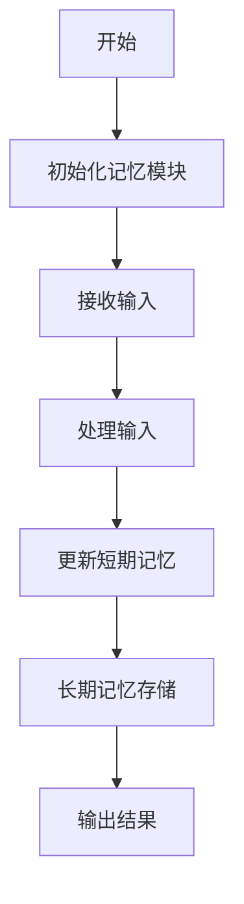
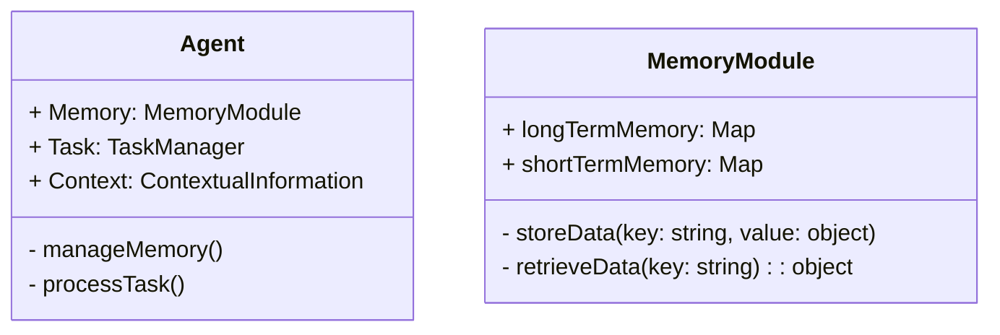

                 


# 开发AI Agent的长短期记忆管理：平衡效率与信息保留

---

## 关键词  
AI Agent, 长期记忆, 短期记忆, 记忆管理, 效率优化, 信息保留  

---

## 摘要  
AI Agent的长短期记忆管理是实现智能系统高效运行的关键技术。本文从理论到实践，详细分析了长短期记忆管理的核心概念、算法原理、系统架构设计以及实际项目案例。通过对比分析、图表展示和代码实现，帮助读者全面理解如何在AI Agent中平衡效率与信息保留，确保记忆管理的准确性和高效性。  

---

## 第一部分: 背景介绍

### 第1章: 长短期记忆管理的核心概念  

#### 1.1 问题背景  
长短期记忆管理是AI Agent实现智能交互和任务处理的基础，其核心目标是在保证信息保留的前提下，优化记忆的存储和检索效率。  

- **1.1.1 AI Agent的基本概念**  
  AI Agent是一种能够感知环境、自主决策并执行任务的智能实体。它需要具备记忆能力，以存储和调用历史信息，支持连续的交互和任务处理。  

- **1.1.2 长短期记忆管理的重要性**  
  长期记忆用于存储持久性信息，而短期记忆用于处理当前任务的相关数据。平衡两者的管理能够提升AI Agent的智能水平和响应速度。  

- **1.1.3 问题背景与现状分析**  
  当前，AI Agent的长短期记忆管理面临信息冗余、检索效率低、内存占用高等问题。如何在有限的资源约束下，实现高效的信息存储与检索，是亟待解决的挑战。  

#### 1.2 问题描述  
长短期记忆管理的关键问题包括：如何选择和存储重要信息、如何高效检索相关数据、如何平衡存储与性能之间的矛盾。  

- **1.2.1 长短期记忆管理的核心问题**  
  - 长期记忆的存储策略：信息筛选、分类存储与检索。  
  - 短期记忆的生命周期：自动更新、过期清除与数据迁移。  

- **1.2.2 AI Agent在实际应用中的挑战**  
  - 数据量大：长期记忆的存储需要处理海量信息。  
  - 实时性要求高：短期记忆的处理需要快速响应。  
  - 资源限制：内存和计算资源的约束。  

- **1.2.3 问题解决与目标设定**  
  通过优化记忆管理算法，设计高效的存储与检索机制，确保AI Agent在资源受限的情况下，仍能保持高效率和准确性。  

#### 1.3 边界与外延  
长短期记忆管理的边界包括：仅处理与任务相关的数据，不涉及其他模块的逻辑。外延则包括与自然语言处理、机器学习等技术的结合应用。  

---

## 第二部分: 核心概念与联系  

### 第2章: 核心概念与联系  

#### 2.1 长短期记忆模型的原理  
长短期记忆模型通过分层存储和管理信息，确保AI Agent能够快速调用所需数据。  

- **2.1.1 长期记忆的存储机制**  
  长期记忆用于存储持久性信息，通常采用分布式存储和冗余备份策略，确保数据的可靠性和可扩展性。  

- **2.1.2 短期记忆的处理流程**  
  短期记忆用于处理当前任务的相关数据，通过优先级排序和自动清除机制，确保短期记忆的高效利用。  

#### 2.2 核心概念的对比分析  
通过对比长期记忆和短期记忆的特征，帮助读者更好地理解两者的区别与联系。  

- **2.2.1 长短期记忆的特征对比**  
  | 特性 | 长期记忆 | 短期记忆 |  
  |------|----------|----------|  
  | 存储时间 | 长久 | 短暂 |  
  | 访问频率 | 低 | 高 |  
  | 数据类型 | 结构化 | 非结构化 |  

- **2.2.2 核心概念的联系与区别**  
  长期记忆和短期记忆在数据存储、访问频率和生命周期上存在显著差异，但它们共同支持AI Agent的任务处理和决策能力。  

#### 2.3 ER实体关系图架构  
通过ER图展示长短期记忆管理的核心实体及其关系。  

```mermaid
er
  actor(Agent, "AI Agent")
  actor(Memory, "记忆模块")
  actor(Task, "任务")
  actor(Context, "上下文")
  relation(M:1, Agent, "拥有", Memory)
  relation(M:1, Memory, "存储", Task)
  relation(M:1, Memory, "关联", Context)
```

---

## 第三部分: 算法原理讲解  

### 第3章: 算法原理概述  

#### 3.1 算法原理概述  
长短期记忆管理的核心算法包括信息筛选、分类存储和高效检索机制。  

- **3.1.1 信息筛选算法**  
  基于关键词匹配和语义分析，筛选出重要的信息并存储到长期记忆中。  

- **3.1.2 分类存储策略**  
  根据信息的类型和优先级，将数据分类存储，确保高效检索和管理。  

#### 3.2 算法实现流程  
通过mermaid流程图展示长短期记忆管理的实现流程。  



---

## 第四部分: 系统分析与架构设计方案  

### 第4章: 系统分析与架构设计  

#### 4.1 系统功能设计  
通过mermaid类图展示系统功能设计。  



#### 4.2 系统架构设计  
通过mermaid架构图展示系统架构设计。  


---

## 第五部分: 项目实战  

### 第5章: 项目实战  

#### 5.1 环境安装与配置  
- 安装Python 3.8及以上版本  
- 安装必要的库：numpy、pandas、scikit-learn  

#### 5.2 核心代码实现  
```python
class MemoryManager:
    def __init__(self):
        self.long_term = {}
        self.short_term = {}
    
    def store_long_term(self, key, value):
        self.long_term[key] = value
    
    def retrieve_long_term(self, key):
        return self.long_term.get(key, None)
    
    def store_short_term(self, key, value):
        self.short_term[key] = value
    
    def retrieve_short_term(self, key):
        return self.short_term.get(key, None)
    
    def clear_short_term(self):
        self.short_term = {}
```

#### 5.3 代码应用解读与分析  
通过代码实现分析记忆管理的具体操作流程，包括数据存储、检索和清除机制。  

#### 5.4 实际案例分析  
通过实际案例展示长短期记忆管理在AI Agent中的应用，分析其优缺点和改进空间。  

---

## 第六部分: 总结与展望  

### 6.1 最佳实践  
- 定期清理短期记忆，避免内存泄漏  
- 合理设计长期记忆的分类策略，确保高效检索  

### 6.2 小结  
长短期记忆管理是AI Agent实现智能交互的核心技术，通过平衡效率与信息保留，能够显著提升系统的性能和用户体验。  

### 6.3 注意事项  
- 避免过度存储，防止资源耗尽  
- 定期优化算法，确保系统的高效运行  

### 6.4 拓展阅读  
推荐相关书籍和论文，帮助读者进一步深入学习长短期记忆管理的技术细节。  

---

## 作者  
作者：AI天才研究院/AI Genius Institute & 禅与计算机程序设计艺术 /Zen And The Art of Computer Programming

