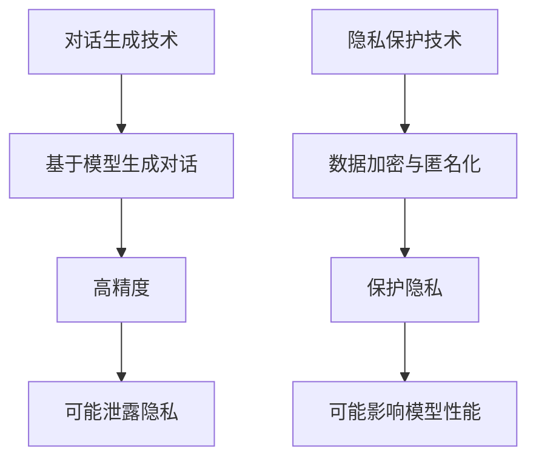
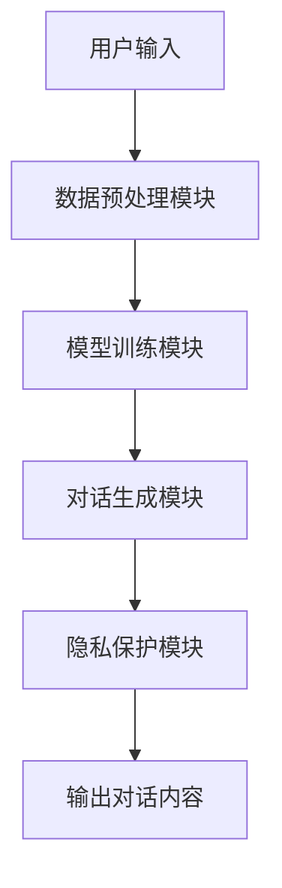

                 


# 《开发AI Agent的隐私保护对话生成技术》

> 关键词：AI Agent, 隐私保护, 对话生成技术, 深度学习, 联邦学习, 同态加密

> 摘要：本文详细探讨了在AI Agent中实现隐私保护对话生成技术的关键方法，包括算法原理、系统架构设计和项目实战。通过分析基于RNN、Transformer和生成对抗网络（GAN）的对话生成模型，结合数据加密、匿名化和差分隐私等技术，展示了如何在保证隐私的前提下，生成高质量的对话内容。文章还提供了具体的Python代码示例和系统架构图，帮助读者理解并实现隐私保护对话生成技术。

---

# 第一部分: AI Agent与隐私保护对话生成技术概述

## 第1章: AI Agent与隐私保护对话生成技术概述

### 1.1 AI Agent的基本概念
AI Agent（人工智能代理）是一种能够感知环境并采取行动以实现目标的智能系统。它可以通过自然语言处理技术与人类进行交互，理解用户意图并生成相应的回复。AI Agent的应用场景广泛，包括智能客服、智能助手、智能聊天机器人等。

#### 1.1.1 AI Agent的定义与分类
- **定义**：AI Agent是一个能够自主决策并执行任务的智能实体，具备感知、推理、学习和行动的能力。
- **分类**：
  - **基于规则的AI Agent**：通过预定义的规则和逻辑进行决策，适用于简单的任务。
  - **基于统计模型的AI Agent**：利用概率统计方法进行预测和决策，适用于复杂任务。
  - **基于深度学习的AI Agent**：通过神经网络进行学习和推理，能够处理复杂的模式识别任务。

#### 1.1.2 对话生成技术的基本原理
对话生成技术是AI Agent实现人机交互的核心技术，其基本原理包括：
- **基于规则的方法**：通过预定义的语法规则生成回复。
- **基于统计模型的方法**：利用马尔可夫链模型生成回复，考虑上下文信息。
- **基于深度学习的方法**：使用循环神经网络（RNN）或变换器（Transformer）模型生成回复。

#### 1.1.3 隐私保护在AI Agent中的重要性
在AI Agent的对话生成过程中，用户的隐私数据（如个人信息、对话内容）可能被收集和使用，存在泄露风险。因此，保护用户隐私是AI Agent设计中的重要环节。

### 1.2 隐私保护对话生成技术的背景
#### 1.2.1 当今对话生成技术的发展现状
对话生成技术经历了从基于规则到基于深度学习的演变。目前，基于Transformer的模型（如GPT系列）在生成高质量对话方面表现出色，但其对隐私的保护相对不足。

#### 1.2.2 隐私泄露问题的严重性
随着AI Agent的应用越来越广泛，隐私泄露问题也日益严重。用户的对话数据可能被滥用，导致个人信息泄露、身份盗窃等问题。

#### 1.2.3 隐私保护对话生成技术的需求与挑战
为了应对隐私泄露问题，隐私保护对话生成技术的需求日益迫切。然而，如何在保护隐私的同时生成高质量的对话内容，仍面临诸多挑战，如数据加密与模型性能的平衡。

### 1.3 本书的核心目标与内容框架
#### 1.3.1 本书的核心目标
本书旨在探讨如何在AI Agent中实现隐私保护对话生成技术，涵盖算法原理、系统架构设计和项目实战。

#### 1.3.2 本书的主要内容框架
- **算法原理**：介绍基于RNN、Transformer和生成对抗网络（GAN）的对话生成模型，并结合数据加密、匿名化和差分隐私等技术。
- **系统架构设计**：分析AI Agent的系统架构，包括数据预处理、模型训练、对话生成和隐私保护模块。
- **项目实战**：提供具体的Python代码示例，展示如何实现一个基于Transformer的隐私保护对话生成系统。

#### 1.3.3 本书的读者对象与适用场景
- **读者对象**：AI开发人员、数据科学家、隐私保护技术研究者。
- **适用场景**：AI Agent开发、智能对话系统设计、隐私保护技术应用。

### 1.4 本章小结
本章介绍了AI Agent的基本概念、对话生成技术的原理以及隐私保护的重要性，为后续内容奠定了基础。

---

## 第2章: AI Agent对话生成技术的核心概念与联系

### 2.1 对话生成技术的核心原理
对话生成技术是AI Agent实现人机交互的关键技术，其核心原理包括：
- **基于规则的方法**：通过预定义的语法规则生成回复。
- **基于统计模型的方法**：利用马尔可夫链模型生成回复，考虑上下文信息。
- **基于深度学习的方法**：使用循环神经网络（RNN）或变换器（Transformer）模型生成回复。

#### 2.1.1 基于规则的对话生成
基于规则的对话生成方法通过预定义的语法规则和逻辑进行回复生成。这种方法适用于简单的对话场景，但难以处理复杂的情况。

#### 2.1.2 基于统计模型的对话生成
基于统计模型的对话生成方法利用概率统计方法，根据上下文信息生成回复。这种方法能够处理一定的复杂性，但仍然受到数据稀疏性的影响。

#### 2.1.3 基于深度学习的对话生成
基于深度学习的对话生成方法是当前的研究热点。循环神经网络（RNN）和变换器（Transformer）模型在生成高质量对话方面表现出色。然而，这些模型通常需要大量数据训练，且存在隐私泄露风险。

### 2.2 隐私保护技术的核心原理
隐私保护技术在AI Agent中的应用主要包括数据加密、匿名化和差分隐私等方法。

#### 2.2.1 数据加密技术
数据加密技术通过加密算法对数据进行加密，确保数据在传输和存储过程中的安全性。常用的加密算法包括AES和RSA。

#### 2.2.2 数据匿名化技术
数据匿名化技术通过去除或脱敏数据中的敏感信息，确保数据无法被用于身份识别。常用的技术包括数据扰动和数据替换。

#### 2.2.3 差分隐私技术
差分隐私技术通过在数据中添加噪声，确保数据的隐私性。这种方法可以在不泄露个体信息的前提下，提供数据的统计信息。

### 2.3 对话生成技术与隐私保护技术的结合
将对话生成技术与隐私保护技术结合起来，可以在生成对话内容的同时保护用户的隐私。具体方法包括：
- **数据加密与匿名化**：在生成对话内容之前，对数据进行加密或匿名化处理。
- **联邦学习**：通过联邦学习技术，在不共享原始数据的情况下，进行模型训练。

#### 2.3.1 对话生成技术与隐私保护技术的相互作用
通过将隐私保护技术嵌入到对话生成过程中，可以在生成对话内容的同时保护用户的隐私。

#### 2.3.2 隐私保护对话生成技术的实现方式
隐私保护对话生成技术的实现方式包括：
- 在生成对话内容时，对数据进行加密或匿名化处理。
- 使用联邦学习技术，在不共享原始数据的情况下，进行模型训练。

#### 2.3.3 隐私保护对话生成技术的优缺点对比
| 技术类型         | 对话生成技术         | 隐私保护技术         |
|------------------|---------------------|---------------------|
| 核心原理         | 基于模型生成对话     | 数据加密与匿名化     |
| 优缺点           | 高精度但可能泄露隐私 | 保护隐私但可能影响模型性能 |

#### 2.3.4 核心概念属性特征对比表格
| 技术类型 | 对话生成技术 | 隐私保护技术 |
|----------|--------------|---------------|
| 核心原理 | 基于模型生成对话 | 数据加密与匿名化 |
| 优缺点   | 高精度但可能泄露隐私 | 保护隐私但可能影响模型性能 |

### 2.4 核心概念属性特征对比表格
| 技术类型 | 对话生成技术 | 隐私保护技术 |
|----------|--------------|---------------|
| 核心原理 | 基于模型生成对话 | 数据加密与匿名化 |
| 优缺点   | 高精度但可能泄露隐私 | 保护隐私但可能影响模型性能 |

---

## 图片：对话生成技术与隐私保护技术的对比



---

## 图片：对话生成技术与隐私保护技术的对比


---

## 本章小结
本章详细介绍了对话生成技术和隐私保护技术的核心原理，并探讨了两者结合的实现方式及其优缺点。通过对对话生成技术与隐私保护技术的对比，为后续章节的算法实现和系统设计奠定了基础。

---

# 第三部分: 算法原理讲解

## 第3章: 基于RNN的对话生成模型

### 3.1 基于RNN的对话生成模型
基于RNN的对话生成模型通过循环神经网络处理序列数据，生成连续的对话内容。

#### 3.1.1 RNN的工作原理
RNN通过处理序列数据，生成与当前输入相关的输出。常见的RNN变体包括LSTM和GRU。

#### 3.1.2 加密机制的实现
在RNN模型中，可以通过对输入数据进行加密，确保数据的安全性。

#### 3.1.3 案例分析
通过具体案例分析，展示RNN模型在隐私保护对话生成中的应用。

---

## 第4章: 基于Transformer的对话生成模型

### 4.1 Transformer的结构
Transformer模型通过自注意力机制和前馈网络，生成高质量的对话内容。

#### 4.1.1 Transformer的基本原理
自注意力机制允许模型在生成每个词时，关注整个输入序列中的重要部分。

#### 4.1.2 差分隐私的实现
在Transformer模型中，可以通过差分隐私技术，对生成的对话内容进行匿名化处理。

#### 4.1.3 案例分析
通过具体案例分析，展示Transformer模型在隐私保护对话生成中的应用。

---

## 第5章: 生成对抗网络（GAN）及其变体

### 5.1 GAN的基本原理
生成对抗网络由生成器和判别器组成，通过对抗训练生成逼真的对话内容。

#### 5.1.1 GAN的工作流程
生成器通过生成数据欺骗判别器，判别器通过区分真实数据和生成数据，指导生成器改进生成效果。

#### 5.1.2 隐私保护的实现
通过联邦学习等技术，可以在不共享原始数据的情况下，训练GAN模型。

#### 5.1.3 案例分析
通过具体案例分析，展示GAN及其变体在隐私保护对话生成中的应用。

---

# 第四部分: 系统分析与架构设计

## 第6章: 系统架构设计方案

### 6.1 问题场景介绍
以智能客服系统为例，介绍隐私保护对话生成技术的应用场景。

### 6.2 系统功能设计
系统功能设计包括数据预处理、模型训练、对话生成和隐私保护模块。

#### 6.2.1 数据预处理
对输入数据进行清洗、分词和向量化处理，确保数据适合模型训练。

#### 6.2.2 模型训练
使用训练数据对对话生成模型进行训练，同时应用隐私保护技术。

#### 6.2.3 对话生成
基于训练好的模型，生成符合用户需求的对话内容。

#### 6.2.4 隐私保护
通过数据加密和匿名化处理，确保用户的隐私数据不被泄露。

### 6.3 系统架构设计
使用Mermaid图展示系统的各个模块及其交互流程。

#### 6.3.1 系统架构图


#### 6.3.2 系统交互流程
使用Mermaid序列图展示系统的交互流程。

### 6.4 系统接口设计
定义系统与其他模块的接口，如数据输入接口、模型调用接口等。

### 6.5 系统交互设计
使用Mermaid序列图展示系统的交互流程，如用户与AI Agent的对话过程。

---

# 第五部分: 项目实战

## 第7章: 项目实战

### 7.1 环境配置
介绍需要安装的工具和库，如Python、TensorFlow、Keras等。

### 7.2 核心实现
提供Python代码，实现一个基于Transformer的隐私保护对话生成模型。

#### 7.2.1 数据预处理代码
```python
import numpy as np
from tensorflow.keras.preprocessing.text import Tokenizer
from tensorflow.keras.preprocessing.sequence import pad_sequences

# 数据预处理
texts = [...]  # 用户输入的对话数据
tokenizer = Tokenizer(num_words=10000)
tokenizer.fit_on_texts(texts)
sequences = tokenizer.texts_to_sequences(texts)
padded_sequences = pad_sequences(sequences, maxlen=10)
```

#### 7.2.2 模型训练代码
```python
from tensorflow.keras.models import Model
from tensorflow.keras.layers import Input, LSTM, Dense, Dropout, Bidirectional

# 定义模型
input_layer = Input(shape=(10, 10000))
lstm_layer = LSTM(128, return_sequences=True)(input_layer)
dropout_layer = Dropout(0.5)(lstm_layer)
dense_layer = Dense(10000, activation='softmax')(dropout_layer)
model = Model(inputs=input_layer, outputs=dense_layer)
model.compile(optimizer='adam', loss='categorical_crossentropy', metrics=['accuracy'])
```

### 7.3 代码解读
对代码进行详细解读，说明每一部分的功能和实现细节。

### 7.4 实际案例分析
通过具体案例分析，展示模型的应用效果和隐私保护能力。

### 7.5 项目小结
总结项目的主要成果和经验教训，提出改进建议。

---

# 第六部分: 最佳实践与总结

## 第8章: 最佳实践与总结

### 8.1 开发中的注意事项
- 数据安全的重要性
- 模型的可解释性
- 隐私保护与模型性能的平衡

### 8.2 小结
总结全文，回顾核心内容，强调隐私保护在AI Agent中的重要性。

### 8.3 未来展望
展望隐私保护对话生成技术的发展方向，如结合联邦学习、同态加密等新技术。

---

# 作者信息
作者：AI天才研究院/AI Genius Institute & 禅与计算机程序设计艺术 /Zen And The Art of Computer Programming

