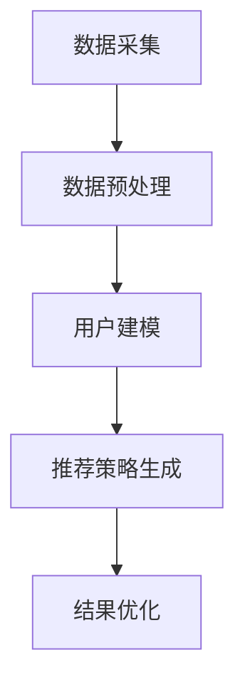
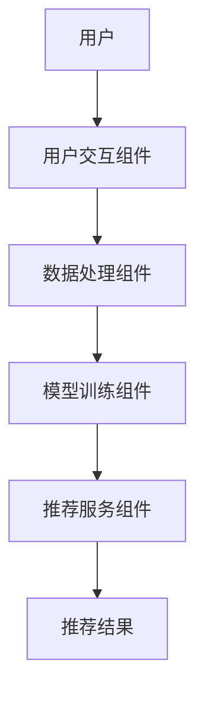
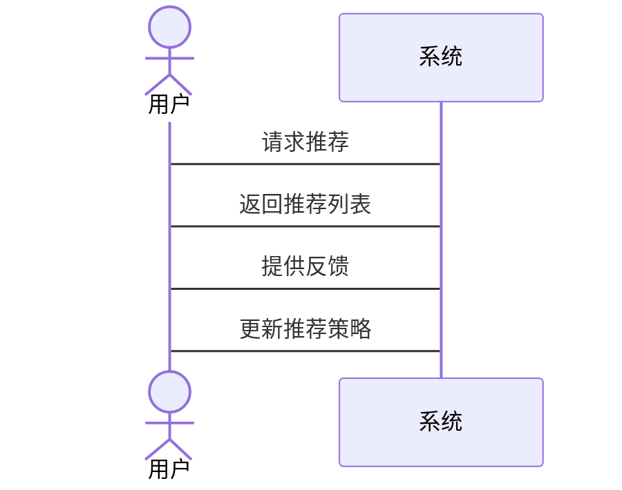

                 


# 开发AI Agent驱动的个性化推荐系统

> 关键词：AI Agent, 个性化推荐, 机器学习, 推荐系统, 算法原理, 系统架构, 项目实战

> 摘要：本篇文章详细探讨了AI Agent在个性化推荐系统中的应用，结合理论分析与实际案例，系统性地介绍了推荐系统的开发过程，从背景介绍到项目实战，深入剖析了AI Agent驱动的推荐系统的原理、算法、架构及实现细节，为读者提供了全面的知识体系。

---

## 第一章: 背景介绍与核心概念

### 1.1 问题背景

#### 1.1.1 传统推荐系统的局限性
传统的推荐系统主要依赖协同过滤和基于内容的推荐方法，存在以下问题：
- 数据稀疏性：当用户数量较少时，难以生成足够的相似用户。
- 单一性：推荐结果基于历史数据，无法动态适应用户实时需求。
- 计算复杂度：在大数据环境下，计算开销较大，影响实时性。

#### 1.1.2 AI Agent的引入及其优势
AI Agent（智能体）通过动态感知用户需求和环境变化，能够显著提升推荐系统的智能化水平：
- **动态适应性**：AI Agent能够实时更新用户模型，适应用户的兴趣变化。
- **多目标优化**：通过强化学习等技术，优化推荐结果的多样性和相关性。
- **上下文感知**：结合环境信息（如时间、地点）提供更精准的推荐。

#### 1.1.3 个性化推荐的市场需求与技术驱动
个性化推荐在电子商务、社交媒体、影视娱乐等领域具有广泛需求，AI Agent的引入进一步推动了技术的进步：
- 提高用户满意度和粘性。
- 增强系统的实时性和智能化水平。
- 通过数据驱动的方法实现精准营销。

### 1.2 核心概念与联系

#### 1.2.1 AI Agent的基本原理
AI Agent通过感知环境、决策和执行动作来实现推荐目标。其主要功能包括：
- **感知**：收集和分析用户行为数据。
- **决策**：基于数据生成推荐策略。
- **执行**：输出推荐结果并实时调整策略。

#### 1.2.2 个性化推荐系统的定义与分类
个性化推荐系统根据数据来源和方法可以分为：
- **基于协同过滤**：利用用户行为数据进行推荐。
- **基于内容的推荐**：基于物品属性进行推荐。
- **混合推荐**：结合多种推荐方法的优势。
- **基于深度学习的推荐**：利用神经网络建模用户行为和偏好。

#### 1.2.3 AI Agent与个性化推荐的关系
AI Agent作为推荐系统的智能引擎，通过动态优化推荐策略，提升推荐的准确性和用户体验。两者结合的关键在于：
- AI Agent提供动态的决策能力。
- 推荐系统负责具体的实现和执行。

#### 1.2.4 核心概念对比表格
| 概念       | 描述                                       |
|------------|--------------------------------------------|
| AI Agent   | 具备感知、决策和执行能力的智能体           |
| 推荐系统   | 基于用户数据提供个性化推荐的系统           |
| 协同过滤   | 基于用户相似性进行推荐                     |
| 深度学习    | 利用神经网络建模用户行为和偏好             |

#### 1.2.5 ER实体关系图
```mermaid
erd
  User {
    id
    偏好
    行为记录
  }
  Item {
    id
    属性
    关联关系
  }
  Recommendation {
    id
    推荐结果
    时间戳
  }
  User --> Recommendation
  Item --> Recommendation
```

---

## 第二章: 算法原理与数学模型

### 2.1 推荐算法概述

#### 2.1.1 协同过滤算法
协同过滤通过寻找相似的用户或物品进行推荐：
- **用户协同过滤**：基于用户行为的相似性推荐。
- **物品协同过滤**：基于物品属性的相似性推荐。
- **混合协同过滤**：结合用户和物品的特征进行推荐。

#### 2.1.2 基于内容的推荐算法
基于内容的推荐通过分析物品的属性特征，生成相似推荐：
- **文本挖掘**：用于分析物品的描述文本。
- **特征提取**：提取关键特征用于推荐。

#### 2.1.3 混合推荐算法
混合推荐结合多种推荐方法的优势：
- 协同过滤和基于内容的推荐结合。
- 利用集成学习技术优化推荐效果。

#### 2.1.4 基于深度学习的推荐算法
深度学习模型（如神经网络）通过非线性特征学习，捕捉复杂的用户偏好：
- **神经网络结构**：如DNN、CNN、RNN等。
- **注意力机制**：用于捕捉重要特征。

### 2.2 AI Agent的算法流程

#### 2.2.1 数据采集与预处理
- **数据采集**：收集用户行为数据、物品信息等。
- **数据清洗**：处理缺失值、噪声数据。
- **特征提取**：提取关键特征用于模型训练。

#### 2.2.2 用户建模与行为分析
- **用户建模**：构建用户画像，分析用户的兴趣和行为模式。
- **行为分析**：通过序列分析、聚类分析等方法，识别用户的兴趣变化。

#### 2.2.3 推荐策略生成
- **策略生成**：基于用户模型和推荐算法，生成推荐策略。
- **动态优化**：实时调整策略以适应用户需求变化。

#### 2.2.4 推荐结果优化
- **结果优化**：通过A/B测试等方法，优化推荐结果的准确性和用户满意度。
- **实时反馈**：根据用户反馈实时调整推荐策略。

### 2.3 数学模型与公式

#### 2.3.1 协同过滤的数学模型
- **相似度计算公式**：
$$ \text{相似度} = \frac{\sum_{i=1}^{n}(r_{ui} - \bar{r}_u)(r_{vi} - \bar{r}_v)}{\sqrt{\sum_{i=1}^{n}(r_{ui} - \bar{r}_u)^2} \sqrt{\sum_{i=1}^{n}(r_{vi} - \bar{r}_v)^2}} $$
其中，\( r_{ui} \) 表示用户 \( u \) 对物品 \( i \) 的评分，\( \bar{r}_u \) 是用户 \( u \) 的平均评分。

- **预测评分公式**：
$$ \hat{r}_{ui} = \bar{r}_u + \sum_{v \in N(u)} w_{uv}(r_{vi} - \bar{r}_v) $$

#### 2.3.2 深度学习模型的损失函数
- **损失函数公式**：
$$ \text{损失} = -\sum_{i=1}^{n} y_i \log p_i + (1 - y_i) \log (1 - p_i) $$
其中，\( y_i \) 是真实标签，\( p_i \) 是模型预测概率。

### 2.4 算法流程图



---

## 第三章: 系统分析与架构设计

### 3.1 问题场景分析

#### 3.1.1 用户需求分析
- 提供个性化推荐服务。
- 实时响应用户请求。
- 支持多种数据源和推荐方法。

#### 3.1.2 系统功能概述
- 数据采集与处理。
- 用户建模与行为分析。
- 推荐策略生成与优化。
- 推荐结果输出与反馈。

#### 3.1.3 系统边界与交互流程
- 系统边界：用户、数据源、推荐引擎。
- 交互流程：用户请求推荐，系统生成并返回结果。

### 3.2 系统架构设计

#### 3.2.1 分层架构设计
- **数据层**：存储用户行为数据、物品信息。
- **计算层**：进行数据处理、模型训练。
- **服务层**：提供推荐服务接口。
- **应用层**：展示推荐结果。

#### 3.2.2 组件交互关系
- **用户交互组件**：接收用户请求，返回推荐结果。
- **数据处理组件**：负责数据的采集、清洗和预处理。
- **模型训练组件**：训练推荐模型，生成推荐策略。
- **推荐服务组件**：根据策略生成最终推荐结果。

#### 3.2.3 系统架构图


### 3.3 接口与交互设计

#### 3.3.1 接口定义
- **输入接口**：接收用户请求和数据。
- **输出接口**：返回推荐结果和反馈信息。

#### 3.3.2 交互流程图


---

## 第四章: 项目实战

### 4.1 环境安装与配置

#### 4.1.1 开发环境
- **操作系统**：Linux/Windows/MacOS。
- **编程语言**：Python 3.8+。
- **框架与库**：TensorFlow、PyTorch、Scikit-learn。

#### 4.1.2 安装依赖
```bash
pip install numpy pandas scikit-learn tensorflow
```

### 4.2 系统核心实现

#### 4.2.1 数据预处理代码
```python
import pandas as pd
import numpy as np

# 加载数据
data = pd.read_csv('user_behavior.csv')

# 去除缺失值
data = data.dropna()

# 提取用户ID和物品ID
user_ids = data['user_id'].unique()
item_ids = data['item_id'].unique()

# 创建用户-物品矩阵
user_item_matrix = pd.DataFrame(index=user_ids, columns=item_ids)
user_item_matrix = user_item_matrix.apply(lambda x: 0)
```

#### 4.2.2 用户建模代码
```python
from sklearn.preprocessing import StandardScaler

# 标准化数据
scaler = StandardScaler()
scaled_data = scaler.fit_transform(data[['feature1', 'feature2']])

# 训练聚类模型
from sklearn.cluster import KMeans
kmeans = KMeans(n_clusters=5)
clusters = kmeans.fit_predict(scaled_data)
```

#### 4.2.3 推荐策略生成代码
```python
import numpy as np
from sklearn.metrics.pairwise import cosine_similarity

# 计算用户相似度矩阵
user_features = user_item_matrix.T.dot(user_item_matrix)
similarity_matrix = cosine_similarity(user_features)
```

### 4.3 系统测试与优化

#### 4.3.1 系统测试
- 功能测试：验证推荐结果是否符合预期。
- 性能测试：评估系统的响应时间和处理能力。
- 安全测试：确保数据的安全性和系统的稳定性。

#### 4.3.2 优化策略
- 参数调优：优化模型参数以提高推荐准确率。
- 系统优化：减少计算开销，提升系统性能。

---

## 第五章: 总结与扩展

### 5.1 核心内容回顾
- AI Agent驱动的个性化推荐系统的开发涉及多个关键环节：数据采集、用户建模、推荐策略生成与优化。
- 系统架构设计和算法实现是整个开发过程的核心。

### 5.2 最佳实践 tips
- 数据预处理是关键，确保数据质量。
- 使用多种推荐方法结合，提升推荐效果。
- 定期更新模型，保持推荐的实时性和准确性。

### 5.3 小结
AI Agent驱动的个性化推荐系统通过动态优化推荐策略，显著提升了推荐的准确性和用户体验。未来，随着AI技术的不断发展，推荐系统将更加智能化和个性化。

### 5.4 注意事项
- 数据隐私和安全问题需高度重视。
- 确保系统的可扩展性，应对数据量的增长。

### 5.5 拓展阅读
- 《推荐系统实践》
- 《深度学习与推荐系统》
- 《智能体与强化学习》

---

## 作者：AI天才研究院/AI Genius Institute & 禅与计算机程序设计艺术 /Zen And The Art of Computer Programming

---

以上是《开发AI Agent驱动的个性化推荐系统》的详细目录大纲，涵盖了从理论到实践的各个方面，确保读者能够系统性地理解和掌握AI Agent驱动的个性化推荐系统的开发过程。

