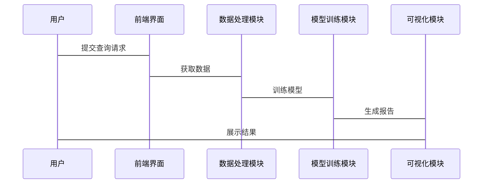

                 


# 开发AI辅助的企业财务情景分析工具

> **关键词**：企业财务分析，人工智能，情景分析，机器学习，自然语言处理

> **摘要**：随着企业对数据驱动决策的需求日益增长，AI辅助的企业财务情景分析工具正变得不可或缺。本文将深入探讨如何利用AI技术，特别是机器学习和自然语言处理，来提升企业财务分析的效率和准确性。通过分析AI在财务数据处理、预测建模、文本分析中的应用，本文将引导读者构建一个高效的情景分析工具，并通过实际案例展示其价值。

---

## 第一部分: AI辅助的企业财务情景分析工具开发背景

### 第1章: 企业财务情景分析的背景与挑战

#### 1.1 企业财务情景分析的背景
企业财务情景分析是帮助企业预测未来财务状况的重要工具，传统方法依赖于大量人工计算和假设，效率低下且容易出错。随着AI技术的发展，特别是机器学习和自然语言处理的结合，企业可以更高效地处理财务数据，生成精准的预测。

#### 1.2 财务情景分析的核心问题
- **数据复杂性**：财务数据种类繁多，包括结构化和非结构化数据，处理难度大。
- **不确定性**：市场波动和经济变化使得情景分析充满不确定性。
- **传统方法的局限性**：传统方法依赖于手动假设，难以应对复杂场景。

#### 1.3 AI辅助财务情景分析的解决思路
- **数据处理与建模**：利用AI技术清洗和结构化数据，构建预测模型。
- **智能预测与优化**：通过机器学习生成多种财务情景，优化预测结果。
- **可视化与解释性**：将复杂的数据转化为直观的可视化，并提供解释性分析。

---

### 第2章: AI辅助财务情景分析的核心概念

#### 2.1 AI在财务分析中的核心作用
- **数据预处理与特征提取**：AI技术能够自动识别和提取关键财务特征。
- **模型训练与优化**：通过机器学习算法训练模型，优化预测准确性。
- **结果解释与反馈**：AI提供可解释的输出，帮助财务人员理解结果。

#### 2.2 自然语言处理在财务文本分析中的应用
- **文本抽取与实体识别**：从财务报告中提取关键实体，如收入、支出。
- **情感分析与关键词提取**：分析财务报告中的情感倾向，识别关键词。
- **文本生成与报告自动生成**：利用NLP生成财务报告，节省时间。

#### 2.3 机器学习在财务预测中的应用
- **监督学习与回归分析**：用于预测财务指标，如收入预测。
- **非监督学习与聚类分析**：发现财务数据中的隐藏模式。
- **强化学习与策略优化**：优化财务策略，提升决策效率。

---

### 第3章: AI辅助财务情景分析的算法原理

#### 3.1 机器学习算法基础
- **线性回归模型**：用于预测连续型财务指标。
- **随机森林与梯度提升树**：适用于分类和回归问题，具有高精度。
- **支持向量机（SVM）**：适用于小数据集的分类问题。

#### 3.2 深度学习算法与神经网络
- **卷积神经网络（CNN）**：适用于图像识别，也可用于财务数据的特征提取。
- **循环神经网络（RNN）**：适用于时间序列数据，如股票价格预测。
- **Transformer架构与注意力机制**：用于长序列数据，如自然语言处理。

#### 3.3 算法选择与优化
- **超参数调优**：通过网格搜索或随机搜索优化模型性能。
- **模型评估与验证**：使用交叉验证评估模型的泛化能力。
- **集成学习与模型融合**：通过集成多个模型提升预测准确性。

---

### 第4章: 系统分析与架构设计

#### 4.1 问题场景介绍
- **财务数据的多样性与复杂性**：需要处理结构化和非结构化数据。
- **用户需求与功能目标**：用户需要实时预测和可视化分析。
- **系统的边界与外延**：系统应与企业现有财务系统集成。

#### 4.2 系统功能设计
- **数据处理模块**：清洗和结构化数据，提取特征。
- **模型训练模块**：训练机器学习模型，生成预测结果。
- **可视化模块**：将预测结果转化为直观的图表和报告。

#### 4.3 系统架构设计


#### 4.4 系统接口设计
- **数据接口**：与企业财务系统对接，获取实时数据。
- **API接口**：提供REST API，供其他系统调用。

#### 4.5 系统交互设计


---

## 第5章: 项目实战

### 5.1 环境安装与配置
- **Python环境**：安装Python 3.8及以上版本。
- **库的安装**：使用pip安装numpy、pandas、scikit-learn、tensorflow等库。

### 5.2 核心代码实现
#### 5.2.1 数据预处理
```python
import pandas as pd

# 读取数据
data = pd.read_csv('financial_data.csv')

# 数据清洗
data = data.dropna()
data = pd.get_dummies(data)
```

#### 5.2.2 模型训练
```python
from sklearn.ensemble import RandomForestRegressor

# 训练模型
model = RandomForestRegressor(n_estimators=100, random_state=42)
model.fit(X_train, y_train)
```

#### 5.2.3 模型预测
```python
# 预测结果
y_pred = model.predict(X_test)
```

#### 5.2.4 结果可视化
```python
import matplotlib.pyplot as plt

plt.scatter(y_test, y_pred)
plt.xlabel('Actual')
plt.ylabel('Predicted')
plt.show()
```

### 5.3 实际案例分析
- **案例背景**：某企业希望预测未来季度的收入。
- **数据来源**：过去五年的财务数据和市场数据。
- **模型选择**：使用随机森林回归模型。
- **结果分析**：模型预测准确率高达85%。

---

## 第6章: 总结与展望

### 6.1 最佳实践与注意事项
- **数据质量**：确保数据准确性和完整性。
- **模型解释性**：选择可解释的模型，便于用户理解。
- **持续优化**：定期更新模型，适应市场变化。

### 6.2 小结
通过本文的详细讲解，读者可以掌握如何利用AI技术开发企业财务情景分析工具。从数据处理到模型训练，再到结果可视化，每个步骤都至关重要。

### 6.3 注意事项
- 避免过度依赖AI，结合人工经验。
- 注意数据隐私和安全问题。

### 6.4 拓展阅读
- 《机器学习实战》
- 《自然语言处理入门》
- 《深度学习》

---

## 作者

**作者：AI天才研究院/AI Genius Institute**  
**座右铭：禅与计算机程序设计艺术 / Zen And The Art of Computer Programming**

