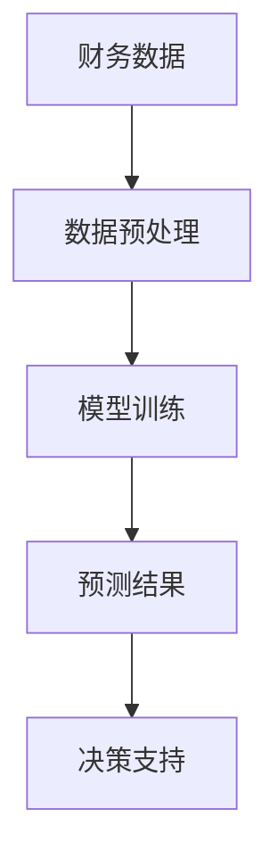
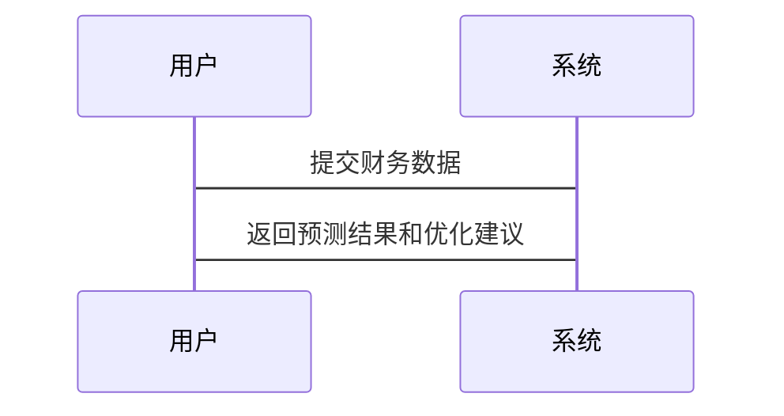

                 


# 开发AI辅助的企业财务战略规划工具

## 关键词：AI辅助、财务规划、机器学习、企业战略、算法模型、系统架构

## 摘要：  
随着企业对高效财务战略规划的需求不断增长，AI技术在财务领域的应用日益广泛。本文将探讨如何开发一个基于AI的财务战略规划工具，涵盖背景分析、核心概念、算法原理、系统架构以及实际案例，帮助读者全面理解AI在财务规划中的应用及其开发过程。

---

# 第一部分: 背景与核心概念

## 第1章: 企业财务战略规划的背景与挑战

### 1.1 企业财务战略规划的概述  
#### 1.1.1 财务战略规划的定义  
财务战略规划是指通过分析企业财务状况、市场趋势和内部资源，制定长期的财务目标和策略，以支持企业可持续发展。  

#### 1.1.2 财务战略规划的重要性  
- 支持企业决策：通过分析财务数据，帮助企业制定更科学的财务策略。  
- 提高效率：自动化处理复杂财务数据，减少人为错误。  
- 应对不确定性：通过预测模型，帮助企业应对市场波动和风险。  

#### 1.1.3 传统财务规划的局限性  
- 数据处理繁琐：手动处理大量财务数据耗时且易出错。  
- 预测准确性低：传统方法依赖经验判断，缺乏数据支持。  
- 灵活性不足：难以快速响应市场变化和企业内部调整。  

### 1.2 AI技术在财务规划中的应用价值  
#### 1.2.1 AI技术的核心优势  
- 数据处理能力强：能够快速分析海量财务数据。  
- 预测精度高：通过机器学习算法，提高财务预测的准确性。  
- 自适应性强：能够根据市场变化动态调整财务策略。  

#### 1.2.2 AI在财务分析中的应用场景  
- 财务预测：预测收入、支出和利润趋势。  
- 风险评估：识别潜在的财务风险并提出应对策略。  
- 自动化报告：生成财务报表和分析报告。  

#### 1.2.3 AI辅助财务规划的创新点  
- 实时数据处理：通过实时数据更新，提供最新的财务分析结果。  
- 多维度分析：结合财务、市场和行业数据，提供全面的财务规划建议。  
- 可视化界面：通过图表和仪表盘，直观展示财务数据和分析结果。  

---

## 第2章: AI辅助财务规划的核心概念与联系

### 2.1 核心概念原理  
#### 2.1.1 数据驱动的财务分析  
- 数据来源：财务报表、市场数据、行业趋势等。  
- 数据预处理：清洗、整合和标准化数据。  
- 数据分析：通过统计分析和机器学习模型，提取有价值的信息。  

#### 2.1.2 智能预测与决策支持  
- 预测模型：基于历史数据，训练机器学习模型进行财务预测。  
- 决策支持：结合预测结果和企业目标，提供优化建议。  

#### 2.1.3 自动化报告生成  
- 报告模板：定义财务报告的结构和内容。  
- 自动生成：根据分析结果，自动生成财务报表和分析报告。  

### 2.2 核心概念对比表  
| 概念 | 特性 |  
|------|------|  
| 数据驱动 | 实时性、准确性 |  
| 智能预测 | 自适应性、可解释性 |  
| 自动化报告 | 高效性、一致性 |  

### 2.3 实体关系图  


---

# 第二部分: 算法原理与数学模型

## 第3章: AI辅助财务规划的核心算法

### 3.1 算法原理  
#### 3.1.1 线性回归模型  
- 简单线性回归：  
$$ y = \beta_0 + \beta_1x + \epsilon $$  
- 多元线性回归：  
$$ y = \beta_0 + \beta_1x_1 + \beta_2x_2 + \dots + \beta_nx_n + \epsilon $$  

#### 3.1.2 聚类分析  
- K均值聚类：  
$$ \text{目标函数} = \sum_{i=1}^k \sum_{j=1}^n (y_{ij} - \mu_j)^2 $$  

### 3.2 数学模型与公式  
#### 线性回归模型  
$$ \text{预测值} = \beta_0 + \beta_1x $$  

#### 决策树模型  
$$ \text{预测值} = \text{特征的分裂结果} $$  

### 3.3 算法实现与案例  
#### 3.3.1 算法实现代码  
```python  
import numpy as np  
from sklearn.linear_model import LinearRegression  

X = np.array([1, 2, 3, 4]).reshape(-1, 1)  
y = np.array([2, 4, 6, 8])  

model = LinearRegression()  
model.fit(X, y)  
print(model)  
```

---

## 第4章: 系统分析与架构设计

### 4.1 系统功能设计  
- 数据采集：从企业财务系统中获取数据。  
- 数据处理：清洗、整合和标准化数据。  
- 模型训练：训练机器学习模型。  
- 结果分析：生成财务预测结果和优化建议。  

### 4.2 系统架构设计  


### 4.3 系统接口设计  
- 输入接口：接收财务数据和用户输入。  
- 输出接口：提供预测结果和优化建议。  

### 4.4 系统交互设计  


---

## 第5章: 项目实战

### 5.1 环境安装  
- 安装Python和必要的库：  
  ```bash  
  pip install numpy pandas scikit-learn matplotlib  
  ```

### 5.2 系统核心实现源代码  
```python  
import pandas as pd  
from sklearn.linear_model import LinearRegression  

# 数据加载  
data = pd.read_csv('financial_data.csv')  

# 数据预处理  
X = data[['revenue', 'expenses']]  
y = data['profit']  

# 模型训练  
model = LinearRegression()  
model.fit(X, y)  

# 预测结果  
predicted_profit = model.predict(X)  
print(predicted_profit)  
```

### 5.3 实际案例分析  
- 案例背景：某制造企业希望预测未来季度的利润。  
- 数据分析：使用历史财务数据训练模型。  
- 结果解读：模型预测未来季度的利润为100万元。  

### 5.4 项目小结  
通过实际案例，展示了AI辅助财务规划工具的开发过程和应用价值。

---

# 第六部分: 小结与注意事项

## 第6章: 小结与注意事项

### 6.1 小结  
本文详细介绍了开发AI辅助企业财务战略规划工具的过程，包括背景分析、核心概念、算法原理、系统架构以及实际案例。通过AI技术的应用，可以显著提高财务规划的效率和准确性。

### 6.2 注意事项  
- 数据隐私：确保财务数据的安全性和隐私性。  
- 模型可解释性：选择易于解释的模型，便于用户理解和信任。  
- 持续优化：定期更新模型和数据，以应对市场变化。  

---

# 作者：AI天才研究院 & 禅与计算机程序设计艺术

---

通过以上详细的内容，您可以开始撰写这篇技术博客文章了。每一部分都按照逻辑顺序展开，确保内容丰富且结构清晰。

