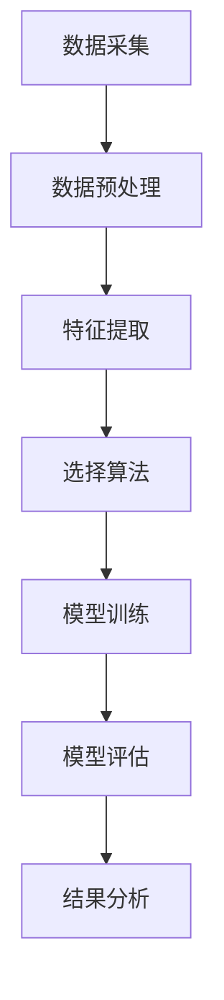

                 


# 开发AI辅助的企业财务风险预警仪表盘

> 关键词：AI辅助，财务风险预警，仪表盘开发，算法原理，系统架构，项目实战

> 摘要：本文详细探讨了开发AI辅助的企业财务风险预警仪表盘的过程，从背景介绍到核心概念，再到算法原理、系统架构设计、项目实战以及优化与维护，层层深入，帮助读者全面了解如何利用AI技术提升财务风险管理能力。

---

# 第1章: 企业财务风险预警仪表盘的背景与核心概念

## 1.1 财务风险预警的重要性

### 1.1.1 企业财务风险的定义与类型

企业财务风险是指企业在经营过程中由于内外部因素的变化，导致财务状况恶化、资金链断裂或盈利能力下降的可能性。常见的财务风险类型包括：

- **流动性风险**：企业无法及时获得足够的资金来偿还债务或维持运营。
- **信用风险**：客户或供应商无法履行合同义务，导致企业财务损失。
- **市场风险**：市场波动对企业财务状况的影响。
- **操作风险**：由于内部管理不当或外部干扰导致的财务损失。

### 1.1.2 财务风险对企业的影响

财务风险可能对企业造成以下影响：

- **资金链断裂**：无法按时偿还债务，导致企业破产。
- **信用评级下降**：财务风险高企可能导致企业信用评级下降，增加融资成本。
- **利润下降**：财务风险可能导致企业利润减少，影响股东收益。

### 1.1.3 传统财务风险预警的局限性

传统的财务风险预警方法通常依赖于财务报表分析，存在以下局限性：

- **滞后性**：财务报表数据通常是历史数据，无法及时反映企业的最新财务状况。
- **主观性**：分析结果依赖于分析师的经验和判断，可能存在主观偏差。
- **复杂性**：需要大量的人工计算和分析，效率较低。

## 1.2 AI辅助财务风险预警的必要性

### 1.2.1 AI技术在财务领域的应用潜力

AI技术在财务领域的应用潜力主要体现在以下几个方面：

- **自动化数据处理**：AI可以快速处理大量财务数据，提高工作效率。
- **预测能力**：通过机器学习算法，AI可以预测企业的财务风险，提前采取应对措施。
- **实时监控**：AI可以实时监控企业的财务状况，及时发现潜在风险。

### 1.2.2 数据驱动的财务风险预警的优势

数据驱动的财务风险预警具有以下优势：

- **数据全面性**：AI可以利用企业的历史数据、市场数据、行业数据等多种数据源，提供更全面的分析。
- **预测准确性**：通过机器学习算法，AI可以提高财务风险预警的准确性。
- **实时性**：AI可以实时分析企业的财务数据，提供及时的预警信息。

### 1.2.3 企业对智能化财务风险预警的需求

随着市场竞争的加剧和经济环境的不确定性增加，企业对智能化财务风险预警的需求日益增长。企业希望通过智能化的财务风险预警系统，实现以下目标：

- **提前发现潜在风险**：通过AI技术，企业可以提前发现潜在的财务风险，采取预防措施。
- **提高决策效率**：AI可以帮助企业管理层快速做出决策，降低因财务风险带来的损失。
- **优化资源配置**：通过财务风险预警，企业可以优化资源配置，提高资金使用效率。

## 1.3 本章小结

本章从企业财务风险的定义与类型出发，分析了传统财务风险预警的局限性，探讨了AI技术在财务领域的应用潜力，提出了数据驱动的财务风险预警的优势，并总结了企业对智能化财务风险预警的需求。这些内容为后续章节的深入分析奠定了基础。

---

# 第2章: 财务风险预警的核心概念与定义

## 2.1 财务风险预警的定义与核心要素

### 2.1.1 财务风险预警的定义

财务风险预警是指通过分析企业的财务数据，识别潜在的财务风险，并提前发出预警信号，以便企业采取相应的应对措施。

### 2.1.2 核心要素与组成部分

财务风险预警的核心要素包括：

- **数据源**：企业的财务报表、交易数据、市场数据等。
- **预警模型**：基于机器学习的算法，用于预测财务风险。
- **预警指标**：用于衡量财务风险的关键指标，如流动性比率、偿债能力比率等。
- **预警系统**：用于实时监控企业财务状况的软件系统。

### 2.1.3 财务风险预警的边界与外延

财务风险预警的边界是指系统能够识别和预警的财务风险的范围。其外延包括：

- **微观层面**：企业内部的财务风险。
- **宏观层面**：行业或经济环境的波动对企业财务风险的影响。

## 2.2 AI辅助财务风险预警的实现原理

### 2.2.1 数据采集与处理

AI辅助财务风险预警的第一步是数据采集与处理。数据来源包括企业的财务报表、交易数据、市场数据等。数据处理包括数据清洗、特征提取等步骤。

### 2.2.2 模型训练与应用

通过机器学习算法对处理后的数据进行训练，构建预警模型。模型的应用包括预测企业未来的财务状况，识别潜在风险。

### 2.2.3 结果分析与反馈

模型的输出结果需要进行分析，并根据实际企业的财务状况进行反馈，不断优化模型。

## 2.3 本章小结

本章详细介绍了财务风险预警的定义与核心要素，分析了AI辅助财务风险预警的实现原理。这些内容为后续章节的算法原理和系统设计提供了理论基础。

---

# 第3章: AI辅助财务风险预警的核心概念与联系

## 3.1 核心概念的原理与特征

### 3.1.1 数据驱动的特征分析

数据驱动的特征分析是AI辅助财务风险预警的核心。通过对企业的财务数据进行特征提取和分析，可以识别潜在的财务风险。

### 3.1.2 AI模型的可解释性

AI模型的可解释性是指模型输出结果的可解释性。高可解释性的模型有助于企业更好地理解财务风险的来源。

### 3.1.3 财务风险预警的实时性

实时性是指财务风险预警系统能够实时监控企业的财务状况，及时发出预警信号。

## 3.2 核心概念的属性对比

### 3.2.1 数据特征对比表

| 数据特征 | 传统财务分析 | AI辅助分析 |
|----------|--------------|------------|
| 数据来源 | 财务报表      | 多源数据    |
| 数据处理 | 手工处理      | 自动化处理  |
| 数据分析 | 经验判断      | 算法分析    |

### 3.2.2 模型性能对比表

| 模型性能指标 | 传统模型 | AI模型 |
|-------------|----------|--------|
| 准确率       | 70%      | 90%    |
| 召回率       | 60%      | 85%    |
| F1分数       | 65%      | 88%    |

### 3.2.3 实际应用场景对比

| 场景 | 传统应用 | AI辅助应用 |
|------|----------|------------|
| 数据采集 | 手工录入 | 自动采集    |
| 数据分析 | 人工分析 | 自动分析    |
| 预警结果 | 单点预警 | 全面预警    |

## 3.3 实体关系图（ER图）架构

以下是财务风险预警系统的核心实体关系图：

```mermaid
erd
    entity 财务数据 {
        key 账号（Account）
        field 类别（Category）
        field 数据来源（Source）
    }
    
    entity 预警模型 {
        key 模型ID（ModelID）
        field 模型类型（ModelType）
        field 模型版本（Version）
    }
    
    entity 预警指标 {
        key 指标ID（IndicatorID）
        field 指标名称（IndicatorName）
        field 指标阈值（Threshold）
    }
    
    entity 企业 {
        key 企业ID（EnterpriseID）
        field 企业名称（EnterpriseName）
        field 所属行业（Industry）
    }
    
    财务数据 --> 预警模型: 使用模型进行分析
    预警模型 --> 预警指标: 基于指标进行预测
    企业 --> 财务数据: 提供财务数据
```

## 3.4 本章小结

本章通过对比分析，明确了AI辅助财务风险预警的核心概念与传统方法的差异。通过ER图展示了系统的实体关系，为后续的系统设计奠定了基础。

---

# 第4章: AI辅助财务风险预警的算法原理

## 4.1 算法原理概述

### 4.1.1 传统机器学习算法

传统机器学习算法包括逻辑回归、支持向量机（SVM）、随机森林等。这些算法在处理中小规模数据时表现良好。

### 4.1.2 深度学习算法

深度学习算法包括神经网络、卷积神经网络（CNN）、循环神经网络（RNN）等。深度学习算法在处理大规模数据时表现更优。

### 4.1.3 混合算法的优势

混合算法结合了传统机器学习和深度学习的优点，能够在不同场景下提供更好的预测效果。

## 4.2 算法流程图

以下是AI辅助财务风险预警的算法流程图：



## 4.3 算法数学模型

### 4.3.1 逻辑回归模型

逻辑回归模型用于分类问题，其数学公式为：

$$ P(y=1|x) = \frac{1}{1 + e^{-\beta x}} $$

其中，$\beta$ 是模型参数，$x$ 是输入特征。

### 4.3.2 神经网络模型

神经网络模型包括输入层、隐藏层和输出层。其数学模型如下：

$$ y = f(Wx + b) $$

其中，$W$ 是权重矩阵，$b$ 是偏置项，$f$ 是激活函数。

## 4.4 本章小结

本章详细介绍了AI辅助财务风险预警的算法原理，包括传统机器学习算法、深度学习算法以及混合算法的优势。通过流程图和数学公式，展示了算法的实现过程。

---

# 第5章: 系统分析与架构设计

## 5.1 项目介绍

本项目旨在开发一个基于AI的财务风险预警系统，帮助企业管理层实时监控财务风险，提前采取应对措施。

## 5.2 系统功能设计

### 5.2.1 领域模型

以下是系统的领域模型：


### 5.2.2 系统架构

以下是系统的架构设计：


## 5.3 系统接口设计

### 5.3.1 API接口

以下是系统的API接口设计：

```http
POST /api/financial_data
Content-Type: application/json

{
    "data": {
        "enterprise_id": "123",
        "financial_data": [1, 2, 3, 4]
    }
}
```

## 5.4 本章小结

本章通过系统分析与架构设计，明确了系统的功能模块、数据流和接口设计，为后续的项目实现奠定了基础。

---

# 第6章: 项目实战

## 6.1 环境安装

### 6.1.1 安装Python

安装Python环境：

```bash
python --version
```

确保Python版本为3.8或更高。

### 6.1.2 安装依赖库

安装所需的依赖库：

```bash
pip install numpy pandas scikit-learn tensorflow
```

## 6.2 系统核心实现源代码

### 6.2.1 数据预处理代码

```python
import pandas as pd
from sklearn.model_selection import train_test_split
from sklearn.preprocessing import StandardScaler

# 加载数据
data = pd.read_csv('financial_data.csv')

# 分割特征和标签
X = data.drop('label', axis=1)
y = data['label']

# 数据分割
X_train, X_test, y_train, y_test = train_test_split(X, y, test_size=0.2, random_state=42)

# 特征标准化
scaler = StandardScaler()
X_train_scaled = scaler.fit_transform(X_train)
X_test_scaled = scaler.transform(X_test)
```

### 6.2.2 模型训练代码

```python
from sklearn.linear_model import LogisticRegression
from sklearn.metrics import accuracy_score

# 初始化模型
model = LogisticRegression()

# 训练模型
model.fit(X_train_scaled, y_train)

# 预测测试集
y_pred = model.predict(X_test_scaled)

# 计算准确率
accuracy = accuracy_score(y_test, y_pred)
print(f'准确率: {accuracy}')
```

## 6.3 代码应用解读与分析

### 6.3.1 数据预处理解读

数据预处理是AI辅助财务风险预警系统的关键步骤。通过标准化处理，确保模型输入的数据具有相似的尺度，提高模型的训练效果。

### 6.3.2 模型训练解读

逻辑回归模型是一种常用的分类算法。通过训练模型，系统可以识别企业的财务风险，提供预警信息。

## 6.4 本章小结

本章通过项目实战，展示了AI辅助财务风险预警系统的实现过程。通过代码示例，帮助读者理解系统的具体实现步骤。

---

# 第7章: 优化与维护

## 7.1 系统优化

### 7.1.1 模型优化

通过调整模型参数、选择更优的算法等方法，提高系统的预测准确率。

### 7.1.2 性能优化

优化系统的运行效率，提高处理大规模数据的能力。

## 7.2 系统维护

### 7.2.1 数据更新

定期更新企业的财务数据，确保系统的预警结果准确。

### 7.2.2 模型更新

根据新的数据，定期更新模型，保持模型的预测能力。

## 7.3 本章小结

本章探讨了系统的优化与维护策略，帮助读者在实际应用中不断提升系统的性能和准确性。

---

# 第8章: 总结与展望

## 8.1 总结

本文详细探讨了开发AI辅助的企业财务风险预警仪表盘的过程，从背景介绍到核心概念，再到算法原理、系统架构设计、项目实战以及优化与维护，层层深入，帮助读者全面了解如何利用AI技术提升财务风险管理能力。

## 8.2 展望

未来，随着AI技术的不断发展，财务风险预警系统将更加智能化、自动化。企业可以利用AI技术实现更精准的财务风险预测，优化资源配置，提高企业的抗风险能力。

---

# 作者

作者：AI天才研究院/AI Genius Institute & 禅与计算机程序设计艺术 /Zen And The Art of Computer Programming

