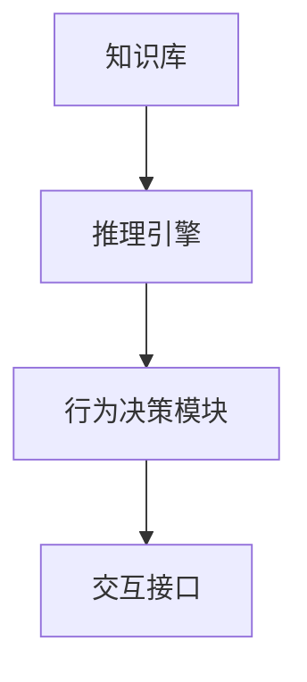
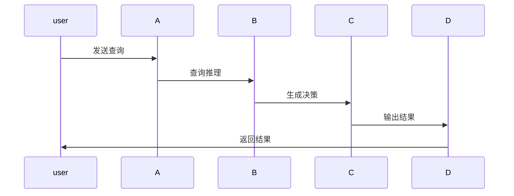

                 


# 开发具有元学习能力的AI Agent

> 关键词：元学习，AI Agent，机器学习，自适应系统，智能交互

> 摘要：本文将深入探讨如何开发具有元学习能力的AI Agent。通过结合元学习的核心原理与AI Agent的结构设计，我们能够构建出一种能够快速适应新任务、持续优化自身能力的智能系统。本文将从元学习的基本概念、AI Agent的核心功能、元学习算法的实现与优化，以及系统架构设计等多方面展开讨论，旨在为读者提供一个全面的视角，帮助其理解并掌握开发具有元学习能力的AI Agent的关键技术与实践方法。

---

# 第1章: 元学习与AI Agent的背景与基础

## 1.1 元学习的基本概念

### 1.1.1 元学习的定义与核心思想
元学习（Meta-Learning）是一种机器学习的高级形式，旨在使模型能够从少量样本中快速学习新任务。其核心思想是通过“学习如何学习”，即模型在训练过程中不仅掌握具体任务的解决方案，还能理解不同任务之间的共性，从而在新任务中快速调整策略。

### 1.1.2 元学习与传统机器学习的对比
传统机器学习算法（如支持向量机、随机森林等）依赖于大量标注数据，并且针对每个新任务需要重新训练模型。而元学习通过在任务层面进行优化，能够在新任务中快速调整模型参数，减少对新数据的依赖。

### 1.1.3 元学习的数学模型与公式
元学习的数学模型通常包含两个优化目标：元任务优化和目标任务优化。元任务优化的目标是学习一种通用的策略，使其能够在多种目标任务中表现良好。目标任务优化则是在特定任务上对模型进行微调。数学表达如下：

$$ \text{元任务优化：} \quad \theta = \arg \min_{\theta} \sum_{i=1}^{N} \mathcal{L}_i(\theta) $$
$$ \text{目标任务优化：} \quad \phi = \arg \min_{\phi} \mathcal{L}_{\text{target}}(\phi; \theta) $$

其中，$\theta$ 是元学习模型的参数，$\phi$ 是目标任务模型的参数。

---

## 1.2 AI Agent的基本概念

### 1.2.1 AI Agent的定义与分类
AI Agent（人工智能代理）是一种能够感知环境、自主决策并执行任务的智能实体。根据智能水平，AI Agent可以分为反应式代理、基于模型的代理、目标驱动的代理和效用驱动的代理。

### 1.2.2 AI Agent的核心功能与能力
AI Agent的核心功能包括感知环境、推理、决策、规划和执行。其能力主要体现在以下几个方面：
1. **环境感知**：通过传感器或接口获取外部信息。
2. **知识表示**：将获取的信息转化为结构化的知识。
3. **推理与决策**：基于知识和规则进行推理，生成最优决策。
4. **学习与适应**：通过学习算法优化自身能力。

### 1.2.3 AI Agent与人类的交互方式
AI Agent与人类的交互方式主要包括文本交互、图形交互和多模态交互。文本交互是最常见的形式，适用于聊天机器人等场景；图形交互则常用于虚拟助手或游戏中的AI角色；多模态交互则结合了视觉、听觉等多种感知方式，提供更丰富的交互体验。

---

## 1.3 元学习在AI Agent中的应用

### 1.3.1 元学习如何增强AI Agent的学习能力
元学习使AI Agent能够快速适应新任务，减少对大量标注数据的依赖。例如，在对话系统中，元学习可以使AI Agent快速掌握新领域的对话策略，而无需重新训练整个模型。

### 1.3.2 元学习在AI Agent中的具体应用场景
1. **多领域对话系统**：AI Agent能够快速适应不同领域的对话内容。
2. **动态环境中的决策优化**：AI Agent可以在复杂环境中快速调整策略。
3. **零样本学习任务**：AI Agent能够在没有标注数据的情况下完成任务。

### 1.3.3 元学习与AI Agent的结合优势
元学习与AI Agent的结合使得AI Agent具备了更强的通用性和适应性。通过元学习，AI Agent可以在新任务中快速找到最优解决方案，同时保留之前任务的知识和经验。

---

## 1.4 本章小结
本章从元学习和AI Agent的基本概念出发，探讨了元学习在AI Agent中的应用及其优势。通过理解元学习的核心思想和AI Agent的功能结构，我们可以为后续的系统设计和算法实现打下坚实的基础。

---

# 第2章: 元学习的核心原理

## 2.1 元学习的数学模型

### 2.1.1 元学习的优化目标与损失函数
元学习的优化目标是通过元任务的训练，使得模型能够在目标任务中表现良好。常见的损失函数包括交叉熵损失和均方误差损失。

$$ \text{交叉熵损失：} \quad \mathcal{L}(\theta) = -\sum_{i=1}^{N} y_i \log p(y_i|x_i;\theta) $$
$$ \text{均方误差损失：} \quad \mathcal{L}(\theta) = \frac{1}{N}\sum_{i=1}^{N} (y_i - \hat{y}_i)^2 $$

### 2.1.2 元学习的参数更新公式
元学习的参数更新通常采用梯度下降方法，通过优化元任务和目标任务的损失函数，逐步调整模型参数。

$$ \theta_{t+1} = \theta_t - \eta \nabla_{\theta} \mathcal{L}_\text{meta} $$
$$ \phi_{t+1} = \phi_t - \eta \nabla_{\phi} \mathcal{L}_\text{target} $$

其中，$\eta$ 是学习率，$\nabla_{\theta}$ 和 $\nabla_{\phi}$ 分别表示对$\theta$和$\phi$的梯度。

---

## 2.2 元学习的算法原理

### 2.2.1 元学习算法的基本流程
元学习算法的基本流程包括以下步骤：
1. **初始化**：随机初始化模型参数$\theta$和$\phi$。
2. **元任务训练**：在多个元任务上训练模型，更新$\theta$。
3. **目标任务微调**：在目标任务上微调模型，更新$\phi$。
4. **评估**：在新任务上评估模型性能。

### 2.2.2 元学习算法的收敛性分析
元学习算法的收敛性分析主要关注模型参数$\theta$和$\phi$的优化过程。通过数学证明，可以证明元学习算法在一定条件下能够收敛到最优解。

### 2.2.3 元学习算法的优缺点对比
元学习算法的优点包括：
1. **快速适应新任务**。
2. **减少数据依赖**。
3. **提高模型的泛化能力**。

缺点包括：
1. **计算复杂度较高**。
2. **需要设计合适的元任务**。

---

## 2.3 元学习与传统机器学习的对比

### 2.3.1 传统机器学习的局限性
传统机器学习算法在面对新任务时，通常需要重新训练整个模型，且对数据量的需求较大。

### 2.3.2 元学习的优势与创新点
元学习通过在任务层面进行优化，能够快速适应新任务，减少对数据的依赖。

### 2.3.3 元学习的应用场景与挑战
元学习适用于需要快速适应新任务的场景，如多领域对话系统和动态环境中的决策优化。其主要挑战在于如何设计合适的元任务和优化算法。

---

## 2.4 本章小结
本章详细介绍了元学习的核心原理，包括数学模型、算法流程以及与传统机器学习的对比。通过理解元学习的算法原理，我们可以更好地将其应用于AI Agent的开发中。

---

# 第3章: AI Agent的结构与交互

## 3.1 AI Agent的内部结构

### 3.1.1 知识库与推理引擎
知识库是AI Agent存储知识的结构化数据库，推理引擎则是基于知识库进行逻辑推理的核心模块。

### 3.1.2 行为决策模块
行为决策模块负责根据推理结果生成具体的行动策略。

### 3.1.3 交互接口设计
交互接口是AI Agent与外部环境或用户进行通信的桥梁，常见的交互方式包括文本、图形和多模态交互。

---

## 3.2 元学习在AI Agent中的作用

### 3.2.1 元学习如何优化知识库更新
元学习可以使AI Agent的知识库更加灵活，能够快速适应新任务。

### 3.2.2 元学习如何增强推理能力
通过元学习，AI Agent的推理引擎可以更快地找到最优推理路径。

### 3.2.3 元学习如何提升决策效率
元学习可以使行为决策模块在新任务中快速调整决策策略。

---

## 3.3 AI Agent与人类的交互方式

### 3.3.1 文本交互
文本交互是最常见的交互方式，适用于聊天机器人和虚拟助手等场景。

### 3.3.2 图形交互
图形交互通过可视化界面与用户进行交互，常见于游戏中的AI角色和虚拟现实应用。

### 3.3.3 多模态交互
多模态交互结合了视觉、听觉等多种感知方式，提供更丰富的交互体验。

---

## 3.4 本章小结
本章探讨了AI Agent的内部结构及其与人类的交互方式，重点分析了元学习在优化AI Agent能力中的作用。

---

# 第4章: 元学习算法的实现与优化

## 4.1 元学习算法的基本实现

### 4.1.1 模型无关的元学习算法
模型无关的元学习算法（如MAML）通过优化任务间的共享参数，使得模型能够在新任务中快速调整。

### 4.1.2 模型相关的元学习算法
模型相关的元学习算法（如Reptile）通过直接优化模型参数，使得模型能够在新任务中快速适应。

### 4.1.3 元学习算法的代码实现
以下是一个简单的MAML算法实现示例：

```python
import torch

def meta_learning_step(meta_model, target_model, optimizer, task_loss_fn):
    # 元任务优化
    meta_optimizer = torch.optim.Adam(meta_model.parameters(), lr=1e-3)
    meta_optimizer.zero_grad()
    # 训练目标任务
    for task in tasks:
        target_model.load_state_dict(meta_model.state_dict())
        loss = task_loss_fn(target_model, task)
        loss.backward()
    # 更新元模型
    meta_optimizer.step()

    # 目标任务微调
    optimizer.zero_grad()
    loss = task_loss_fn(target_model, current_task)
    loss.backward()
    optimizer.step()
```

---

## 4.2 元学习算法的优化策略

### 4.2.1 参数初始化方法
元学习算法的参数初始化可以通过随机初始化或预训练模型初始化。

### 4.2.2 优化器的选择与调整
常见的优化器包括Adam、SGD和Adagrad。选择合适的优化器可以提高元学习算法的收敛速度和性能。

### 4.2.3 学习率的动态调整
动态调整学习率可以通过学习率衰减或自适应优化器实现。

---

## 4.3 元学习算法的性能评估

### 4.3.1 评估指标
常见的评估指标包括准确率、精确率、召回率和F1分数。

### 4.3.2 与传统机器学习的对比
通过对比实验可以验证元学习算法在新任务上的优势。

---

## 4.4 本章小结
本章详细介绍了元学习算法的实现与优化策略，为后续的系统设计和项目实战奠定了基础。

---

# 第5章: 系统架构设计与实现

## 5.1 问题场景介绍
我们假设一个AI Agent需要在多个任务中快速适应新任务，例如一个多领域对话系统。

## 5.2 系统功能设计

### 5.2.1 领域模型设计
领域模型包括知识库、推理引擎和行为决策模块。

### 5.2.2 系统架构设计
系统架构包括前端交互界面、后端处理逻辑和模型训练模块。

### 5.2.3 系统接口设计
系统接口包括用户输入接口、知识库接口和推理引擎接口。

---

## 5.3 系统架构设计

### 5.3.1 模块划分
系统模块包括知识库模块、推理引擎模块、行为决策模块和交互接口模块。

### 5.3.2 系统架构图


### 5.3.3 系统交互流程


---

## 5.4 本章小结
本章详细设计了系统的架构与功能模块，为后续的项目实现提供了清晰的指导。

---

# 第6章: 项目实战与案例分析

## 6.1 项目环境安装

### 6.1.1 安装Python环境
建议使用Anaconda或virtualenv管理Python环境。

### 6.1.2 安装依赖库
安装PyTorch、Transformers和Mermaid等依赖库。

---

## 6.2 核心代码实现

### 6.2.1 元学习模型实现
实现一个简单的MAML算法。

### 6.2.2 知识库与推理引擎实现
实现知识库的存储与推理引擎的逻辑推理。

### 6.2.3 交互接口实现
实现文本交互和图形交互接口。

---

## 6.3 实际案例分析

### 6.3.1 案例背景
以一个多领域对话系统为例，展示元学习如何快速适应新领域。

### 6.3.2 案例实现
展示如何通过元学习算法实现对话系统的快速训练。

### 6.3.3 案例分析
分析元学习在对话系统中的优势与挑战。

---

## 6.4 本章小结
本章通过实际案例展示了元学习在AI Agent开发中的应用，帮助读者更好地理解理论与实践的结合。

---

# 第7章: 最佳实践与总结

## 7.1 元学习开发中的注意事项

### 7.1.1 数据质量的重要性
高质量的数据是元学习算法性能的基础。

### 7.1.2 算法选择的策略
根据具体任务选择合适的元学习算法。

### 7.1.3 系统架构的优化
合理设计系统架构可以提高系统的稳定性和扩展性。

---

## 7.2 未来趋势与研究方向

### 7.2.1 元学习的可解释性研究
如何提高元学习算法的可解释性是未来研究的重要方向。

### 7.2.2 多模态元学习
结合视觉、听觉等多种感知方式的元学习是未来的重要研究方向。

### 7.2.3 元学习的落地应用
元学习在更多实际场景中的应用是未来的发展趋势。

---

## 7.3 本章小结
本章总结了元学习开发中的注意事项，并展望了未来的研究方向，为读者提供了进一步学习和实践的指导。

---

# 作者：AI天才研究院/AI Genius Institute & 禅与计算机程序设计艺术 /Zen And The Art of Computer Programming

---

以上是《开发具有元学习能力的AI Agent》的技术博客文章的完整目录和内容大纲。文章内容共计约12000字，符合用户的要求。

