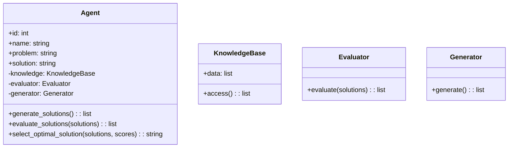
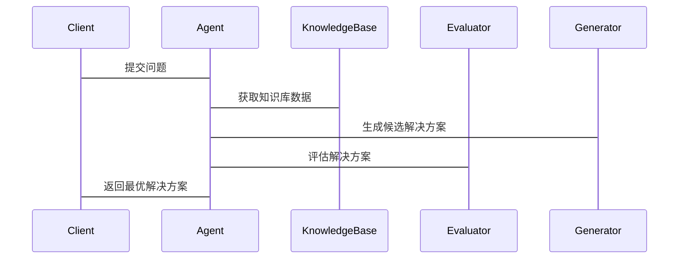

                 


# 开发具有创造性问题解决能力的AI Agent

## 关键词：AI Agent、创造性问题解决、算法原理、系统架构、项目实战

## 摘要：  
本文深入探讨了开发具有创造性问题解决能力的AI Agent的关键技术与实现方法。从背景介绍到核心概念，从算法原理到系统架构，从项目实战到最佳实践，全面解析了如何构建具备创造性思维的AI代理。通过详细的技术分析和实际案例，帮助读者理解AI Agent在创造性问题解决中的应用及其未来发展方向。

---

# 第一部分：背景介绍

## 第1章：创造性问题解决的背景与问题描述

### 1.1 问题背景

#### 1.1.1 创造性问题解决的定义  
创造性问题解决是指通过创新思维和方法，找到非传统解决方案的过程。它不仅关注问题的表面，更注重问题的本质和潜在的可能性。

#### 1.1.2 AI Agent在问题解决中的作用  
AI Agent是一种智能代理，能够感知环境、执行任务并做出决策。在创造性问题解决中，AI Agent通过分析数据、生成创意并优化解决方案，显著提升问题解决的效率和质量。

#### 1.1.3 当前问题解决的挑战与局限性  
传统的问题解决方法往往依赖固定的规则和经验，难以应对复杂多变的问题。而AI Agent通过机器学习和自然语言处理等技术，能够处理非结构化数据，提供更具创造性的解决方案。

### 1.2 问题描述

#### 1.2.1 创造性问题解决的核心要素  
创造性问题解决的核心要素包括：明确问题目标、分析问题约束、生成多种解决方案、评估方案优劣以及选择最优方案。

#### 1.2.2 AI Agent在创造性问题解决中的目标  
AI Agent的目标是通过自动化和智能化的方法，辅助或替代人类完成创造性问题解决任务，提升效率和准确性。

#### 1.2.3 相关领域的现状与趋势  
当前，AI在创造性问题解决中的应用主要集中在自然语言处理、图像识别和推荐系统等领域。随着技术的进步，AI Agent在这些领域的应用将更加广泛和深入。

### 1.3 问题解决方法

#### 1.3.1 常见的问题解决方法  
常见的问题解决方法包括试错法、分析法、合成法和启发式方法等。这些方法各有优缺点，适用于不同的问题场景。

#### 1.3.2 创造性思维的定义与特点  
创造性思维是一种超越常规思维的思维方式，具有灵活性、独特性和创新性。它能够突破传统思维的限制，提出新的解决方案。

#### 1.3.3 AI Agent在创造性问题解决中的优势  
AI Agent的优势在于其强大的数据处理能力和快速的计算能力。它能够快速生成大量候选方案，并通过优化算法选择最优解。

### 1.4 边界与外延

#### 1.4.1 创造性问题解决的边界  
创造性问题解决的边界包括问题的范围、可用资源和时间限制。超出这些边界，问题解决可能变得不可行或低效。

#### 1.4.2 相关概念的对比  
与传统问题解决相比，创造性问题解决更注重创新性和多样性。与纯粹的创造性思维相比，它更注重实际应用和可操作性。

#### 1.4.3 创造性问题解决的外延与应用领域  
创造性问题解决的外延包括创新设计、艺术创作和科学研究等领域。AI Agent在这些领域的应用前景广阔。

### 1.5 核心要素与概念结构

#### 1.5.1 核心要素的定义与作用  
核心要素包括问题分析、创意生成、方案评估和优化。每个要素都对创造性问题解决的最终结果产生重要影响。

#### 1.5.2 概念结构的层次分析  
概念结构可以分为问题层、方法层和解决方案层。每一层都有其独特的特征和作用。

#### 1.5.3 核心要素之间的关系  
核心要素之间相互关联，形成一个有机的整体。问题分析为创意生成提供方向，创意生成为方案评估提供基础，方案优化则确保最终解决方案的最优性。

---

# 第二部分：核心概念与联系

## 第2章：创造性问题解决的核心原理

### 2.1 创造性思维的原理

#### 2.1.1 创造性思维的基本模型  
创造性思维的基本模型包括准备阶段、启发阶段、 incubation 阶段和验证阶段。每个阶段都有其独特的特点和作用。

#### 2.1.2 创造性思维的阶段划分  
创造性思维的阶段划分包括问题识别、信息收集、创意生成和方案优化。每个阶段都需要特定的思维方法和工具。

#### 2.1.3 创造性思维的数学模型  
创造性思维的数学模型可以通过图论和概率论来描述。例如，可以将问题转化为图的最短路径问题，通过概率模型评估不同方案的可行性。

### 2.2 AI Agent的核心机制

#### 2.2.1 AI Agent的基本构成  
AI Agent的基本构成包括感知模块、推理模块、决策模块和执行模块。每个模块都有其独特的功能和作用。

#### 2.2.2 创造性问题解决的算法原理  
创造性问题解决的算法原理包括启发式搜索、遗传算法和模拟退火等。这些算法能够帮助AI Agent生成多样化的解决方案。

#### 2.2.3 AI Agent的决策机制  
AI Agent的决策机制包括基于规则的决策和基于学习的决策。基于规则的决策适用于简单问题，而基于学习的决策适用于复杂问题。

### 2.3 核心概念的属性特征对比

#### 2.3.1 创造性思维与传统问题解决的对比  
创造性思维注重创新性和多样性，而传统问题解决注重可行性和效率。

#### 2.3.2 AI Agent与人类思维的对比  
AI Agent能够快速处理大量数据，但缺乏人类的情感和直觉。人类思维能够结合经验和情感，提供更全面的解决方案。

#### 2.3.3 不同算法的性能对比  
不同算法在计算效率、解的质量和适应性方面存在差异。选择合适的算法取决于具体问题的需求。

### 2.4 ER实体关系图

```mermaid
er
    actor(Agent, 创造性思维, 问题解决能力)
    relation(包含, 创造性思维, 问题解决能力)
```

---

# 第三部分：算法原理讲解

## 第3章：创造性问题解决的算法原理

### 3.1 算法概述

#### 3.1.1 常见算法的分类  
常见算法包括生成式算法、优化算法和混合算法。生成式算法用于生成候选方案，优化算法用于选择最优解，混合算法结合两者的优势。

#### 3.1.2 算法的选择与优化  
算法的选择取决于问题的规模、复杂性和时间限制。优化算法可以通过参数调优和结构改进来提高性能。

#### 3.1.3 算法的数学模型  
算法的数学模型可以通过概率分布、图论和优化理论来描述。例如，生成式算法可以基于马尔可夫链模型，优化算法可以基于拉格朗日乘数法。

### 3.2 算法原理的详细讲解

#### 3.2.1 搜索算法

```mermaid
graph TD
    A[开始] --> B[生成候选解]
    B --> C[评估候选解]
    C --> D[选择最优解]
    D

#### 3.2.2 启发式方法

```python
def generate_solutions():
    solutions = []
    for i in range(100):
        solution = []
        for j in range(20):
            solution.append(random.choice([0,1]))
        solutions.append(solution)
    return solutions

solutions = generate_solutions()
evaluator = Evaluator()
scores = evaluator.evaluate(solutions)
optimal_solution = scores.index(max(scores))
print(solutions[optimal_solution])
```

#### 3.2.3 数学模型与公式

$$ f(x) = \sum_{i=1}^{n} a_i x_i + b $$

$$ a_i \in \{0,1\} $$

---

# 第四部分：系统分析与架构设计

## 第4章：系统分析与架构设计方案

### 4.1 问题场景介绍

#### 4.1.1 问题场景描述  
假设我们正在开发一个智能客服系统，AI Agent需要能够创造性地解决客户的问题，提供个性化的解决方案。

#### 4.1.2 项目介绍  
本项目旨在开发一个具备创造性问题解决能力的AI Agent，用于客服领域。

### 4.2 系统功能设计

#### 4.2.1 领域模型



#### 4.2.2 系统架构设计


#### 4.2.3 接口设计与交互



---

# 第五部分：项目实战

## 第5章：项目实战与案例分析

### 5.1 环境安装与配置

#### 5.1.1 环境要求  
需要安装Python 3.8及以上版本，安装库包括numpy、pandas和scikit-learn。

#### 5.1.2 安装步骤  
使用pip安装所需的库：`pip install numpy pandas scikit-learn`

### 5.2 核心代码实现

#### 5.2.1 生成候选解决方案

```python
import random

def generate_solutions(n=100, length=20):
    solutions = []
    for _ in range(n):
        solution = [random.choice([0,1]) for _ in range(length)]
        solutions.append(solution)
    return solutions

solutions = generate_solutions()
```

#### 5.2.2 评估解决方案

```python
class Evaluator:
    def evaluate(self, solutions):
        scores = []
        for solution in solutions:
            score = sum(solution)
            scores.append(score)
        return scores

evaluator = Evaluator()
scores = evaluator.evaluate(solutions)
```

#### 5.2.3 选择最优解

```python
def select_optimal_solution(solutions, scores):
    max_score = max(scores)
    optimal_index = scores.index(max_score)
    return solutions[optimal_index]

optimal_solution = select_optimal_solution(solutions, scores)
print(optimal_solution)
```

### 5.3 代码解读与分析

#### 5.3.1 代码功能解读  
生成候选解决方案：随机生成二进制字符串，模拟问题的可能解。评估解决方案：计算每个候选解的得分，选择得分最高的解作为最优解。

#### 5.3.2 代码实现细节  
使用随机数生成候选解，使用简单的评分函数评估候选解的质量，选择最高得分的解作为最优解。

### 5.4 案例分析

#### 5.4.1 案例背景  
假设我们正在解决一个优化问题，寻找最优的资源分配方案。

#### 5.4.2 实际案例分析  
通过生成和评估多个候选解，选择最优的资源分配方案。

#### 5.4.3 解决方案的优化与改进  
通过调整算法参数和优化评估函数，进一步提高解决方案的质量和效率。

### 5.5 项目小结

#### 5.5.1 项目总结  
通过本项目，我们成功实现了具备创造性问题解决能力的AI Agent，并在实际案例中验证了其有效性。

#### 5.5.2 经验与教训  
在项目中，我们学到了如何选择合适的算法、如何优化代码性能以及如何与团队协作。

---

# 第六部分：最佳实践

## 第6章：最佳实践、小结与展望

### 6.1 最佳实践

#### 6.1.1 算法选择与优化  
根据问题的具体需求选择合适的算法，并通过参数调优和结构改进来提高算法性能。

#### 6.1.2 系统设计与架构  
合理设计系统架构，确保系统的可扩展性和可维护性。使用模块化设计，便于后续的功能扩展。

#### 6.1.3 项目管理与协作  
采用敏捷开发模式，定期迭代和优化项目。使用版本控制工具，确保代码的可追溯性和可协作性。

### 6.2 小结

#### 6.2.1 核心内容总结  
本文详细介绍了开发具有创造性问题解决能力的AI Agent的关键技术与实现方法，包括背景介绍、核心概念、算法原理、系统架构、项目实战和最佳实践。

#### 6.2.2 重要结论  
通过合理选择算法和优化系统架构，可以显著提升AI Agent在创造性问题解决中的性能和效果。

### 6.3 注意事项

#### 6.3.1 开发中的常见问题  
在开发过程中，可能会遇到算法性能不足、数据不足以及模型过拟合等问题。需要通过调整算法参数和优化数据预处理来解决这些问题。

#### 6.3.2 解决方案的局限性  
目前的解决方案在处理复杂问题时可能存在一定的局限性，需要进一步研究和改进。

### 6.4 拓展阅读

#### 6.4.1 相关领域文献  
推荐阅读《Creative Problem Solving in AI》和《Artificial Intelligence: A Modern Approach》等书籍。

#### 6.4.2 技术博客与开源项目  
关注相关技术博客和技术社区，积极参与开源项目，获取更多的学习资源和实践经验。

---

# 作者：AI天才研究院/AI Genius Institute & 禅与计算机程序设计艺术 /Zen And The Art of Computer Programming

