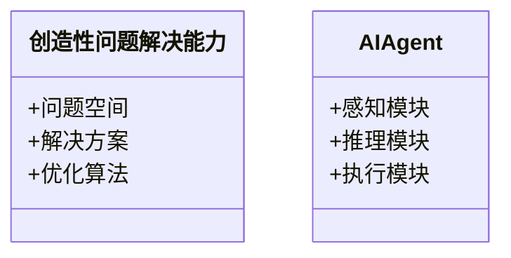
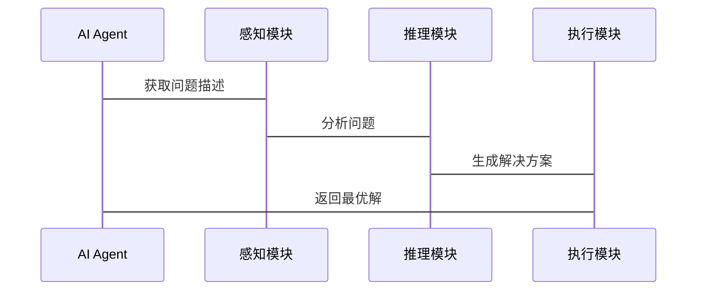

                 


# 开发具有创造性问题解决能力的AI Agent

## 关键词：AI Agent，创造性问题解决，机器学习，算法原理，系统架构设计

## 摘要：本文详细探讨了开发具有创造性问题解决能力的AI Agent的关键技术与实现方法。通过分析创造性问题解决的核心概念、算法原理和系统架构，结合实际项目案例，为读者提供从理论到实践的全面指导。

---

## 第1章: AI Agent与创造性问题解决概述

### 1.1 问题背景

#### 1.1.1 AI Agent的定义与核心概念
AI Agent（人工智能代理）是指能够感知环境、自主决策并执行任务的智能体。其核心能力包括感知、推理、规划和执行。

#### 1.1.2 创造性问题解决能力的重要性
创造性问题解决是指在问题解决过程中，不仅找到正确的答案，还能提出新颖、独特的解决方案。这种能力对于AI Agent在复杂场景中的应用至关重要。

#### 1.1.3 当前AI Agent在问题解决中的挑战
传统的AI Agent在处理复杂问题时往往依赖固定的规则或预定义的模型，难以应对高度动态或不确定的环境。

### 1.2 问题描述

#### 1.2.1 创造性问题解决的定义
创造性问题解决是在问题解决过程中，通过创新的思维方式，提出非传统解决方案的能力。

#### 1.2.2 AI Agent在创造性问题解决中的角色
AI Agent通过分析问题、生成多种解决方案并优化选择，帮助用户或系统实现更高效的决策。

#### 1.2.3 创造性问题解决的典型场景
例如，在自动驾驶中，AI Agent需要在复杂交通环境中做出快速、创新的决策。

### 1.3 问题解决方法论

#### 1.3.1 传统问题解决方法
传统方法依赖于固定的规则和逻辑推理，适合处理确定性问题。

#### 1.3.2 创造性思维的定义与特点
创造性思维强调创新性和独特性，能够突破常规思维方式的限制。

#### 1.3.3 AI Agent如何实现创造性问题解决
通过结合机器学习和知识图谱，AI Agent能够生成多样化的解决方案并进行优化选择。

### 1.4 边界与外延

#### 1.4.1 创造性问题解决的边界
创造性问题解决的边界在于其创新性和可行性，既要避免过于激进的方案，又要确保方案的实际可行。

#### 1.4.2 AI Agent能力的局限性
AI Agent的创造性能力受限于其知识库和训练数据的多样性。

#### 1.4.3 创造性问题解决与其他AI能力的关系
创造性问题解决与其他AI能力（如推理、学习）密切相关，共同构成了AI Agent的综合能力。

### 1.5 概念结构与核心要素

#### 1.5.1 创造性问题解决的要素分解
包括问题建模、解决方案生成、方案优化和方案实施。

#### 1.5.2 AI Agent的核心能力构成
感知能力、推理能力、创造力和执行能力。

#### 1.5.3 要素之间的关系与协同
各要素协同工作，形成完整的创造性问题解决能力。

---

## 第2章: AI Agent的核心概念与联系

### 2.1 核心概念原理

#### 2.1.1 创造性思维的数学模型
创造性思维可以通过概率图模型（如贝叶斯网络）进行建模。

#### 2.1.2 AI Agent的知识表示与推理
知识表示是AI Agent实现创造性问题解决的基础，常用的知识表示方法包括语义网络和框架表示。

#### 2.1.3 多目标优化的原理
多目标优化通过权衡多个目标，找到最优解决方案。

### 2.2 概念属性特征对比

#### 2.2.1 创造性与传统问题解决的对比
创造性问题解决更注重方案的独特性和创新性。

#### 2.2.2 AI Agent与人类思维的对比
AI Agent的创造性问题解决能力基于数据驱动，而人类思维则更具主观性和创造性。

#### 2.2.3 不同AI Agent模型的对比
基于规则的AI Agent和基于学习的AI Agent在创造性问题解决能力上各有优劣。

### 2.3 ER实体关系图

```mermaid
er
    Entity: 创造性问题解决能力
    Entity: AI Agent
    Entity: 问题空间
    Entity: 解决方案
    Relationship: 实现
    Relationship: 适用于
```

---

## 第3章: 创造性问题解决的算法原理

### 3.1 算法原理概述

#### 3.1.1 创造性问题解决的算法分类
包括基于搜索的算法、基于机器学习的算法和混合算法。

#### 3.1.2 基于搜索的算法
例如A*算法，通过搜索问题空间找到最优解。

#### 3.1.3 基于机器学习的算法
例如深度学习模型，通过训练数据生成多种解决方案。

### 3.2 问题建模与搜索算法

#### 3.2.1 问题空间的建模
将问题转化为可搜索的状态空间。

#### 3.2.2 A*算法的实现
使用优先队列进行节点扩展，找到最优路径。

#### 3.2.3 算法的优化与改进
通过启发式函数和剪枝技术优化搜索效率。

### 3.3 基于机器学习的代理模型

#### 3.3.1 深度学习模型的构建
使用神经网络模型（如LSTM）生成多样化的解决方案。

#### 3.3.2 知识图谱的构建与应用
通过知识图谱表示问题相关知识，辅助生成解决方案。

#### 3.3.3 案例分析
在自然语言处理任务中，使用生成模型（如GPT）生成多种解决方案。

---

## 第4章: 系统分析与架构设计

### 4.1 问题场景介绍

#### 4.1.1 项目介绍
开发一个具备创造性问题解决能力的AI Agent系统。

#### 4.1.2 系统功能设计
包括问题建模、解决方案生成、方案优化和方案实施。

#### 4.1.3 领域模型类图


### 4.2 系统架构设计

#### 4.2.1 系统架构图


#### 4.2.2 系统接口设计
定义API接口，实现各模块之间的通信。

#### 4.2.3 系统交互序列图


---

## 第5章: 项目实战

### 5.1 环境安装

#### 5.1.1 安装Python和相关库
安装Python 3.8及以上版本，安装TensorFlow、Keras和Scikit-learn等库。

### 5.2 系统核心实现源代码

#### 5.2.1 基于A*算法的实现
```python
import heapq

def a_star_search(graph, start, goal):
    open_set = set([start])
    came_from = {}
    g_score = {node: float('inf') for node in graph.nodes}
    g_score[start] = 0
    f_score = {node: float('inf') for node in graph.nodes}
    f_score[start] = heuristic(start, goal)
    
    while open_set:
        current = heapq.heappop(open_set, key=lambda x: f_score[x])
        if current == goal:
            return reconstruct_path(came_from, start, goal)
        for neighbor in graph.neighbors(current):
            tentative_g_score = g_score[current] + graph.cost(current, neighbor)
            if tentative_g_score < g_score[neighbor]:
                came_from[neighbor] = current
                g_score[neighbor] = tentative_g_score
                f_score[neighbor] = g_score[neighbor] + heuristic(neighbor, goal)
                heapq.heappush(open_set, neighbor)
```

#### 5.2.2 基于机器学习的实现
```python
import tensorflow as tf
from tensorflow.keras import layers

model = tf.keras.Sequential()
model.add(layers.Dense(128, activation='relu', input_dim=64))
model.add(layers.Dense(32, activation='relu'))
model.add(layers.Dense(1, activation='sigmoid'))
model.compile(optimizer='adam', loss='binary_crossentropy', metrics=['accuracy'])
```

### 5.3 代码应用解读与分析

#### 5.3.1 A*算法的实现细节
详细解释A*算法的实现，包括优先队列的使用和启发式函数的选择。

#### 5.3.2 机器学习模型的训练与优化
讨论模型的训练过程、超参数调优和评估指标。

### 5.4 实际案例分析

#### 5.4.1 案例一：路径规划问题
使用A*算法实现路径规划，生成多种可能的路径并选择最优解。

#### 5.4.2 案例二：自然语言处理任务
使用深度学习模型生成多种文本摘要，并选择最佳方案。

### 5.5 项目小结
总结项目开发过程中的关键点和经验教训，为后续开发提供参考。

---

## 第6章: 最佳实践与小结

### 6.1 最佳实践 tips

#### 6.1.1 知识储备
建议读者掌握AI、机器学习和算法设计的基础知识。

#### 6.1.2 工具选择
推荐使用Python和相关机器学习框架进行开发。

#### 6.1.3 项目管理
建议采用敏捷开发模式，分阶段完成项目。

### 6.2 小结

#### 6.2.1 创造性问题解决能力的核心
创造性问题解决能力是AI Agent实现智能决策的关键。

#### 6.2.2 系统架构设计的重要性
合理的系统架构设计能够提高AI Agent的性能和可扩展性。

### 6.3 注意事项

#### 6.3.1 数据质量
数据质量直接影响AI Agent的性能，需确保数据的多样性和准确性。

#### 6.3.2 模型优化
模型优化是提升AI Agent能力的重要手段，需持续关注。

#### 6.3.3 伦理问题
在开发AI Agent时，需注意伦理问题，确保AI Agent的行为符合社会规范。

### 6.4 拓展阅读

#### 6.4.1 推荐书籍
《人工智能：一种现代的方法》

#### 6.4.2 技术博客
建议读者阅读相关技术博客，了解最新技术动态。

---

## 作者：AI天才研究院/AI Genius Institute & 禅与计算机程序设计艺术/Zen And The Art of Computer Programming

