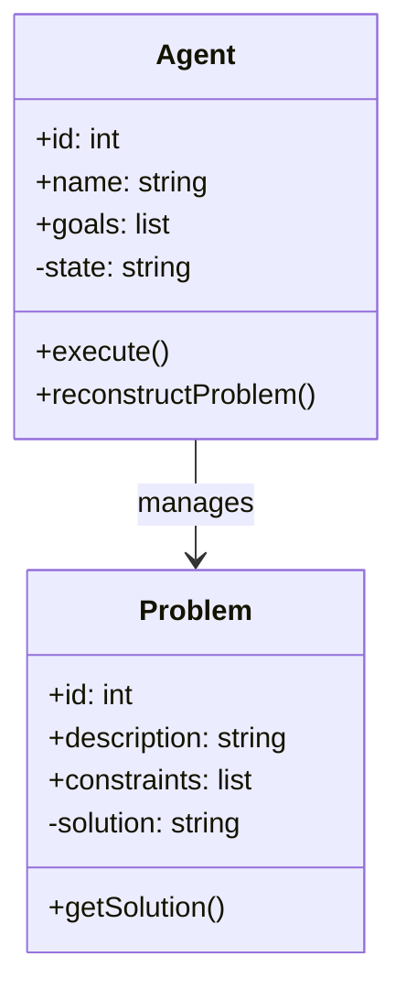
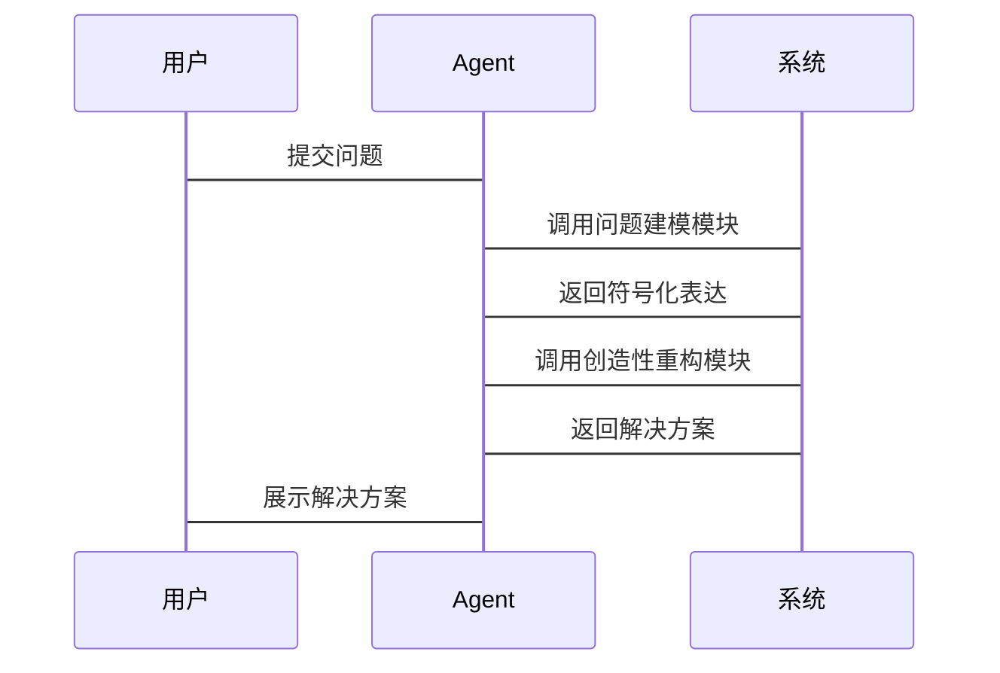

                 


# 开发具有创造性问题重构能力的AI Agent

## 关键词：AI Agent，创造性问题重构，问题建模，生成式模型，系统架构

## 摘要：本文详细探讨了开发具有创造性问题重构能力的AI Agent的核心概念、算法原理、系统架构与项目实战。从AI Agent的基本概念出发，逐步分析创造性问题重构的原理与方法，结合具体的算法实现和系统设计，最后通过项目实战验证理论，提供完整的开发思路和实践经验。

---

# 目录大纲

---

# 第一部分: AI Agent基础与创造性问题重构概述

## 第1章: AI Agent概述

### 1.1 AI Agent的基本概念

#### 1.1.1 AI Agent的定义与特点

- AI Agent的定义
- 特点：自主性、反应性、目标导向、社会性

#### 1.1.2 AI Agent的类型与应用场景

- 分类：简单反射型、基于模型的反射型、目标驱动型、实用驱动型
- 应用场景：智能助手、自动驾驶、智能客服

#### 1.1.3 创造性问题重构能力的定义

- 问题重构的定义
- 创造性重构的特点：创新性、灵活性、多样性

---

## 第2章: 创造性问题重构的核心要素

### 2.1 创造性问题重构的原理

#### 2.1.1 问题认知模型

- 认知模型的构建
- 问题理解的关键因素

#### 2.1.2 问题转换机制

- 转换策略：简化、扩展、重新定义
- 转换过程：识别、分析、转换

#### 2.1.3 问题创新方法

- 创新方法：类比法、逆向思维、组合创新

---

## 第3章: 问题建模与符号化表达

### 3.1 问题建模的基本概念

#### 3.1.1 符号化表达的定义

- 符号化表达的优势
- 常见符号化方法：谓词逻辑、语义网络

#### 3.1.2 领域模型的构建

- 领域模型的分类
- 领域模型的构建步骤

#### 3.1.3 知识表示的多样性

- 多种表示方法：框架、规则、语义网络
- 选择合适的表示方法

---

# 第二部分: 创造性问题重构的算法与实现

## 第4章: 创造性问题重构的算法原理

### 4.1 基于搜索的创造性问题重构算法

#### 4.1.1 搜索算法的基本原理

- 广度优先搜索（BFS）与深度优先搜索（DFS）
- 启发式搜索：A*算法的原理与优化

#### 4.1.2 启发式搜索算法的优化

- 使用评估函数（heuristic）优化搜索路径
- A*算法的数学公式：$$f(n) = g(n) + h(n)$$

#### 4.1.3 基于生成式模型的搜索

- 大语言模型的搜索机制
- GPT模型的生成式搜索原理

---

## 第5章: 创造性问题重构的数学模型与公式

### 5.1 基于概率论的创造性问题重构

#### 5.1.1 贝叶斯网络的构建

- 贝叶斯网络的结构
- 贝叶斯推断的基本公式：$$P(A|B) = \frac{P(B|A)P(A)}{P(B)}$$

#### 5.1.2 马尔可夫链的应用

- 马尔可夫链的基本原理
- 状态转移矩阵的构建

#### 5.1.3 概率分布的优化

- 最大似然估计（MLE）
- 贝叶斯估计（MAP）

---

# 第三部分: 系统架构与设计

## 第6章: 系统架构设计

### 6.1 系统功能设计

#### 6.1.1 领域模型的mermaid类图



### 6.2 系统架构设计

#### 6.2.1 系统架构的mermaid架构图


### 6.3 接口设计与交互设计

#### 6.3.1 系统接口设计

- 输入接口：接收问题描述
- 输出接口：返回重构后的解决方案

#### 6.3.2 交互设计的mermaid序列图



---

# 第四部分: 项目实战

## 第7章: 项目实战

### 7.1 环境搭建

#### 7.1.1 开发环境的选择

- Python 3.9+
- 必要的库：numpy、pandas、scipy、scikit-learn

#### 7.1.2 安装依赖

```bash
pip install numpy scipy scikit-learn transformers
```

### 7.2 核心实现

#### 7.2.1 问题建模的代码实现

```python
class ProblemModel:
    def __init__(self, description, constraints):
        self.description = description
        self.constraints = constraints

    def get_description(self):
        return self.description

    def get_constraints(self):
        return self.constraints
```

#### 7.2.2 创造性重构的代码实现

```python
from transformers import pipeline

reconstructor = pipeline('text-generation', model='gpt2')
def reconstruct_problem(problem):
    return reconstructor(problem)[0]['generated_text']
```

### 7.3 案例分析

#### 7.3.1 实际案例分析

- 案例1：优化物流路径问题
- 案例2：产品设计问题重构

#### 7.3.2 项目总结

- 成功经验
- 改进方向

---

# 第五部分: 优化与展望

## 第8章: 优化与展望

### 8.1 性能优化

#### 8.1.1 算法优化

- 优化搜索算法的效率
- 提升生成模型的生成速度

#### 8.1.2 知识库的优化

- 使用更高效的符号化表达方式
- 优化领域模型的构建过程

### 8.2 可扩展性与可维护性

#### 8.2.1 模块化设计

- 各模块的独立性
- 模块间的解耦设计

#### 8.2.2 适应性优化

- 适应不同领域的重构需求
- 灵活调整模型参数

### 8.3 人机协作优化

#### 8.3.1 人机协作模式

- 人机协作的定义
- 协作流程的优化

#### 8.3.2 可解释性增强

- 提高AI Agent的可解释性
- 优化人机交互的友好性

---

# 结语

## 第9章: 结语

### 9.1 本文总结

- 总结创造性问题重构的核心内容
- 强调系统架构设计的重要性

### 9.2 未来展望

- 未来的优化方向
- 新技术的应用前景

---

# 附录

## 附录A: 工具与资源

### A.1 开发工具推荐

- Python
- 知识库工具：RDF、OWL
- 可视化工具：Graphviz、PlantUML

### A.2 推荐阅读资源

- 推荐书籍：《人工智能：一种现代方法》
- 推荐论文：生成式模型的最新研究

---

# 作者

作者：AI天才研究院 & 禅与计算机程序设计艺术

---

以上是《开发具有创造性问题重构能力的AI Agent》的详细目录大纲，接下来将按照此大纲逐步撰写完整的文章内容。

