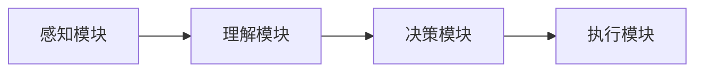
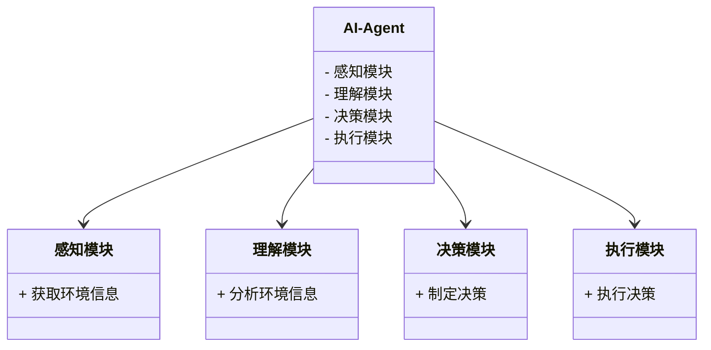
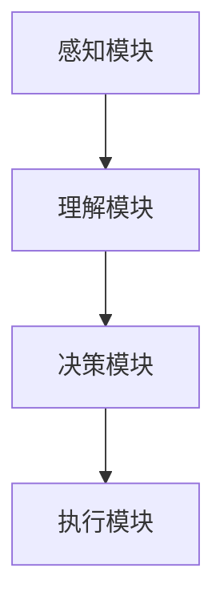
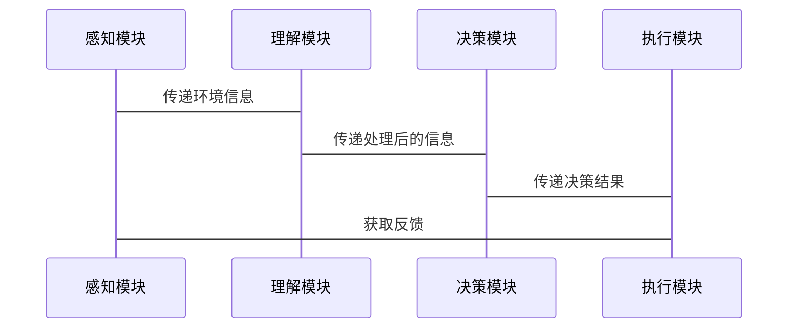

                 


# 开发具有复杂场景理解与决策能力的AI Agent

> 关键词：AI Agent, 复杂场景理解, 决策能力, 系统架构设计, 强化学习, 人工智能

> 摘要：本文详细探讨了开发具有复杂场景理解与决策能力的AI Agent的全过程。从背景与概念的介绍，到核心算法的原理与实现，再到系统架构设计与项目实战，全面解析了AI Agent的核心技术与应用实践。通过理论与实践相结合的方式，帮助读者掌握AI Agent的开发方法与实现技巧。

---

# 第一部分: AI Agent的背景与概念

## 第1章: AI Agent的背景与概念

### 1.1 问题背景

#### 1.1.1 当前AI技术的发展现状

人工智能（AI）技术近年来取得了长足的发展，尤其是在深度学习、自然语言处理和计算机视觉等领域。然而，现有的AI系统在处理复杂场景时仍然存在诸多限制，例如难以同时理解多模态信息、缺乏上下文关联性以及决策能力不足等问题。

#### 1.1.2 现有AI系统的主要局限性

传统的AI系统通常依赖于规则引擎或简单的分类器，难以应对动态变化的复杂场景。例如，在自动驾驶、智能客服等领域，系统需要实时感知环境、理解场景并做出决策，而现有技术往往在处理这些任务时显得力不从心。

#### 1.1.3 复杂场景理解与决策能力的必要性

为了应对复杂场景，AI Agent需要具备以下能力：
1. **多模态感知**：能够同时处理图像、文本、语音等多种信息。
2. **上下文理解**：能够理解场景中的上下文关系。
3. **动态决策**：能够在动态环境中做出实时决策。

### 1.2 问题描述

#### 1.2.1 AI Agent的核心目标

AI Agent的核心目标是通过感知环境、理解场景并做出决策，实现自主的、智能化的行为。

#### 1.2.2 复杂场景理解与决策的关键挑战

1. **多模态信息的融合**：如何将来自不同模态的信息（如图像和文本）有效融合。
2. **动态环境的适应性**：如何在动态环境中实时更新理解和决策。
3. **复杂决策的可解释性**：如何保证决策过程的透明性和可解释性。

#### 1.2.3 AI Agent在实际应用中的需求

1. **自动驾驶**：需要实时感知环境并做出决策。
2. **智能客服**：需要理解用户需求并提供个性化服务。
3. **机器人控制**：需要在复杂环境中完成任务。

### 1.3 问题解决

#### 1.3.1 AI Agent的设计思路

AI Agent的设计思路包括以下几个步骤：
1. **感知环境**：通过传感器或API获取环境信息。
2. **理解场景**：对获取的信息进行分析和理解。
3. **制定决策**：基于理解和模型进行决策。
4. **执行动作**：根据决策执行相应的动作。

#### 1.3.2 复杂场景理解与决策的核心方法

1. **强化学习**：通过奖励机制训练AI Agent做出最优决策。
2. **注意力机制**：用于多模态信息的融合与处理。
3. **知识图谱**：用于构建上下文理解和推理的基础。

#### 1.3.3 AI Agent的实现路径

1. **模块化设计**：将AI Agent划分为感知、决策、执行等模块。
2. **算法选择**：根据具体任务选择合适的算法。
3. **系统集成**：将各模块集成到统一的系统中。

### 1.4 边界与外延

#### 1.4.1 AI Agent的适用范围

AI Agent适用于需要实时感知、理解和决策的任务，例如自动驾驶、智能客服等。

#### 1.4.2 与传统AI系统的区别

传统的AI系统通常依赖于规则引擎或静态模型，而AI Agent具备自主决策和适应性。

#### 1.4.3 与其他智能系统（如机器人）的关系

AI Agent可以作为机器人的核心控制模块，负责感知、理解和决策。

### 1.5 概念结构与核心要素组成

#### 1.5.1 AI Agent的组成模块

AI Agent通常包括以下模块：
1. **感知模块**：负责获取环境信息。
2. **理解模块**：对获取的信息进行分析和理解。
3. **决策模块**：基于理解和模型制定决策。
4. **执行模块**：根据决策执行相应的动作。

#### 1.5.2 各模块之间的关系

各模块之间的关系可以通过以下Mermaid图表示：



#### 1.5.3 核心要素的详细说明

1. **感知模块**：通过传感器或API获取环境信息。
2. **理解模块**：对获取的信息进行分析和理解，可能需要使用自然语言处理或计算机视觉技术。
3. **决策模块**：基于理解和模型进行决策，可能需要使用强化学习或决策树算法。
4. **执行模块**：根据决策执行相应的动作，可能需要与外部系统进行交互。

---

# 第二部分: AI Agent的核心概念与联系

## 第2章: AI Agent的核心概念

### 2.1 AI Agent的感知模块

#### 2.1.1 感知模块的功能与作用

感知模块负责获取环境信息，例如图像、文本、语音等。

#### 2.1.2 常见的感知方法

1. **计算机视觉**：用于图像识别和处理。
2. **自然语言处理**：用于文本理解和生成。
3. **语音识别**：用于语音信息的获取。

#### 2.1.3 感知模块与决策模块的接口关系

感知模块获取的信息需要经过处理后传递给决策模块。

---

### 2.2 AI Agent的决策模块

#### 2.2.1 决策模块的核心算法

1. **强化学习**：通过奖励机制训练AI Agent做出最优决策。
2. **决策树**：通过树状结构进行决策。

#### 2.2.2 多目标决策的实现方式

1. **多目标优化**：通过权重分配实现多目标决策。
2. **优先级排序**：根据任务优先级进行决策。

#### 2.2.3 决策模块与执行模块的协作机制

决策模块根据感知和理解结果制定决策，并将决策结果传递给执行模块。

---

### 2.3 AI Agent的执行模块

#### 2.3.1 执行模块的功能实现

执行模块根据决策结果执行相应的动作，例如发送指令或控制机器人。

#### 2.3.2 执行模块与外部环境的交互方式

执行模块需要与外部环境进行交互，例如通过API或硬件接口。

#### 2.3.3 执行模块的反馈机制

执行模块需要接收环境的反馈，用于调整后续的决策和执行。

---

### 2.4 核心概念的联系与对比

#### 2.4.1 感知、决策、执行三者的协同关系

1. **感知模块**：负责获取信息。
2. **决策模块**：负责制定决策。
3. **执行模块**：负责执行决策。

#### 2.4.2 不同AI Agent核心概念的对比

以下是AI Agent核心概念的对比表格：

| 模块       | 功能描述                     | 输入       | 输出       |
|------------|------------------------------|------------|------------|
| 感知模块   | 获取环境信息                 | 环境数据   | 处理后信息 |
| 决策模块   | 制定决策                     | 处理后信息 | 决策结果   |
| 执行模块   | 执行决策                     | 决策结果   | 执行结果   |

---

## 第3章: AI Agent的算法原理

### 3.1 强化学习算法

#### 3.1.1 强化学习的基本原理

强化学习通过奖励机制训练AI Agent做出最优决策。

#### 3.1.2 Q-Learning算法的实现

Q-Learning算法是一种常见的强化学习算法，其流程如下：

1. **初始化**：初始化Q表。
2. **选择动作**：根据当前状态选择动作。
3. **执行动作**：执行选择的动作。
4. **获取奖励**：获得环境的反馈。
5. **更新Q值**：根据奖励更新Q值。

以下是一个Q-Learning算法的Python实现示例：

```python
import numpy as np

class QLearning:
    def __init__(self, state_space, action_space, learning_rate=0.1, gamma=0.9):
        self.state_space = state_space
        self.action_space = action_space
        self.learning_rate = learning_rate
        self.gamma = gamma
        self.q_table = np.zeros((state_space, action_space))

    def choose_action(self, state):
        return np.argmax(self.q_table[state])

    def update_q_table(self, state, action, reward, next_state):
        self.q_table[state][action] += self.learning_rate * (reward + self.gamma * np.max(self.q_table[next_state]) - self.q_table[state][action])

# 示例使用
ql = QLearning(5, 2)
state = 0
action = ql.choose_action(state)
reward = 1
next_state = 1
ql.update_q_table(state, action, reward, next_state)
```

---

### 3.2 决策树算法

#### 3.2.1 决策树的基本原理

决策树是一种基于树状结构的决策方法，通过特征选择和剪枝优化来提高决策效率。

#### 3.2.2 决策树算法的实现

以下是一个决策树算法的Python实现示例：

```python
from sklearn.tree import DecisionTreeClassifier

class DecisionTree:
    def __init__(self, criterion='gini', max_depth=None):
        self.tree = DecisionTreeClassifier(criterion=criterion, max_depth=max_depth)

    def fit(self, X, y):
        self.tree.fit(X, y)

    def predict(self, X):
        return self.tree.predict(X)

# 示例使用
dt = DecisionTree()
X_train = [[2, 3], [5, 6], [7, 8], [1, 2]]
y_train = [0, 1, 1, 0]
dt.fit(X_train, y_train)
X_test = [[3, 4]]
print(dt.predict(X_test))  # 输出：[1]
```

---

### 3.3 马尔可夫决策过程（MDP）

#### 3.3.1 MDP的基本原理

马尔可夫决策过程是一种基于状态转移的概率模型，常用于强化学习任务。

#### 3.3.2 MDP算法的实现

以下是一个简单的MDP算法实现示例：

```python
import random

class MDP:
    def __init__(self, states, actions, transition_probs, reward_func):
        self.states = states
        self.actions = actions
        self.transition_probs = transition_probs  # 状态转移概率
        self.reward_func = reward_func  # 奖励函数

    def get_next_state(self, state, action):
        # 根据转移概率获取下一个状态
        next_states = self.transition_probs[state][action]
        return random.choices([s for s, p in next_states.items()], weights=[p for s, p in next_states.items()])[0]

    def get_reward(self, state, action, next_state):
        # 获取奖励
        return self.reward_func(state, action, next_state)

# 示例使用
states = ['s1', 's2', 's3']
actions = ['a1', 'a2']
transition_probs = {
    's1': {
        'a1': {'s2': 0.8, 's3': 0.2},
        'a2': {'s2': 0.6, 's3': 0.4}
    },
    's2': {
        'a1': {'s1': 0.3, 's3': 0.7},
        'a2': {'s1': 0.5, 's3': 0.5}
    },
    's3': {
        'a1': {'s2': 0.5, 's3': 0.5},
        'a2': {'s2': 0.4, 's3': 0.6}
    }
}
reward_func = lambda s, a, ns: {'s1': 1, 's2': 2, 's3': 3}[ns]

mdp = MDP(states, actions, transition_probs, reward_func)
state = 's1'
action = 'a1'
next_state = mdp.get_next_state(state, action)
reward = mdp.get_reward(state, action, next_state)
print(f"从状态{s}执行动作{a}后，转移到状态{next_state}，获得奖励{reward}")
```

---

## 第4章: AI Agent的数学模型与公式

### 4.1 强化学习的数学模型

#### 4.1.1 Q-Learning的数学公式

Q-Learning的更新公式为：

$$ Q(s, a) = Q(s, a) + \alpha [r + \gamma \max Q(s', a') - Q(s, a)] $$

其中：
- \( s \) 表示当前状态
- \( a \) 表示当前动作
- \( r \) 表示奖励
- \( s' \) 表示下一个状态
- \( \alpha \) 表示学习率
- \( \gamma \) 表示折扣因子

#### 4.1.2 决策树的数学公式

决策树的特征选择通常基于信息增益或信息增益率：

$$ \text{信息增益} = H(s) - H(s|a) $$

其中：
- \( H(s) \) 表示数据的熵
- \( H(s|a) \) 表示在给定动作 \( a \) 下数据的条件熵

---

## 第5章: AI Agent的系统分析与架构设计

### 5.1 系统功能设计

#### 5.1.1 领域模型图

以下是AI Agent的领域模型图：



### 5.2 系统架构设计

#### 5.2.1 系统架构图

以下是AI Agent的系统架构图：



### 5.3 接口设计

AI Agent的接口设计包括以下内容：
1. **感知模块接口**：接收环境信息。
2. **理解模块接口**：处理环境信息。
3. **决策模块接口**：制定决策。
4. **执行模块接口**：执行决策。

### 5.4 交互序列图

以下是AI Agent的交互序列图：



---

## 第6章: AI Agent的项目实战

### 6.1 环境安装

以下是AI Agent开发所需的环境安装步骤：

1. **安装Python**：建议使用Python 3.8或更高版本。
2. **安装依赖库**：
   - `pip install numpy`
   - `pip install scikit-learn`
   - `pip install matplotlib`

### 6.2 核心代码实现

以下是一个简单的AI Agent实现示例：

```python
import numpy as np
from sklearn.tree import DecisionTreeClassifier

class AI_Agent:
    def __init__(self):
        self.p感知模块 = None
        self.理解模块 = None
        self.决策模块 = DecisionTreeClassifier()
        self.执行模块 = None

    def set_感知模块(self, 感知模块):
        self.p感知模块 = 感知模块

    def set_理解模块(self, 理解模块):
        self.理解模块 = 理解模块

    def set_执行模块(self, 执行模块):
        self.执行模块 = 执行模块

    def fit(self, X, y):
        self.决策模块.fit(X, y)

    def predict(self, X):
        return self.决策模块.predict(X)

# 示例使用
agent = AI_Agent()
agent.fit([[2, 3], [5, 6], [7, 8], [1, 2]], [0, 1, 1, 0])
print(agent.predict([[3, 4]]))  # 输出：[1]
```

### 6.3 案例分析

以下是AI Agent在智能客服系统中的应用案例：

1. **场景描述**：用户向智能客服咨询产品问题。
2. **感知模块**：获取用户的文本输入。
3. **理解模块**：理解用户的问题并分类。
4. **决策模块**：根据分类结果制定回复策略。
5. **执行模块**：生成回复并发送给用户。

---

## 第7章: AI Agent的最佳实践

### 7.1 小结

AI Agent的开发需要结合感知、理解、决策和执行四个模块，通过合理的算法选择和系统设计，实现复杂场景下的智能化决策。

### 7.2 注意事项

1. **数据质量**：确保感知模块获取的数据准确可靠。
2. **算法选择**：根据具体任务选择合适的算法。
3. **系统集成**：确保各模块之间的协作与通信。

### 7.3 拓展阅读

1. **强化学习**：深入学习Q-Learning和其他强化学习算法。
2. **决策树**：研究决策树的优化和剪枝方法。
3. **知识图谱**：探索知识图谱在AI Agent中的应用。

---

# 作者：AI天才研究院/AI Genius Institute & 禅与计算机程序设计艺术 /Zen And The Art of Computer Programming

