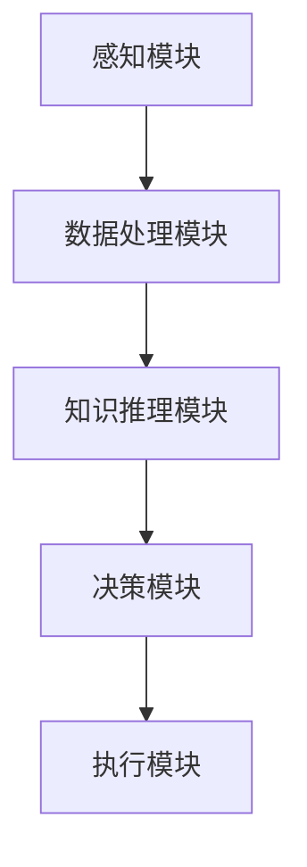
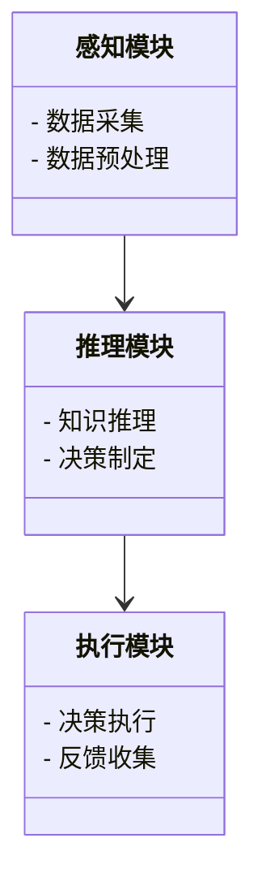
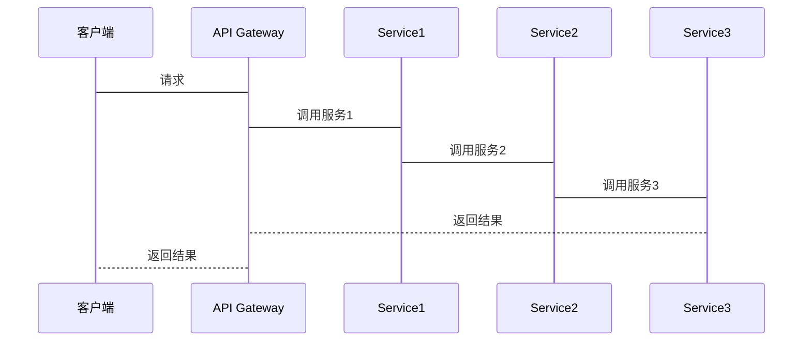

                 


# 开发具有复杂场景理解能力的AI Agent

## 关键词：AI Agent，复杂场景理解，注意力机制，图神经网络，强化学习，系统架构

## 摘要：本文详细探讨了开发具有复杂场景理解能力的AI Agent所需的关键技术，包括背景知识、核心概念、算法原理、系统架构设计、项目实战以及最佳实践。文章通过逐步分析和实例说明，帮助读者全面理解AI Agent在复杂场景下的应用与实现。

---

## 第一章: AI Agent概述

### 1.1 AI Agent的基本概念

#### 1.1.1 什么是AI Agent
AI Agent（人工智能代理）是一种能够感知环境、执行任务并做出决策的智能实体。它通过传感器获取信息，利用算法处理数据，然后通过执行器与环境交互。

#### 1.1.2 AI Agent的核心能力
- **感知能力**：通过传感器或接口获取环境信息。
- **推理能力**：基于知识和逻辑进行推理和决策。
- **学习能力**：通过机器学习技术不断优化自身能力。
- **执行能力**：通过执行器或接口对外界产生影响。

#### 1.1.3 AI Agent的发展背景
AI Agent的概念起源于人工智能领域，随着深度学习和强化学习的兴起，AI Agent在自动驾驶、智能助手、机器人等领域得到了广泛应用。

---

### 1.2 复杂场景理解的必要性

#### 1.2.1 复杂场景的定义
复杂场景指的是涉及多个变量、高度动态且不确定性较高的环境。例如，自动驾驶需要处理交通流量、行人行为等多种因素。

#### 1.2.2 为什么需要复杂场景理解
在复杂场景中，AI Agent需要处理高度动态的信息，做出快速且准确的决策。复杂场景理解能力是AI Agent实现高级智能的关键。

#### 1.2.3 复杂场景理解的边界与外延
复杂场景理解的边界在于AI Agent的能力限制，而外延则涉及多模态数据处理、知识图谱构建等多个方面。

---

## 第二章: 复杂场景理解的核心概念

### 2.1 复杂场景理解的定义与特点

#### 2.1.1 复杂场景理解的定义
复杂场景理解是指AI Agent在复杂动态环境中，通过多模态数据处理、知识推理和实时决策来理解并适应环境的能力。

#### 2.1.2 复杂场景理解的核心要素
- **多模态数据处理**：整合文本、图像、语音等多种数据源。
- **知识推理**：基于知识图谱进行逻辑推理。
- **实时决策**：在动态环境中做出快速决策。

#### 2.1.3 复杂场景理解与简单场景理解的对比
| 特性 | 复杂场景理解 | 简单场景理解 |
|------|--------------|--------------|
| 数据源 | 多模态        | 单一或少数    |
| 决策时间 | 实时          | 离线或较慢    |
| 不确定性 | 高           | 低           |

### 2.2 复杂场景理解的技术架构

#### 2.2.1 复杂场景理解的技术架构图


#### 2.2.2 各模块的功能与交互关系
- **感知模块**：负责收集环境数据。
- **数据处理模块**：对数据进行预处理和特征提取。
- **知识推理模块**：基于知识图谱进行推理。
- **决策模块**：根据推理结果做出决策。
- **执行模块**：执行决策并反馈结果。

---

## 第三章: 复杂场景理解的算法原理

### 3.1 注意力机制

#### 3.1.1 注意力机制的定义
注意力机制是一种模拟人类注意力的机制，用于在序列数据中找到重要部分。

#### 3.1.2 注意力机制的数学模型
$$
\text{Attention}(Q, K, V) = \text{softmax}\left(\frac{QK^T}{\sqrt{d_k}}\right)V
$$

#### 3.1.3 注意力机制的实现流程
1. 计算查询（Q）、键（K）和值（V）。
2. 计算注意力权重。
3. 加权求和得到最终结果。

#### 3.1.4 注意力机制的优缺点分析
- **优点**：能够捕捉序列中的关键信息。
- **缺点**：计算复杂度较高。

### 3.2 图神经网络

#### 3.2.1 图神经网络的定义
图神经网络是一种处理图结构数据的深度学习模型。

#### 3.2.2 图神经网络的数学模型
$$
Z = \sigma(A X W^T)
$$

#### 3.2.3 图神经网络的实现流程
1. 构建图的邻接矩阵。
2. 进行图传播和聚合。
3. 输出节点表示。

#### 3.2.4 图神经网络的优缺点分析
- **优点**：能够处理复杂的依赖关系。
- **缺点**：需要构建高质量的图结构数据。

### 3.3 强化学习

#### 3.3.1 强化学习的定义
强化学习是一种通过试错机制来优化决策的机器学习方法。

#### 3.3.2 强化学习的数学模型
$$
Q(s,a) = r + \gamma \max_{a'} Q(s',a')
$$`

#### 3.3.3 强化学习的实现流程
1. 环境初始化。
2. 与环境交互，获取奖励。
3. 更新Q值表。

#### 3.3.4 强化学习的优缺点分析
- **优点**：能够适应动态环境。
- **缺点**：需要大量的训练样本。

---

## 第四章: 复杂场景理解的系统架构与设计

### 4.1 系统模块划分

#### 4.1.1 系统模块划分
- **感知模块**：数据采集和预处理。
- **推理模块**：知识推理和决策。
- **执行模块**：决策执行和反馈。

#### 4.1.2 系统模块划分图


### 4.2 系统架构设计

#### 4.2.1 微服务架构


#### 4.2.2 系统交互流程图


---

## 第五章: 项目实战

### 5.1 项目概述

#### 5.1.1 项目介绍
本项目旨在开发一个具有复杂场景理解能力的AI Agent，用于智能客服系统。

### 5.2 核心代码实现

#### 5.2.1 环境安装
```bash
pip install tensorflow numpy
```

#### 5.2.2 核心代码
```python
import tensorflow as tf
import numpy as np

class AttentionModel:
    def __init__(self, input_dim):
        self.Wq = tf.keras.layers.Dense(input_dim)
        self.Wk = tf.keras.layers.Dense(input_dim)
        self.Wv = tf.keras.layers.Dense(input_dim)
    
    def call(self, inputs):
        q = self.Wq(inputs)
        k = self.Wk(inputs)
        v = self.Wv(inputs)
        attention = self.attention(q, k, v)
        return attention
    
    def attention(self, q, k, v):
        dk = tf.cast(tf.shape(k)[-1], tf.float32)
        attention_weights = tf.nn.softmax(tf.matmul(q, k, transpose_b=True) / tf.sqrt(dk))
        return tf.matmul(attention_weights, v)
```

### 5.3 代码解读与分析

#### 5.3.1 代码解读
- **AttentionModel**：定义了一个注意力机制模型。
- **call**：实现了注意力机制的前向传播。
- **attention**：具体计算注意力权重和输出。

### 5.4 实际案例分析

#### 5.4.1 案例分析
在智能客服系统中，AI Agent能够理解用户的意图，提供个性化的服务。

---

## 第六章: 最佳实践与总结

### 6.1 最佳实践 tips
- 确保数据质量。
- 选择合适的算法。
- 进行充分的测试。

### 6.2 小结
本文详细介绍了开发具有复杂场景理解能力的AI Agent的关键技术，包括算法原理、系统架构设计和项目实战。

### 6.3 注意事项
- 注意计算复杂度。
- 确保数据隐私。
- 及时处理异常情况。

### 6.4 拓展阅读
建议读者进一步学习强化学习和图神经网络的相关知识。

---

## 作者信息

作者：AI天才研究院/AI Genius Institute  
联系邮箱：contact@aising genius.com

---

以上是文章的完整内容，希望对您有所帮助！

