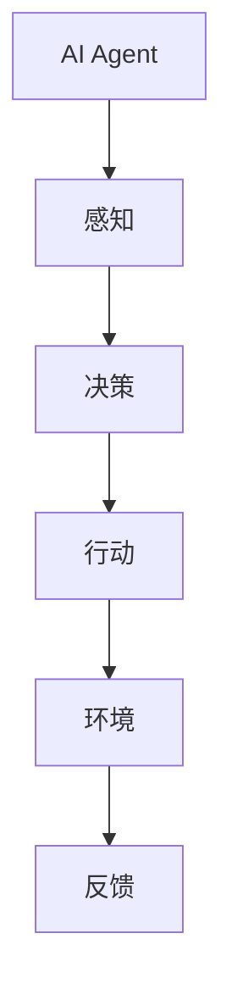
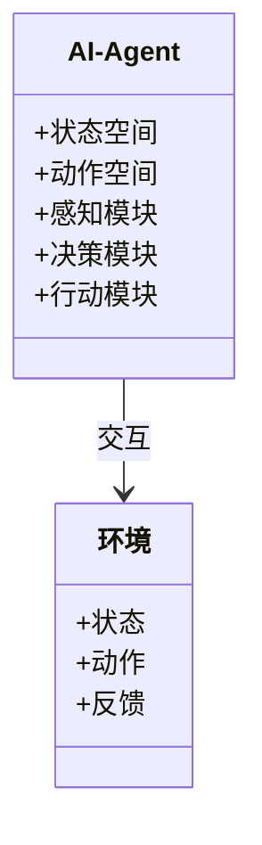
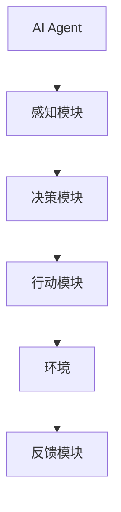
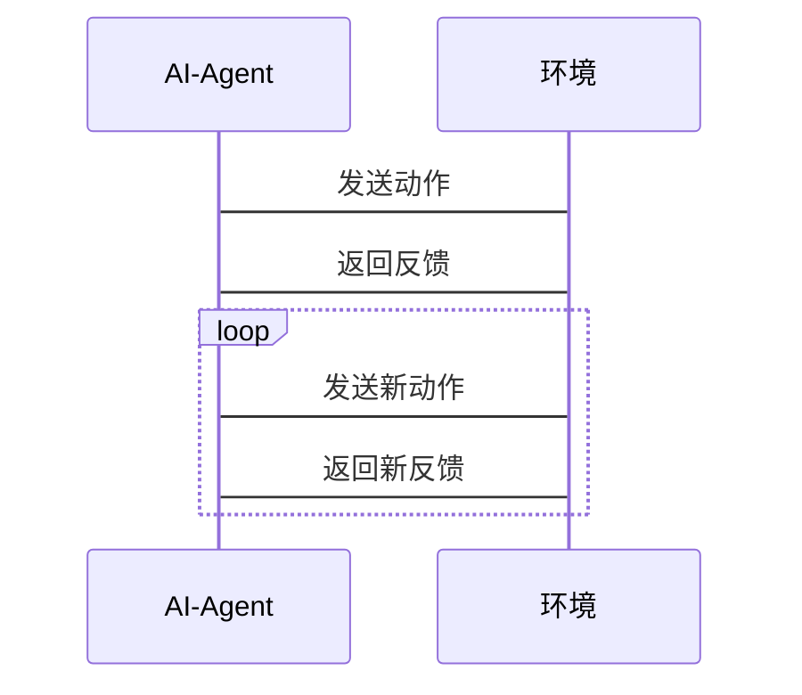

                 

# 开发具有复杂系统建模与仿真能力的AI Agent

> 关键词：AI Agent、复杂系统建模、仿真、人工智能、系统架构、算法原理

> 摘要：  
本文将深入探讨开发具有复杂系统建模与仿真能力的AI Agent所需的关键知识和方法。从AI Agent的基本概念到复杂系统的建模与仿真，结合实际项目案例，系统地分析和实现AI Agent在复杂系统建模中的应用。通过本文的学习，读者将能够掌握AI Agent的核心原理、系统架构设计方法，以及如何将这些技术应用到实际项目中。

---

# 目录

## 第一部分: AI Agent 的基础知识

### 第1章: AI Agent 的基本概念

#### 1.1 AI Agent 的定义与特点
- 1.1.1 AI Agent 的定义
- 1.1.2 AI Agent 的核心特点
- 1.1.3 AI Agent 与传统程序的区别

#### 1.2 AI Agent 的类型
- 1.2.1 简单反射式 Agent
- 1.2.2 基于模型的反射式 Agent
- 1.2.3 目标驱动的 Agent
- 1.2.4 混合式 Agent

#### 1.3 AI Agent 的体系结构
- 1.3.1 反射式架构
- 1.3.2 目标驱动架构
- 1.3.3 分层架构

### 第2章: 复杂系统建模与仿真的基础

#### 2.1 复杂系统的定义与特点
- 2.1.1 复杂系统的定义
- 2.1.2 复杂系统的特征
- 2.1.3 复杂系统的建模挑战

#### 2.2 系统建模的基本方法
- 2.2.1 系统建模的定义
- 2.2.2 系统建模的步骤
- 2.2.3 常用的建模方法

#### 2.3 复杂系统仿真与 AI Agent 的结合
- 2.3.1 仿真的基本概念
- 2.3.2 AI Agent 在仿真中的作用
- 2.3.3 复杂系统仿真与 AI Agent 的结合方式

## 第3章: AI Agent 的核心概念与联系

#### 3.1 核心概念原理
- 3.1.1 AI Agent 的感知与行动
- 3.1.2 状态空间与动作空间
- 3.1.3 环境建模与交互

#### 3.2 核心概念属性特征对比表格
- 3.2.1 不同类型 AI Agent 的对比
- 3.2.2 不同体系结构的对比
- 3.2.3 不同建模方法的对比

#### 3.3 系统架构的 Mermaid 流程图

---

## 第二部分: 复杂系统建模与仿真的方法

### 第4章: 系统建模的理论与方法

#### 4.1 系统建模的基本原理
- 4.1.1 系统建模的目标
- 4.1.2 系统建模的步骤
- 4.1.3 常用的建模方法

#### 4.2 复杂系统建模的挑战
- 4.2.1 复杂系统的动态性
- 4.2.2 复杂系统的不确定性
- 4.2.3 复杂系统的交互性

#### 4.3 AI Agent 在复杂系统建模中的作用
- 4.3.1 AI Agent 的感知与建模能力
- 4.3.2 AI Agent 的学习与适应能力
- 4.3.3 AI Agent 的协作与协调能力

### 第5章: 基于 AI Agent 的系统仿真

#### 5.1 仿真的基本概念
- 5.1.1 仿真的定义
- 5.1.2 仿真的目的
- 5.1.3 仿真的步骤

#### 5.2 基于 AI Agent 的仿真方法
- 5.2.1 AI Agent 作为仿真主体
- 5.2.2 多智能体仿真系统
- 5.2.3 AI Agent 与环境的交互仿真

#### 5.3 仿真实例分析
- 5.3.1 交通流仿真中的 AI Agent 应用
- 5.3.2 社交网络仿真中的 AI Agent 应用
- 5.3.3 经济系统仿真中的 AI Agent 应用

---

## 第三部分: AI Agent 的算法与数学模型

### 第6章: 强化学习算法

#### 6.1 强化学习的基本原理
- 6.1.1 强化学习的定义
- 6.1.2 强化学习的核心要素
- 6.1.3 强化学习的数学模型

#### 6.2 常见强化学习算法
- 6.2.1 Q-Learning
- 6.2.2 Deep Q-Network (DQN)
- 6.2.3 Policy Gradient Methods

#### 6.3 强化学习在复杂系统建模中的应用
- 6.3.1 状态空间的定义与建模
- 6.3.2 动作空间的定义与建模
- 6.3.3 奖励函数的设计与实现

### 第7章: 遗传算法

#### 7.1 遗传算法的基本原理
- 7.1.1 遗传算法的定义
- 7.1.2 遗传算法的核心步骤
- 7.1.3 遗传算法的数学模型

#### 7.2 遗传算法的应用
- 7.2.1 遗传算法在优化问题中的应用
- 7.2.2 遗传算法在复杂系统建模中的应用
- 7.2.3 遗传算法与其他算法的结合

---

## 第四部分: 系统架构设计与实现

### 第8章: 系统功能设计

#### 8.1 问题场景介绍
- 8.1.1 项目背景
- 8.1.2 项目目标
- 8.1.3 项目需求

#### 8.2 系统功能设计
- 8.2.1 功能模块划分
- 8.2.2 功能流程设计
- 8.2.3 功能交互设计

#### 8.3 系统架构的 Mermaid 类图

### 第9章: 系统架构设计

#### 9.1 系统架构的总体设计
- 9.1.1 分层架构设计
- 9.1.2 模块化设计
- 9.1.3 可扩展性设计

#### 9.2 系统架构的 Mermaid 架构图

#### 9.3 系统接口设计
- 9.3.1 接口定义
- 9.3.2 接口实现
- 9.3.3 接口交互

### 第10章: 系统交互设计

#### 10.1 系统交互的流程设计
- 10.1.1 交互步骤
- 10.1.2 交互流程图
- 10.1.3 交互反馈机制

#### 10.2 系统交互的 Mermaid 序列图

---

## 第五部分: 项目实战

### 第11章: 项目背景与需求分析

#### 11.1 项目背景
- 11.1.1 项目目标
- 11.1.2 项目需求
- 11.1.3 项目约束

#### 11.2 系统功能设计
- 11.2.1 功能模块划分
- 11.2.2 功能流程设计
- 11.2.3 功能交互设计

### 第12章: 系统实现与测试

#### 12.1 系统实现
- 12.1.1 代码实现
- 12.1.2 代码结构
- 12.1.3 代码测试

#### 12.2 系统测试
- 12.2.1 测试方法
- 12.2.2 测试结果
- 12.2.3 测试总结

### 第13章: 项目案例分析

#### 13.1 案例分析
- 13.1.1 案例背景
- 13.1.2 案例分析
- 13.1.3 案例总结

#### 13.2 经验总结
- 13.2.1 开发经验
- 13.2.2 问题总结
- 13.2.3 改进方向

---

## 第六部分: 最佳实践与拓展阅读

### 第14章: 最佳实践

#### 14.1 开发规范
- 14.1.1 代码规范
- 14.1.2 文档规范
- 14.1.3 测试规范

#### 14.2 优化技巧
- 14.2.1 系统优化
- 14.2.2 算法优化
- 14.2.3 性能优化

### 第15章: 小结与注意事项

#### 15.1 小结
- 15.1.1 核心内容回顾
- 15.1.2 关键点总结
- 15.1.3 学习建议

#### 15.2 注意事项
- 15.2.1 开发中的常见问题
- 15.2.2 问题解决方法
- 15.2.3 未来发展趋势

### 第16章: 拓展阅读与参考资料

#### 16.1 拓展阅读
- 16.1.1 推荐书籍
- 16.1.2 推荐论文
- 16.1.3 推荐博客

#### 16.2 参考资料
- 16.2.1 开发工具
- 16.2.2 开发框架
- 16.2.3 开发社区

---

# 作者

作者：AI天才研究院/AI Genius Institute & 禅与计算机程序设计艺术 /Zen And The Art of Computer Programming

