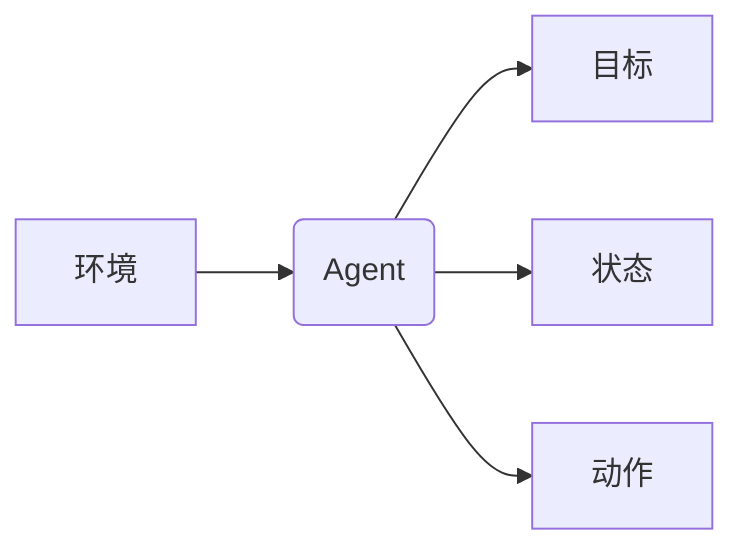
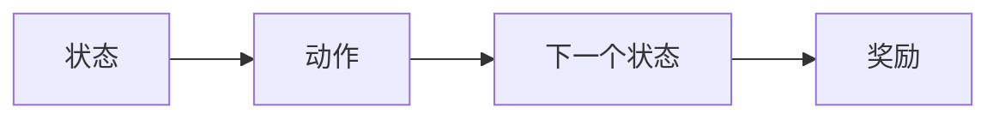
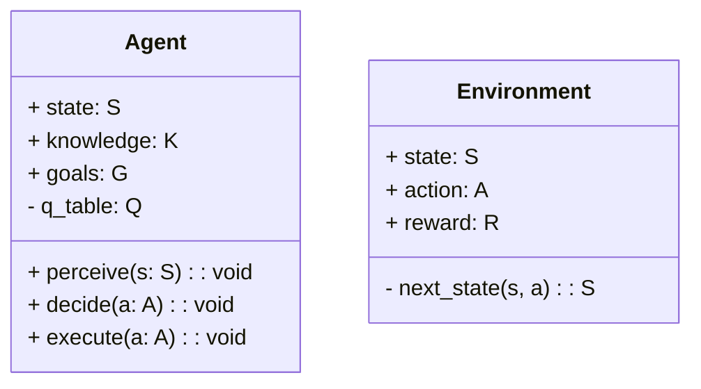
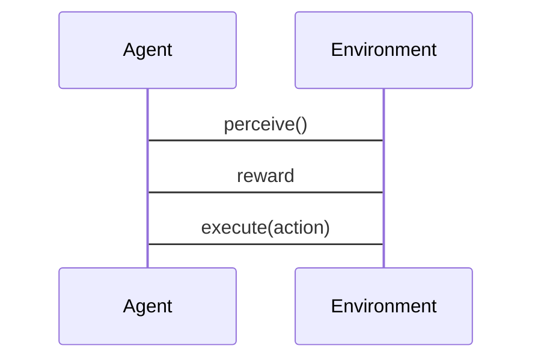

                 


# 开发具有复杂系统建模能力的AI Agent

## 关键词：AI Agent, 复杂系统建模, 强化学习, 系统架构设计, 项目实战

## 摘要：  
在现代计算机科学中，AI Agent（智能体）作为实现人机交互和复杂系统建模的核心技术，正变得越来越重要。本文将深入探讨AI Agent的基本概念、算法原理、系统架构设计以及实际开发中的应用。通过结合理论与实践，本文将帮助读者理解如何构建一个能够处理复杂系统的AI Agent，并通过具体的案例分析，展示其在现实场景中的应用价值。

---

## 第一部分: AI Agent与复杂系统建模基础

### 第1章: AI Agent的基本概念与背景

#### 1.1 AI Agent的定义与特点
AI Agent是一种能够感知环境、做出决策并执行动作的智能实体。与传统程序不同，AI Agent具有以下特点：
- **自主性**：能够在没有外部干预的情况下运行。
- **反应性**：能够实时感知环境并做出响应。
- **目标导向性**：基于目标驱动行为。
- **学习能力**：通过与环境的交互不断优化自身性能。

#### 1.2 复杂系统建模的挑战与机遇
复杂系统通常具有高度的非线性、不确定性以及动态变化的特点，传统的基于规则的建模方法难以应对这些挑战。AI Agent的引入为复杂系统建模提供了新的思路，尤其是在处理多目标优化、实时决策和自适应性方面展现了显著优势。

---

## 第2章: AI Agent的核心概念与联系

#### 2.1 AI Agent的模块化架构
AI Agent通常由以下几个模块组成：
- **感知模块**：负责从环境中获取信息，如传感器数据或用户输入。
- **决策模块**：基于感知信息，结合内部知识库和目标，制定决策。
- **执行模块**：将决策转化为具体动作，如发送指令或输出结果。

#### 2.2 AI Agent的实体关系图
下图展示了AI Agent在复杂系统中的实体关系：


#### 2.3 AI Agent的系统架构图
下图展示了AI Agent的整体架构：
```mermaid
graph LR
    Agent --> [感知] --> Environment
    Agent --> [决策] --> Action
    Agent --> [学习] --> Knowledge
```

---

## 第3章: AI Agent的算法原理

#### 3.1 强化学习算法
强化学习是一种通过试错机制优化决策策略的方法。以下是Q-learning算法的流程：


以下是Q-learning算法的Python实现示例：
```python
class QLearning:
    def __init__(self, actions, epsilon=0.1, alpha=0.1):
        self.actions = actions
        self.epsilon = epsilon
        self.alpha = alpha
        self.q_table = defaultdict(float)
    
    def choose_action(self, state):
        if random.random() < self.epsilon:
            return random.choice(self.actions)
        else:
            max_action = max(self.q_table[(state, action)] for action in self.actions)
            actions_with_max = [action for action in self.actions if self.q_table[(state, action)] == max_action]
            return random.choice(actions_with_max)
    
    def learn(self, state, action, reward, next_state):
        current_q = self.q_table[(state, action)]
        next_max_q = max(self.q_table[(next_state, action)] for action in self.actions)
        new_q = current_q + self.alpha * (reward + next_max_q - current_q)
        self.q_table[(state, action)] = new_q
```

#### 3.2 监督学习算法
监督学习通过标注数据训练模型，使其能够预测新的输入。以下是线性回归的数学模型：
$$ y = \theta^T x + \beta $$
其中，$\theta$为权重向量，$x$为输入特征，$\beta$为截距。

---

## 第4章: 系统分析与架构设计方案

#### 4.1 系统功能设计
以下是系统功能设计的类图：


#### 4.2 系统架构设计
以下是系统架构设计的架构图：
```mermaid
graph LR
    Agent --> [感知] --> Environment
    Agent --> [决策] --> Action
    Agent --> [学习] --> Knowledge
```

#### 4.3 接口设计
以下是系统交互的序列图：


---

## 第5章: 项目实战

#### 5.1 环境安装
开发AI Agent需要以下环境：
- Python 3.8+
- TensorFlow 2.0+
- OpenAI Gym库

#### 5.2 核心代码实现
以下是强化学习算法的核心代码：
```python
import random
from collections import defaultdict

class QLearning:
    def __init__(self, actions, epsilon=0.1, alpha=0.1):
        self.actions = actions
        self.epsilon = epsilon
        self.alpha = alpha
        self.q_table = defaultdict(float)
    
    def choose_action(self, state):
        if random.random() < self.epsilon:
            return random.choice(self.actions)
        else:
            max_action = max(self.q_table[(state, action)] for action in self.actions)
            actions_with_max = [action for action in self.actions if self.q_table[(state, action)] == max_action]
            return random.choice(actions_with_max)
    
    def learn(self, state, action, reward, next_state):
        current_q = self.q_table[(state, action)]
        next_max_q = max(self.q_table[(next_state, action)] for action in self.actions)
        new_q = current_q + self.alpha * (reward + next_max_q - current_q)
        self.q_table[(state, action)] = new_q
```

#### 5.3 代码解读与分析
上述代码实现了Q-learning算法，通过不断更新Q值表，使AI Agent能够在环境中学习最优策略。

---

## 第6章: 总结与展望

#### 6.1 最佳实践
- 在实际项目中，建议结合强化学习和监督学习，构建混合模型。
- 定期对模型进行调参和优化，以适应动态变化的环境。

#### 6.2 小结
本文详细介绍了AI Agent的开发过程，从理论到实践，帮助读者掌握了AI Agent的核心概念和开发技巧。

#### 6.3 注意事项
- 在处理复杂系统时，需注意环境的不确定性和动态性。
- 模型的泛化能力需要通过大量数据进行训练。

#### 6.4 拓展阅读
- 《Reinforcement Learning: Theory and Algorithms》
- 《Deep Learning for Computer Vision》

---

## 作者：AI天才研究院/AI Genius Institute & 禅与计算机程序设计艺术 /Zen And The Art of Computer Programming

