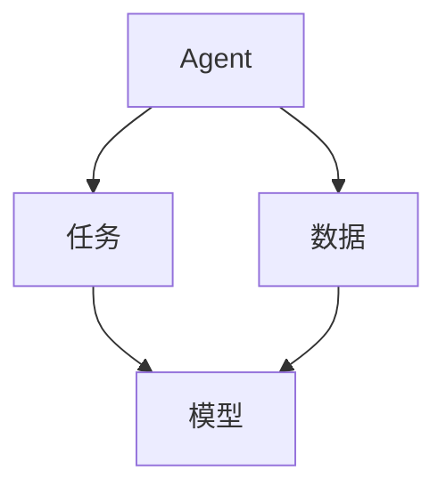
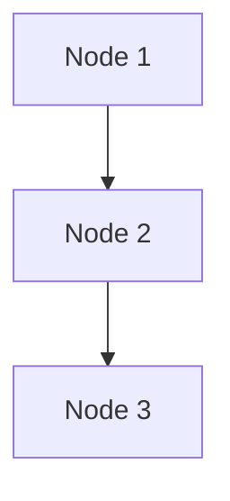
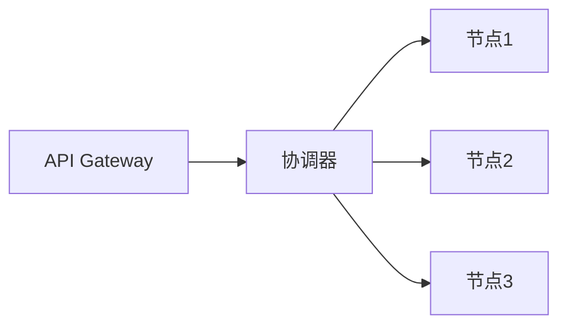
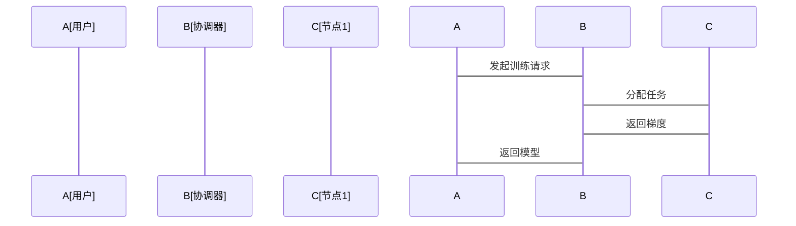

                 


# 开发具有多Agent协同学习能力的系统

> 关键词：多Agent协同学习，分布式机器学习，联邦学习，系统架构设计，算法实现

> 摘要：随着人工智能和分布式计算技术的快速发展，多Agent协同学习系统在各个领域的应用越来越广泛。本文详细探讨了多Agent协同学习的核心概念、算法原理、系统架构设计以及实际项目实现，旨在帮助读者全面理解并掌握如何开发具有多Agent协同学习能力的系统。

---

# 第1章: 多Agent协同学习系统概述

## 1.1 多Agent协同学习的背景与问题背景

### 1.1.1 问题背景
在现代信息技术快速发展的背景下，数据的规模和复杂性不断增加，传统的单一Agent学习模式已经难以满足实际需求。例如，在分布式计算环境中，数据可能分布在不同的节点上，如何高效地利用这些数据进行学习成为一个挑战。

### 1.1.2 问题描述
多Agent协同学习是指多个Agent通过协作完成学习任务的过程。与传统的单Agent学习相比，多Agent系统能够更好地处理分布式数据和复杂任务，但同时也面临通信开销大、同步困难等问题。

### 1.1.3 问题解决思路
通过设计高效的通信机制和同步算法，可以实现多Agent之间的协同学习。例如，采用分布式机器学习算法和联邦学习技术，可以在不共享原始数据的情况下完成模型训练。

### 1.1.4 边界与外延
多Agent协同学习的边界包括数据分布、通信延迟、计算资源限制等。其外延则涉及分布式系统、分布式计算、联邦学习等领域。

### 1.1.5 核心要素组成
多Agent协同学习系统的核心要素包括：Agent、任务、数据、模型和通信机制。

## 1.2 多Agent协同学习的核心概念

### 1.2.1 多Agent系统的基本概念
Agent是指能够感知环境并采取行动的实体。多Agent系统由多个Agent组成，通过协作完成复杂任务。

### 1.2.2 协同学习的定义与特点
协同学习是指多个学习器通过协作完成任务的过程。其特点包括数据分布、模型同步、通信效率等。

### 1.2.3 多Agent协同学习的实现机制
多Agent协同学习的实现机制包括数据交换、模型同步、任务分配等。

### 1.2.4 多Agent协同学习与传统机器学习的对比
与传统机器学习相比，多Agent协同学习具有分布式、协作性强等特点。

## 1.3 本章小结
本章详细介绍了多Agent协同学习的背景、核心概念和实现机制，为后续章节的深入探讨奠定了基础。

---

# 第2章: 多Agent协同学习的核心概念与联系

## 2.1 多Agent协同学习的核心概念

### 2.1.1 Agent的基本属性与特征
Agent具有自主性、反应性、目标导向性等基本属性。

### 2.1.2 协同学习的实现机制
协同学习通过数据交换和模型同步实现。

### 2.1.3 多Agent协同学习的数学模型
多Agent协同学习的数学模型可以表示为：
$$ J = \sum_{i=1}^{n} J_i $$

## 2.2 多Agent协同学习的核心概念对比

### 2.2.1 Agent与传统机器学习模型的对比
| 特性 | Agent | 传统机器学习模型 |
|------|-------|-----------------|
| 自主性 | 高     | 低             |
| 反应性 | 高     | 低             |

### 2.2.2 协同学习与分布式学习的对比
| 特性 | 协同学习 | 分布式学习 |
|------|----------|------------|
| 数据共享 | 高      | 低         |

### 2.2.3 多Agent系统与分布式系统的对比
多Agent系统与分布式系统的主要区别在于协作机制和目标导向性。

## 2.3 多Agent协同学习的ER实体关系图


## 2.4 本章小结
本章通过对比分析，进一步明确了多Agent协同学习的核心概念和实现机制。

---

# 第3章: 多Agent协同学习的算法原理

## 3.1 分布式机器学习算法

### 3.1.1 分布式机器学习的基本原理
分布式机器学习通过将数据分发到多个节点，分别进行训练，最后汇总结果。

### 3.1.2 分布式机器学习的数学模型
分布式机器学习的数学模型可以表示为：
$$ \theta = \arg\min_{\theta} \frac{1}{n}\sum_{i=1}^{n} J_i(\theta) $$

## 3.2 多Agent协同学习的算法实现

### 3.2.1 分布式梯度下降算法


### 3.2.2 分布式随机梯度下降算法
```python
def distributed SGD():
    # 初始化参数
    theta = np.zeros(d)
    # 分配数据
    data = distribute_data()
    # 并行更新参数
    for i in range(n):
        # 计算梯度
        gradient = compute_gradient(data[i], theta)
        # 更新参数
        theta = theta - eta * gradient
    return theta
```

## 3.3 算法实现的数学模型

### 3.3.1 梯度下降的数学公式
$$ \text{梯度下降} = -\eta \cdot \nabla J $$

### 3.3.2 联邦学习的数学公式
$$ \t

---

# 第4章: 多Agent协同学习的系统架构设计

## 4.1 问题场景介绍
在分布式环境中，如何高效地进行模型训练是一个关键问题。

## 4.2 系统功能设计
系统功能包括数据分发、模型同步、任务分配等。

## 4.3 系统架构设计


## 4.4 系统交互设计


---

# 第5章: 多Agent协同学习的项目实战

## 5.1 环境安装
安装必要的依赖库，如TensorFlow、Keras等。

## 5.2 系统核心实现
实现多Agent协同学习的核心功能，包括数据分发和模型同步。

## 5.3 代码实现与解读
```python
import tensorflow as tf
from tensorflow import keras

# 定义模型
model = keras.Sequential([
    keras.layers.Dense(64, activation='relu'),
    keras.layers.Dense(10, activation='softmax')
])

# 编译模型
model.compile(optimizer='adam', loss='sparse_categorical_crossentropy', metrics=['accuracy'])

# 训练模型
model.fit(x_train, y_train, epochs=10, batch_size=32)
```

## 5.4 实际案例分析
通过实际案例分析，展示多Agent协同学习的应用场景和效果。

## 5.5 项目小结
总结项目实现的关键点和经验教训。

---

# 第6章: 总结与展望

## 6.1 总结
本文详细探讨了多Agent协同学习的核心概念、算法原理和系统架构设计。

## 6.2 注意事项
在实际应用中，需要注意通信开销和同步延迟等问题。

## 6.3 未来展望
未来的研究方向包括更高效的通信机制和更智能的任务分配策略。

---

# 作者：AI天才研究院 & 禅与计算机程序设计艺术

---

以上是《开发具有多Agent协同学习能力的系统》的技术博客文章的目录大纲和内容概要。如果需要更详细的内容或调整结构，请随时告知！

