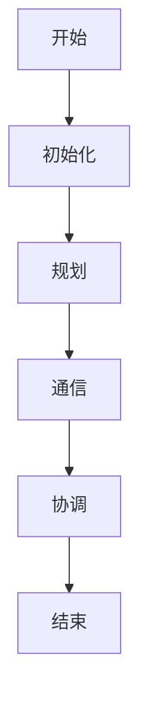
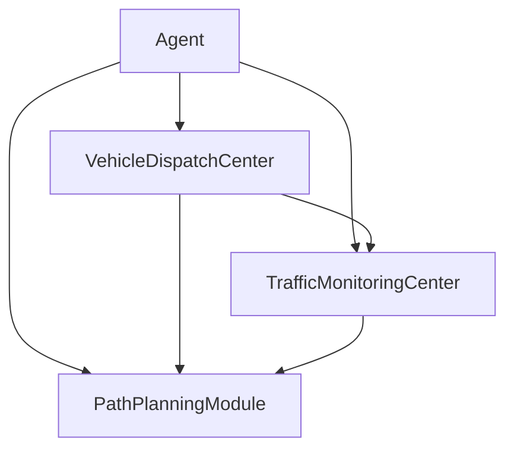

                 


# 开发具有多Agent协同规划能力的系统

> 关键词：多Agent系统、协同规划、分布式计算、智能系统开发、系统架构设计

> 摘要：本文详细探讨了开发具有多Agent协同规划能力的系统的各个方面。从概念和背景出发，逐步深入分析多Agent协同规划的核心原理、算法实现、系统架构设计以及实际项目中的应用。通过丰富的图表和代码示例，结合理论与实践，帮助读者全面理解并掌握多Agent协同规划系统的开发方法。

---

## 第一部分: 多Agent协同规划系统背景与概念

### 第1章: 多Agent系统概述

#### 1.1 多Agent系统的定义与特点

多Agent系统（Multi-Agent System, MAS）是由多个智能体（Agent）组成的分布式系统，这些智能体能够通过协作完成复杂的任务。以下是多Agent系统的定义与特点：

- **定义**：多Agent系统是由多个独立但相互作用的智能体组成的系统，每个智能体都有自己的目标、知识和能力，并能够与其他智能体进行通信和协作。
  
- **特点**：
  - **分布式性**：多个智能体分布在不同的位置，各自独立地进行计算和决策。
  - **自主性**：每个智能体都有自主决策的能力，能够在没有中央控制的情况下完成任务。
  - **协作性**：智能体之间通过通信和协作，共同完成复杂的任务。
  - **反应性**：智能体能够感知环境的变化，并实时调整自己的行为。

#### 1.2 协同规划的概念与背景

协同规划（Collaborative Planning）是多Agent系统中的一个核心概念，指多个智能体通过协作制定共同的行动计划，以实现特定的目标。以下是协同规划的背景和概念：

- **背景**：随着复杂系统的需求不断增加，单个智能体难以独立完成复杂的任务，需要多个智能体协作完成。
- **概念**：协同规划是指多个智能体通过通信和协作，共同制定行动计划，以实现共同目标的过程。
- **必要性**：协同规划能够提高系统的整体效率和智能性，能够在复杂环境中完成任务。

### 第2章: 多Agent协同规划的核心概念

#### 2.1 多Agent协同规划的原理

多Agent协同规划的原理包括以下几个方面：

- **Agent的定义与属性**：每个Agent都有自己的目标、知识和能力，并能够与其他Agent进行通信和协作。
- **多Agent系统的协同机制**：通过通信和协作，多个Agent共同制定行动计划。
- **协同规划的实现方式**：包括分布式规划、基于规则的规划和基于模型的规划等。

#### 2.2 多Agent协同规划的数学模型

多Agent协同规划的数学模型可以通过以下方式描述：

- **状态空间**：系统的状态空间由多个Agent的状态组成。
- **动作空间**：每个Agent可以执行的动作。
- **目标函数**：系统的优化目标。

数学模型可以用以下公式表示：

$$
\text{目标函数} = \sum_{i=1}^{n} \text{Agent}_i的贡献
$$

其中，n是Agent的数量。

#### 2.3 多Agent协同规划的ER实体关系图

以下是多Agent协同规划的ER实体关系图：

```mermaid
er
actor: Agent
actor: 环境
actor: 目标
relation: 参与
relation: 影响
relation: 实现
```

---

## 第二部分: 多Agent协同规划算法原理

### 第3章: 多Agent协同规划算法概述

#### 3.1 分布式规划算法

分布式规划算法是一种基于分布式计算的规划方法，适用于多个Agent协作完成任务的情况。以下是分布式规划算法的原理和实现步骤：

- **原理**：通过分布式计算，每个Agent独立地进行规划，并通过通信将规划结果共享给其他Agent。
- **实现步骤**：
  1. 初始化：每个Agent初始化自己的状态和目标。
  2. 规划：每个Agent根据自己的知识和环境状态进行规划。
  3. 通信：Agent之间通过通信共享规划结果。
  4. 协调：根据共享的信息进行协调，调整各自的规划。

#### 3.2 基于规则的协同规划算法

基于规则的协同规划算法是一种通过预定义规则进行协作的规划方法。以下是基于规则的协同规划算法的实现步骤：

- **规则的定义**：定义协作规则，如优先级规则、冲突解决规则等。
- **规则的执行**：根据当前的环境状态和规则，执行相应的协作行为。

#### 3.3 基于模型的协同规划算法

基于模型的协同规划算法是一种通过构建系统模型进行协作的规划方法。以下是基于模型的协同规划算法的实现步骤：

- **模型构建**：构建系统的模型，包括Agent的状态、动作和环境的关系。
- **模型优化**：根据模型进行优化，调整Agent的行为以实现最优目标。

### 第4章: 多Agent协同规划算法实现

#### 4.1 算法流程图

以下是多Agent协同规划算法的流程图：



#### 4.2 算法实现代码

以下是Python实现的多Agent协同规划算法示例：

```python
class Agent:
    def __init__(self, id):
        self.id = id
        self.state = None
        self.goal = None

    def plan(self):
        # 根据当前状态和目标进行规划
        pass

    def communicate(self, other_agent):
        # 与其他Agent通信
        pass

    def coordinate(self):
        # 协调规划
        pass

# 初始化多个Agent
agents = [Agent(i) for i in range(5)]

# 初始化状态
for agent in agents:
    agent.state = "initial"
    agent.goal = "achieve target"

# 规划
for agent in agents:
    agent.plan()

# 通信
for i in range(len(agents)):
    for j in range(i+1, len(agents)):
        agents[i].communicate(agents[j])

# 协调
for agent in agents:
    agent.coordinate()

# 结束
print("规划完成")
```

---

## 第三部分: 数学模型和公式

### 3.1 状态空间与动作空间

状态空间和动作空间是多Agent协同规划中的重要组成部分。以下是状态空间和动作空间的数学表示：

- **状态空间**：S = {s₁, s₂, ..., sₙ}，其中sᵢ表示第i个Agent的状态。
- **动作空间**：A = {a₁, a₂, ..., aₘ}，其中aⱼ表示第j个动作。

### 3.2 目标函数与优化模型

目标函数是多Agent协同规划中的优化目标。以下是目标函数的数学表示：

$$
\text{目标函数} = \sum_{i=1}^{n} \text{Agent}_i的贡献
$$

其中，n是Agent的数量。

---

## 第四部分: 系统分析与架构设计

### 4.1 问题场景介绍

#### 4.1.1 问题场景：智能交通系统中的车辆调度

在智能交通系统中，多Agent协同规划可以用于车辆调度。以下是车辆调度的具体问题：

- **问题描述**：在交通高峰期，如何通过多Agent协同规划，实现车辆的高效调度，减少拥堵和等待时间。
- **系统功能设计**：需要实现车辆调度、路径规划、交通监控等功能。
- **系统架构设计**：包括车辆调度中心、交通监控中心、路径规划模块等。

### 4.2 系统功能设计

#### 4.2.1 系统功能设计：类图

以下是系统功能设计的类图：

```mermaid
classDiagram
class Agent:
    - id: int
    - state: string
    + plan(): void
    + communicate(): void
    + coordinate(): void

class VehicleDispatchCenter:
    - agents: list of Agent
    + dispatch_vehicle(): void
    + monitor_traffic(): void
    + plan_route(): void

class TrafficMonitoringCenter:
    - agents: list of Agent
    + monitor_traffic(): void
    + send_update(): void

class PathPlanningModule:
    - agents: list of Agent
    + plan_route(): void
    + optimize_route(): void
```

### 4.3 系统架构设计

#### 4.3.1 系统架构设计：架构图

以下是系统架构设计的架构图：



---

## 第五部分: 项目实战

### 5.1 环境安装

#### 5.1.1 环境安装步骤

以下是多Agent协同规划系统的环境安装步骤：

1. 安装Python和必要的库（如numpy、scipy等）。
2. 安装Mermaid工具，用于绘制图表。
3. 安装LaTeX，用于公式排版。

### 5.2 系统核心实现源代码

以下是多Agent协同规划系统的Python实现代码：

```python
import numpy as np

class Agent:
    def __init__(self, id):
        self.id = id
        self.state = np.array([0, 0])
        self.goal = np.array([1, 1])

    def plan(self):
        # 规划路径
        pass

    def communicate(self, other_agent):
        # 与其他Agent通信
        pass

    def coordinate(self):
        # 协调规划
        pass

# 初始化多个Agent
agents = [Agent(i) for i in range(5)]

# 初始化状态
for agent in agents:
    agent.state = np.array([0, 0])
    agent.goal = np.array([1, 1])

# 规划
for agent in agents:
    agent.plan()

# 通信
for i in range(len(agents)):
    for j in range(i+1, len(agents)):
        agents[i].communicate(agents[j])

# 协调
for agent in agents:
    agent.coordinate()

# 结束
print("规划完成")
```

### 5.3 实际案例分析与详细解读

#### 5.3.1 实际案例分析

在智能交通系统中，多Agent协同规划可以用于车辆调度。以下是具体的案例分析：

- **问题描述**：在交通高峰期，如何通过多Agent协同规划，实现车辆的高效调度，减少拥堵和等待时间。
- **系统功能设计**：需要实现车辆调度、路径规划、交通监控等功能。
- **系统架构设计**：包括车辆调度中心、交通监控中心、路径规划模块等。

#### 5.3.2 详细解读

通过多Agent协同规划，车辆调度中心可以与其他Agent（如交通监控中心和路径规划模块）进行通信和协作，实现车辆的高效调度。以下是详细解读：

- **通信与协作**：车辆调度中心与其他Agent通信，获取实时交通数据和路径规划信息。
- **路径优化**：路径规划模块根据实时数据，优化车辆的行驶路径，减少拥堵和等待时间。
- **动态调整**：根据交通状况的变化，动态调整车辆的调度计划，确保车辆能够高效运行。

---

## 第六部分: 最佳实践

### 6.1 小结

多Agent协同规划系统是一种复杂的分布式系统，通过多个智能体的协作，实现系统的高效运行。本文从概念、算法、系统架构设计和实际案例等方面，详细探讨了多Agent协同规划系统的开发方法。

### 6.2 注意事项

- **通信延迟**：在多Agent系统中，通信延迟可能会影响系统的实时性和效率。
- **协作冲突**：多个Agent之间的协作可能会导致冲突，需要通过合理的规则和算法进行协调。
- **系统复杂性**：多Agent系统的复杂性较高，需要进行详细的系统设计和优化。

### 6.3 拓展阅读

- **推荐书籍**：《Multi-Agent Systems: Algorithmic, Complexity, and Synthesis》
- **推荐论文**：《A Survey on Multi-Agent Planning and Coordination》
- **推荐工具**：Mermaid、LaTeX、Python等工具的使用。

---

## 作者

作者：AI天才研究院/AI Genius Institute & 禅与计算机程序设计艺术 /Zen And The Art of Computer Programming

---

以上就是《开发具有多Agent协同规划能力的系统》的完整目录大纲及正文内容，希望对您有所帮助！

