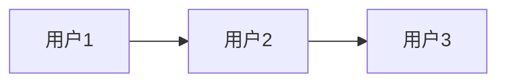
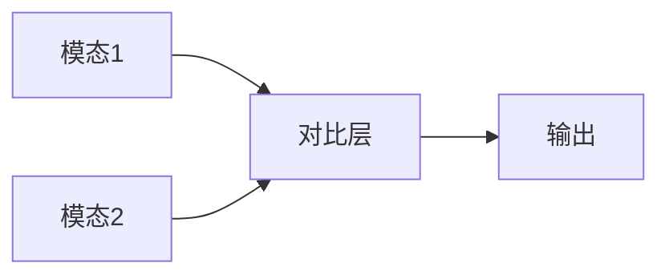
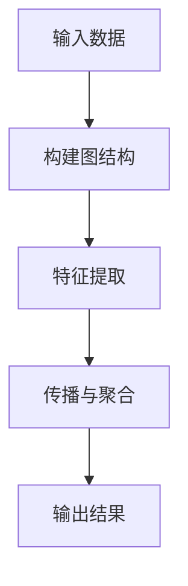
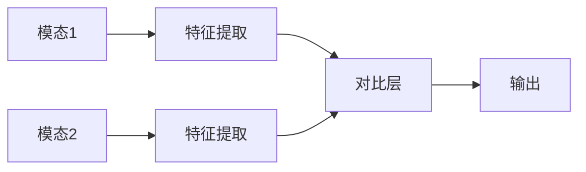
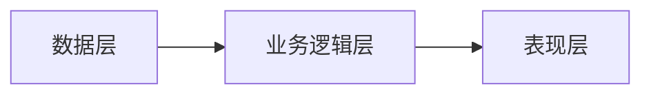
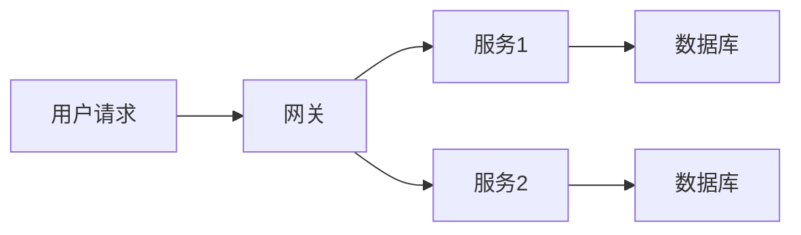

                 


---

# 开发具有多模态学习能力的AI Agent

## 关键词：多模态学习，AI Agent，系统架构，算法原理，项目实战

## 摘要：  
本文详细探讨了开发具有多模态学习能力的AI Agent所需的关键技术，包括多模态数据的表示与融合、主流算法的原理与实现、系统架构设计以及实际项目开发的实战经验。通过本文，读者可以系统地了解如何构建一个多模态AI Agent，并掌握相关的理论基础和实践技能。

---

# 第一部分: 引言

# 第1章: 多模态学习与AI Agent概述

## 1.1 多模态学习的基本概念

### 1.1.1 多模态数据的定义与特点

多模态数据是指来自多种感官渠道的数据，如视觉（图像、视频）、听觉（音频、语音）、触觉（触感反馈）等。与单模态数据相比，多模态数据能够提供更全面的信息，使AI系统能够更好地理解和处理复杂场景。

**特点：**
1. **互补性**：不同模态的数据可以相互补充，提供更丰富的信息。
2. **多样性**：多模态数据能够捕捉到更多的细节，提高模型的鲁棒性。
3. **复杂性**：处理多模态数据需要更高的计算能力和更复杂的算法。

### 1.1.2 多模态学习的核心思想

多模态学习的核心思想是通过融合不同模态的数据，提升模型的学习能力。这种学习方式能够使AI系统在处理复杂任务时更具灵活性和适应性。例如，在自然语言处理中，结合图像和文本信息可以显著提高模型的语义理解能力。

### 1.1.3 多模态学习与单模态学习的对比

| 对比维度       | 单模态学习                          | 多模态学习                          |
|----------------|------------------------------------|------------------------------------|
| 数据来源       | 单一感官渠道                        | 多个感官渠道                        |
| 信息丰富性     | 较低                               | 较高                               |
| 学习能力       | 较弱                               | 较强                               |
| 应用场景       | 简单任务（如文本分类）              | 复杂任务（如视觉问答）              |

## 1.2 AI Agent的基本概念

### 1.2.1 AI Agent的定义与分类

AI Agent（智能体）是指在环境中能够感知并自主行动以实现目标的实体。AI Agent可以分为以下几类：
- **简单反射型**：基于当前感知做出反应。
- **基于模型的反应型**：利用内部模型进行决策。
- **目标驱动型**：根据目标驱动行为。
- **实用驱动型**：通过效用函数优化行为。

### 1.2.2 AI Agent的核心能力

1. **感知能力**：通过传感器或数据源获取环境信息。
2. **决策能力**：基于感知信息做出最优决策。
3. **执行能力**：通过执行机构将决策转化为行动。
4. **学习能力**：通过经验改进性能。

### 1.2.3 多模态学习能力对AI Agent的重要性

多模态学习能力使AI Agent能够更好地处理复杂环境中的信息，从而提升其感知和决策能力。例如，在自动驾驶中，结合视觉、雷达和激光雷达等多种模态数据，可以显著提高环境感知的准确性和可靠性。

## 1.3 本章小结

本章介绍了多模态学习的基本概念及其在AI Agent中的重要性。通过对比单模态和多模态学习的特点，读者可以更好地理解多模态学习的优势。同时，通过对AI Agent核心能力的分析，明确了多模态学习能力在提升AI Agent性能中的关键作用。

---

# 第二部分: 多模态学习的数学基础

# 第2章: 多模态数据的表示与融合

## 2.1 多模态数据的表示方法

### 2.1.1 向量空间模型

向量空间模型通过将数据映射到高维向量空间来表示信息。例如，在自然语言处理中，词向量（如Word2Vec）可以将单词表示为向量。

**公式：**  
$$ \text{词向量} = \text{Word2Vec}(w) $$

### 2.1.2 图结构表示

图结构表示通过节点和边来描述数据之间的关系。例如，在社交网络中，用户和用户之间的关系可以用图结构表示。

**图结构示例：**  


### 2.1.3 深度学习中的嵌入表示

嵌入表示是一种将高维数据映射到低维空间的方法，常用于处理文本、图像等数据。

**公式：**  
$$ \text{嵌入向量} = \text{Embedding}(x) $$

## 2.2 多模态数据的融合方法

### 2.2.1 晚期融合与早期融合的对比

- **晚期融合**：在特征提取后对不同模态的特征进行融合。
- **早期融合**：在特征提取过程中对不同模态的数据进行融合。

**对比表格：**

| 对比维度       | 晚期融合                          | 早期融合                          |
|----------------|----------------------------------|----------------------------------|
| 融合时间       | 特征提取后                      | 特征提取中                      |
| 优势           | 简单实现                        | 更强的特征表达能力                |
| 劣势           | 可能忽略模态间的关联性          | 实现复杂性较高                    |

### 2.2.2 对比学习与联合学习的优缺点

- **对比学习**：通过对比不同模态的数据，学习其共同特征。
- **联合学习**：将不同模态的数据联合起来进行学习。

**对比学习示意图：**  


### 2.2.3 注意力机制在多模态融合中的应用

注意力机制能够关注重要信息，提升模型的性能。

**公式：**  
$$ \text{注意力权重} = \text{softmax}(QK^T/\sqrt{d_k}) $$  
其中，\( Q \) 是查询向量，\( K \) 是键向量，\( d_k \) 是向量维度。

## 2.3 本章小结

本章详细介绍了多模态数据的表示方法和融合策略，分析了各种方法的优缺点，并通过对比和图表展示了不同方法的应用场景。

---

# 第三部分: 多模态学习算法

# 第3章: 多模态学习的算法原理

## 3.1 多模态学习的主流算法

### 3.1.1 图神经网络（GNN）

图神经网络通过处理图结构数据，能够有效捕捉数据之间的关系。

**GNN算法流程图：**  


### 3.1.2 变体自注意力机制（ViT）

ViT将图像划分为块，并将每个块表示为向量，然后通过自注意力机制进行处理。

**ViT处理流程：**  
1. 将图像划分为块：  
   $$ \text{块数} = (\text{图像高度}/\text{块大小}) \times (\text{图像宽度}/\text{块大小}) $$
2. 将块转换为向量：  
   $$ \text{向量} = \text{Embedding}(\text{块}) $$
3. 应用自注意力机制：  
   $$ \text{输出} = \text{自注意力}(\text{向量}) $$

### 3.1.3 多模态对比学习（MCL）

MCL通过对比不同模态的数据，学习其共同特征。

**MCL算法示意图：**  


## 3.2 多模态学习的数学模型

### 3.2.1 图结构模型的数学表达

图结构模型可以用邻接矩阵和节点特征矩阵表示。

**邻接矩阵**：  
$$ A \in \{0,1\}^{n \times n} $$  
其中，\( n \) 是节点数。

**节点特征矩阵**：  
$$ X \in \mathbb{R}^{n \times d} $$  
其中，\( d \) 是特征维度。

### 3.2.2 对比学习的损失函数

对比学习的损失函数通常采用交叉熵损失。

**损失函数**：  
$$ L = -\sum_{i=1}^{n} \log(p_i) $$  
其中，\( p_i \) 是正样本的概率。

### 3.2.3 注意力机制的公式推导

注意力机制的权重计算公式为：  
$$ \text{权重} = \text{softmax}(QK^T/\sqrt{d_k}) $$  
其中，\( Q \) 和 \( K \) 分别是查询和键的向量。

## 3.3 算法实现与优化

### 3.3.1 算法实现的步骤分解

1. **数据预处理**：将多模态数据转换为模型可接受的格式。
2. **模型训练**：使用训练数据对模型进行训练。
3. **模型推理**：使用训练好的模型进行推理和预测。

### 3.3.2 模型训练的优化策略

- **学习率调整**：采用学习率衰减策略。
- **批量归一化**：在每一层添加批量归一化层，加速训练过程。
- **早停**：当验证集损失不再下降时，提前终止训练。

### 3.3.3 模型评估与调优

- **评估指标**：采用准确率、召回率、F1分数等指标评估模型性能。
- **超参数调优**：通过网格搜索或随机搜索优化模型参数。

## 3.4 本章小结

本章详细介绍了多模态学习的主流算法及其数学模型，并通过公式推导和图表展示了算法的实现过程。通过优化策略的分析，读者可以更好地理解和实现这些算法。

---

# 第四部分: 多模态AI Agent的系统架构

# 第4章: 多模态AI Agent的系统设计

## 4.1 系统功能需求分析

### 4.1.1 多模态数据采集与处理

AI Agent需要能够采集和处理多种模态的数据，例如图像、语音、文本等。

### 4.1.2 多模态模型推理与决策

AI Agent需要具备多模态数据的推理能力，能够根据输入数据做出决策。

### 4.1.3 人机交互界面设计

AI Agent需要具备友好的人机交互界面，方便用户与其互动。

## 4.2 系统架构设计

### 4.2.1 分层架构设计

分层架构将系统划分为数据层、业务逻辑层和表现层，每一层负责不同的功能。

**分层架构示意图：**  


### 4.2.2 微服务架构设计

微服务架构将系统功能分解为多个独立的服务，每个服务负责不同的功能模块。

**微服务架构示意图：**  


### 4.2.3 混合架构的优势与挑战

混合架构结合了分层和微服务架构的优点，能够更好地应对复杂的业务需求。

**优势：**
- **灵活性**：可以根据需求灵活调整架构。
- **可扩展性**：可以方便地扩展系统功能。

**挑战：**
- **复杂性**：架构设计和管理较为复杂。
- **维护成本**：需要投入更多资源进行维护。

## 4.3 系统接口设计

### 4.3.1 数据接口规范

- **输入接口**：定义输入数据的格式和规范。
- **输出接口**：定义输出结果的格式和规范。

### 4.3.2 模型推理接口

- **推理接口**：定义模型推理的输入和输出接口。
- **调用方式**：可以通过API调用模型进行推理。

### 4.3.3 交互接口设计

- **用户界面**：设计友好的用户界面，方便用户与AI Agent交互。
- **交互协议**：定义交互的协议和规范。

## 4.4 本章小结

本章详细介绍了多模态AI Agent的系统架构设计，分析了不同架构的优缺点，并提出了系统的接口设计方案。通过合理的设计，可以确保系统的灵活性、可扩展性和易维护性。

---

# 第五部分: 项目实战

# 第5章: 多模态AI Agent的开发实践

## 5.1 项目环境搭建

### 5.1.1 开发工具安装

- **Python**：安装Python 3.8及以上版本。
- **深度学习框架**：安装TensorFlow或PyTorch。
- **可视化工具**：安装TensorBoard或其他可视化工具。

### 5.1.2 数据集准备

- **数据来源**：可以从公开数据集（如ImageNet、COCO）获取数据。
- **数据格式**：确保数据格式符合模型输入要求。

### 5.1.3 模型框架选择

- **选择框架**：根据需求选择TensorFlow或PyTorch。
- **模型选择**：根据任务选择合适的模型架构。

## 5.2 系统核心实现

### 5.2.1 数据预处理代码

```python
import numpy as np
from tensorflow.keras.preprocessing.image import ImageDataGenerator

datagen = ImageDataGenerator(rescale=1./255, rotation_range=20, horizontal_flip=True)
```

### 5.2.2 模型训练代码

```python
import tensorflow as tf
from tensorflow.keras.layers import Dense, GlobalAveragePooling2D
from tensorflow.keras.models import Model

base_model = tf.keras.applications.VGG16(weights='imagenet', include_top=False)
x = base_model.output
x = GlobalAveragePooling2D()(x)
x = Dense(512, activation='relu')(x)
predictions = Dense(num_classes, activation='softmax')(x)
model = Model(inputs=base_model.input, outputs=predictions)
model.compile(optimizer='adam', loss='categorical_crossentropy', metrics=['accuracy'])
model.fit(train_generator, epochs=10, validation_data=validation_generator)
```

### 5.2.3 推理与交互代码

```python
import cv2
from tensorflow.keras.models import load_model

model = load_model('model.h5')
image = cv2.imread('input.jpg')
image = cv2.resize(image, (224, 224))
image = image / 255.0
image = np.expand_dims(image, axis=0)
prediction = model.predict(image)
print(prediction)
```

## 5.3 项目测试与优化

### 5.3.1 功能测试

- **输入测试**：测试不同输入的数据，确保系统能够正确处理。
- **输出测试**：检查输出结果是否符合预期。

### 5.3.2 性能优化

- **模型优化**：通过减少模型参数或使用剪枝技术优化模型性能。
- **算法优化**：优化算法的实现，减少计算时间。

### 5.3.3 模型调优

- **超参数调整**：通过网格搜索或随机搜索优化模型超参数。
- **数据增强**：增加数据的多样性和数量，提高模型的泛化能力。

## 5.4 本章小结

本章通过一个实际的项目案例，展示了多模态AI Agent的开发过程。从环境搭建到代码实现，再到测试与优化，详细讲解了开发的每一步骤。通过实际操作，读者可以更好地理解和掌握多模态AI Agent的开发技能。

---

# 总结

开发具有多模态学习能力的AI Agent是一项复杂的任务，需要综合运用多种技术和算法。通过本文的介绍，读者可以系统地了解多模态学习的基本概念、算法原理和系统架构设计。同时，通过实际的项目实战，读者可以掌握开发多模态AI Agent的技能。未来，随着技术的不断发展，多模态学习能力的AI Agent将在更多领域得到广泛应用。

---

# 作者：AI天才研究院/AI Genius Institute & 禅与计算机程序设计艺术 /Zen And The Art of Computer Programming

