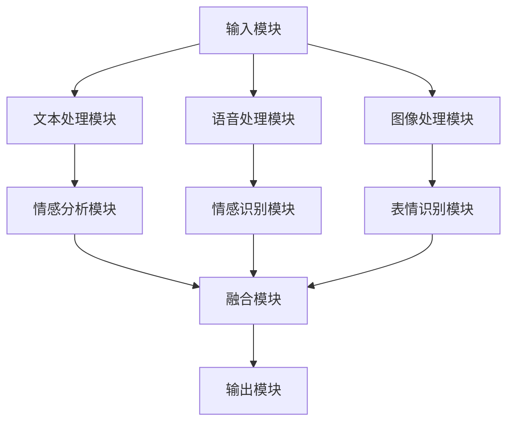

                 


# 开发具有多模态情感交互能力的AI Agent

> 关键词：多模态情感交互，AI Agent，文本处理，语音处理，图像处理，情感计算，机器学习

> 摘要：本文详细探讨了开发具有多模态情感交互能力的AI Agent所需的关键技术与实现方法。首先介绍了AI Agent的基本概念和多模态情感交互的重要性，然后分别从文本、语音、图像三个模态详细讲解了情感交互的核心技术，包括文本预处理、情感分析、语音特征提取、图像目标检测等。接着讨论了多模态数据融合方法和系统架构设计，最后通过一个实际项目案例展示了如何将这些技术落地实现。本文还探讨了当前技术的局限性及未来发展方向。

---

# 第1章: 多模态情感交互AI Agent概述

## 1.1 AI Agent的基本概念

### 1.1.1 AI Agent的定义与分类
- **AI Agent**：智能体，能够感知环境、自主决策并执行任务的计算机系统。
- **分类**：基于智能水平分为简单反应型、基于模型的反射型、目标驱动型和实用驱动型。

### 1.1.2 多模态交互的定义
- **多模态交互**：通过多种感官通道（如文本、语音、图像）进行信息交换，提升交互的自然性和丰富性。

### 1.1.3 情感交互的核心要素
- **情感识别**：理解用户的情感状态。
- **情感生成**：模拟情感反馈。
- **情感记忆**：保持情感状态的连续性。

## 1.2 多模态情感交互的必要性

### 1.2.1 单模态交互的局限性
- **单一性**：仅依赖文本或语音，无法全面理解用户意图。

### 1.2.2 多模态交互的优势
- **丰富性**：结合多种信息源，提高交互的准确性和自然性。

### 1.2.3 情感交互在人机交互中的作用
- **提升用户体验**：使交互更自然、更贴近人类交流方式。

## 1.3 本章小结
本章介绍了AI Agent的基本概念和多模态情感交互的重要性，为后续技术实现奠定了基础。

---

# 第2章: 文本处理与情感分析

## 2.1 文本预处理

### 2.1.1 分词与词干提取
- **分词**：将文本分割成词语或短语。
- **词干提取**：去除词语的词缀，保留词干。

### 2.1.2 停用词处理
- **停用词**：常见但无实际意义的词语，如“的”、“是”等。

### 2.1.3 词向量表示
- **词向量**：将词语映射为向量，常用工具如Word2Vec、GloVe。

## 2.2 情感分析算法

### 2.2.1 基于规则的情感分析
- **规则设定**：根据预设的关键词或语法规则判断情感倾向。

### 2.2.2 基于机器学习的情感分析
- **特征提取**：提取文本特征（如TF-IDF）。
- **分类器训练**：使用SVM、随机森林等模型。

### 2.2.3 基于深度学习的情感分析
- **模型选择**：使用RNN、LSTM或Transformer模型。
- **训练流程**：数据预处理、模型训练、评估与优化。

## 2.3 文本生成技术

### 2.3.1 基于规则的文本生成
- **规则库**：根据预设规则生成回复。

### 2.3.2 基于模板的文本生成
- **模板设计**：使用模板结构，填充关键词生成回复。

### 2.3.3 基于大模型的文本生成
- **大模型选择**：如GPT、BERT等，用于生成高质量回复。

## 2.4 案例分析: 情感分析在客服系统中的应用

### 2.4.1 问题场景描述
- **场景**：用户对产品或服务的评价分析。

### 2.4.2 系统功能设计
- **功能**：自动识别用户评价的情感倾向，分类处理。

### 2.4.3 实际应用案例
- **案例**：电商客服系统中情感分析的应用。

## 2.5 本章小结
本章详细讲解了文本处理与情感分析的核心技术，并通过案例展示了实际应用。

---

# 第3章: 语音处理与情感识别

## 3.1 语音信号处理

### 3.1.1 语音信号的采集与预处理
- **采集**：通过麦克风采集音频信号。
- **预处理**：降噪、分段、归一化。

### 3.1.2 语音特征提取
- **特征提取**：提取MFCC、 pitch、能量等特征。

### 3.1.3 语音识别技术
- **识别方法**：基于HMM、DNN的语音识别。

## 3.2 情感语音识别

### 3.2.1 情感特征分析
- **声学特征**：音调、节奏、音量的变化。
- **情感类别**：如快乐、悲伤、愤怒等。

### 3.2.2 基于机器学习的情感识别
- **模型训练**：使用SVM、随机森林等进行分类。

### 3.2.3 基于深度学习的情感识别
- **模型选择**：如CNN、RNN用于语音特征提取。

## 3.3 本章小结
本章探讨了语音处理与情感识别的关键技术，为后续多模态融合奠定了基础。

---

# 第4章: 图像处理与情感识别

## 4.1 图像处理基础

### 4.1.1 图像采集与预处理
- **采集**：获取图像数据。
- **预处理**：调整亮度、对比度、去噪等。

### 4.1.2 图像特征提取
- **特征提取**：使用OpenCV提取边缘、纹理特征。

## 4.2 情感识别技术

### 4.2.1 面部表情识别
- **关键点检测**：识别面部关键点，如眼睛、鼻子、嘴巴。
- **表情分类**：使用CNN进行表情分类。

### 4.2.2 人体姿态分析
- **姿态检测**：分析用户的身体姿态，如坐姿、站姿。

## 4.3 本章小结
本章介绍了图像处理与情感识别的核心技术，展示了多模态情感交互的视觉部分。

---

# 第5章: 多模态数据融合与系统架构设计

## 5.1 多模态数据融合方法

### 5.1.1 晚融合与早融合
- **晚融合**：分别处理各模态数据，最后进行融合。
- **早融合**：在特征层面进行融合。

### 5.1.2 跨模态特征对齐
- **对齐方法**：使用相似性度量或深度学习模型对齐特征。

## 5.2 系统架构设计

### 5.2.1 模块划分
- **输入模块**：接收文本、语音、图像输入。
- **处理模块**：分别处理各模态数据。
- **融合模块**：整合多模态特征。
- **输出模块**：生成情感交互的输出。

### 5.2.2 系统架构图


### 5.2.3 接口设计
- **API定义**：定义各模块之间的接口，如文本处理接口、语音识别接口。

### 5.2.4 交互设计
- **交互流程**：用户输入 -> 多模态处理 -> 情感分析 -> 输出反馈。

---

# 第6章: 项目实战——开发一个多模态情感交互AI Agent

## 6.1 项目背景与需求分析

### 6.1.1 项目背景
- **目标**：开发一个多模态情感交互AI Agent，能够理解并回应用户的情感需求。

### 6.1.2 需求分析
- **功能需求**：支持文本、语音、图像输入，具备情感识别与生成能力。
- **性能需求**：实时响应，准确率高。

## 6.2 环境搭建与工具安装

### 6.2.1 开发环境
- **操作系统**：Linux/Windows/MacOS。
- **编程语言**：Python。
- **依赖库安装**：安装TensorFlow、Keras、OpenCV、SpeechRecognition等。

## 6.3 核心代码实现

### 6.3.1 文本处理模块
```python
import numpy as np
from sklearn.feature_extraction.text import TfidfVectorizer

# 文本预处理
def preprocess(text):
    # 分词
    words = text.split()
    # 词干提取（假设已经完成）
    return words

# 情感分析（基于机器学习）
vectorizer = TfidfVectorizer()
model = SVC()
```

### 6.3.2 语音处理模块
```python
import speech_recognition as sr

# 语音识别
def recognize_speech(audio_file):
    r = sr.Recognizer()
    with sr.AudioFile(audio_file) as source:
        audio = r.listen(source)
        return r.recognize_google(audio)
```

### 6.3.3 图像处理模块
```python
import cv2

# 面部检测
def detect_face(image):
    gray = cv2.cvtColor(image, cv2.COLOR_BGR2GRAY)
    faceCascade = cv2.CascadeClassifier(cv2.data.haarcascades + 'haarcascade_frontalface_default.xml')
    faces = faceCascade.detectMultiScale(gray, 1.1, 4)
    return faces
```

## 6.4 系统功能实现

### 6.4.1 多模态输入处理
- **文本输入**：用户输入文本，进行情感分析。
- **语音输入**：用户通过语音输入，进行情感识别。
- **图像输入**：用户通过图像输入，进行表情识别。

### 6.4.2 情感交互实现
- **情感识别**：综合分析文本、语音和图像的情感信息。
- **情感反馈**：生成相应的回复，模拟情感反馈。

## 6.5 项目测试与优化

### 6.5.1 测试方案
- **单元测试**：分别测试各模块功能。
- **集成测试**：测试系统整体功能。
- **用户测试**：收集用户反馈，优化系统。

### 6.5.2 性能优化
- **算法优化**：提升模型准确率。
- **资源优化**：减少计算资源消耗。

## 6.6 本章小结
本章通过实际项目案例，详细讲解了多模态情感交互AI Agent的开发过程，从环境搭建到功能实现，再到测试优化，为读者提供了实践指导。

---

# 第7章: 高级主题与未来展望

## 7.1 技术局限性与改进方向

### 7.1.1 当前技术的局限性
- **准确性**：多模态融合的准确性有待提升。
- **实时性**：部分场景下的实时处理能力不足。

### 7.1.2 未来改进方向
- **鲁棒性提升**：增强模型的抗干扰能力。
- **个性化优化**：根据用户个性化需求定制交互方式。
- **实时性优化**：优化算法提高处理速度。

## 7.2 伦理与隐私问题

### 7.2.1 数据隐私
- **数据安全**：保护用户数据不被滥用。

### 7.2.2 伦理问题
- **情感模拟的伦理**：避免误导用户，确保交互的透明性。

## 7.3 未来研究方向

### 7.3.1 情感记忆与学习
- **长期记忆**：构建情感记忆模块，实现连续性交互。

### 7.3.2 多模态协同优化
- **协同学习**：研究多模态数据协同优化的方法。

### 7.3.3 情感计算的扩展应用
- **新领域探索**：将多模态情感交互技术应用于更多领域。

## 7.4 本章小结
本章探讨了当前技术的局限性及未来改进方向，展望了多模态情感交互技术的广阔前景。

---

# 第8章: 结论与展望

## 8.1 全文总结
- **总结**：本文详细探讨了开发具有多模态情感交互能力的AI Agent的关键技术与实现方法，从文本、语音、图像三个模态分别讲解了情感交互的核心技术，结合系统架构设计和项目实战，展示了如何将这些技术落地实现。

## 8.2 未来展望
- **技术进步**：随着深度学习和大模型的不断发展，多模态情感交互技术将更加智能化和自然化。
- **应用扩展**：多模态情感交互技术将在更多领域得到应用，如教育、医疗、娱乐等。

## 8.3 致谢
感谢所有为本文提供灵感和帮助的人。

---

# 作者：AI天才研究院/AI Genius Institute & 禅与计算机程序设计艺术 /Zen And The Art of Computer Programming

---

### 附录: 参考文献与工具列表
- **参考文献**：列出相关论文和书籍。
- **工具列表**：列出使用的开发工具和库。

---

通过本文的详细讲解，读者可以系统地了解多模态情感交互AI Agent的核心技术与实现方法，从理论到实践，全面掌握开发要点。

