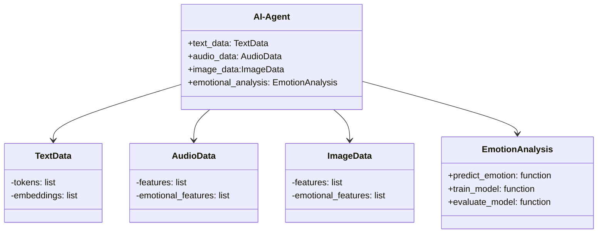

                 

# 开发具有多模态情感分析能力的AI Agent

> **关键词**: 多模态情感分析, AI Agent, 深度学习, 多模态数据, 情感计算, 系统架构设计

> **摘要**:  
> 本文旨在探讨如何开发具有多模态情感分析能力的AI Agent。通过结合文本、语音、图像等多种模态数据，AI Agent能够更准确地理解和分析用户情感。文章从多模态情感分析的背景、核心算法、系统架构设计到实际项目实现进行了详细阐述，并提供了丰富的技术细节和代码示例。

---

## 第1章: 多模态情感分析与AI Agent概述

### 1.1 AI Agent的基本概念

AI Agent（人工智能代理）是指能够感知环境、自主决策并执行任务的智能实体。AI Agent的核心特点包括：

- **自主性**: 能够独立决策，无需外部干预。
- **反应性**: 能够实时感知环境并做出响应。
- **目标导向**: 以特定目标为导向，执行任务。
- **学习能力**: 能够通过数据和经验进行自我优化。

AI Agent在情感分析领域的应用，要求其能够理解并处理多模态数据，从而更准确地捕捉用户情感。

### 1.2 多模态情感分析的背景与意义

#### 1.2.1 多模态数据的定义与分类

多模态数据是指结合了多种数据形式（如文本、语音、图像）的信息。常见的多模态数据类型包括：

- **文本数据**: 包括自然语言文本、对话记录等。
- **语音数据**: 包括语音信号、语调、语速等。
- **图像数据**: 包括面部表情、肢体语言等。

#### 1.2.2 情感分析的多模态挑战

传统的情感分析主要基于单一模态数据（如文本），但在实际应用中，单一模态数据往往不足以捕捉用户的真实情感。例如：

- **文本数据的局限性**: 文本无法反映用户的语气、情绪强度等。
- **语音数据的补充作用**: 通过语音数据可以捕捉到用户的语调、语速等情感线索。
- **图像数据的丰富性**: 图像数据（如面部表情）能够提供额外的情感信息。

#### 1.2.3 多模态情感分析的应用场景

- **智能客服**: 通过分析用户的文本、语音和面部表情，提供更精准的服务。
- **情感陪护机器人**: 通过多模态数据理解用户情感，提供个性化的陪伴服务。
- **社交媒体分析**: 结合文本、图片等数据，分析用户的整体情感倾向。

---

## 第2章: 多模态数据处理基础

### 2.1 多模态数据的获取与预处理

#### 2.1.1 文本数据的预处理

文本数据的预处理包括以下步骤：

1. **分词**: 将文本分割成词语或短语。
2. **去停用词**: 去除无意义的词汇（如“的”、“了”等）。
3. **词向量化**: 将词语转换为向量表示（如Word2Vec、TF-IDF等）。

#### 2.1.2 语音数据的预处理

语音数据的预处理包括：

1. **语音信号提取**: 从音频信号中提取特征（如梅尔频率倒谱系数MFCC）。
2. **降噪处理**: 去除背景噪声，提高语音质量。
3. **语音分割**: 将连续的语音信号分割成单词或句子。

#### 2.1.3 图像数据的预处理

图像数据的预处理包括：

1. **图像增强**: 通过旋转、缩放等操作增加数据多样性。
2. **特征提取**: 提取图像的低级特征（如边缘、纹理）或高级特征（如使用CNN提取的特征）。
3. **标准化处理**: 将图像尺寸标准化，方便模型输入。

### 2.2 多模态数据的融合方法

#### 2.2.1 数据融合的基本概念

数据融合是指将多种数据形式（如文本、语音、图像）结合在一起，以提高分析的准确性和全面性。常见的数据融合方法包括：

1. **特征级融合**: 在特征层面对多模态数据进行融合。
2. **决策级融合**: 在决策层面对多模态数据进行融合。
3. **模型级融合**: 在模型层面对多模态数据进行融合。

#### 2.2.2 基于特征的融合方法

基于特征的融合方法通过将多模态数据的特征向量进行线性组合，生成最终的融合特征。例如：

$$
f_{\text{fusion}} = w_1 f_{\text{text}} + w_2 f_{\text{audio}} + w_3 f_{\text{image}}
$$

其中，$w_1, w_2, w_3$ 是融合权重，$f_{\text{text}}, f_{\text{audio}}, f_{\text{image}}$ 是各模态的特征向量。

#### 2.2.3 基于模型的融合方法

基于模型的融合方法通过构建多模态模型，将不同模态的数据同时输入模型中，进行联合分析。例如，使用多任务学习框架，同时优化多个模态的特征提取和情感分类任务。

### 2.3 多模态数据处理的挑战

#### 2.3.1 数据异构性问题

多模态数据的异构性（即不同模态数据具有不同的特征维度和表示方式）可能导致数据难以直接融合。

#### 2.3.2 数据同步与对齐问题

在处理多模态数据时，需要确保不同模态数据的时间同步和空间对齐。例如，语音数据的时间维度与文本数据的时间维度需要对齐。

#### 2.3.3 数据隐私与安全问题

多模态数据的处理可能涉及敏感信息（如面部表情、语音特征等），需要考虑数据隐私和安全问题。

---

## 第3章: 情感分析算法原理

### 3.1 情感分析的传统方法

#### 3.1.1 基于特征工程的传统分类方法

传统的情感分类方法通常基于特征工程，例如：

1. **朴素贝叶斯分类器**: 基于特征的条件概率进行分类。
2. **支持向量机(SVM)**: 基于特征空间的线性分割。

#### 3.1.2 常见特征提取方法

- **Bag-of-Words (BoW)**: 基于词袋模型提取文本特征。
- **TF-IDF**: 基于词频-逆文档频率提取文本特征。
- **Word2Vec**: 通过词嵌入技术提取词向量。

#### 3.1.3 传统分类算法的优缺点

- **优点**: 实现简单，计算效率高。
- **缺点**: 特征工程依赖性强，难以捕捉语义信息。

### 3.2 基于深度学习的情感分析

#### 3.2.1 RNN与LSTM在情感分析中的应用

- **RNN**: 适用于处理序列数据，但存在梯度消失问题。
- **LSTM**: 通过门控机制解决梯度消失问题，适用于长序列数据。

#### 3.2.2 Transformer模型的原理与应用

- **Transformer**: 基于自注意力机制，能够捕捉长距离依赖关系。

#### 3.2.3 BERT等预训练模型的改进与应用

- **BERT**: 基于双向Transformer的预训练模型，适用于多种情感分析任务。

### 3.3 多模态情感分析的算法选择

#### 3.3.1 多模态情感分析的算法框架

- **模态融合**: 在特征层面对多模态数据进行融合，生成联合特征向量。
- **多任务学习**: 同时优化多个模态的特征提取和情感分类任务。

#### 3.3.2 基于模态融合的算法设计

- **模态权重分配**: 通过学习模态权重，动态调整各模态的贡献。
- **跨模态注意力机制**: 基于注意力机制，捕捉各模态之间的相互关系。

---

## 第4章: 多模态情感分析系统的架构设计

### 4.1 系统需求分析

#### 4.1.1 功能需求分析

- **数据输入**: 支持文本、语音、图像等多种数据形式的输入。
- **情感分析**: 对输入数据进行情感分类，输出情感标签（如正面、负面、中性）。
- **结果展示**: 以可视化方式展示分析结果。

#### 4.1.2 性能需求分析

- **处理速度**: 快速响应用户输入，支持实时分析。
- **准确性**: 情感分类的准确率需要达到较高的水平（如超过90%）。

### 4.2 系统功能设计

#### 4.2.1 领域模型设计

使用Mermaid绘制领域模型类图：

---

由于篇幅限制，以上为部分目录和内容示例。完整的文章将包含更多细节和具体实现，包括数学公式、系统架构图和代码示例。

