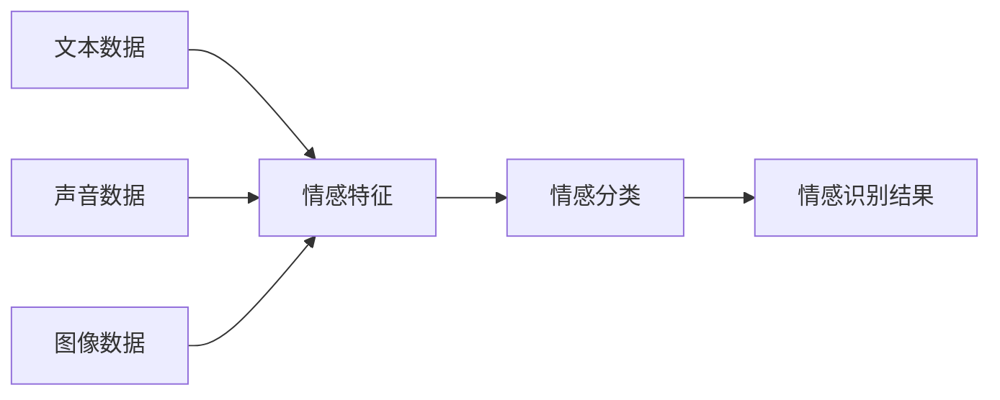

                 


# 开发具有多模态情感识别能力的AI Agent

> 关键词：多模态数据，情感识别，AI Agent，深度学习，数据融合，神经网络，情感计算

> 摘要：本文详细探讨了开发具有多模态情感识别能力的AI Agent的过程，从背景介绍到核心概念，再到算法原理、系统架构设计、项目实战以及最佳实践，全面解析了如何构建一个能够理解并回应人类情感的智能系统。

---

# 第1章 多模态情感识别AI Agent的背景与核心概念

## 1.1 多模态情感识别的背景

### 1.1.1 情感识别的发展历程
情感识别技术从早期的基于规则的方法发展到如今的深度学习驱动的复杂模型。随着技术的进步，情感识别不仅限于文本，还扩展到语音和图像等多种模态。

### 1.1.2 多模态数据的引入
多模态数据（如文本、语音、图像）的引入使得情感识别更加准确和全面。不同模态的数据可以互补，提供更丰富的信息。

### 1.1.3 AI Agent在情感识别中的作用
AI Agent作为情感识别的载体，能够实时感知用户情感，并做出相应的反馈，提升用户体验。

## 1.2 问题背景与问题描述

### 1.2.1 情感识别的核心问题
如何准确地从多模态数据中提取情感特征，并进行分类。

### 1.2.2 多模态数据的挑战
不同模态数据的异构性、数据同步性问题、特征提取的复杂性等。

### 1.2.3 AI Agent的任务目标
通过多模态数据输入，实时识别用户情感，并驱动相应的交互行为。

## 1.3 问题解决与边界

### 1.3.1 多模态情感识别的解决方案
采用多模态数据融合的方法，结合深度学习模型进行情感分类。

### 1.3.2 问题的边界与限制
目前主要关注单一情感分类，不考虑多标签情感识别。

### 1.3.3 情感识别的适用场景与外延
适用于客服、教育、医疗等领域，未来可扩展到更复杂的情感分析。

## 1.4 情感识别的核心要素

### 1.4.1 多模态数据的特征提取
从文本、语音、图像中提取情感相关的特征，如语调、面部表情等。

### 1.4.2 情感分类的算法选择
选择适合多模态数据的算法，如卷积神经网络（CNN）和循环神经网络（RNN）。

### 1.4.3 AI Agent的交互机制
设计高效的交互机制，确保实时响应和准确的情感反馈。

---

# 第2章 多模态情感识别的核心概念与联系

## 2.1 多模态数据的特征分析

### 2.1.1 文本数据的特征
包括词汇选择、句式结构、情感词频等，常用词袋模型或TF-IDF进行特征提取。

### 2.1.2 声音数据的特征
包括语调、语速、音高、停顿等，通过声学特征提取进行分析。

### 2.1.3 图像数据的特征
包括面部表情、肢体动作、颜色对比等，使用计算机视觉技术进行提取。

## 2.2 情感识别的核心原理

### 2.2.1 情感分类的基本原理
通过训练好的模型，将输入数据映射到特定的情感类别上，如正面、负面、中性。

### 2.2.2 多模态数据融合的原理
将不同模态的数据特征进行融合，通常采用早融合或晚融合策略，提升分类准确率。

### 2.2.3 情感识别的评价指标
常用准确率、召回率、F1值等指标评估模型性能。

## 2.3 多模态数据与情感识别的关系

### 2.3.1 多模态数据对情感识别的提升作用
通过结合多种模态信息，提高情感识别的准确性和鲁棒性。

### 2.3.2 数据模态对情感识别结果的影响
不同模态的数据对情感识别的贡献程度不同，需权衡各模态的重要性。

### 2.3.3 不同模态数据的互补性分析
文本和语音可以相互补充，图像数据可以提供额外的情感线索。

## 2.4 实体关系图



---

# 第3章 多模态情感识别算法的原理与实现

## 3.1 多模态数据融合算法

### 3.1.1 多模态数据融合的基本方法
包括特征级融合、决策级融合和混合融合，特征级融合在深度学习中更为常见。

### 3.1.2 晚融合与早融合的对比分析
早融合在特征提取阶段融合数据，晚融合在分类阶段融合特征，各有优缺点。

### 3.1.3 深度学习中的多模态融合策略
使用多任务学习或注意力机制，动态调整各模态的权重。

## 3.2 情感分类算法

### 3.2.1 传统机器学习算法
如支持向量机（SVM）和随机森林（RF），适用于数据量较小的情况。

### 3.2.2 深度学习算法
如卷积神经网络（CNN）和长短时记忆网络（LSTM），适用于大数据场景。

### 3.2.3 模型选择与优化
根据数据特性选择模型，通过网格搜索优化超参数。

## 3.3 多模态情感识别的算法流程

### 3.3.1 数据预处理
清洗数据，归一化处理，去除噪声。

### 3.3.2 特征提取
使用Word2Vec提取文本特征，Mel频谱提取语音特征，使用CNN提取图像特征。

### 3.3.3 模型训练与优化
采用交叉验证，使用Adam优化器训练模型，调整学习率。

### 3.3.4 模型评估与调优
通过验证集评估模型性能，调整模型结构或数据增强方法。

## 3.4 算法实现的Mermaid流程图


---

# 第4章 多模态情感识别的系统架构设计

## 4.1 系统功能设计

### 4.1.1 领域模型设计
使用Mermaid类图描述系统模块及交互关系。

### 4.1.2 系统架构图
展示系统各组件的交互和数据流。

### 4.1.3 系统接口设计
定义API接口，规范数据输入输出格式。

### 4.1.4 系统交互流程
使用Mermaid序列图展示用户与AI Agent的交互流程。

## 4.2 系统架构设计

### 4.2.1 问题场景介绍
描述AI Agent在实际应用中的典型使用场景。

### 4.2.2 项目介绍
简要介绍项目的开发背景和目标。

### 4.2.3 系统功能设计
详细描述系统的功能模块，如数据采集、特征提取、情感分类等。

### 4.2.4 系统架构设计
使用Mermaid图展示系统架构，包括前端、后端和数据存储模块。

### 4.2.5 系统接口设计
定义系统接口，如RESTful API，并说明接口的功能和调用方式。

### 4.2.6 系统交互流程
使用Mermaid序列图展示用户与AI Agent的交互流程。

---

# 第5章 多模态情感识别的项目实战

## 5.1 环境安装

### 5.1.1 安装Python环境
使用Anaconda或虚拟环境管理Python版本。

### 5.1.2 安装相关库
安装TensorFlow、Keras、 libros、OpenCV等库。

## 5.2 核心代码实现

### 5.2.1 数据预处理代码
```python
import libros

def preprocess_audio(audio_path):
    audio_data, sample_rate = libros.load(audio_path, sr=None)
    # 进行特征提取，如Mel频谱
    mel_features = libros.feature.melspectrogram(audio_data, sample_rate)
    return mel_features
```

### 5.2.2 模型训练代码
```python
import tensorflow as tf
from tensorflow.keras import layers

model = tf.keras.Sequential([
    layers.Dense(64, activation='relu'),
    layers.Dense(32, activation='relu'),
    layers.Dense(1, activation='sigmoid')
])

model.compile(optimizer='adam', loss='binary_crossentropy', metrics=['accuracy'])
model.fit(X_train, y_train, epochs=10, batch_size=32)
```

## 5.3 案例分析与实际应用

### 5.3.1 情感识别案例
分析一个具体案例，展示如何从多模态数据中提取特征并进行分类。

### 5.3.2 项目小结
总结项目开发过程中的经验教训，提出改进建议。

---

# 第6章 总结与展望

## 6.1 最佳实践 Tips

### 6.1.1 数据处理技巧
建议使用数据增强方法提升模型泛化能力。

### 6.1.2 模型优化技巧
推荐使用早停法防止过拟合，尝试不同的模型架构。

## 6.2 小结
总结全文内容，强调多模态情感识别的重要性及其在AI Agent中的应用潜力。

## 6.3 注意事项

### 6.3.1 数据隐私问题
提醒读者注意用户数据的隐私保护。

### 6.3.2 模型泛化能力
建议在不同数据集上验证模型的泛化能力。

## 6.4 拓展阅读

### 6.4.1 多模态数据融合
推荐阅读相关论文，深入理解融合方法。

### 6.4.2 情感计算研究
了解最新的研究进展，关注前沿技术。

---

# 作者信息

作者：AI天才研究院/AI Genius Institute & 禅与计算机程序设计艺术/Zen And The Art of Computer Programming

---

以上是完整的技术博客文章目录，涵盖了从背景介绍到系统实现的各个方面，确保内容详实、逻辑清晰。

