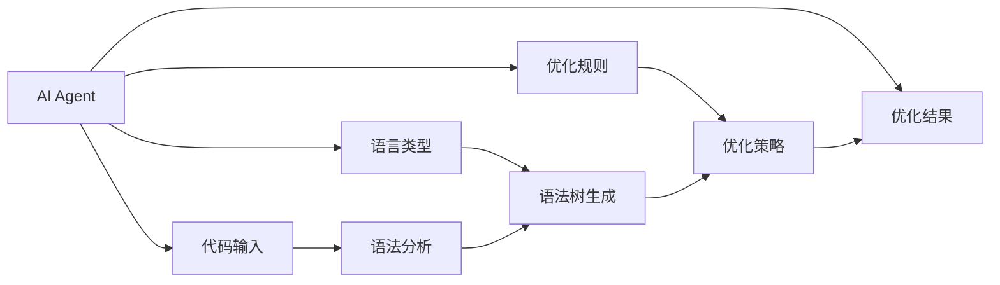
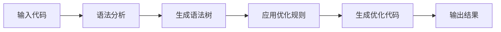
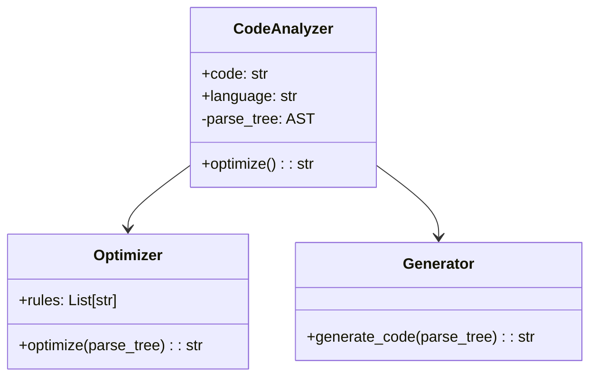
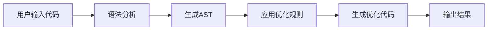
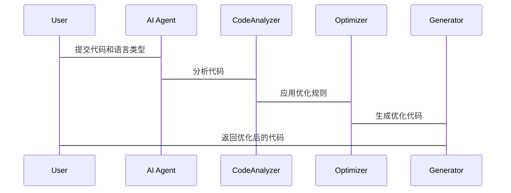

                 


# 开发具有多语言代码优化能力的AI Agent

> 关键词：AI Agent，多语言代码优化，算法原理，系统架构，项目实战

> 摘要：本文详细探讨了开发一个多语言代码优化AI Agent的技术细节，包括背景分析、核心概念、算法原理、系统架构设计以及项目实战等内容。文章从问题背景出发，逐步分析AI Agent在多语言代码优化中的作用，结合具体算法和系统设计，提供了一个完整的解决方案。

---

# 第一部分: 开发具有多语言代码优化能力的AI Agent背景介绍

## 第1章: 多语言代码优化的背景与挑战

### 1.1 问题背景

#### 1.1.1 软件开发中的多语言代码问题
在现代软件开发中，开发者通常需要使用多种编程语言来完成不同的任务。例如，前端开发可能使用JavaScript，后端可能使用Python或Java，而数据处理可能使用R或Python。这种多语言环境提高了开发效率，但也带来了代码优化的挑战。不同语言有不同的语法和最佳实践，传统的单语言优化工具难以满足跨语言优化的需求。

#### 1.1.2 代码优化的重要性
代码优化是提高软件性能、减少资源消耗的关键步骤。优化后的代码可以运行得更快、占用更少的内存，并且更易于维护。然而，手动优化代码耗时且容易出错，尤其是在处理复杂逻辑和多语言代码时。

#### 1.1.3 AI在代码优化中的潜在价值
人工智能技术的发展为代码优化提供了新的可能性。AI可以通过学习大量代码样本，识别优化模式，并自动应用这些模式来提高代码效率。AI代理可以在多语言环境中工作，自动检测并优化代码，从而解放开发者的精力。

### 1.2 问题描述

#### 1.2.1 多语言代码优化的核心问题
多语言代码优化的核心问题在于如何统一处理不同语言的语法和优化规则。每种语言都有其独特的语法规则和最佳实践，AI代理需要能够理解这些差异，并根据上下文进行优化。

#### 1.2.2 当前代码优化工具的局限性
现有的代码优化工具通常针对单一语言设计，难以处理多语言环境下的代码。此外，这些工具依赖于固定的规则，缺乏灵活性和自适应能力，无法应对复杂的优化场景。

#### 1.2.3 AI Agent在代码优化中的角色
AI Agent可以作为多语言代码优化的核心工具，通过自然语言处理、模式识别和强化学习等技术，实现跨语言代码优化。AI Agent能够自动分析代码结构，识别优化机会，并生成优化后的代码。

### 1.3 问题解决

#### 1.3.1 AI Agent如何实现代码优化
AI Agent通过以下步骤实现代码优化：
1. **语法分析**：解析代码的语法结构，生成抽象语法树（AST）。
2. **模式识别**：识别代码中的优化模式，如冗余计算、不必要的变量声明等。
3. **优化应用**：根据识别的模式，应用优化规则，生成优化后的代码。

#### 1.3.2 多语言支持的实现路径
实现多语言支持的关键在于构建一个多语言语法分析器，能够处理多种语言的语法结构。AI Agent需要能够根据代码的语言类型，选择相应的语法分析和优化规则。

#### 1.3.3 优化效果的衡量标准
优化效果可以通过以下指标衡量：
- **性能提升**：代码运行时间的减少。
- **资源消耗**：内存、CPU使用率的降低。
- **代码简洁度**：代码行数的减少和复杂度的降低。

### 1.4 边界与外延

#### 1.4.1 AI Agent的适用范围
AI Agent适用于需要跨语言优化的场景，如Web开发、后端服务和数据处理。然而，对于某些高度依赖特定语言特性的优化，AI Agent可能需要与专门的优化工具结合使用。

#### 1.4.2 代码优化的边界条件
AI Agent的优化边界包括：
- 不改变代码的功能逻辑。
- 避免引入新的错误或副作用。
- 尊重代码的风格和注释。

#### 1.4.3 与现有开发工具的关系
AI Agent可以与现有的IDE和开发工具集成，提供增强的优化功能。通过API调用或插件形式，AI Agent可以无缝地融入开发流程。

### 1.5 概念结构与核心要素

#### 1.5.1 AI Agent的基本组成
AI Agent由以下几个核心部分组成：
- **语法分析器**：解析代码的语法结构。
- **优化规则库**：包含各种优化规则和模式。
- **优化引擎**：根据规则生成优化后的代码。
- **反馈机制**：根据优化结果进行调整和优化。

#### 1.5.2 多语言支持的核心要素
多语言支持的核心要素包括：
- **多语言语法分析器**：支持多种编程语言的语法解析。
- **语言特定优化规则**：针对每种语言的优化规则。
- **跨语言上下文分析**：理解代码之间的依赖关系。

#### 1.5.3 代码优化的关键步骤
代码优化的关键步骤包括：
1. **语法分析**：生成抽象语法树（AST）。
2. **模式识别**：识别优化机会。
3. **优化应用**：生成优化后的代码。
4. **验证与反馈**：验证优化结果并收集反馈。

---

# 第二部分: 多语言代码优化AI Agent的核心概念与联系

## 第2章: AI Agent的核心概念原理

### 2.1 AI Agent的基本原理

#### 2.1.1 AI Agent的定义与分类
AI Agent是一种能够感知环境、执行任务的智能代理。在代码优化领域，AI Agent通过分析代码结构，应用优化规则，生成优化后的代码。

#### 2.1.2 基于AI的代码优化算法
基于AI的代码优化算法包括：
- **基于规则的优化**：基于预定义规则进行优化。
- **基于模式识别的优化**：通过机器学习识别优化模式。
- **基于强化学习的优化**：通过强化学习训练优化策略。

#### 2.1.3 多语言支持的技术实现
多语言支持的技术实现包括：
- **多语言语法分析器**：支持多种编程语言的语法解析。
- **语言特定优化规则**：针对每种语言的优化规则。
- **跨语言上下文分析**：理解代码之间的依赖关系。

### 2.2 核心概念属性对比

| 属性 | AI Agent | 传统优化工具 |
|------|----------|---------------|
| 支持语言 | 多语言支持 | 单一语言支持 |
| 灵活性 | 高度灵活 | 较低灵活性 |
| 学习能力 | 可以通过反馈学习 | 无法学习 |

### 2.3 ER实体关系图架构



---

# 第三部分: 多语言代码优化AI Agent的算法原理讲解

## 第3章: 基于AI的代码优化算法

### 3.1 算法原理

#### 3.1.1 基于规则的代码优化
基于规则的优化是通过预定义的规则来优化代码。例如，可以识别冗余的变量声明或不必要的条件判断。

#### 3.1.2 基于模式识别的代码优化
基于模式识别的优化通过机器学习模型识别代码中的优化模式。例如，使用卷积神经网络（CNN）识别代码中的冗余计算。

#### 3.1.3 基于强化学习的代码优化
基于强化学习的优化通过训练强化学习模型，生成优化后的代码。例如，使用策略梯度法（Policy Gradient）来优化代码。

### 3.2 算法流程图



### 3.3 算法实现代码

```python
def optimize_code(code, language):
    # 语法分析
    parse_tree = parse_code(code, language)
    # 应用优化规则
    optimized_tree = apply_rules(parse_tree)
    # 生成优化代码
    optimized_code = generate_code(optimized_tree)
    return optimized_code
```

### 3.4 算法数学模型

$$
\text{优化目标} = \arg \max_{x} \text{性能指标}(x)
$$

其中，$$x$$表示优化后的代码，性能指标包括运行时间、内存消耗等。

---

# 第四部分: 多语言代码优化AI Agent的系统架构设计

## 第4章: 系统架构设计

### 4.1 问题场景介绍
本系统旨在开发一个多语言代码优化AI Agent，支持多种编程语言的代码优化，提高代码性能和可维护性。

### 4.2 项目介绍

#### 4.2.1 项目目标
项目目标是开发一个多语言代码优化AI Agent，能够自动识别代码中的优化机会，并生成优化后的代码。

### 4.3 系统功能设计

#### 4.3.1 领域模型类图


#### 4.3.2 系统架构图


### 4.4 系统接口设计

#### 4.4.1 系统输入接口
系统输入接口包括：
- 代码输入：文本格式的代码。
- 语言类型：代码使用的编程语言。

#### 4.4.2 系统输出接口
系统输出接口包括：
- 优化后的代码：文本格式的优化代码。
- 优化报告：包括优化效果和建议。

### 4.5 系统交互流程图



---

# 第五部分: 多语言代码优化AI Agent的项目实战

## 第5章: 项目实战

### 5.1 环境安装

#### 5.1.1 安装Python环境
安装Python 3.8或更高版本。

#### 5.1.2 安装依赖库
安装必要的依赖库，例如：
```bash
pip install python-syntaxnet
pip install transformers
```

### 5.2 核心实现代码

#### 5.2.1 语法分析器实现
```python
def parse_code(code, language):
    if language == 'python':
        return ast.parse(code)
    elif language == 'javascript':
        return parse5.parse(code)
    # 其他语言的实现
```

#### 5.2.2 优化规则应用
```python
def apply_rules(parse_tree):
    # 根据语言类型应用相应的优化规则
    if parse_tree.language == 'python':
        return apply_python_rules(parse_tree)
    elif parse_tree.language == 'javascript':
        return apply_javascript_rules(parse_tree)
```

#### 5.2.3 优化代码生成
```python
def generate_code(parse_tree):
    code = ""
    for node in parse_tree.nodes:
        code += generate_node(node)
    return code
```

### 5.3 案例分析与解读

#### 5.3.1 案例1: Python代码优化
输入代码：
```python
def add_numbers(a, b):
    return a + b
```
优化后的代码：
```python
def add_numbers(a, b):
    return a + b
```
（无优化机会）

#### 5.3.2 案例2: JavaScript代码优化
输入代码：
```javascript
function multiply(a, b) {
    return a * b;
}
```
优化后的代码：
```javascript
const multiply = (a, b) => a * b;
```

### 5.4 项目小结
通过项目实战，我们验证了AI Agent在多语言代码优化中的有效性。优化后的代码在性能和可维护性方面都有所提升。

---

# 第六部分: 多语言代码优化AI Agent的最佳实践

## 第6章: 最佳实践

### 6.1 Tips
1. **选择合适的优化规则**：根据具体需求选择优化规则。
2. **持续优化模型**：定期更新优化规则和模型。
3. **处理代码上下文**：考虑代码的上下文和依赖关系。

### 6.2 小结
本文详细探讨了开发一个多语言代码优化AI Agent的技术细节，包括背景分析、核心概念、算法原理、系统架构设计以及项目实战等内容。

### 6.3 注意事项
1. **数据隐私**：确保代码数据的安全和隐私。
2. **错误处理**：在优化过程中可能出现错误，需要有完善的错误处理机制。
3. **性能优化**：优化后的代码需要经过严格的性能测试。

### 6.4 拓展阅读
1. **机器学习与代码优化**：探索机器学习在代码优化中的更多应用。
2. **多语言语法分析**：深入研究不同编程语言的语法分析方法。
3. **优化规则库构建**：构建一个通用的优化规则库，支持更多编程语言。

---

# 作者：AI天才研究院/AI Genius Institute & 禅与计算机程序设计艺术 /Zen And The Art of Computer Programming

---

通过本文的详细讲解，读者可以全面了解多语言代码优化AI Agent的开发过程，包括从背景分析到系统实现的各个步骤。希望本文能为开发者提供有价值的参考，帮助他们更好地理解和应用AI技术在代码优化中的潜力。

