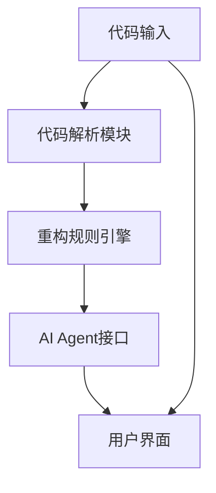
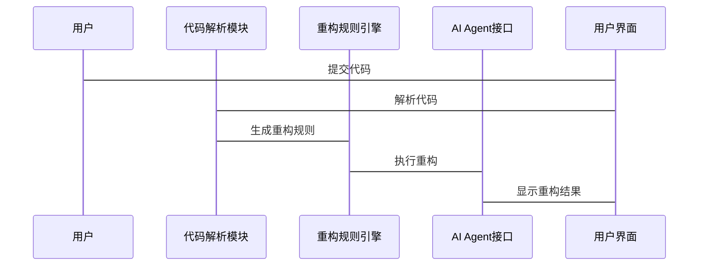

                 


# 开发具有多语言代码重构能力的AI Agent

## 关键词
- 多语言代码重构
- AI Agent
- 代码重构
- 人工智能
- 自然语言处理
- 机器学习

## 摘要
本文探讨了开发具有多语言代码重构能力的AI Agent的技术挑战和实现方法。首先介绍了代码重构和AI Agent的基本概念，分析了多语言代码重构的需求和AI Agent在其中的作用。接着，深入讲解了AI Agent的核心算法，包括基于规则和基于机器学习的重构方法。然后，通过系统架构设计和项目实战，展示了如何构建一个高效的多语言代码重构AI Agent。最后，提供了最佳实践和未来研究方向的建议。

---

# 《开发具有多语言代码重构能力的AI Agent》正文

## 第一部分: 多语言代码重构与AI Agent背景介绍

### 第1章: 多语言代码重构与AI Agent概述

#### 1.1 多语言代码重构的核心概念

##### 1.1.1 代码重构的定义与重要性
代码重构是指通过改变代码的结构和形式，而不改变其功能的行为。代码重构可以提高代码的可读性、可维护性和可扩展性。在软件开发中，代码重构是保持代码质量的重要手段。

##### 1.1.2 多语言代码重构的挑战
随着软件开发中多语言项目的增多，代码重构需要支持多种编程语言，增加了复杂性。不同语言的语法、语义和结构差异使得跨语言代码重构更具挑战性。

##### 1.1.3 AI在代码重构中的作用
AI技术可以帮助识别代码模式，自动生成重构规则，并提供重构建议。AI在代码重构中的应用可以提高重构效率，减少人工错误。

#### 1.2 AI Agent的基本概念

##### 1.2.1 AI Agent的定义
AI Agent是一种智能代理，能够感知环境、做出决策并执行任务。AI Agent可以是软件或硬件形式，广泛应用于自动驾驶、智能助手等领域。

##### 1.2.2 AI Agent的类型与特点
AI Agent可以分为简单反射型、基于模型的反应型、目标驱动型和效用驱动型。AI Agent的特点包括自主性、反应性、目标导向和学习能力。

##### 1.2.3 AI Agent在软件开发中的应用
AI Agent可以用于代码生成、错误检测、自动修复和代码重构等领域，提升软件开发效率和代码质量。

#### 1.3 多语言代码重构AI Agent的必要性

##### 1.3.1 跨语言代码重构的需求
随着全球化和多语言项目的增多，代码重构需要支持多种编程语言，满足不同项目的需求。

##### 1.3.2 AI Agent在代码重构中的优势
AI Agent能够处理复杂多变的代码结构，适应多种编程语言，提供高效的代码重构服务。

##### 1.3.3 当前技术的局限性与解决方案
传统代码重构工具难以应对多语言环境下的复杂问题，AI Agent通过结合自然语言处理和机器学习技术，提供了更强大的重构能力。

---

## 第二部分: 多语言代码重构AI Agent的核心概念与联系

### 第2章: 多语言代码重构与AI Agent的关系

#### 2.1 多语言代码重构的原理

##### 2.1.1 代码结构分析
代码结构分析是代码重构的基础，包括语法分析、语义分析和结构化分析。语法分析处理编程语言的语法结构，语义分析理解代码的功能和意图，结构化分析识别代码的逻辑结构。

##### 2.1.2 重构规则的提取
重构规则是代码重构的核心，基于代码结构分析提取重构规则，包括命名规则、格式规则、逻辑规则和性能规则。

##### 2.1.3 跨语言语法转换
跨语言语法转换是多语言代码重构的关键，涉及语法转换规则的设计和实现，确保代码在不同语言之间的正确转换。

#### 2.2 AI Agent在代码重构中的应用

##### 2.2.1 自然语言处理在代码理解中的应用
自然语言处理技术用于代码注释和文档的理解，帮助AI Agent识别代码的功能和意图。

##### 2.2.2 机器学习在代码重构规则中的应用
机器学习算法用于重构规则的自动生成和优化，提高代码重构的准确性和效率。

##### 2.2.3 智能决策在代码重构中的应用
AI Agent通过智能决策选择最优的重构方案，平衡代码质量和重构风险。

#### 2.3 核心概念对比分析

##### 2.3.1 多语言代码重构与单语言代码重构的对比
多语言代码重构需要处理多种语言的语法和语义差异，增加了复杂性。单语言代码重构仅处理单一语言的代码，相对简单。

##### 2.3.2 AI Agent与传统代码重构工具的对比
AI Agent具有更强的适应性和智能性，能够处理复杂多变的代码结构。传统代码重构工具功能相对固定，难以应对多语言环境下的复杂问题。

---

## 第三部分: 多语言代码重构AI Agent的算法原理

### 第3章: 基于规则的代码重构算法

#### 3.1 基于规则的重构算法

##### 3.1.1 规则提取与匹配
规则提取是基于规则的重构算法的核心，通过分析代码结构提取重构规则。规则匹配是将代码与重构规则匹配，识别需要重构的部分。

##### 3.1.2 基于规则的重构实现
基于规则的重构算法通过模式匹配和规则应用实现代码重构。模式匹配用于识别代码中的特定结构，规则应用用于将识别的结构转换为目标形式。

##### 3.1.3 规则库的管理和优化
规则库的管理和优化是基于规则的重构算法的重要部分，包括规则的存储、维护和优化。

#### 3.2 基于机器学习的代码重构算法

##### 3.2.1 代码表示与特征提取
代码表示是基于机器学习的重构算法的基础，特征提取是将代码转换为可学习的特征表示。

##### 3.2.2 基于深度学习的重构模型
基于深度学习的重构模型通过神经网络学习代码重构规则，实现代码重构的自动化。

##### 3.2.3 基于强化学习的重构策略
基于强化学习的重构策略通过奖励机制优化重构策略，提高重构的准确性和效果。

---

## 第四部分: 多语言代码重构AI Agent的系统分析与架构设计

### 第4章: 多语言代码重构AI Agent的系统架构

#### 4.1 问题场景介绍
多语言代码重构AI Agent的目标是实现跨语言代码重构，提高代码质量和开发效率。

#### 4.2 系统功能设计

##### 4.2.1 领域模型设计
领域模型描述了多语言代码重构AI Agent的核心概念和关系，包括代码结构、重构规则、AI Agent功能和用户交互。

##### 4.2.2 系统架构设计
系统架构设计展示了多语言代码重构AI Agent的主要组件及其交互关系，包括代码解析模块、重构规则引擎、AI Agent接口和用户界面。

#### 4.3 系统架构图


#### 4.4 系统接口设计
系统接口设计定义了多语言代码重构AI Agent与其他系统的交互接口，包括代码解析接口、重构规则接口和用户交互接口。

#### 4.5 系统交互流程图


---

## 第五部分: 多语言代码重构AI Agent的项目实战

### 第5章: 多语言代码重构AI Agent的实现

#### 5.1 环境安装与配置
需要安装Python、TensorFlow、Keras、Mermaid工具和相关开发库。

#### 5.2 系统核心功能实现

##### 5.2.1 代码解析模块
代码解析模块负责解析多种编程语言的代码，提取代码结构和语法信息。

##### 5.2.2 重构规则引擎
重构规则引擎基于规则和机器学习算法生成重构规则，实现代码重构。

##### 5.2.3 AI Agent接口
AI Agent接口负责与用户交互，接收重构请求，执行重构操作，并返回结果。

#### 5.3 代码实现与解读

##### 5.3.1 代码解析模块实现
```python
def parse_code(code, language):
    # 根据编程语言解析代码
    if language == 'python':
        # 解析Python代码
        pass
    elif language == 'java':
        # 解析Java代码
        pass
    # 其他语言的解析逻辑
```

##### 5.3.2 重构规则引擎实现
```python
def generate_rules(code, language):
    # 基于规则和机器学习生成重构规则
    pass
```

##### 5.3.3 AI Agent接口实现
```python
def agent_interface():
    # AI Agent接口实现
    pass
```

#### 5.4 案例分析与详细解读
通过具体案例展示多语言代码重构AI Agent的实际应用，分析重构过程和结果。

#### 5.5 项目小结
总结项目实现的经验和教训，提出改进建议和未来研究方向。

---

## 第六部分: 多语言代码重构AI Agent的最佳实践与总结

### 第6章: 最佳实践与总结

#### 6.1 数据质量的重要性
高质量的数据是AI Agent性能的基础，数据清洗和特征工程是关键步骤。

#### 6.2 模型调优的技巧
通过交叉验证、网格搜索等方法优化模型参数，提高重构准确率。

#### 6.3 未来的研究方向
包括多语言语法的深度学习、跨语言代码理解的强化学习和代码重构的自动化决策。

---

## 作者

作者：AI天才研究院/AI Genius Institute & 禅与计算机程序设计艺术 /Zen And The Art of Computer Programming

---

以上是《开发具有多语言代码重构能力的AI Agent》的技术博客的目录和部分正文内容。如需进一步扩展或修改，请随时告知！

