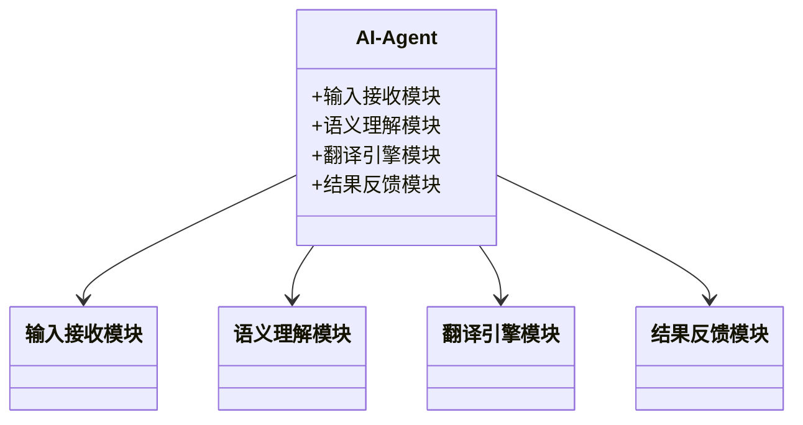
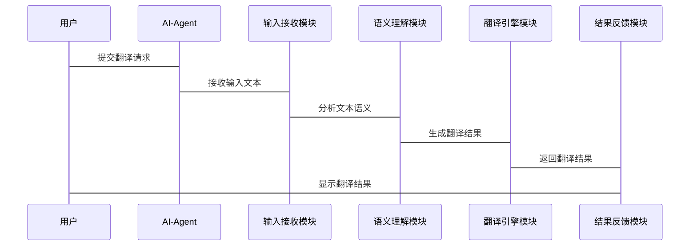

                 


# 开发具有多语言翻译能力的AI Agent

## 关键词：AI Agent，多语言翻译，自然语言处理，深度学习，机器学习

## 摘要：本文详细探讨了开发具有多语言翻译能力的AI Agent的技术背景、核心算法、系统架构及实现方案。通过分析多语言翻译的挑战，结合AI Agent的特性，本文提出了基于Transformer模型和注意力机制的解决方案，并通过实际项目案例展示了如何实现一个高效的多语言翻译AI Agent。文章最后总结了开发中的注意事项及未来研究方向。

---

## 第一部分: 多语言翻译AI Agent开发背景与基础

### 第1章: 多语言翻译AI Agent概述

#### 1.1 多语言翻译的挑战与需求

##### 1.1.1 多语言翻译的必要性
在国际化业务中，多语言翻译是企业与全球用户沟通的关键桥梁。传统翻译工具存在效率低、准确率不足的问题，AI Agent通过自动化学习和推理，能够显著提升翻译质量。

##### 1.1.2 当前翻译技术的局限性
现有翻译工具主要依赖预设规则或单一语言模型，难以处理复杂语境和多语言间的语义差异。此外，实时交互性和上下文理解能力较弱，限制了用户体验。

##### 1.1.3 AI Agent在多语言翻译中的优势
AI Agent能够实时学习用户偏好，动态调整翻译策略，并通过上下文理解提供更精准的翻译结果。其自主学习和推理能力使其在复杂场景中表现更优。

#### 1.2 AI Agent的基本概念

##### 1.2.1 AI Agent的定义
AI Agent是一种智能实体，能够感知环境、理解需求、自主决策并执行任务。在多语言翻译场景中，AI Agent负责接收输入、分析语义、生成翻译结果。

##### 1.2.2 AI Agent的核心特征
- **自主性**：无需人工干预，自动执行翻译任务。
- **反应性**：实时响应用户输入，调整翻译策略。
- **学习能力**：通过机器学习不断优化翻译质量。

##### 1.2.3 多语言翻译AI Agent的功能模块
- **输入接收模块**：获取用户输入文本。
- **语义理解模块**：分析文本语义和上下文。
- **翻译引擎模块**：调用多语言翻译模型生成翻译结果。
- **结果反馈模块**：将翻译结果返回给用户。

### 第2章: 多语言翻译与AI Agent的核心概念

#### 2.1 多语言翻译的原理

##### 2.1.1 自然语言处理基础
自然语言处理（NLP）是实现多语言翻译的核心技术。通过词法分析、句法分析和语义分析，AI Agent能够理解输入文本的含义。

##### 2.1.2 翻译模型的分类
- **基于规则的翻译模型**：依赖预定义的翻译规则，适用于简单场景。
- **统计机器翻译模型**：基于大规模平行文本训练。
- **神经机器翻译模型**：基于深度学习，效果更优。

##### 2.1.3 多语言翻译的挑战
- **语义差异**：不同语言间的语义表达存在差异。
- **上下文理解**：需要处理复杂语境和隐含意义。
- **实时性要求**：需要快速响应用户请求。

#### 2.2 AI Agent的体系结构

##### 2.2.1 AI Agent的组成模块
- **感知模块**：接收用户输入并解析需求。
- **推理模块**：分析需求并生成翻译请求。
- **执行模块**：调用翻译模型生成结果。
- **反馈模块**：将结果返回给用户并收集反馈。

##### 2.2.2 多语言翻译模块的设计
- **输入处理**：识别输入语言并选择相应的翻译模型。
- **翻译引擎**：调用预训练的多语言翻译模型。
- **结果优化**：根据用户反馈优化翻译质量。

##### 2.2.3 用户交互模块的实现
- **输入接口**：支持多种输入方式，如文本、语音。
- **输出接口**：支持多种输出方式，如文本、语音。

#### 2.3 多语言翻译与AI Agent的关联

##### 2.3.1 翻译需求的识别
AI Agent通过自然语言理解技术识别用户的翻译需求，包括语言选择和上下文分析。

##### 2.3.2 翻译结果的反馈机制
翻译结果生成后，AI Agent会根据用户反馈调整翻译策略，优化翻译质量。

##### 2.3.3 多语言上下文的理解与生成
AI Agent能够理解多语言上下文，并生成符合目标语言习惯的翻译结果。

---

## 第二部分: 多语言翻译AI Agent的核心算法与数学模型

### 第3章: 多语言翻译的核心算法

#### 3.1 翻译模型的算法原理

##### 3.1.1 Transformer模型的工作原理
Transformer模型通过自注意力机制和前馈网络实现高效的序列转换。其核心思想是通过全局上下文信息生成翻译结果。

##### 3.1.2 注意力机制的实现
注意力机制通过计算输入序列中每个词的重要性，生成加权后的词向量，提升翻译的准确率。

##### 3.1.3 多语言模型的训练策略
多语言模型通过联合训练多种语言的数据，共享语言间的特征，提升跨语言翻译的效果。

#### 3.2 多语言翻译的损失函数

##### 3.2.1 交叉熵损失函数
交叉熵损失函数用于衡量翻译结果与真实结果的差异，公式如下：
$$ \text{loss} = -\sum_{i=1}^{n} y_{i} \log(p(y_{i})) $$

##### 3.2.2 多任务学习的损失函数
多任务学习通过将翻译任务与其他任务（如文本分类）结合，共享特征，提升模型的泛化能力。

##### 3.2.3 惩罚项的设计与应用
惩罚项用于防止过拟合，常用的有L1和L2正则化：
$$ \text{loss} = \text{cross\_entropy} + \lambda \cdot \text{regularization} $$

### 第4章: AI Agent的自然语言理解与生成

#### 4.1 自然语言理解的算法

##### 4.1.1 分词算法
分词算法将连续文本分割成词语或短语，常用的有基于规则和统计的分词方法。

##### 4.1.2 语法分析
语法分析通过句法树分析文本结构，帮助理解句子的语法关系。

##### 4.1.3 上下文表示
上下文表示通过词向量（如Word2Vec）或句向量（如BERT）表示文本含义。

#### 4.2 自然语言生成的算法

##### 4.2.1 编解码模型
编解码模型通过编码器将输入序列编码为向量，解码器将向量解码为输出序列。

##### 4.2.2 生成式模型
生成式模型通过生成对抗网络（GAN）或变分自编码器（VAE）生成文本。

##### 4.2.3 基于规则的生成策略
基于规则的生成策略通过预定义的语法规则生成文本，适用于特定场景。

### 第5章: 多语言翻译的数学模型

#### 5.1 翻译模型的数学表达

##### 5.1.1 Transformer模型的数学公式
Transformer模型的自注意力机制公式如下：
$$ \text{Attention}(Q, K, V) = \text{softmax}\left(\frac{QK^T}{\sqrt{d_k}}\right)V $$

##### 5.1.2 段落编码
段落编码通过全局注意力机制捕捉长文本的上下文信息。

##### 5.1.3 跨语言对齐
跨语言对齐通过语言嵌入实现，公式如下：
$$ E_{lang} = \text{嵌入矩阵}[lang\_id] $$

---

## 第三部分: 系统分析与架构设计方案

### 第6章: 系统分析与架构设计

#### 6.1 问题场景介绍

##### 6.1.1 用户需求
用户需要一个能够实时进行多语言翻译的AI Agent，支持多种语言和复杂语境的翻译。

##### 6.1.2 功能需求
- 实时翻译
- 上下文理解
- 用户反馈优化

##### 6.1.3 约束条件
- 翻译准确性
- 实时响应
- 跨语言理解

#### 6.2 项目介绍

##### 6.2.1 项目目标
开发一个多语言翻译AI Agent，支持多种语言的实时翻译和上下文理解。

##### 6.2.2 项目范围
涵盖需求分析、算法设计、系统实现和测试优化。

##### 6.2.3 项目计划
分阶段完成需求分析、算法实现、系统集成和测试优化。

#### 6.3 系统功能设计

##### 6.3.1 功能模块
- 输入接收模块
- 语义理解模块
- 翻译引擎模块
- 结果反馈模块

##### 6.3.2 功能流程
用户输入文本 -> 输入接收模块 -> 语义理解模块 -> 翻译引擎模块 -> 结果反馈模块。

##### 6.3.3 领域模型类图


#### 6.4 系统架构设计

##### 6.4.1 系统架构图
```mermaid
架构图
```

##### 6.4.2 系统接口设计
- 输入接口：文本输入、语音输入
- 输出接口：文本输出、语音输出

##### 6.4.3 系统交互流程


---

## 第四部分: 项目实战

### 第7章: 项目实战

#### 7.1 环境安装

##### 7.1.1 安装Python
安装Python 3.8或更高版本。

##### 7.1.2 安装依赖
安装必要的Python库，如TensorFlow、Keras、NLTK。

##### 7.1.3 安装翻译模型
安装预训练的多语言翻译模型，如_mBART。

#### 7.2 系统核心实现源代码

##### 7.2.1 输入接收模块
```python
def receive_input():
    while True:
        input_text = input("请输入需要翻译的文本：")
        source_lang = detect_language(input_text)
        return input_text, source_lang
```

##### 7.2.2 语义理解模块
```python
def semantic_analysis(input_text, source_lang):
    # 使用预训练的NLP模型进行语义分析
    model = load_model(source_lang)
    return model.predict(input_text)
```

##### 7.2.3 翻译引擎模块
```python
def translate(text, source_lang, target_lang):
    model = load_translation_model(source_lang, target_lang)
    return model.translate(text)
```

##### 7.2.4 结果反馈模块
```python
def feedback_result(translated_text):
    print(f"翻译结果：{translated_text}")
```

#### 7.3 代码解读与分析

##### 7.3.1 输入接收模块
该模块负责接收用户输入的文本，并识别源语言。

##### 7.3.2 语义理解模块
该模块使用预训练的NLP模型分析输入文本的语义，生成翻译请求。

##### 7.3.3 翻译引擎模块
该模块调用多语言翻译模型，生成目标语言的翻译结果。

##### 7.3.4 结果反馈模块
该模块将翻译结果返回给用户，并收集用户反馈。

#### 7.4 实际案例分析

##### 7.4.1 案例背景
用户需要将中文文本“你好，今天天气怎么样？”翻译成英文。

##### 7.4.2 翻译过程
1. 输入接收模块接收输入文本和源语言。
2. 语义理解模块分析文本语义。
3. 翻译引擎模块调用翻译模型生成翻译结果。
4. 结果反馈模块返回翻译结果：“Hello, How's the weather today?”

##### 7.4.3 代码实现
```python
input_text, source_lang = receive_input()
semantic_analysis_result = semantic_analysis(input_text, source_lang)
translated_text = translate(input_text, source_lang, target_lang)
feedback_result(translated_text)
```

#### 7.5 项目小结

##### 7.5.1 系统实现的关键点
- 输入接收模块的准确性
- 语义理解模块的深度
- 翻译引擎模块的效率
- 结果反馈模块的用户友好性

##### 7.5.2 系统实现的难点
- 多语言翻译模型的调用
- 上下文理解的准确性
- 翻译结果的优化

##### 7.5.3 未来改进方向
- 支持更多语言
- 提高翻译准确率
- 增强上下文理解能力

---

## 第五部分: 最佳实践、小结、注意事项及拓展阅读

### 第8章: 最佳实践

#### 8.1 最佳实践 tips

##### 8.1.1 系统设计
- 模块化设计，便于维护和扩展。
- 使用现有的NLP库和框架，减少开发时间。

##### 8.1.2 开发规范
- 遵循Python编程规范，确保代码可读性和可维护性。
- 保持代码简洁，避免过度复杂。

##### 8.1.3 测试策略
- 单元测试：测试每个模块的功能。
- 集成测试：测试模块之间的接口。
- 性能测试：测试系统在高负载下的表现。

#### 8.2 小结

##### 8.2.1 开发总结
本文详细探讨了开发具有多语言翻译能力的AI Agent的技术背景、核心算法、系统架构及实现方案。通过分析多语言翻译的挑战，结合AI Agent的特性，本文提出了基于Transformer模型和注意力机制的解决方案，并通过实际项目案例展示了如何实现一个高效的多语言翻译AI Agent。

##### 8.2.2 项目意义
多语言翻译AI Agent能够显著提升跨语言沟通的效率和质量，具有重要的应用价值。

##### 8.2.3 未来展望
随着NLP技术的不断进步，多语言翻译AI Agent将更加智能化和人性化，为用户提供更优质的服务。

#### 8.3 注意事项

##### 8.3.1 开发注意事项
- 确保翻译模型的准确性和实时性。
- 处理好多语言间的语义差异。
- 保护用户数据的安全性。

##### 8.3.2 测试注意事项
- 测试多种语言和场景，确保系统的通用性。
- 处理好异常情况，确保系统的健壮性。

##### 8.3.3 部署注意事项
- 优化系统的性能，确保高并发场景下的稳定运行。
- 定期更新翻译模型，保持翻译的准确性。

#### 8.4 拓展阅读

##### 8.4.1 推荐书籍
- 《Deep Learning》
- 《自然语言处理入门》
- 《机器学习实战》

##### 8.4.2 推荐博客
- TensorFlow官方博客
- PyTorch官方博客
- Hugging Face的Transformers库博客

##### 8.4.3 推荐在线课程
- Coursera上的《自然语言处理专项课程》
- edX上的《机器学习基础》
- Udemy上的《Python编程基础》

---

## 作者信息

作者：AI天才研究院/AI Genius Institute & 禅与计算机程序设计艺术 /Zen And The Art of Computer Programming

---

通过以上内容，我们希望为读者提供一个全面、系统的技术博客文章，涵盖开发具有多语言翻译能力的AI Agent的各个方面，包括背景介绍、核心算法、系统架构和项目实战。

