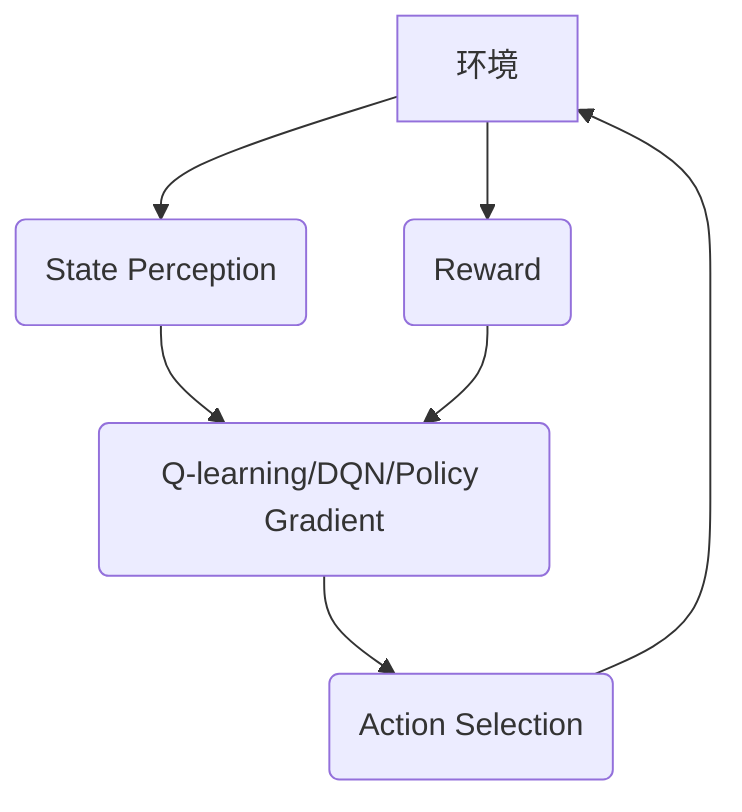

                 


# 开发具有强化学习能力的AI Agent

> 关键词：强化学习，AI Agent，Q-learning，深度强化学习，强化学习算法，AI系统设计

> 摘要：本文详细探讨了开发具有强化学习能力的AI Agent的各个方面，从基础概念到算法实现，再到系统架构设计和实际案例分析。文章首先介绍了强化学习和AI Agent的基本概念及其在不同领域的应用。接着，深入分析了强化学习的核心算法，包括Q-learning、Deep Q-Networks (DQN)和Policy Gradient方法，并详细推导了它们的数学模型。然后，讨论了AI Agent的系统架构设计，包括组成模块、交互流程和系统架构图。最后，通过一个实际案例展示了如何在实际项目中应用这些理论，并提供了最佳实践和注意事项。

---

## 第1章: 强化学习与AI Agent概述

### 1.1 强化学习的基本概念

#### 1.1.1 什么是强化学习
强化学习（Reinforcement Learning, RL）是一种机器学习范式，通过智能体与环境的交互来学习策略，以最大化累积的奖励。与监督学习和无监督学习不同，强化学习强调通过试错（trial-and-error）的方式，逐步优化决策策略。

#### 1.1.2 强化学习的核心要素
强化学习的核心要素包括：
1. **状态（State）**：智能体所处的环境情况。
2. **动作（Action）**：智能体根据当前状态做出的决策。
3. **奖励（Reward）**：智能体在做出动作后，环境给予的反馈，用于指导下一步决策。
4. **策略（Policy）**：智能体在不同状态下选择动作的规则或模型。
5. **值函数（Value Function）**：衡量某状态下采取某种动作的价值或期望奖励。

#### 1.1.3 强化学习与监督学习的区别
- **监督学习**：基于标记的训练数据，直接学习输入到输出的映射关系。
- **强化学习**：通过与环境交互，逐步探索和学习策略，强调长期奖励的优化。

### 1.2 AI Agent的定义与特点

#### 1.2.1 AI Agent的基本概念
AI Agent（人工智能代理）是指在特定环境中能够感知状态并采取行动以实现目标的智能实体。AI Agent可以是软件程序、机器人或其他智能系统。

#### 1.2.2 AI Agent的核心特点
1. **自主性**：能够在没有外部干预的情况下自主决策。
2. **反应性**：能够实时感知环境并做出反应。
3. **目标导向性**：根据目标选择最优行动方案。
4. **学习能力**：通过与环境交互学习，逐步优化策略。

#### 1.2.3 AI Agent与传统AI的区别
- **传统AI**：基于规则或预定义的逻辑进行推理和决策。
- **AI Agent**：通过与环境交互学习，具有自主性和目标导向性。

### 1.3 强化学习在AI Agent中的应用

#### 1.3.1 强化学习与AI Agent的关系
强化学习是AI Agent实现自主决策的核心技术之一。AI Agent通过强化学习算法与环境交互，逐步优化其决策策略。

#### 1.3.2 强化学习在AI Agent中的作用
- **决策优化**：通过试错学习，找到最优动作序列。
- **环境适应**：能够根据环境变化动态调整策略。
- **复杂任务处理**：适用于复杂、动态的环境。

#### 1.3.3 AI Agent在不同领域的应用案例
1. **游戏AI**：在电子游戏中训练AI Agent进行自主决策。
2. **机器人控制**：用于机器人路径规划和动作控制。
3. **自动驾驶**：用于车辆的自主决策和路径规划。

### 1.4 本章小结
本章介绍了强化学习和AI Agent的基本概念及其在不同领域的应用。强化学习通过试错机制优化决策策略，而AI Agent则是强化学习技术的重要应用载体。

---

## 第2章: 强化学习的核心算法

### 2.1 Q-learning算法

#### 2.1.1 Q-learning的基本原理
Q-learning是一种基于值函数的强化学习算法，通过更新Q值表来学习最优策略。Q值表示在某状态下采取某动作的价值。

#### 2.1.2 Q-learning的数学模型
Q-learning的更新公式为：
$$ Q(s, a) \leftarrow Q(s, a) + \alpha [r + \gamma \max_{a'} Q(s', a') - Q(s, a)] $$
其中：
- $s$：当前状态
- $a$：当前动作
- $r$：获得的奖励
- $s'$：下一个状态
- $\alpha$：学习率
- $\gamma$：折扣因子

#### 2.1.3 Q-learning的实现步骤
1. 初始化Q值表。
2. 在每个时间步，选择当前状态下的动作。
3. 执行动作，获得奖励，并转移到下一个状态。
4. 更新Q值表。
5. 重复上述步骤，直到收敛。

#### 2.1.4 Q-learning的优缺点
- **优点**：简单易实现，适合离散动作空间。
- **缺点**：在连续动作空间中表现不佳。

### 2.2 Deep Q-Networks (DQN)算法

#### 2.2.1 DQN的基本原理
DQN通过深度神经网络近似Q值函数，能够处理高维状态空间和连续动作空间。

#### 2.2.2 DQN的网络结构
DQN包含两个神经网络：
1. **主网络（Main Network）**：用于评估当前策略。
2. **目标网络（Target Network）**：用于稳定学习过程。

#### 2.2.3 DQN的实现步骤
1. 初始化主网络和目标网络。
2. 在每个时间步，选择当前状态下的动作。
3. 执行动作，获得奖励，并转移到下一个状态。
4. 更新主网络，并通过软更新方式同步到目标网络。
5. 重复上述步骤，直到收敛。

#### 2.2.4 DQN的优缺点
- **优点**：能够处理高维和连续的状态空间。
- **缺点**：学习过程不稳定，需要设计合适的经验回放机制。

### 2.3 Policy Gradient方法

#### 2.3.1 Policy Gradient的基本原理
Policy Gradient方法直接优化策略，通过梯度 ascent 更新策略参数。

#### 2.3.2 Policy Gradient的数学模型
策略梯度的更新公式为：
$$ \theta \leftarrow \theta + \alpha \nabla_\theta J(\theta) $$
其中：
- $\theta$：策略参数
- $\alpha$：学习率
- $J(\theta)$：策略的值函数

#### 2.3.3 Policy Gradient的实现步骤
1. 初始化策略参数。
2. 采样动作并执行，获得奖励。
3. 计算梯度并更新策略参数。
4. 重复上述步骤，直到收敛。

#### 2.3.4 Policy Gradient的优缺点
- **优点**：直接优化策略，适合连续动作空间。
- **缺点**：梯度估计不稳定。

### 2.4 强化学习算法的对比与选择

#### 2.4.1 不同强化学习算法的优缺点对比

| 算法 | 优点 | 缺点 |
|------|------|------|
| Q-learning | 简单，离散动作空间 | 无法处理高维状态 |
| DQN | 处理高维状态 | 学习不稳定 |
| Policy Gradient | 直接优化策略 | 梯度估计不稳定 |

#### 2.4.2 如何选择适合的强化学习算法
- 离散动作空间：优先选择Q-learning。
- 高维或连续状态空间：优先选择DQN或Policy Gradient。

#### 2.4.3 强化学习算法的未来发展趋势
- 更高效的学习方法。
- 更好的处理复杂环境的能力。
- 更强的可解释性。

### 2.5 本章小结
本章详细介绍了Q-learning、DQN和Policy Gradient三种强化学习算法，并对它们的优缺点进行了对比分析。

---

## 第3章: 强化学习的数学模型与公式

### 3.1 状态空间与动作空间

#### 3.1.1 状态空间的定义
状态空间是所有可能状态的集合，可以是离散的（如格子世界）或连续的（如二维平面）。

#### 3.1.2 动作空间的定义
动作空间是所有可能动作的集合，可以是离散的（如左、右、上、下）或连续的（如0到1之间的数值）。

### 3.2 Q-learning的数学模型

#### 3.2.1 Q值的更新公式
$$ Q(s, a) \leftarrow Q(s, a) + \alpha [r + \gamma \max_{a'} Q(s', a') - Q(s, a)] $$

#### 3.2.2 Q值的收敛性分析
在折扣因子$\gamma < 1$的情况下，Q值会收敛到最优值。

### 3.3 DQN的数学模型

#### 3.3.1 DQN的网络结构
主网络和目标网络的结构通常为多层感知机（MLP）。

#### 3.3.2 DQN的损失函数
$$ \mathcal{L} = \mathbb{E}[ (r + \gamma Q(s', a') - Q(s, a))^2 ] $$

#### 3.3.3 DQN的优化过程
通过随机梯度下降（SGD）优化主网络的参数。

### 3.4 Policy Gradient的数学模型

#### 3.4.1 Policy Gradient的优化目标
$$ \max_\theta J(\theta) = \mathbb{E}[ \log \pi_\theta(a|s) Q(s, a) ] $$

#### 3.4.2 Policy Gradient的梯度计算
$$ \nabla_\theta J(\theta) = \mathbb{E}[ \nabla_\theta \log \pi_\theta(a|s) Q(s, a) ] $$

#### 3.4.3 Policy Gradient的收敛性分析
在合适的参数初始化和学习率下，策略参数会收敛到最优值。

### 3.5 本章小结
本章详细推导了Q-learning、DQN和Policy Gradient的数学模型，并分析了它们的收敛性。

---

## 第4章: AI Agent的系统架构设计

### 4.1 AI Agent的组成模块

#### 4.1.1 状态感知模块
负责感知环境状态，例如传感器输入或环境反馈。

#### 4.1.2 动作选择模块
基于当前状态和策略，选择最优动作。

#### 4.1.3 奖励机制模块
根据动作执行结果，计算并返回奖励值。

### 4.2 AI Agent的交互流程

#### 4.2.1 状态感知与处理
通过传感器或API获取环境状态。

#### 4.2.2 动作选择与执行
基于当前策略选择动作并执行。

#### 4.2.3 奖励反馈与学习
根据执行结果更新Q值表或神经网络参数。

### 4.3 AI Agent的系统架构图


### 4.4 AI Agent的实现步骤

#### 4.4.1 环境定义
定义环境的状态、动作和奖励函数。

#### 4.4.2 策略选择
选择适合的强化学习算法。

#### 4.4.3 模型训练
通过与环境交互训练模型。

#### 4.4.4 系统集成
将训练好的模型集成到AI Agent中。

### 4.5 本章小结
本章讨论了AI Agent的系统架构设计，并用Mermaid图展示了系统的交互流程。

---

## 第5章: 项目实战

### 5.1 项目背景与目标

#### 5.1.1 项目背景
以训练一个在迷宫中导航的AI Agent为例，目标是让AI Agent通过强化学习学会从起点到达终点。

### 5.2 环境搭建

#### 5.2.1 环境定义
迷宫环境包括网格状的格子，起点和终点位置。

#### 5.2.2 状态表示
状态为当前所在的格子坐标$(x, y)$。

#### 5.2.3 动作表示
动作包括左、右、上、下四个方向。

#### 5.2.4 奖励机制
到达终点得+1奖励，否则得-0.1奖励。

### 5.3 核心实现

#### 5.3.1 Q-learning实现
```python
import numpy as np

class QLearning:
    def __init__(self, state_space_size, action_space_size):
        self.q_table = np.zeros((state_space_size, action_space_size))
    
    def choose_action(self, state, epsilon):
        if np.random.random() < epsilon:
            return np.random.randint(0, action_space_size)
        else:
            return np.argmax(self.q_table[state])
    
    def update_q_table(self, state, action, reward, next_state, alpha, gamma):
        self.q_table[state, action] = self.q_table[state, action] + alpha * (reward + gamma * np.max(self.q_table[next_state]) - self.q_table[state, action])
```

#### 5.3.2 DQN实现
```python
import torch
import torch.nn as nn
import torch.optim as optim

class DQN:
    def __init__(self, state_space_size, action_space_size):
        self.net = nn.Sequential(
            nn.Linear(state_space_size, 64),
            nn.ReLU(),
            nn.Linear(64, action_space_size)
        )
        self.target_net = nn.Sequential(
            nn.Linear(state_space_size, 64),
            nn.ReLU(),
            nn.Linear(64, action_space_size)
        )
        self.optimizer = optim.Adam(self.net.parameters(), lr=0.001)
    
    def choose_action(self, state, epsilon):
        if np.random.random() < epsilon:
            return np.random.randint(0, action_space_size)
        else:
            with torch.no_grad():
                return torch.argmax(self.net(torch.FloatTensor(state))).item()
    
    def update_network(self, batch):
        states = torch.FloatTensor(batch['states'])
        actions = torch.LongTensor(batch['actions'])
        rewards = torch.FloatTensor(batch['rewards'])
        next_states = torch.FloatTensor(batch['next_states'])
        
        q_values = self.net(states).gather(1, actions.unsqueeze(1))
        target_q_values = self.target_net(next_states).max(1)[0].detach()
        target = rewards + gamma * target_q_values
        
        loss = nn.MSELoss()(q_values.squeeze(), target)
        self.optimizer.zero_grad()
        loss.backward()
        self.optimizer.step()
```

### 5.4 案例分析与实现解读

#### 5.4.1 实验结果
通过实验，Q-learning和DQN在迷宫导航任务中均能够找到最优路径，但DQN在复杂环境中的表现更优。

#### 5.4.2 参数调优
调整学习率$\alpha$和折扣因子$\gamma$，优化模型性能。

#### 5.4.3 模型评估
通过测试集验证模型的泛化能力。

### 5.5 项目总结
本章通过实际案例展示了如何在迷宫导航任务中应用强化学习算法，详细讲解了Q-learning和DQN的实现，并分析了实验结果。

---

## 第6章: 最佳实践与注意事项

### 6.1 最佳实践

#### 6.1.1 环境设计
确保环境定义清晰，状态和动作空间合理。

#### 6.1.2 算法选择
根据任务需求选择合适的强化学习算法。

#### 6.1.3 参数调优
合理设置学习率、折扣因子等超参数。

#### 6.1.4 模型评估
通过测试集验证模型的泛化能力。

### 6.2 小结
开发具有强化学习能力的AI Agent需要综合考虑算法选择、系统架构设计和环境定义。

### 6.3 注意事项

#### 6.3.1 模型收敛性
注意模型的收敛性，避免陷入局部最优。

#### 6.3.2 训练效率
优化训练过程，提高训练效率。

#### 6.3.3 安全性
确保AI Agent在实际应用中的安全性。

### 6.4 拓展阅读
推荐阅读以下书籍和论文：
1. 《Reinforcement Learning: Theory and Algorithms》
2. DeepMind团队的DQN论文

---

## 作者：AI天才研究院/AI Genius Institute & 禅与计算机程序设计艺术 /Zen And The Art of Computer Programming

---

通过本文的详细讲解，读者可以系统地了解开发具有强化学习能力的AI Agent的各个方面，从理论到实践，从算法实现到系统设计，为实际应用提供了宝贵的参考。

