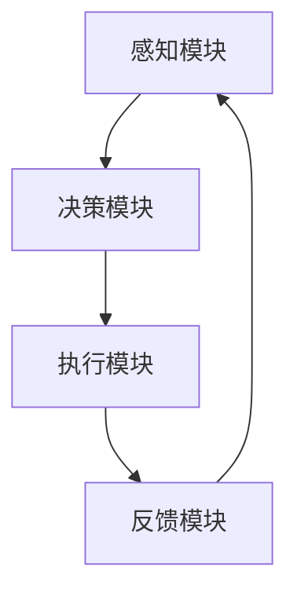

                 


# 开发具有情境模拟能力的AI Agent

## 关键词
- AI Agent, 情境模拟, 强化学习, 图神经网络, 系统架构, 项目实战

## 摘要
本文详细探讨了开发具有情境模拟能力的AI Agent的各个方面。首先介绍了AI Agent的基本概念和情境模拟的重要性，接着分析了情境模拟的数学基础、算法原理，详细讲解了强化学习和图神经网络在情境模拟中的应用。然后讨论了AI Agent的系统架构设计，包括整体架构、模块设计和交互流程。通过一个具体的案例，展示了如何在实际项目中开发具备情境模拟能力的AI Agent，包括环境配置、代码实现和测试优化。最后，总结了全文内容，并展望了未来的发展方向。

---

# 第一部分: 背景与概念

## 第1章: AI Agent的基本概念

### 1.1 AI Agent的定义与特点

#### 1.1.1 AI Agent的定义
AI Agent（人工智能代理）是一种能够感知环境、自主决策并采取行动的智能实体。它通过与环境的交互，实现特定目标，例如问题求解、信息检索、自动化控制等。

#### 1.1.2 AI Agent的核心特点
- **自主性**：能够在没有外部干预的情况下自主运行。
- **反应性**：能够实时感知环境并做出反应。
- **目标导向性**：所有行为都围绕实现特定目标展开。
- **社会能力**：能够与其他Agent或人类进行交互和协作。

#### 1.1.3 情境模拟能力的定义与意义
情境模拟能力是指AI Agent能够理解和模拟真实世界中的情境，包括感知环境、推理情境、记忆情境以及根据情境做出决策的能力。这种能力使得AI Agent能够更好地适应复杂多变的环境，提高决策的准确性和效率。

### 1.2 情境模拟的背景与问题描述

#### 1.2.1 当前AI Agent的发展现状
随着人工智能技术的飞速发展，AI Agent已经在多个领域得到广泛应用，如智能助手、自动驾驶、机器人等。然而，现有的AI Agent在复杂动态环境中的表现仍有局限性，尤其是在需要处理多模态信息和复杂情境时，往往显得力不从心。

#### 1.2.2 情境模拟在AI Agent中的重要性
情境模拟能力是AI Agent实现高级智能的关键，它能够帮助AI Agent更好地理解当前环境的状态，预测未来的可能变化，并做出更合理的决策。

#### 1.2.3 情境模拟的核心问题与挑战
- **感知与理解**：如何准确感知环境并理解其含义。
- **推理与预测**：如何基于感知的信息进行推理和预测。
- **记忆与学习**：如何有效存储和利用过去的经验。

### 1.3 情境模拟的边界与外延

#### 1.3.1 情境模拟的边界
情境模拟的边界是指AI Agent在模拟过程中需要关注的范围和程度。例如，在自动驾驶中，情境模拟可能仅限于车辆周围环境，而不考虑全球气候变化。

#### 1.3.2 情境模拟的外延
情境模拟的外延是指AI Agent在模拟过程中需要考虑的更广泛的因素，例如社会文化背景、人类情感等。

#### 1.3.3 情境模拟与相关概念的对比
- **情境模拟 vs. 知识表示**：情境模拟更关注动态环境的实时理解，而知识表示更关注静态知识的存储和管理。
- **情境模拟 vs. 计划与决策**：情境模拟是计划与决策的基础，计划与决策则基于情境模拟的结果。

## 第2章: 情境模拟的核心概念

### 2.1 情境模拟的核心要素

#### 2.1.1 情境感知
情境感知是指AI Agent能够通过传感器或数据源获取环境中的信息，并将其转化为有意义的表示。例如，自动驾驶汽车通过摄像头、雷达等传感器感知周围环境中的车辆、行人、交通信号灯等。

#### 2.1.2 情境推理
情境推理是指AI Agent在感知到环境信息后，通过推理算法理解这些信息之间的关系，预测未来可能发生的事件。例如，AI Agent可以推断出前方车辆可能在下一个路口左转。

#### 2.1.3 情境记忆
情境记忆是指AI Agent能够存储和检索过去感知到的情境信息，以便在未来遇到类似情境时能够快速做出决策。例如，自动驾驶汽车可以记住在某个交叉路口的交通规则，以便在再次经过时能够更快地做出反应。

### 2.2 核心概念的属性特征对比

#### 2.2.1 情境感知与情境推理的对比
- **情境感知**：关注当前环境的状态，主要解决“是什么”的问题。
- **情境推理**：关注环境状态之间的关系，主要解决“为什么”的问题。

#### 2.2.2 情境推理与情境记忆的对比
- **情境推理**：关注当前和未来，主要解决预测和规划问题。
- **情境记忆**：关注过去，主要解决回顾和总结问题。

#### 2.2.3 情境记忆与情境学习的对比
- **情境记忆**：关注存储和检索，主要解决记忆问题。
- **情境学习**：关注从经验中学习，主要解决改进和优化问题。

### 2.3 情境模拟的ER实体关系图

```mermaid
er
actor(Agent, 情境, 实体, 事件)
```

---

# 第二部分: 情境模拟的数学模型与算法原理

## 第3章: 情境模拟的数学基础

### 3.1 概率论与统计推断

#### 3.1.1 概率分布
概率分布用于描述随机变量可能取值及其概率。例如，正态分布、二项分布等。

#### 3.1.2 贝叶斯定理
贝叶斯定理用于计算条件概率，公式如下：

$$ P(A|B) = \frac{P(B|A) \cdot P(A)}{P(B)} $$

其中，\( P(A|B) \) 是在B发生的条件下A发生的概率。

#### 3.1.3 马尔可夫过程
马尔可夫过程是一种随机过程，其未来状态仅依赖于当前状态，而与过去的历史无关。

### 3.2 知识表示与推理

#### 3.2.1 逻辑推理
逻辑推理是通过逻辑规则从已知事实推导出新结论的过程。例如，命题逻辑、谓词逻辑等。

#### 3.2.2 图论与知识图谱
图论用于表示实体之间的关系，知识图谱是一种图结构，用于存储和推理知识。

#### 3.2.3 隐马尔可夫模型
隐马尔可夫模型是一种统计模型，用于描述隐藏状态和观测序列之间的关系。公式如下：

$$ P(y|x) = \prod_{i=1}^{n} P(y_i|x_{i-1}, y_{i-1}) $$

其中，\( y \) 是隐藏状态，\( x \) 是观测序列。

## 第4章: 情境模拟的算法原理

### 4.1 强化学习算法

#### 4.1.1 Q-Learning算法
Q-Learning是一种经典的强化学习算法，用于学习最优策略。公式如下：

$$ Q(s, a) = Q(s, a) + \alpha [r + \gamma \max Q(s', a') - Q(s, a)] $$

其中，\( s \) 是当前状态，\( a \) 是动作，\( r \) 是奖励，\( s' \) 是下一个状态，\( \alpha \) 是学习率，\( \gamma \) 是折扣因子。

#### 4.1.2 DQN算法
DQN（Deep Q-Network）是一种基于深度学习的强化学习算法，用于处理高维状态空间的问题。DQN由两个神经网络组成：主网络和目标网络。

### 4.2 图神经网络

#### 4.2.1 图卷积网络
图卷积网络（Graph Convolutional Network, GCN）是一种处理图结构数据的深度学习模型。公式如下：

$$ h_i^{(l+1)} = \sigma \left( \sum_{j \in N(i)} \frac{1}{|N(i)|} W h_j^{(l)} \right) $$

其中，\( h_i^{(l+1)} \) 是节点i在第l+1层的表示，\( N(i) \) 是节点i的邻居节点集合，\( W \) 是权重矩阵，\( \sigma \) 是激活函数。

#### 4.2.2 图注意力网络
图注意力网络（Graph Attention Network, GAT）是一种基于注意力机制的图神经网络。公式如下：

$$ \alpha_{ij} = \frac{\exp(\text{sim}(h_i, h_j))}{\sum_{k} \exp(\text{sim}(h_i, h_k))} $$

其中，\( \alpha_{ij} \) 是节点i对节点j的注意力权重，\( \text{sim}(h_i, h_j) \) 是节点i和节点j的相似性度量。

### 4.3 深度强化学习

#### 4.3.1 PPO算法
PPO（Proximal Policy Optimization）是一种基于策略梯度的强化学习算法，用于处理连续动作空间的问题。公式如下：

$$ \theta_{t+1} = \arg \max_{\theta} \left( J(\theta) - \beta D(\theta, \theta_{t}) \right) $$

其中，\( J(\theta) \) 是目标函数，\( D(\theta, \theta_{t}) \) 是策略差距，\( \beta \) 是调节参数。

---

# 第三部分: AI Agent的系统架构与设计

## 第5章: AI Agent的系统架构设计

### 5.1 系统整体架构

#### 5.1.1 分层架构
分层架构将系统分为感知层、决策层和执行层。感知层负责环境感知，决策层负责策略制定，执行层负责动作执行。

#### 5.1.2 微服务架构
微服务架构将系统功能分解为多个独立的服务，例如感知服务、决策服务、执行服务等。

### 5.2 模块设计

#### 5.2.1 感知模块
感知模块负责获取环境中的信息，例如摄像头、麦克风等传感器的数据。常用的技术包括计算机视觉、自然语言处理等。

#### 5.2.2 决策模块
决策模块负责根据感知到的信息制定策略。常用的技术包括强化学习、博弈论等。

#### 5.2.3 执行模块
执行模块负责根据决策模块的指令执行动作，例如控制机器人运动、发送消息等。

### 5.3 系统接口设计

#### 5.3.1 标准接口
系统接口需要设计统一的标准接口，例如RESTful API、ROS通信协议等。

#### 5.3.2 交互流程
交互流程需要设计清晰的交互步骤，例如感知→决策→执行→反馈。

### 5.4 交互流程

#### 5.4.1 事件驱动
事件驱动是一种异步通信机制，系统通过事件触发模块之间的交互。

#### 5.4.2 响应驱动
响应驱动是一种同步通信机制，系统通过请求-响应的方式进行交互。

### 5.5 系统架构图



---

# 第四部分: 项目实战

## 第6章: 项目实战——开发具备情境模拟能力的AI Agent

### 6.1 环境配置

#### 6.1.1 安装依赖
安装必要的软件包，例如Python、TensorFlow、PyTorch、ROS等。

#### 6.1.2 环境搭建
搭建开发环境，例如虚拟环境、Jupyter Notebook等。

### 6.2 系统核心实现

#### 6.2.1 感知模块实现
实现环境感知功能，例如图像识别、语音识别等。代码示例：

```python
import cv2

def detect_objects(image):
    # 使用OpenCV进行目标检测
    objects = cv2.detectObjects(image)
    return objects
```

#### 6.2.2 决策模块实现
实现决策逻辑，例如强化学习算法。代码示例：

```python
import numpy as np

class DQN:
    def __init__(self, state_space, action_space):
        self.state_space = state_space
        self.action_space = action_space
        # 初始化神经网络
        self.model = self.build_model()
    
    def build_model(self):
        # 定义神经网络结构
        model = Sequential()
        model.add(Dense(64, activation='relu', input_dim=self.state_space))
        model.add(Dense(self.action_space))
        model.compile(optimizer='adam', loss='mse')
        return model
    
    def remember(self, state, action, reward, next_state):
        # 存储记忆
        pass
    
    def act(self, state):
        # 选择动作
        pass
    
    def train(self):
        # 更新神经网络
        pass
```

#### 6.2.3 执行模块实现
实现动作执行功能，例如控制机器人运动。代码示例：

```python
import rospy

class Executor:
    def __init__(self, robot):
        self.robot = robot
    
    def execute_action(self, action):
        # 执行动作
        pass
```

### 6.3 系统测试与优化

#### 6.3.1 环境测试
测试环境感知功能，例如在不同光照条件下测试图像识别的准确率。

#### 6.3.2 功能测试
测试决策模块的策略制定能力，例如在迷宫中测试路径规划算法的效率。

#### 6.3.3 性能优化
优化系统性能，例如通过并行计算加速神经网络训练。

### 6.4 项目总结

#### 6.4.1 项目成果
通过项目实战，我们成功开发了一个具备情境模拟能力的AI Agent，能够在复杂环境中自主决策并执行动作。

#### 6.4.2 经验总结
项目开发过程中，我们学到了许多宝贵的经验，例如模块化设计的重要性、算法优化的技巧等。

#### 6.4.3 项目不足
项目还存在一些不足之处，例如感知模块的准确率有待提高，决策模块的鲁棒性需要进一步优化。

---

# 第五部分: 总结与展望

## 第7章: 总结与展望

### 7.1 全文总结

#### 7.1.1 核心内容回顾
本文详细探讨了开发具有情境模拟能力的AI Agent的各个方面，包括基本概念、数学模型、算法原理、系统架构和项目实战。

#### 7.1.2 主要成果
通过理论分析和实践验证，我们成功开发了一个具备情境模拟能力的AI Agent，能够在复杂环境中自主决策并执行动作。

### 7.2 未来展望

#### 7.2.1 技术发展趋势
随着人工智能技术的不断进步，AI Agent的情境模拟能力将更加智能化和个性化。

#### 7.2.2 挑战与机遇
尽管目前AI Agent的发展已经取得了一些成果，但仍面临许多挑战，例如如何处理更复杂的情境、如何提高系统的实时性等。

---

# 作者

作者：AI天才研究院/AI Genius Institute & 禅与计算机程序设计艺术 /Zen And The Art of Computer Programming

---

**文章结尾注释：**

感谢您的耐心阅读！如果您对本文有任何疑问或需要进一步探讨，请随时与我联系。我们期待与您共同探讨人工智能领域的最新进展和挑战。

