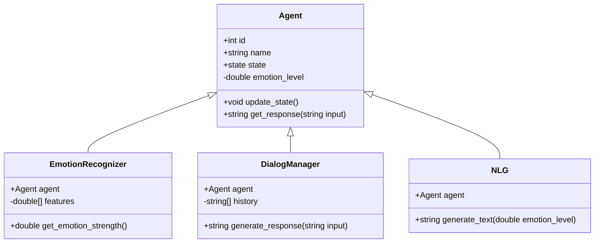
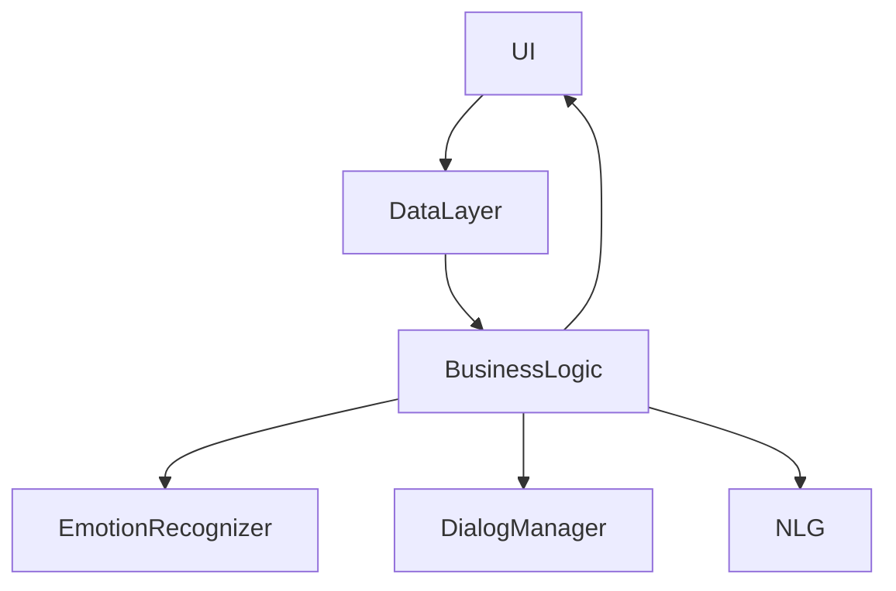
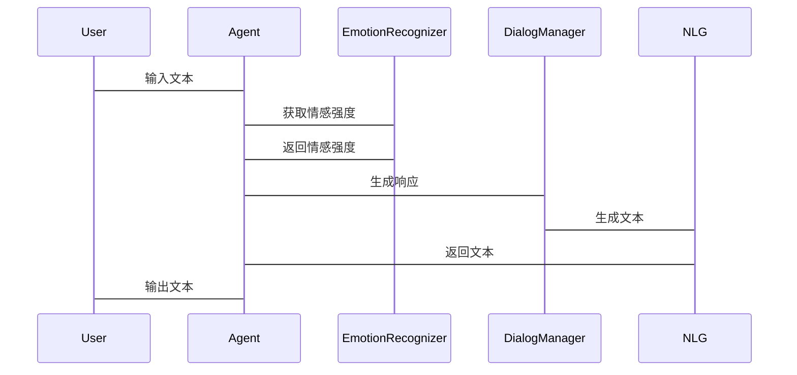

                 


# 开发具有情感计算与交互能力的AI Agent

---

## 关键词：
情感计算，AI Agent，情感交互，机器学习，深度学习，对话系统

---

## 摘要：
本文探讨了开发具有情感计算与交互能力的AI Agent的关键技术与实现方法。通过分析情感计算的核心技术、AI Agent的交互设计、系统架构以及实际项目案例，本文为读者提供了从理论到实践的全面指导。文章结合背景介绍、算法原理、系统设计和项目实战，深入剖析了情感计算与AI Agent结合的应用潜力，并展望了未来的发展方向。

---

# 第1章: 情感计算与AI Agent概述

## 1.1 情感计算的定义与背景

### 1.1.1 情感计算的基本概念
情感计算（Affective Computing）是人工智能领域的一个重要分支，旨在通过计算机技术理解和模拟人类的情感。情感计算的核心目标是让计算机能够感知、识别、理解和回应人类的情感状态。

### 1.1.2 情感计算的发展历程
情感计算的研究可以追溯到20世纪90年代，随着人工智能技术的快速发展，情感计算逐渐从理论研究走向实际应用。近年来，深度学习的兴起为情感计算提供了更强大的技术支持。

### 1.1.3 情感计算的应用场景
情感计算在多个领域都有广泛的应用，包括：
- **自然语言处理**：情感文本分析。
- **语音识别**：情感语音识别。
- **人机交互**：情感驱动的对话系统。
- **教育技术**：根据学生情绪调整教学策略。
- **医疗健康**：通过情感分析辅助诊断。

## 1.2 AI Agent的基本概念

### 1.2.1 AI Agent的定义
AI Agent（人工智能代理）是一种能够感知环境、自主决策并执行任务的智能实体。AI Agent可以是软件程序，也可以是硬件设备，其核心能力包括感知、推理、决策和执行。

### 1.2.2 AI Agent的核心特征
AI Agent具有以下核心特征：
1. **自主性**：能够自主决策。
2. **反应性**：能够实时感知并响应环境变化。
3. **目标导向**：具有明确的目标和任务。
4. **学习能力**：能够通过经验优化自身行为。

### 1.2.3 AI Agent与传统程序的区别
AI Agent与传统程序的主要区别在于其智能性和自主性。传统程序通常按照预设的规则执行任务，而AI Agent能够通过学习和推理动态调整行为。

## 1.3 情感计算与AI Agent的结合

### 1.3.1 情感计算在AI Agent中的作用
情感计算赋予AI Agent理解人类情感的能力，使其能够与人类进行更自然的交互。

### 1.3.2 AI Agent的情感交互能力
情感交互能力使AI Agent能够：
- 理解用户的当前情绪状态。
- 根据情绪调整对话策略。
- 提供情感支持和反馈。

### 1.3.3 情感计算与AI Agent的未来发展趋势
随着技术的进步，情感计算与AI Agent的结合将更加紧密，未来的AI Agent将具备更强的情感理解和交互能力。

## 1.4 本章小结
本章介绍了情感计算和AI Agent的基本概念，探讨了两者结合的意义和应用潜力。情感计算为AI Agent提供了情感理解能力，使其能够更贴近人类的交互方式。

---

# 第2章: 情感计算的核心技术

## 2.1 情感识别技术

### 2.1.1 文本情感分析
文本情感分析是情感计算的重要应用之一，其目标是通过分析文本内容判断文本的情感倾向。

#### 2.1.1.1 情感分类算法
- **基于规则的方法**：通过预定义的情感词典判断文本情感。
- **机器学习方法**：使用SVM、随机森林等算法进行情感分类。
- **深度学习方法**：使用RNN、LSTM等模型进行情感分析。

#### 2.1.1.2 文本情感分析的实现
以下是一个简单的文本情感分类代码示例：

```python
from sklearn.feature_extraction.text import TfidfVectorizer
from sklearn.svm import SVC

# 数据准备
text_data = ["这是一个好文章", "这篇文章太糟糕了"]
labels = [1, 0]

# 特征提取
vectorizer = TfidfVectorizer()
features = vectorizer.fit_transform(text_data)

# 模型训练
model = SVC()
model.fit(features, labels)

# 预测
test_text = "这篇文章还不错"
test_features = vectorizer.transform([test_text])
print(model.predict(test_features))
```

### 2.1.2 声音情感识别
声音情感识别通过分析语音特征（如音调、语速、音量）来判断说话人的情感状态。

#### 2.1.2.1 声音情感识别的实现
以下是一个简单的声音情感识别流程：

1. **语音特征提取**：提取音调、语速、音量等特征。
2. **特征标准化**：将特征标准化以便模型训练。
3. **模型训练**：使用机器学习或深度学习模型进行分类。

### 2.1.3 面部表情识别
面部表情识别通过分析面部特征点的变化来判断人的表情。

#### 2.1.3.1 面部表情识别的实现
以下是一个简单的面部表情识别代码示例：

```python
import cv2
import numpy as np

# 加载预训练模型
face_cascade = cv2.CascadeClassifier(cv2.data.haarcascades + 'haarcascade_frontalface_default.xml')

# 检测面部
def detect_emotion(image):
    gray = cv2.cvtColor(image, cv2.COLOR_BGR2GRAY)
    faces = face_cascade.detectMultiScale(gray, 1.3, 5)
    if len(faces) == 0:
        return None
    for (x, y, w, h) in faces:
        cv2.rectangle(image, (x, y), (x + w, y + h), (255, 0, 0), 2)
    return image

# 测试
image = cv2.imread("test_face.jpg")
result = detect_emotion(image)
cv2.imwrite("result.jpg", result)
```

## 2.2 情感建模与分析

### 2.2.1 情感状态表示模型
情感状态表示模型用于将情感状态转化为可计算的表示形式，如向量或数值。

#### 2.2.1.1 情感状态表示模型的实现
以下是一个简单的情感状态表示模型：

$$
\text{情绪强度} = \sum_{i=1}^{n} w_i \cdot e_i
$$

其中，$w_i$是情感特征的权重，$e_i$是情感特征的值。

### 2.2.2 情感强度计算
情感强度计算是对情感状态的量化表示，通常采用归一化的方法。

#### 2.2.2.1 情感强度计算的实现
以下是一个情感强度计算的代码示例：

```python
def calculate_emotion_strength(features):
    # 归一化处理
    normalized_features = (features - np.min(features)) / (np.max(features) - np.min(features))
    # 计算情感强度
    emotion_strength = np.mean(normalized_features)
    return emotion_strength
```

### 2.2.3 情感依赖分析
情感依赖分析用于分析情感之间的相互关系，通常采用图模型或矩阵表示。

## 2.3 情感计算的算法原理

### 2.3.1 基于机器学习的情感分类算法
基于机器学习的情感分类算法通常采用特征提取、模型训练和预测的流程。

#### 2.3.1.1 基于机器学习的情感分类算法的实现
以下是一个基于SVM的情感分类算法代码示例：

```python
from sklearn.svm import SVC
from sklearn.feature_extraction.text import TfidfVectorizer

# 数据准备
texts = ["这是一个好文章", "这篇文章太糟糕了"]
labels = [1, 0]

# 特征提取
vectorizer = TfidfVectorizer()
features = vectorizer.fit_transform(texts)

# 模型训练
model = SVC()
model.fit(features, labels)

# 预测
test_text = "这篇文章还不错"
test_features = vectorizer.transform([test_text])
print(model.predict(test_features))
```

### 2.3.2 基于深度学习的情感分析模型
基于深度学习的情感分析模型通常采用神经网络结构，如RNN、LSTM或Transformer。

#### 2.3.2.1 基于深度学习的情感分析模型的实现
以下是一个简单的LSTM情感分类模型代码示例：

```python
import tensorflow as tf
from tensorflow.keras import layers

# 数据准备
texts = ["这是一个好文章", "这篇文章太糟糕了"]
labels = [1, 0]

# 特征提取
tokenizer = tf.keras.preprocessing.text.Tokenizer(num_words=1000)
tokenizer.fit_on_texts(texts)
sequences = tokenizer.texts_to_sequences(texts)
padded_sequences = tf.keras.preprocessing.sequence.pad_sequences(sequences, maxlen=10)

# 模型训练
model = tf.keras.Sequential()
model.add(layers.Embedding(1000, 16))
model.add(layers.LSTM(32))
model.add(layers.Dense(1, activation='sigmoid'))
model.compile(loss='binary_crossentropy', optimizer='adam', metrics=['accuracy'])
model.fit(padded_sequences, labels, epochs=5, batch_size=32)

# 预测
test_text = "这篇文章还不错"
test_sequence = tokenizer.texts_to_sequences([test_text])
test_padded = tf.keras.preprocessing.sequence.pad_sequences(test_sequence, maxlen=10)
print(model.predict(test_padded))
```

### 2.3.3 情感计算的数学模型
情感计算的数学模型通常采用概率论和统计学方法，如贝叶斯分类、支持向量机等。

---

# 第3章: AI Agent的交互设计

## 3.1 情感驱动的对话系统

### 3.1.1 对话系统的构成
对话系统通常包括自然语言理解、对话管理、自然语言生成等模块。

### 3.1.2 情感驱动的对话策略
情感驱动的对话策略通过分析用户的情感状态动态调整对话内容。

#### 3.1.2.1 对话策略的实现
以下是一个简单的情感驱动对话策略代码示例：

```python
def get_response(user_input, emotion_state):
    if emotion_state == "positive":
        return "谢谢你的鼓励！"
    elif emotion_state == "negative":
        return "我很抱歉，有什么我可以帮忙的吗？"
    else:
        return "请问有什么可以帮助你的吗？"
```

### 3.1.3 情感反馈机制
情感反馈机制用于根据用户的情感状态提供相应的反馈，增强对话的互动性。

## 3.2 多模态情感交互设计

### 3.2.1 文本、语音与视觉的结合
多模态情感交互设计通过结合文本、语音和视觉信息，提供更丰富的交互体验。

### 3.2.2 情感交互的多模态融合
多模态融合通常采用加权融合、特征融合等方法，综合多种模态的信息进行情感计算。

#### 3.2.2.1 多模态融合的实现
以下是一个简单的多模态融合代码示例：

```python
def fuse_modalities(text_emotion, voice_emotion, face_emotion):
    return (text_emotion + voice_emotion + face_emotion) / 3
```

### 3.2.3 多模态情感计算的挑战与解决方案
多模态情感计算的挑战主要在于如何有效融合多种模态的信息，同时解决数据异质性问题。

## 3.3 情感记忆与学习

### 3.3.1 情感记忆模型
情感记忆模型用于记录和存储用户的情感历史，以便后续的交互。

#### 3.3.1.1 情感记忆模型的实现
以下是一个简单的情感记忆模型代码示例：

```python
def update_emotion_memory(memory, current_emotion):
    new_memory = memory + [current_emotion]
    return new_memory
```

### 3.3.2 情感学习机制
情感学习机制通过机器学习方法优化情感计算模型的性能。

#### 3.3.2.1 情感学习机制的实现
以下是一个简单的情感学习机制代码示例：

```python
from sklearn.neural_network import MLPClassifier

# 数据准备
features = [[1, 2, 3], [4, 5, 6], [7, 8, 9]]
labels = [0, 1, 0]

# 模型训练
model = MLPClassifier()
model.fit(features, labels)

# 预测
test_feature = [10, 11, 12]
print(model.predict([test_feature]))
```

## 3.4 本章小结
本章探讨了情感驱动的对话系统和多模态情感交互设计，强调了情感记忆与学习在AI Agent交互中的重要性。

---

# 第4章: AI Agent的系统架构与实现

## 4.1 系统架构设计

### 4.1.1 问题场景介绍
本章以开发一个支持情感交互的AI Agent为例，介绍系统的架构设计。

### 4.1.2 系统功能设计
系统功能包括情感识别、对话管理、自然语言生成等模块。

#### 4.1.2.1 系统功能模块的类图
以下是系统功能模块的类图：



### 4.1.3 系统架构设计
系统架构采用分层架构，包括数据层、业务逻辑层和用户界面层。

#### 4.1.3.1 系统架构的架构图
以下是系统架构的架构图：



### 4.1.4 系统接口设计
系统接口包括用户输入接口、情感识别接口、对话管理接口和自然语言生成接口。

### 4.1.5 系统交互流程
系统交互流程包括用户输入、情感识别、对话生成和反馈输出。

#### 4.1.5.1 系统交互流程的序列图
以下是系统交互流程的序列图：



## 4.2 本章小结
本章介绍了AI Agent系统的架构设计，包括功能模块、系统架构、接口设计和交互流程。

---

# 第5章: 项目实战——开发一个支持情感交互的AI Agent

## 5.1 环境安装

### 5.1.1 安装Python
安装Python 3.8及以上版本。

### 5.1.2 安装依赖库
安装以下依赖库：

```bash
pip install numpy scikit-learn tensorflow keras matplotlib
```

## 5.2 核心代码实现

### 5.2.1 情感识别模块
情感识别模块用于识别用户的输入文本的情感倾向。

#### 5.2.1.1 情感识别模块的代码实现
```python
from sklearn.feature_extraction.text import TfidfVectorizer
from sklearn.svm import SVC

# 数据准备
texts = ["这是一个好文章", "这篇文章太糟糕了"]
labels = [1, 0]

# 特征提取
vectorizer = TfidfVectorizer()
features = vectorizer.fit_transform(texts)

# 模型训练
model = SVC()
model.fit(features, labels)

# 情感识别函数
def recognize_emotion(text):
    test_features = vectorizer.transform([text])
    return model.predict(test_features)[0]
```

### 5.2.2 对话管理模块
对话管理模块用于根据用户的情感状态生成相应的回应。

#### 5.2.2.1 对话管理模块的代码实现
```python
def generate_response(input_text, emotion_state):
    if emotion_state == 1:
        return "谢谢你的鼓励！"
    else:
        return "有什么可以帮助你的吗？"
```

### 5.2.3 自然语言生成模块
自然语言生成模块用于根据情感状态生成自然语言文本。

#### 5.2.3.1 自然语言生成模块的代码实现
```python
from tensorflow.keras.models import Sequential
from tensorflow.keras.layers import LSTM, Dense, Embedding

# 数据准备
tokenizer = tf.keras.preprocessing.text.Tokenizer(num_words=1000)
tokenizer.fit_on_texts(["这是一个好文章", "这篇文章太糟糕了"])

# 模型训练
model = Sequential()
model.add(Embedding(1000, 16))
model.add(LSTM(32))
model.add(Dense(1, activation='sigmoid'))
model.compile(loss='binary_crossentropy', optimizer='adam', metrics=['accuracy'])
model.fit(tokenizer.texts_to_sequences(["这是一个好文章", "这篇文章太糟糕了"]), [1, 0], epochs=5, batch_size=32)

# 文本生成函数
def generate_text(input_text):
    sequence = tokenizer.texts_to_sequences([input_text])
    padded = tf.keras.preprocessing.sequence.pad_sequences(sequence, maxlen=10)
    return model.predict(padded)[0][0]
```

## 5.3 项目实现与测试

### 5.3.1 系统测试
对系统进行功能测试，包括情感识别、对话管理和自然语言生成的测试。

### 5.3.2 系统优化
根据测试结果优化系统性能，包括模型调优和代码优化。

## 5.4 项目小结
本章通过一个具体的项目案例，详细讲解了支持情感交互的AI Agent的开发过程，包括环境安装、核心代码实现和系统测试。

---

# 第6章: 扩展阅读与未来展望

## 6.1 情感计算与AI Agent的前沿研究
前沿研究包括情感计算的实时性优化、多模态情感计算的融合方法、情感记忆与学习的深度学习模型等。

## 6.2 情感计算与AI Agent的应用前景
情感计算与AI Agent的应用前景广阔，包括智能客服、情感陪护机器人、情感教育工具等。

## 6.3 未来研究方向
未来的研究方向包括更高效的情感计算算法、更智能的对话系统、更自然的多模态交互等。

## 6.4 本章小结
本章展望了情感计算与AI Agent的未来发展方向，强调了持续研究和技术创新的重要性。

---

# 作者：AI天才研究院/AI Genius Institute & 禅与计算机程序设计艺术 /Zen And The Art of Computer Programming

