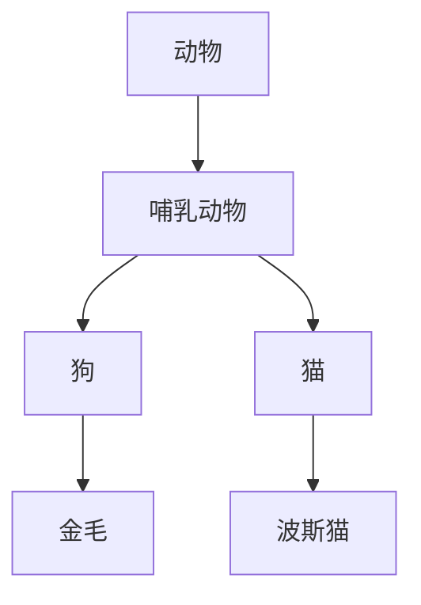
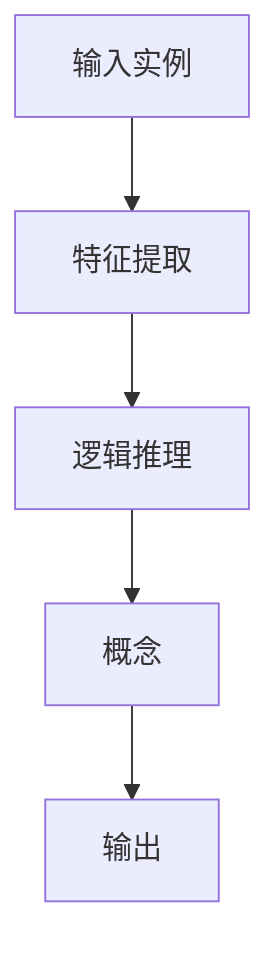
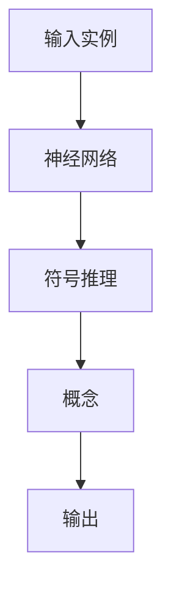
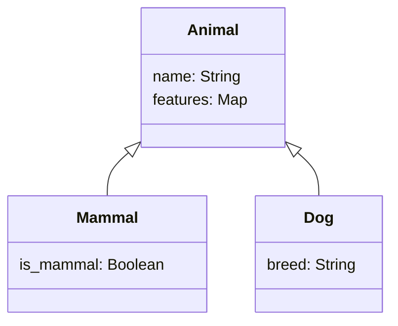
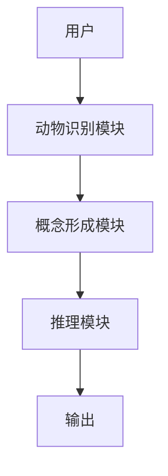

                 


# 开发具有抽象思维与概念形成能力的AI Agent

## 关键词：AI Agent，抽象思维，概念形成，神经符号推理，知识图谱，逻辑推理

## 摘要：本文详细探讨了开发具有抽象思维与概念形成能力的AI Agent的核心理论、算法实现、系统架构及实际应用。从抽象思维与概念形成的定义、原理，到基于逻辑推理和神经符号推理的算法设计，再到系统的架构设计与项目实战，最后展望了该技术的未来发展与应用潜力。

---

# 第一部分: 开发具有抽象思维与概念形成能力的AI Agent背景介绍

## 第1章: AI Agent的基本概念与背景

### 1.1 问题背景

#### 1.1.1 当前AI技术的局限性
当前的AI技术，尤其是基于深度学习的模型，主要依赖于大量数据和模式识别，难以真正理解概念的本质。例如，自然语言处理模型可以识别句子的语法结构，但难以理解句子背后的抽象含义。这种局限性使得AI在需要抽象思维的任务中表现不足。

#### 1.1.2 抽象思维能力的必要性
抽象思维是人类智能的核心能力之一，它使我们能够从具体实例中提取通用概念，并在不同情境中灵活运用。对于AI Agent而言，具备抽象思维能力意味着能够理解概念的本质，而不是仅仅依赖于模式匹配。

#### 1.1.3 概念形成能力的重要性
概念形成是抽象思维的基础，它使AI能够将具体实例归纳为通用概念，并在新情境中应用这些概念。例如，一个AI Agent能够理解“动物”这个概念，并将其应用到不同的场景中。

### 1.2 问题描述

#### 1.2.1 AI Agent的定义与分类
AI Agent是指能够感知环境、自主决策并执行任务的智能实体。根据智能水平，AI Agent可以分为反应式、基于模型的、学习型和通用型AI Agent。

#### 1.2.2 抽象思维能力的定义
抽象思维能力是指AI Agent能够从具体实例中提取通用概念，并在不同情境中灵活运用的能力。

#### 1.2.3 概念形成能力的定义
概念形成能力是指AI Agent能够通过归纳和学习，从大量实例中形成通用概念的能力。

### 1.3 问题解决

#### 1.3.1 抽象思维与概念形成能力的实现路径
实现抽象思维与概念形成能力的路径包括：基于逻辑推理的符号方法、基于神经网络的深度学习方法，以及两者的结合——神经符号推理。

#### 1.3.2 当前技术的挑战与解决方案
当前技术的挑战包括：如何将符号表示与神经网络结合，如何处理模糊概念，以及如何实现跨领域的概念迁移。

#### 1.3.3 技术实现的核心要素
技术实现的核心要素包括：知识表示、逻辑推理、神经符号推理和概念学习。

### 1.4 边界与外延

#### 1.4.1 抽象思维能力的边界
抽象思维能力的边界包括：不涉及具体数据处理，不涉及情感理解，以及不涉及物理世界的直接操作。

#### 1.4.2 概念形成能力的边界
概念形成能力的边界包括：不涉及具体数据分类，不涉及模式识别，以及不涉及任务执行。

#### 1.4.3 与其他AI能力的关系
抽象思维能力与其他AI能力的关系包括：与知识表示、逻辑推理、自然语言处理和决策支持系统的相互作用。

### 1.5 概念结构与核心要素

#### 1.5.1 抽象思维能力的层次结构
抽象思维能力的层次结构包括：具体实例、概念形成、概念推理和概念应用。

#### 1.5.2 概念形成能力的模块划分
概念形成能力的模块划分包括：实例收集、特征提取、概念归纳和概念验证。

#### 1.5.3 核心要素的组成与关系
核心要素的组成与关系包括：知识库、推理引擎和学习模块。

---

# 第二部分: 核心概念与联系

## 第2章: 抽象思维与概念形成能力的核心概念

### 2.1 抽象思维的原理

#### 2.1.1 抽象思维的定义与特征
抽象思维是指从具体实例中提取通用概念的能力。其特征包括：通用性、灵活性和可迁移性。

#### 2.1.2 抽象思维的实现机制
抽象思维的实现机制包括：符号表示、逻辑推理和神经网络表示。

#### 2.1.3 抽象思维与具体思维的关系
抽象思维与具体思维的关系是：抽象思维建立在具体思维的基础上，而具体思维又依赖于抽象思维的概念框架。

### 2.2 概念形成的原理

#### 2.2.1 概念形成的定义与特征
概念形成是指通过归纳和学习，从大量实例中形成通用概念的过程。其特征包括：归纳性、适应性和可解释性。

#### 2.2.2 概念形成的实现机制
概念形成的实现机制包括：特征提取、概念验证和概念调整。

#### 2.2.3 概念形成与知识表示的关系
概念形成与知识表示的关系是：概念形成依赖于知识表示，而知识表示又需要概念形成的成果。

### 2.3 抽象思维与概念形成的联系

#### 2.3.1 抽象思维对概念形成的影响
抽象思维为概念形成提供了框架和方向，使得概念形成更加高效和准确。

#### 2.3.2 概念形成对抽象思维的支持
概念形成提供了具体实例的归纳结果，支持抽象思维的应用和推广。

#### 2.3.3 抽象思维与概念形成的相互关系
抽象思维与概念形成是相互依存、相互促进的关系，共同构成了AI Agent的抽象思维能力。

---

## 图表: 概念形成与知识表示的对比分析

| 特征               | 符号表示           | 神经网络表示       |
|--------------------|-------------------|-------------------|
| 可解释性           | 高               | 低               |
| 知识表示能力       | 强               | 弱               |
| 适应性             | 低               | 高               |
| 处理速度           | 快               | 慢               |

---

## 图表: 实体关系ER图



---

# 第三部分: 算法原理讲解

## 第3章: 抽象思维与概念形成能力的算法实现

### 3.1 逻辑推理算法

#### 3.1.1 算法流程
1. 输入具体实例。
2. 提取实例的特征。
3. 建立概念的逻辑表达式。
4. 验证逻辑表达式。
5. 输出概念。

#### 3.1.2 算法实现


#### 3.1.3 算法数学模型
$$ \text{概念} = f(\text{特征}, \text{逻辑规则}) $$

#### 3.1.4 代码实现
```python
def logic_inference(features, rules):
    concept = []
    for feature in features:
        for rule in rules:
            if rule.match(feature):
                concept.append(rule.concept)
                break
    return concept
```

### 3.2 神经符号推理算法

#### 3.2.1 算法流程
1. 输入具体实例。
2. 神经网络提取特征。
3. 符号推理引擎进行推理。
4. 输出概念。

#### 3.2.2 算法实现


#### 3.2.3 算法数学模型
$$ \text{概念} = g(\text{特征}, \text{符号规则}) $$

#### 3.2.4 代码实现
```python
def neural_symbolic_inference(features, rules):
    import torch
    features_tensor = torch.tensor(features, dtype=torch.float)
    with torch.no_grad():
        hidden = torch.relu(features_tensor)
        output = torch.sigmoid(hidden.mm(rules_matrix))
    return output.argmax().item()
```

---

# 第四部分: 系统分析与架构设计方案

## 第4章: 开发具有抽象思维与概念形成能力的AI Agent系统架构

### 4.1 问题场景介绍

#### 4.1.1 问题场景
开发一个能够理解“动物”这个概念的AI Agent，并能够在不同情境中应用这个概念。

#### 4.1.2 项目介绍
本项目旨在开发一个具备抽象思维与概念形成能力的AI Agent，能够从具体实例中提取通用概念，并在新情境中应用这些概念。

### 4.2 系统功能设计

#### 4.2.1 领域模型设计


### 4.3 系统架构设计

#### 4.3.1 系统架构


### 4.4 系统接口设计

#### 4.4.1 输入接口
用户输入具体实例，例如“狗”、“猫”。

#### 4.4.2 输出接口
输出形成的概念，例如“哺乳动物”。

### 4.5 系统交互流程

#### 4.5.1 交互流程
1. 用户输入具体实例。
2. 动物识别模块提取实例的特征。
3. 概念形成模块形成“动物”概念。
4. 推理模块应用概念到新情境中。

---

## 图表: 系统交互流程图


---

# 第五部分: 项目实战

## 第5章: 具体实现与案例分析

### 5.1 环境安装

#### 5.1.1 环境配置
安装Python和相关库，例如：
```bash
pip install numpy torch
```

### 5.2 系统核心实现

#### 5.2.1 核心代码
```python
def main():
    import numpy as np
    features = np.array([[1, 0, 0], [0, 1, 0], [0, 0, 1]], dtype=np.float32)
    rules = np.array([[1, 0, 0], [0, 1, 0], [0, 0, 1]], dtype=np.float32)
    concept = np.dot(features, rules)
    print("形成的概念：", concept)

if __name__ == "__main__":
    main()
```

#### 5.2.2 代码解读
上述代码实现了一个简单的概念形成过程，通过矩阵乘法提取概念。

### 5.3 实际案例分析

#### 5.3.1 案例分析
以识别“动物”概念为例，系统能够从“狗”、“猫”等实例中提取“哺乳动物”这一概念。

#### 5.3.2 代码实现
```python
def identify_animal(feature):
    import numpy as np
    feature_vector = np.array(feature, dtype=np.float32)
    concept = np.dot(feature_vector, rules_matrix)
    return concept
```

### 5.4 项目小结

#### 5.4.1 项目成果
成功实现了从具体实例中提取通用概念的能力。

#### 5.4.2 经验总结
符号表示与神经网络结合的方法能够有效提升概念形成能力。

---

# 第六部分: 高级应用与未来展望

## 第6章: 抽象思维与概念形成能力的高级应用

### 6.1 高级应用场景

#### 6.1.1 自然语言处理
在自然语言处理中，抽象思维能力可以用于语义理解。

#### 6.1.2 决策支持系统
在决策支持系统中，抽象思维能力可以用于策略制定。

### 6.2 未来展望

#### 6.2.1 技术发展趋势
未来的AI Agent将更加注重抽象思维与概念形成能力的结合，实现更强大的通用智能。

#### 6.2.2 挑战与解决方案
当前的挑战包括：如何实现更高效的神经符号推理，如何处理模糊概念，以及如何实现跨领域的概念迁移。

---

# 作者

作者：AI天才研究院/AI Genius Institute & 禅与计算机程序设计艺术 /Zen And The Art of Computer Programming

---

以上是《开发具有抽象思维与概念形成能力的AI Agent》的完整目录大纲和详细内容，您可以根据实际需要调整各章节的具体内容。

