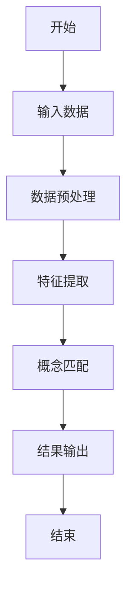
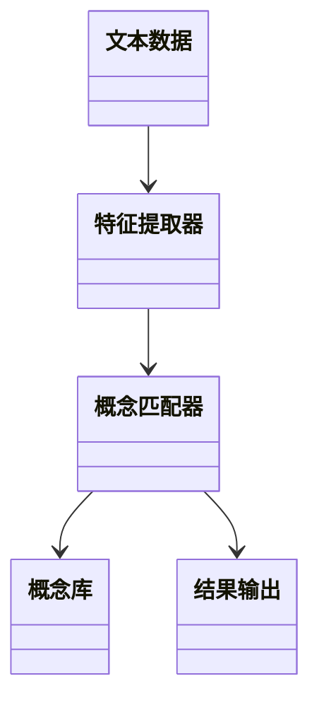

                 


# 开发具有抽象思维能力的AI Agent

> 关键词：AI Agent，抽象思维能力，算法原理，系统架构，项目实战

> 摘要：本文详细探讨了开发具有抽象思维能力的AI Agent的关键技术，从背景介绍、核心概念、算法原理到系统架构和项目实战，全面解析了实现具有抽象思维能力的AI Agent的各个方面。文章结合理论与实践，通过丰富的案例分析和代码示例，帮助读者深入理解并掌握相关技术。

---

## 第1章: 抽象思维能力在AI Agent中的重要性

### 1.1 问题背景与描述

#### 1.1.1 当前AI Agent的发展现状
AI Agent（智能体）是人工智能领域的重要研究方向，旨在模拟人类智能，能够感知环境、自主决策并执行任务。然而，现有的AI Agent大多局限于具体任务的执行，缺乏抽象思维能力，难以处理复杂、模糊或抽象的问题。

#### 1.1.2 抽象思维能力的定义与内涵
抽象思维能力是指AI Agent能够从具体问题中提取出一般性的概念、模式或规律，从而更好地理解和解决复杂问题的能力。它包括概念形成、模式识别、逻辑推理等多个方面。

#### 1.1.3 抽象思维能力在AI Agent中的必要性
抽象思维能力是AI Agent实现更高层次智能的基础。它使得AI Agent能够超越具体任务的限制，具备更强大的问题解决能力和适应性。

---

### 1.2 问题解决与边界

#### 1.2.1 抽象思维能力如何帮助AI Agent解决问题
抽象思维能力使AI Agent能够发现隐藏在数据中的模式和规律，从而更好地理解和解决复杂问题。例如，在自然语言处理中，抽象思维能力可以帮助AI Agent理解句子的语义结构。

#### 1.2.2 抽象思维能力的边界与外延
抽象思维能力并非万能的，它受到数据质量、模型复杂度和计算能力的限制。此外，抽象思维能力通常需要与其他能力（如逻辑推理、知识表示）结合使用，才能发挥最大效用。

#### 1.2.3 抽象思维能力与其他AI能力的关系
抽象思维能力是AI Agent的“桥梁”，连接感知与行动、具体与抽象。它与逻辑推理能力、知识表示能力等密切相关，共同构成AI Agent的核心能力。

---

### 1.3 核心概念与结构

#### 1.3.1 抽象思维能力的核心要素
抽象思维能力的核心要素包括：概念形成、模式识别、逻辑推理、知识表示和上下文理解。

#### 1.3.2 抽象思维能力的组成结构
抽象思维能力的组成结构可以分为三个层次：感知层（数据输入与预处理）、认知层（概念形成与模式识别）和决策层（逻辑推理与决策制定）。

#### 1.3.3 抽象思维能力的数学模型
抽象思维能力的数学模型可以表示为：$$ \text{抽象思维能力} = f(\text{输入数据}, \text{知识库}, \text{推理规则}) $$，其中$f$表示抽象思维算法。

---

## 第2章: 抽象思维能力的核心概念与联系

### 2.1 核心概念原理

#### 2.1.1 抽象思维能力的基本原理
抽象思维能力的基本原理包括：数据抽象、概念提取和模式匹配。数据抽象是将具体数据转化为一般性概念的过程，概念提取是识别数据中的核心概念，模式匹配是将抽象出的概念与实际问题进行匹配。

#### 2.1.2 抽象思维能力的数学模型
抽象思维能力的数学模型可以表示为：$$ \text{抽象概念} = g(\text{输入数据}, \text{特征提取器}, \text{概念库}) $$，其中$g$表示概念提取算法。

#### 2.1.3 抽象思维能力的算法实现
抽象思维能力的算法实现通常包括数据预处理、特征提取、概念匹配和结果验证等步骤。

---

### 2.2 核心概念属性对比

#### 2.2.1 抽象思维能力与逻辑推理能力的对比
| 属性 | 抽象思维能力 | 逻辑推理能力 |
|------|--------------|---------------|
| 核心任务 | 概念提取与模式识别 | 命题推理与结论推导 |
| 输入 | 数据与事实 | 命题与规则 |
| 输出 | 概念与模式 | 推理结果 |

#### 2.2.2 抽象思维能力与知识表示能力的对比
| 属性 | 抽象思维能力 | 知识表示能力 |
|------|--------------|---------------|
| 核心任务 | 概念提取与模式识别 | 知识的结构化表示 |
| 输入 | 数据与事实 | 知识库 |
| 输出 | 概念与模式 | 知识图谱 |

#### 2.2.3 抽象思维能力与问题解决能力的对比
| 属性 | 抽象思维能力 | 问题解决能力 |
|------|--------------|---------------|
| 核心任务 | 概念提取与模式识别 | 目标导向的问题解决 |
| 输入 | 数据与事实 | 问题描述 |
| 输出 | 概念与模式 | 解决方案 |

---

### 2.3 ER实体关系图

```mermaid
er
  actor 抽象思维能力
  actor 逻辑推理能力
  actor 知识表示能力
  actor 问题解决能力
  relation 实现于
```

---

## 第3章: 抽象思维能力的算法原理

### 3.1 算法原理概述

#### 3.1.1 抽象思维能力的基本算法
抽象思维能力的基本算法包括：基于规则的抽象算法、基于统计的抽象算法和基于深度学习的抽象算法。

#### 3.1.2 抽象思维能力的实现步骤
1. 数据预处理：清洗和归一化数据。
2. 特征提取：提取数据中的关键特征。
3. 概念匹配：将特征与预定义的概念库进行匹配。
4. 模型训练：训练抽象思维模型。
5. 结果验证：验证模型的准确性和鲁棒性。

#### 3.1.3 抽象思维能力的优化方法
优化方法包括：增加训练数据、优化模型结构和调整超参数。

---

### 3.2 算法流程图



---

### 3.3 算法实现代码

```python
def abstract_thinking_algorithm(input_data):
    processed_data = preprocess(input_data)
    features = extract_features(processed_data)
    concepts = match_concepts(features)
    return concepts
```

---

## 第4章: 系统分析与架构设计

### 4.1 问题场景介绍

#### 4.1.1 问题场景描述
假设我们需要开发一个具备抽象思维能力的AI Agent，用于自动分析和总结文档内容。

#### 4.1.2 项目介绍
该项目的目标是开发一个能够从大量文本数据中提取关键概念和模式的AI Agent。

---

### 4.2 系统功能设计

#### 4.2.1 领域模型类图



---

### 4.3 系统架构设计

#### 4.3.1 系统架构图


---

## 第5章: 项目实战

### 5.1 环境安装

#### 5.1.1 安装Python环境
安装Python 3.8或更高版本，并安装必要的库，如numpy、pandas和scikit-learn。

#### 5.1.2 安装开发工具
安装Jupyter Notebook或其他代码编辑器。

---

### 5.2 系统核心实现源代码

#### 5.2.1 预处理代码

```python
def preprocess(text):
    # 数据清洗和归一化
    processed_text = text.lower()
    return processed_text
```

#### 5.2.2 特征提取代码

```python
def extract_features(text):
    # 提取文本中的关键词
    keywords = extract_keywords(text)
    return keywords
```

#### 5.2.3 概念匹配代码

```python
def match_concepts(keywords, concept

