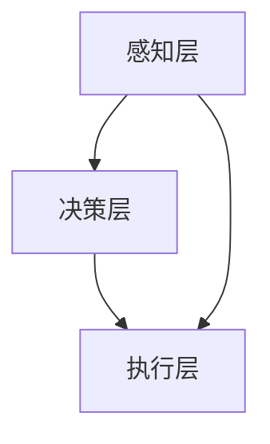

                 


# 开发具有深度强化学习能力的AI Agent

## 关键词：
AI Agent, 深度强化学习, 强化学习, 人工智能, 系统架构, 算法实现

## 摘要：
本文旨在详细探讨开发具有深度强化学习能力的AI Agent的核心概念、算法原理、系统架构设计以及实际项目实现。通过逐步分析，帮助读者理解如何将深度强化学习应用于AI Agent的开发中，掌握相关算法的实现技巧，并通过实际案例加深对系统的理解。本文适合有一定AI基础的读者，旨在提供从理论到实践的全面指导。

---

# 第1章: AI Agent与深度强化学习概述

## 1.1 AI Agent的基本概念

### 1.1.1 AI Agent的定义与分类
AI Agent（人工智能代理）是指在环境中能够感知并自主行动以实现目标的智能体。AI Agent可以分为简单反射型、基于模型型、目标驱动型和效用驱动型等。

**简单反射型AI Agent**：基于当前感知直接做出反应，适用于简单的决策场景。

**基于模型型AI Agent**：维护对环境的内部模型，能够进行预测和规划。

**目标驱动型AI Agent**：根据预定义的目标选择行动，优化行动序列以达到目标。

**效用驱动型AI Agent**：通过最大化效用函数来选择行动，适用于复杂的多目标决策场景。

### 1.1.2 深度强化学习的定义与特点
深度强化学习（Deep Reinforcement Learning, DRL）是强化学习与深度学习的结合。强化学习通过试错机制，学习如何采取行动以最大化累积奖励；深度学习则用于处理复杂环境中的高维状态空间。

**深度强化学习的特点**：
- **端到端学习**：直接从输入到输出进行端到端的学习，无需手动提取特征。
- **处理高维状态**：能够处理图像、语音等高维数据。
- **自适应性**：能够根据环境动态调整策略。

### 1.1.3 AI Agent与深度强化学习的结合
AI Agent通过深度强化学习技术，能够更好地感知环境、做出决策并执行动作。这种结合使得AI Agent在复杂动态环境中表现出更强的适应性和自主性。

---

## 1.2 深度强化学习的核心原理

### 1.2.1 强化学习的基本原理
强化学习通过智能体与环境的交互，学习最优策略。智能体通过执行动作获得奖励，逐步优化策略以最大化累积奖励。

**关键概念**：
- **状态（State）**：智能体所处的环境情况。
- **动作（Action）**：智能体在给定状态下选择的行为。
- **奖励（Reward）**：智能体执行动作后获得的反馈，用于指导策略优化。
- **策略（Policy）**：智能体选择动作的概率分布。

### 1.2.2 深度学习在强化学习中的应用
深度学习用于处理强化学习中的高维状态空间和动作空间。例如，使用卷积神经网络（CNN）处理图像信息，使用循环神经网络（RNN）处理序列数据。

### 1.2.3 深度强化学习的数学模型
深度强化学习结合了强化学习和深度学习的数学模型。例如，深度Q网络（DQN）的数学模型如下：

$$ Q(s, a) = \theta^T \phi(s, a) $$

其中，$\theta$ 是模型参数，$\phi(s, a)$ 是状态-动作对的特征向量。

---

## 1.3 AI Agent的开发背景与应用前景

### 1.3.1 AI Agent在各个领域的应用
- **游戏AI**：在游戏环境中进行决策和控制。
- **机器人控制**：实现自主决策和动作执行。
- **自动驾驶**：通过感知和决策实现自主驾驶。
- **智能推荐系统**：根据用户行为推荐个性化内容。

### 1.3.2 深度强化学习在AI Agent中的优势
- **处理复杂环境**：深度强化学习能够处理高维、动态的环境。
- **自适应性**：能够根据环境变化自适应调整策略。
- **端到端学习**：直接从输入到输出进行学习，简化了特征工程。

### 1.3.3 当前AI Agent开发的挑战与机遇
- **挑战**：复杂环境中的决策不确定性，计算资源需求高，算法收敛速度慢。
- **机遇**：随着计算能力的提升和算法的改进，深度强化学习在更多领域的应用成为可能。

---

## 1.4 本章小结
本章介绍了AI Agent和深度强化学习的基本概念、核心原理以及应用前景。通过结合深度强化学习和AI Agent，我们可以开发出更智能、更自主的智能体，能够处理复杂的动态环境。

---

# 第2章: 深度强化学习的核心原理

## 2.1 深度强化学习的基本原理

### 2.1.1 状态、动作、奖励的定义
- **状态（State）**：智能体所处的环境情况，如游戏中的棋盘状态。
- **动作（Action）**：智能体在给定状态下选择的行为，如移动方向。
- **奖励（Reward）**：智能体执行动作后获得的反馈，如得分增加。

### 2.1.2 策略与价值函数的定义
- **策略（Policy）**：智能体选择动作的概率分布，$\pi(a|s)$ 表示在状态$s$下选择动作$a$的概率。
- **价值函数（Value Function）**：衡量状态或状态-动作对的价值，如$Q(s, a)$ 表示在状态$s$下执行动作$a$的预期累积奖励。

### 2.1.3 深度强化学习的数学模型
深度强化学习通过神经网络来近似策略或价值函数。例如，使用神经网络近似$Q(s, a)$：

$$ Q(s, a) = w^T \phi(s, a) $$

其中，$w$ 是神经网络的权重，$\phi(s, a)$ 是状态-动作对的特征向量。

---

## 2.2 深度强化学习的主要算法

### 2.2.1 Q-Learning算法
Q-Learning是一种经典的强化学习算法，通过更新Q值表来学习最优策略：

$$ Q(s, a) = Q(s, a) + \alpha [r + \gamma \max Q(s', a') - Q(s, a)] $$

其中，$\alpha$ 是学习率，$\gamma$ 是折扣因子。

### 2.2.2 Deep Q-Networks (DQN)算法
DQN算法将Q-Learning与深度神经网络结合，通过经验回放和目标网络来稳定训练：

1. 经验回放：将经验存储在回放缓冲区，随机抽取样本进行训练。
2. 目标网络：使用目标网络作为Q值的参考，减少更新的不稳定。

### 2.2.3 Policy Gradient方法
Policy Gradient方法直接优化策略，通过梯度上升最大化累积奖励：

$$ \theta = \theta + \alpha \nabla_\theta J(\theta) $$

其中，$J(\theta)$ 是累积奖励的期望。

### 2.2.4 Actor-Critic方法
Actor-Critic方法同时学习策略（Actor）和价值函数（Critic），通过策略梯度和价值梯度的结合来优化：

1. Actor网络负责生成动作，$a = \pi(s)$。
2. Critic网络负责评估状态-动作对的价值，$Q(s, a)$。

---

## 2.3 深度强化学习的优缺点

### 2.3.1 深度强化学习的优势
- **处理高维状态**：能够处理图像、语音等高维数据。
- **端到端学习**：直接从输入到输出进行学习，简化了特征工程。
- **自适应性**：能够根据环境变化自适应调整策略。

### 2.3.2 深度强化学习的局限性
- **计算资源需求高**：训练深度强化学习模型需要大量的计算资源。
- **收敛速度慢**：在复杂环境中，算法收敛速度较慢。
- **探索与利用的平衡**：如何在探索新策略和利用已知策略之间取得平衡是一个挑战。

---

## 2.4 本章小结
本章详细介绍了深度强化学习的核心原理，包括Q-Learning、DQN、Policy Gradient和Actor-Critic等算法。这些算法为AI Agent的开发提供了丰富的工具和方法。

---

# 第3章: AI Agent的系统架构设计

## 3.1 AI Agent的系统架构概述

### 3.1.1 感知层
感知层负责从环境中获取信息，如视觉、听觉等。常用的感知方法包括图像处理、语音识别和自然语言处理。

### 3.1.2 决策层
决策层负责根据感知信息选择最优动作。常用的决策方法包括基于规则的决策、基于模型的决策和基于学习的决策。

### 3.1.3 执行层
执行层负责将决策层选择的动作转化为具体的操作，如移动机器人、发送指令等。

---

## 3.2 深度强化学习在AI Agent中的应用

### 3.2.1 状态表示
状态表示是深度强化学习的关键，常用的表示方法包括图像表示、向量表示和符号表示。

### 3.2.2 动作选择
动作选择是AI Agent的核心，常用的策略包括贪心策略、ε-贪心策略和策略网络。

### 3.2.3 奖励机制
奖励机制是强化学习的核心，常用的奖励设计方法包括基于任务的奖励、基于进度的奖励和基于行为的奖励。

---

## 3.3 AI Agent的系统架构图



---

## 3.4 本章小结
本章介绍了AI Agent的系统架构，包括感知层、决策层和执行层，并详细探讨了深度强化学习在各层中的应用。

---

# 第4章: 深度强化学习算法的实现与优化

## 4.1 深度强化学习算法的实现

### 4.1.1 DQN算法的实现
DQN算法的实现步骤如下：

1. 初始化经验回放缓冲区和目标网络。
2. 环境中获取当前状态$s$。
3. 根据策略网络选择动作$a$。
4. 执行动作，获取新的状态$s'$和奖励$r$。
5. 将经验$(s, a, r, s')$存储在回放缓冲区。
6. 从回放缓冲区随机抽取一批经验进行训练。
7. 更新策略网络，使其逼近目标网络。

### 4.1.2 DQN算法的代码实现

```python
import numpy as np
import gym
import tensorflow as tf

class DQN:
    def __init__(self, state_space, action_space, learning_rate=0.01, gamma=0.99, epsilon=1.0, epsilon_min=0.01, epsilon_decay=0.995):
        self.state_space = state_space
        self.action_space = action_space
        self.learning_rate = learning_rate
        self.gamma = gamma
        self.epsilon = epsilon
        self.epsilon_min = epsilon_min
        self.epsilon_decay = epsilon_decay
        
        self.model = self.build_model()
        self.target_model = self.build_model()
        
    def build_model(self):
        model = tf.keras.Sequential([
            tf.keras.layers.Dense(64, activation='relu', input_dim=self.state_space),
            tf.keras.layers.Dense(self.action_space, activation='linear')
        ])
        model.compile(optimizer=tf.keras.optimizers.Adam(lr=self.learning_rate), loss='mse')
        return model
    
    def act(self, state):
        if np.random.random() < self.epsilon:
            return np.random.randint(self.action_space)
        else:
            q_values = self.model.predict(state[np.newaxis])
            return np.argmax(q_values[0])
    
    def remember(self, state, action, reward, next_state):
        self.memory.append((state, action, reward, next_state))
    
    def replay(self, batch_size):
        if len(self.memory) < batch_size:
            return
        minibatch = random.sample(self.memory, batch_size)
        states = np.array([tup[0] for tup in minibatch])
        actions = np.array([tup[1] for tup in minibatch])
        rewards = np.array([tup[2] for tup in minibatch])
        next_states = np.array([tup[3] for tup in minibatch])
        
        target = self.target_model.predict(next_states)
        target_q = rewards + self.gamma * np.max(target, axis=1)
        
        q_values = self.model.predict(states)
        q_values[np.arange(batch_size), actions] = target_q
        
        self.model.fit(states, q_values, epochs=1, verbose=0)
    
    def decay_epsilon(self):
        self.epsilon = max(self.epsilon * self.epsilon_decay, self.epsilon_min)
```

### 4.1.3 算法优化
- **经验回放**：通过随机抽取经验来减少相关样本的偏差。
- **目标网络**：使用目标网络作为Q值的参考，减少更新的不稳定。

---

## 4.2 算法实现的数学模型

### 4.2.1 DQN算法的数学模型
DQN算法通过神经网络近似Q值函数：

$$ Q(s, a) = w^T \phi(s, a) $$

其中，$w$ 是神经网络的权重，$\phi(s, a)$ 是状态-动作对的特征向量。

---

## 4.3 本章小结
本章详细介绍了深度强化学习算法的实现，包括DQN算法的代码实现和数学模型。通过这些实现，我们可以更好地理解深度强化学习在AI Agent中的应用。

---

# 第5章: 深度强化学习在AI Agent中的应用案例

## 5.1 项目背景与目标
本项目旨在开发一个基于深度强化学习的AI Agent，能够在复杂环境中自主决策。

## 5.2 系统功能设计
系统功能设计包括状态感知、动作选择和奖励机制。

### 5.2.1 状态感知
通过图像处理技术获取环境状态。

### 5.2.2 动作选择
使用DQN算法选择最优动作。

### 5.2.3 奖励机制
设计奖励函数，根据环境反馈给予奖励。

## 5.3 项目实现

### 5.3.1 环境安装
安装必要的库和框架，如TensorFlow、Keras、OpenAI Gym等。

### 5.3.2 系统核心实现
实现AI Agent的感知、决策和执行模块。

### 5.3.3 代码实现
以下是AI Agent的实现代码：

```python
import gym
import numpy as np
import tensorflow as tf

class AI_Agent:
    def __init__(self, env):
        self.env = env
        self.state_space = env.observation_space.shape[0]
        self.action_space = env.action_space.n
        self.model = self.build_model()
        
    def build_model(self):
        model = tf.keras.Sequential([
            tf.keras.layers.Dense(64, activation='relu', input_dim=self.state_space),
            tf.keras.layers.Dense(self.action_space, activation='linear')
        ])
        model.compile(optimizer=tf.keras.optimizers.Adam(lr=0.001), loss='mse')
        return model
    
    def act(self, state):
        q_values = self.model.predict(state[np.newaxis])
        return np.argmax(q_values[0])
    
    def train(self, episodes=1000):
        for episode in range(episodes):
            state = self.env.reset()
            total_reward = 0
            while True:
                action = self.act(state)
                next_state, reward, done, _ = self.env.step(action)
                total_reward += reward
                self.remember(state, action, reward, next_state)
                self.replay(32)
                state = next_state
                if done:
                    break
            print(f'Episode {episode+1}, Reward: {total_reward}')

    def remember(self, state, action, reward, next_state):
        self.memory.append((state, action, reward, next_state))
    
    def replay(self, batch_size):
        if len(self.memory) < batch_size:
            return
        minibatch = random.sample(self.memory, batch_size)
        states = np.array([tup[0] for tup in minibatch])
        actions = np.array([tup[1] for tup in minibatch])
        rewards = np.array([tup[2] for tup in minibatch])
        next_states = np.array([tup[3] for tup in minibatch])
        
        target = self.model.predict(next_states)
        target_q = rewards + 0.99 * np.max(target, axis=1)
        
        q_values = self.model.predict(states)
        q_values[np.arange(batch_size), actions] = target_q
        
        self.model.fit(states, q_values, epochs=1, verbose=0)
```

### 5.3.4 代码解读与分析
- **AI_Agent类**：封装了AI Agent的核心功能，包括感知、决策和执行。
- **build_model方法**：构建深度神经网络模型。
- **act方法**：根据当前状态选择动作。
- **train方法**：训练AI Agent，更新模型参数。
- **remember方法**：将经验存储在回放缓冲区。
- **replay方法**：从回放缓冲区抽取经验进行训练。

## 5.4 项目小结
本项目通过实现一个基于DQN算法的AI Agent，展示了深度强化学习在复杂环境中的应用。通过训练，AI Agent能够在环境中逐步优化策略，实现自主决策。

---

# 第6章: 最佳实践与注意事项

## 6.1 开发AI Agent的最佳实践
- **选择合适的算法**：根据任务需求选择合适的深度强化学习算法。
- **设计合理的奖励机制**：奖励机制是训练成功的关键。
- **优化算法参数**：合理调整学习率、折扣因子等参数。
- **使用经验回放**：通过经验回放提高训练效率。

## 6.2 开发AI Agent的注意事项
- **计算资源需求高**：训练深度强化学习模型需要大量的计算资源。
- **算法收敛速度慢**：在复杂环境中，算法收敛速度较慢。
- **探索与利用的平衡**：如何在探索新策略和利用已知策略之间取得平衡是一个挑战。

## 6.3 未来发展趋势
- **多智能体协作**：研究多个AI Agent协作的场景，如多机器人协作、自动驾驶等。
- **实时决策**：研究如何在实时环境中进行决策和行动。
- **结合其他技术**：将深度强化学习与其他技术结合，如与自然语言处理结合，实现更复杂的任务。

---

# 作者：AI天才研究院/AI Genius Institute & 禅与计算机程序设计艺术 /Zen And The Art of Computer Programming

---

本文详细探讨了开发具有深度强化学习能力的AI Agent的核心概念、算法原理、系统架构设计以及实际项目实现。通过逐步分析，帮助读者理解如何将深度强化学习应用于AI Agent的开发中，掌握相关算法的实现技巧，并通过实际案例加深对系统的理解。希望本文能够为读者在开发AI Agent方面提供有价值的参考和指导。

