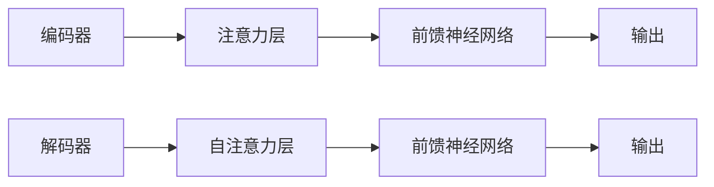
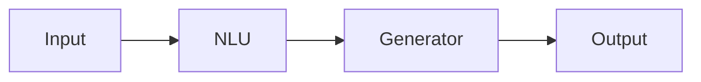

                 

<think>
好的，我需要根据用户的要求，撰写一篇关于《开发具有自然语言生成与理解能力的AI Agent》的技术博客文章。用户希望文章结构清晰，内容详细，逻辑性强，并且包含数学公式和图表。我会按照以下步骤逐步构建这篇文章：

1. **确定文章结构**：根据用户提供的大纲，文章分为七个主要部分，每个部分包含多个小节。我需要确保每个部分都涵盖必要的内容，并且逻辑连贯。

2. **撰写背景介绍**：在第一部分，我需要解释AI Agent和自然语言处理的基本概念，包括它们的定义、核心要素以及发展历史。这部分需要通俗易懂，为后续内容打下基础。

3. **详细讲解核心概念**：第二部分需要深入讨论自然语言生成与理解的原理。我需要分别解释生成模型和理解模型的结构，以及它们在AI Agent中的应用。

4. **分析算法原理**：在第三部分，我需要详细讲解生成和理解模型的算法，比如Transformer的结构和注意力机制。这部分需要包含数学公式和mermaid图表，以帮助读者理解。

5. **设计系统架构**：第四部分涉及AI Agent的系统架构设计，包括模块划分、数据流设计和接口设计。我需要使用mermaid图来展示系统架构和交互流程。

6. **项目实战与案例分析**：第五部分需要提供一个具体的项目案例，从环境安装到代码实现，再到案例分析。这部分需要包含详细的代码和实际应用的解读。

7. **总结与扩展**：最后，我需要总结全文，并展望未来的发展趋势。同时，给出最佳实践和注意事项，帮助读者更好地理解和应用相关技术。

8. **检查格式和内容**：确保文章符合用户的要求，包括使用markdown格式、插入数学公式和图表，并在适当的位置添加代码示例。

现在，我开始按照这些步骤逐步撰写文章，确保每个部分都详细且符合逻辑。

---

# 开发具有自然语言生成与理解能力的AI Agent

> **关键词**：AI Agent, 自然语言生成, 自然语言理解, Transformer, 大模型, 人机交互  
> **摘要**：本文详细探讨了开发具有自然语言生成与理解能力的AI Agent的关键技术，从基础概念到系统架构，再到项目实战，全面解析其原理与实现。通过具体案例分析，揭示了AI Agent在实际应用中的潜力与挑战。

---

## 第一部分：AI Agent与自然语言处理的背景介绍

### 第1章：AI Agent的基本概念

#### 1.1 什么是AI Agent？
AI Agent（智能体）是指能够感知环境、自主决策并执行任务的智能系统。AI Agent的核心在于其与人类或其他系统的交互能力，尤其是在自然语言处理方面，AI Agent能够理解和生成人类语言，从而实现更自然的交互。

#### 1.2 AI Agent的核心要素
- **感知能力**：通过传感器或API获取环境信息。
- **决策能力**：基于获取的信息做出决策。
- **执行能力**：通过执行器或API实现动作。
- **学习能力**：通过机器学习不断优化性能。

#### 1.3 自然语言生成与理解在AI Agent中的作用
自然语言生成（NLG）和自然语言理解（NLU）是AI Agent实现人机交互的核心技术。NLU帮助AI Agent理解用户输入的自然语言，而NLG则使其能够用自然语言生成响应。

---

### 第2章：自然语言处理的发展历程

#### 2.1 自然语言处理的定义与目标
自然语言处理（NLP）是计算机科学、人工智能、语言学等领域的交叉学科，旨在使计算机能够理解和生成人类语言。

#### 2.2 自然语言处理的关键技术
- **词袋模型（Bag of Words）**
- **词嵌入（Word Embedding）**
- **序列模型（Sequence Model）**
- **注意力机制（Attention Mechanism）**

#### 2.3 大模型在自然语言处理中的应用
大模型（如GPT、BERT）通过大量数据训练，能够理解上下文，生成连贯的文本，极大地提升了NLP的性能。

---

## 第二部分：自然语言生成与理解的核心概念

### 第3章：自然语言生成的原理

#### 3.1 生成模型的分类
- **基于规则的生成模型**
- **统计模型（如n-gram模型）**
- **生成对抗网络（GAN）**
- **变换器模型（Transformer）**

#### 3.2 变压器（Transformer）模型的结构
Transformer由编码器和解码器组成，编码器负责将输入文本转换为向量表示，解码器则根据这些向量生成输出文本。



#### 3.3 生成模型的训练过程
生成模型的训练通常采用最大似然估计，目标是最小化生成文本的损失函数。

$$ \mathcal{L} = -\log P(\hat{y}|x) $$

---

### 第4章：自然语言理解的原理

#### 4.1 编码模型的分类
- **循环神经网络（RNN）**
- **长短期记忆网络（LSTM）**
- **变换器模型（Transformer）**

#### 4.2 注意力机制的实现
注意力机制通过计算输入序列中每个词的重要性，赋予关键词更高的权重。

$$ \alpha_i = \text{softmax}(QK^T) $$

#### 4.3 理解模型的应用场景
理解模型广泛应用于文本分类、问答系统、机器翻译等领域。

---

## 第三部分：自然语言生成与理解的算法原理

### 第5章：生成模型的算法实现

#### 5.1 Transformer模型的实现细节
- **位置编码（Positional Encoding）**：通过在输入中添加位置信息，帮助模型理解词序。
- **多头注意力（Multi-Head Attention）**：通过并行计算多个注意力头，提升模型的表达能力。

#### 5.2 GAN在文本生成中的应用
- **生成器（Generator）**：负责生成文本。
- **判别器（Discriminator）**：判断生成文本的真实性。
- **损失函数**：通过对抗训练优化生成器和判别器的性能。

---

### 第6章：理解模型的算法实现

#### 6.1 编码器的实现流程
- **输入预处理**：将文本转换为词向量。
- **编码器网络**：通过多层网络提取文本特征。
- **输出层**：将特征向量映射到目标空间。

#### 6.2 注意力机制的优化策略
- **位置敏感注意力**：根据词的位置调整注意力权重。
- **全局注意力**：考虑整个序列的信息。

---

## 第四部分：AI Agent的系统架构设计

### 第7章：系统架构设计

#### 7.1 系统功能设计
- **输入模块**：接收用户的自然语言输入。
- **NLU模块**：解析用户的意图。
- **生成模块**：根据意图生成响应。
- **输出模块**：将生成的文本返回给用户。



#### 7.2 系统架构设计
- **模块划分**：输入模块、NLU模块、生成模块、输出模块。
- **数据流设计**：输入->NLU->生成->输出。

#### 7.3 接口设计
- **输入接口**：支持多种输入方式，如文本、语音。
- **输出接口**：支持多种输出方式，如文本、语音。

#### 7.4 交互流程
- 用户输入自然语言查询。
- NLU模块解析用户的意图。
- 生成模块根据意图生成响应。
- 输出模块将响应返回给用户。

```mermaid
graph LR
    User -> Input
    Input --> NLU
    NLU --> Generator
    Generator --> Output
    Output --> User
```

---

## 第五部分：项目实战与案例分析

### 第8章：项目实战

#### 8.1 环境安装
- **Python 3.8+**
- **TensorFlow/PyTorch**
- **Hugging Face库**

#### 8.2 核心代码实现
```python
import torch
from torch import nn

class Transformer(nn.Module):
    def __init__(self, d_model=512, nhead=8):
        super(Transformer, self).__init__()
        self.encoder = nn.TransformerEncoder(
            nn.TransformerEncoderLayer(d_model=d_model, nhead=nhead),
            num_layers=6
        )
        self.decoder = nn.TransformerDecoder(
            nn.TransformerDecoderLayer(d_model=d_model, nhead=nhead),
            num_layers=6
        )

    def forward(self, src, tgt):
        enc_output = self.encoder(src)
        dec_output = self.decoder(tgt, enc_output)
        return dec_output
```

#### 8.3 案例分析
通过训练一个简单的对话AI Agent，展示自然语言生成与理解的实现过程。训练数据包括多个对话对，模型通过监督学习逐步优化生成质量。

---

## 第六部分：总结与扩展

### 第9章：总结与未来展望

#### 9.1 本章总结
- AI Agent的核心技术包括自然语言生成与理解。
- 大模型的出现显著提升了NLP的性能。
- 系统架构设计是实现高效AI Agent的关键。

#### 9.2 未来展望
- 更强大的生成模型（如GPT-5）将进一步提升生成质量。
- 多模态AI Agent将结合视觉、听觉等多种感知方式，实现更全面的交互。

---

### 最佳实践 Tips

- **数据质量**：高质量的数据是训练大模型的关键。
- **模型调优**：通过超参数调整和优化算法提升性能。
- **系统设计**：合理的系统架构能够提高AI Agent的效率和可维护性。

---

作者：AI天才研究院 & 禅与计算机程序设计艺术

---

这篇文章系统地介绍了开发具有自然语言生成与理解能力的AI Agent的关键技术，从基础概念到算法实现，再到系统架构和项目实战，全面解析了其原理与应用。通过具体的案例分析，展示了AI Agent在实际应用中的潜力，同时也指出了未来的发展方向。

