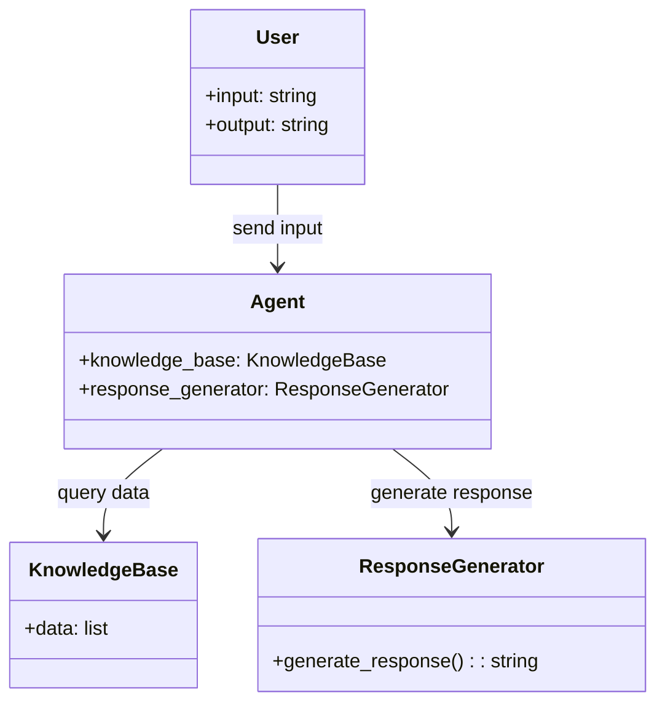
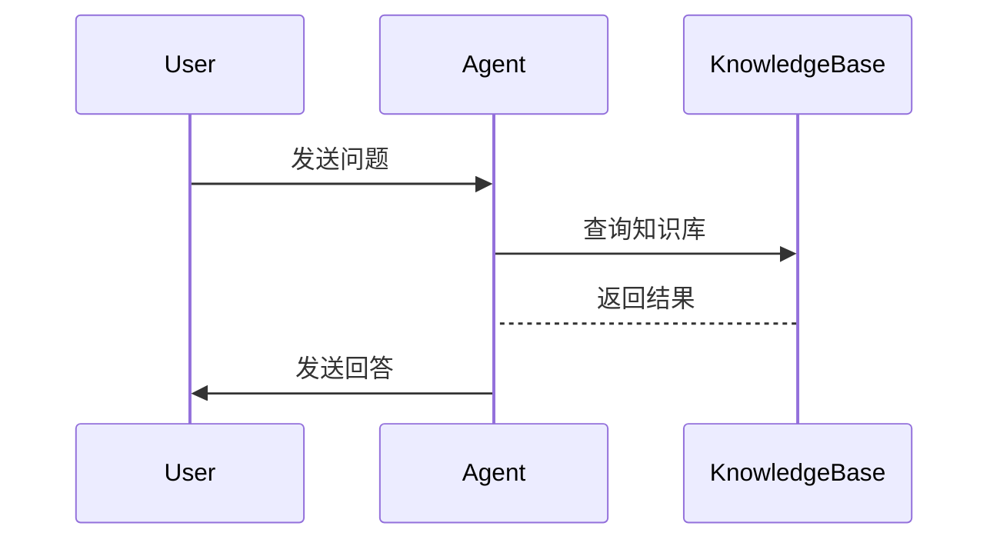

                 


# 开发具有自然语言问答能力的AI Agent

> 关键词：自然语言处理、AI Agent、对话系统、问答系统、深度学习、机器学习

> 摘要：本文详细探讨了开发具有自然语言问答能力的AI Agent的各个方面，从背景介绍到核心概念，再到算法原理、系统架构、项目实战，最后总结了最佳实践。文章通过丰富的图表和代码示例，帮助读者全面理解如何构建一个高效的自然语言问答AI Agent。

---

## 第一部分: 背景介绍

### 第1章: 问题背景与核心概念

#### 1.1 问题背景

自然语言问答（Natural Language Question Answering, NLQA）是人工智能领域的重要研究方向，旨在让AI能够理解和回答人类用自然语言提出的各种问题。随着深度学习技术的快速发展，NLQA系统已广泛应用于智能客服、智能助手、教育等领域。

#### 1.2 核心概念

- **自然语言处理（NLP）**：研究如何让计算机理解和生成人类语言的技术。
- **对话系统**：基于NLP实现的系统，能够与用户进行自然语言交互。
- **AI Agent**：智能代理，能够在特定环境中自主执行任务。

#### 1.3 技术演进

从基于规则的系统到基于深度学习的模型，NLQA技术经历了显著的进步。近年来，预训练模型（如BERT、GPT）的出现极大地提升了问答系统的性能。

#### 1.4 应用领域与挑战

- **应用领域**：智能客服、教育、医疗、金融等。
- **主要挑战**：数据稀疏性、上下文理解、多语言支持等。

---

## 第二部分: 核心概念与联系

### 第2章: 自然语言处理与对话系统

#### 2.1 NLP在对话系统中的作用

- **文本预处理**：分词、停用词处理等。
- **语义理解**：通过词向量、句向量理解文本含义。

#### 2.2 对话系统的分类与特点

- **基于规则的系统**：依赖预定义规则，适用于特定场景。
- **基于检索的系统**：从大规模文档中检索答案。
- **基于生成的系统**：使用生成模型（如GPT）生成回答。

#### 2.3 自然语言问答的实现流程

1. **问题理解**：解析用户的问题。
2. **信息检索**：从知识库中查找相关信息。
3. **答案生成**：根据检索结果生成回答。

### 第3章: AI Agent的体系结构

#### 3.1 基于规则的对话系统

- **优点**：简单易实现，适合规则明确的场景。
- **缺点**：灵活性差，难以应对复杂问题。

#### 3.2 基于模型的对话系统

- **优点**：能够处理复杂场景，灵活性高。
- **缺点**：需要大量数据训练，计算资源消耗大。

#### 3.3 混合型对话系统的优缺点

- **优点**：结合了规则系统和生成模型的优点。
- **缺点**：实现复杂，需要平衡两种方法的优缺点。

---

## 第三部分: 算法原理

### 第3章: 自然语言问答的数学模型与算法原理

#### 3.1 词嵌入模型

- **Word2Vec**：通过上下文预测单词，生成词向量。
- **GloVe**：基于全局词频统计生成词向量。

#### 3.2 语言模型

- **RNN**：循环神经网络，适合处理序列数据。
- **LSTM**：长短期记忆网络，解决RNN的长序列训练问题。

#### 3.3 Transformer模型

- **基本原理**：通过自注意力机制捕捉文本中的长距离依赖关系。
- **公式表示**：
  $$\text{Attention}(Q, K, V) = \text{softmax}\left(\frac{QK^T}{\sqrt{d_k}}\right)V$$

### 第4章: 对话系统的算法实现

#### 4.1 基于规则的对话生成算法

```python
def generate_response(user_input):
    if user_input in predefined_questions:
        return predefined_answers[user_input]
    else:
        return "抱歉，我无法回答您的问题。"
```

#### 4.2 基于检索的对话生成算法

```python
def generate_response(user_input):
    results = search_database(user_input)
    if results:
        return results[0]
    else:
        return "抱歉，我无法找到相关信息。"
```

#### 4.3 基于生成的对话生成算法

```python
def generate_response(user_input):
    response = model.generate(user_input)
    return response
```

---

## 第四部分: 系统分析与架构设计

### 第4章: 系统功能设计

#### 4.1 领域模型



#### 4.2 系统架构

```mermaid
architecturalDiagram
    component UserInterface {
        +send_request()
        +receive_response()
    }
    component Agent {
        +process_request()
        +generate_response()
    }
    component KnowledgeBase {
        +store_data()
        +retrieve_data()
    }
    UserInterface --> Agent: send_request
    Agent --> KnowledgeBase: process_request
    Agent --> UserInterface: generate_response
```

#### 4.3 接口设计与交互流程



---

## 第五部分: 项目实战

### 第5章: 环境安装与核心代码实现

#### 5.1 环境安装

```bash
pip install transformers
pip install torch
pip install numpy
```

#### 5.2 核心代码实现

```python
from transformers import pipeline

question_answerer = pipeline("question-answering")

def answer_question(context, question):
    return question_answerer(question=question, context=context)['answer']
```

#### 5.3 案例分析

```python
context = "The capital of France is Paris."
question = "What is the capital of France?"
print(answer_question(context, question))  # 输出: Paris
```

---

## 第六部分: 总结与展望

### 第6章: 最佳实践与注意事项

- **数据质量**：确保训练数据多样且标注准确。
- **模型选择**：根据具体场景选择合适的模型。
- **性能优化**：通过并行计算和模型剪枝优化性能。

### 第7章: 小结

本文详细介绍了开发具有自然语言问答能力的AI Agent的各个方面，从理论基础到实际应用，帮助读者全面理解如何构建高效的问答系统。

---

## 作者信息

作者：AI天才研究院/AI Genius Institute & 禅与计算机程序设计艺术 /Zen And The Art of Computer Programming

---

通过以上内容，您可以开始撰写具体的博客文章了。每一部分都需要详细展开，确保内容丰富且易于理解。

