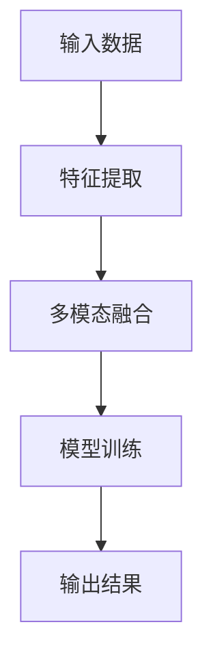

                 


# 开发具有视觉-触觉-语言多模态学习能力的AI Agent

---

## 关键词

- 多模态学习
- AI Agent
- 视觉、触觉、语言
- 多任务学习
- 模态融合

---

## 摘要

随着人工智能技术的快速发展，AI Agent（智能体）在多个领域展现了强大的潜力。然而，单一模态的感知和决策能力往往无法满足复杂场景的需求。本文将探讨如何开发具有视觉、触觉和语言多模态学习能力的AI Agent。通过分析多模态学习的核心概念、算法原理、系统架构以及实际应用案例，本文将详细阐述如何实现AI Agent在多模态环境下的智能感知和决策能力。文章最后将总结多模态学习的关键挑战与未来研究方向。

---

## 第1章: 多模态学习与AI Agent概述

### 1.1 多模态学习的背景与意义

#### 1.1.1 多模态学习的背景

在人工智能领域，单模态学习（如仅依赖视觉或语言）在许多场景中表现出局限性。例如，在机器人操作中，仅依赖视觉信息难以完成复杂的任务，因为触觉信息对于抓取和操作物体至关重要。类似地，在自然语言处理中，结合视觉信息（如图像或视频）可以显著提升语义理解能力。

#### 1.1.2 多模态学习的意义

多模态学习通过整合多种模态的信息，能够提升AI Agent的感知能力、决策能力和交互能力。具体而言，多模态学习可以让AI Agent在复杂环境中更好地理解任务需求，提高任务完成的准确性和效率。

#### 1.1.3 多模态学习的应用领域

- **机器人技术**：结合视觉和触觉信息进行物体识别和操作。
- **自然语言处理**：通过结合视觉信息（如图像）进行跨模态理解。
- **增强现实**：通过整合视觉和语言信息提供更丰富的交互体验。
- **医疗健康**：结合医学影像（视觉）和患者症状（语言）进行诊断辅助。

### 1.2 AI Agent的定义与特点

#### 1.2.1 AI Agent的定义

AI Agent是一种能够感知环境、自主决策并执行任务的智能实体。它可以是一个软件程序、一个机器人，或者嵌入在智能设备中的算法。

#### 1.2.2 AI Agent的核心特点

- **自主性**：能够在没有外部干预的情况下自主完成任务。
- **反应性**：能够实时感知环境变化并做出响应。
- **学习能力**：能够通过经验改进自身性能。
- **社交能力**：能够与人类或其他智能体进行交互和协作。

#### 1.2.3 AI Agent与传统AI的区别

传统AI通常依赖预定义的规则和数据，而AI Agent具有更强的自主性和适应性，能够在动态环境中完成任务。

### 1.3 多模态学习在AI Agent中的作用

#### 1.3.1 多模态学习的必要性

在复杂环境中，单一模态的信息往往不足以支持AI Agent完成任务。例如，在智能客服场景中，结合客户的语音情感（语言）和面部表情（视觉）信息，可以更准确地理解客户的需求。

#### 1.3.2 多模态学习如何提升AI Agent的能力

通过整合多种模态的信息，AI Agent可以更全面地理解环境，从而做出更准确的决策。

#### 1.3.3 多模态学习的挑战与机遇

- **挑战**：不同模态的数据格式和特征维度差异较大，如何有效融合这些信息是一个难点。
- **机遇**：多模态学习能够显著提升AI Agent的智能水平，使其在更多场景中实现高效应用。

---

## 第2章: 多模态学习的核心概念与联系

### 2.1 多模态学习的核心原理

#### 2.1.1 多模态数据的定义与特征

- **视觉模态**：图像、视频等视觉信息。
- **触觉模态**：力反馈、温度等触觉信息。
- **语言模态**：文本、语音等语言信息。

#### 2.1.2 多模态数据的融合方法

- **特征级融合**：在特征提取阶段对不同模态的特征进行融合。
- **决策级融合**：在决策阶段对不同模态的输出结果进行融合。

#### 2.1.3 多模态学习的数学模型

多模态学习的数学模型通常涉及多个模态的特征表示和融合方法。例如，可以使用多模态注意力机制来聚合不同模态的信息。

### 2.2 多模态学习的特征对比

#### 2.2.1 视觉、触觉、语言的特征维度对比

| 模态 | 特征维度 | 描述 |
|------|----------|------|
| 视觉 | 像素值、颜色、形状 | 图像或视频中的像素信息 |
| 触觉 | 力度、温度、压力 | 物体表面的触感信息 |
| 语言 | 词向量、语法结构 | 文本或语音的语义信息 |

#### 2.2.2 各模态特征的处理方式对比

| 模态 | 处理方式 | 示例 |
|------|----------|------|
| 视觉 | 图像分类、目标检测 | 使用CNN进行图像分类 |
| 触觉 | 力反馈处理、触觉识别 | 使用传感器数据进行物体识别 |
| 语言 | 词嵌入、序列模型 | 使用Word2Vec或LSTM进行文本处理 |

#### 2.2.3 模态特征的权重分配

在多模态学习中，不同模态的特征权重可能不同。例如，在图像识别任务中，视觉信息的权重可能高于触觉信息。

### 2.3 多模态学习的ER实体关系图

ER实体关系图用于描述多模态学习中的实体及其关系。例如：

- **实体**：视觉数据、触觉数据、语言数据
- **关系**：视觉数据与触觉数据的关联，触觉数据与语言数据的关联，语言数据与视觉数据的关联

---

## 第3章: 多模态学习的算法原理

### 3.1 多模态学习的主要算法

#### 3.1.1 多任务学习

多任务学习是一种通过同时学习多个相关任务来提升模型性能的方法。例如，可以在视觉模态和语言模态上同时进行图像分类和文本分类。

#### 3.1.2 跨模态对齐

跨模态对齐的目标是将不同模态的数据对齐到同一个语义空间。例如，可以通过对比学习将图像和文本对齐。

#### 3.1.3 多模态注意力机制

多模态注意力机制允许模型在不同模态之间分配注意力权重，从而更好地融合多模态信息。

### 3.2 多模态学习算法的流程图

以下是一个多模态学习算法的流程图：



---

## 第4章: 多模态学习的系统分析与架构设计

### 4.1 问题场景介绍

在智能客服场景中，AI Agent需要结合客户的语音情感（语言模态）和面部表情（视觉模态）信息来提供更个性化的服务。

### 4.2 系统功能设计

系统功能设计包括：

- **感知模块**：负责获取多模态数据。
- **融合模块**：负责对多模态数据进行融合。
- **决策模块**：负责根据融合后的数据做出决策。

### 4.3 系统架构设计

系统架构设计包括：

- **数据层**：存储多模态数据。
- **模型层**：实现多模态学习算法。
- **接口层**：提供API供上层应用调用。

### 4.4 系统交互设计

系统交互设计包括：

- **输入接口**：接收多模态数据。
- **输出接口**：返回决策结果。

---

## 第5章: 项目实战

### 5.1 环境安装

需要安装以下环境：

- Python 3.8+
- PyTorch 1.9+
- Transformers库

### 5.2 系统核心实现源代码

以下是一个简单的多模态学习代码示例：

```python
import torch
from torch import nn
import numpy as np

class MultimodalModel(nn.Module):
    def __init__(self, visual_dim, tactile_dim, language_dim):
        super().__init__()
        self.visual_layer = nn.Linear(visual_dim, 128)
        self.tactile_layer = nn.Linear(tactile_dim, 128)
        self.language_layer = nn.Linear(language_dim, 128)
        self.attention = nn.MultiheadAttention(128, 2)
        self.output_layer = nn.Linear(128, 1)

    def forward(self, visual_features, tactile_features, language_features):
        visual_out = self.visual_layer(visual_features)
        tactile_out = self.tactile_layer(tactile_features)
        language_out = self.language_layer(language_features)
        combined = torch.stack([visual_out, tactile_out, language_out], dim=0)
        attn_output, _ = self.attention(combined, combined, combined)
        output = self.output_layer(attn_output.mean(dim=0))
        return output
```

### 5.3 代码应用解读与分析

上述代码实现了一个简单的多模态模型，通过多头注意力机制对不同模态的特征进行融合。

### 5.4 实际案例分析

以智能客服场景为例，可以通过上述模型结合客户的语音情感和面部表情信息，提供更个性化的服务。

### 5.5 项目小结

通过本项目，我们可以看到多模态学习在AI Agent中的巨大潜力。

---

## 结论

多模态学习能够显著提升AI Agent的智能水平，使其在更多场景中实现高效应用。然而，多模态学习也面临诸多挑战，例如不同模态数据的融合问题。未来的研究方向包括如何更高效地融合多模态信息，以及如何提升模型的可解释性。

---

## 作者

作者：AI天才研究院/AI Genius Institute & 禅与计算机程序设计艺术 /Zen And The Art of Computer Programming

