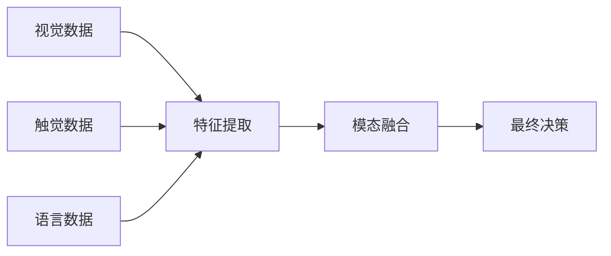
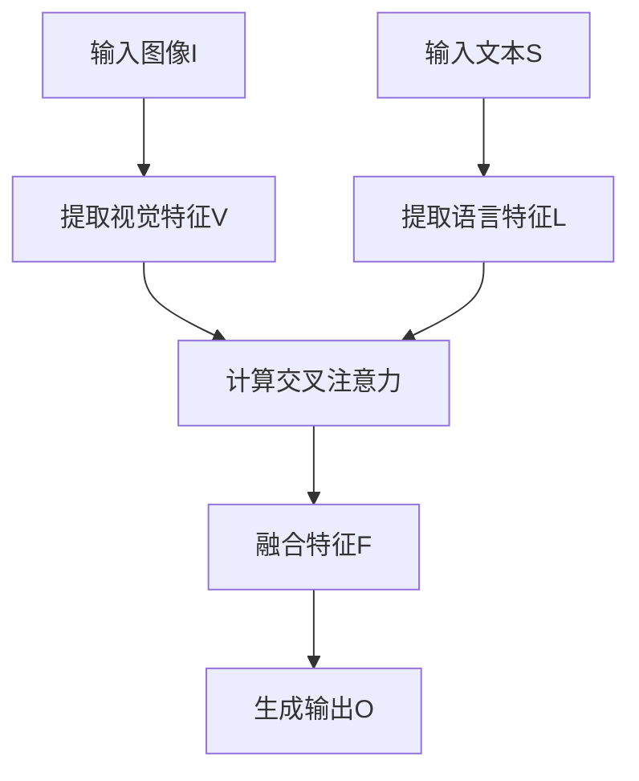
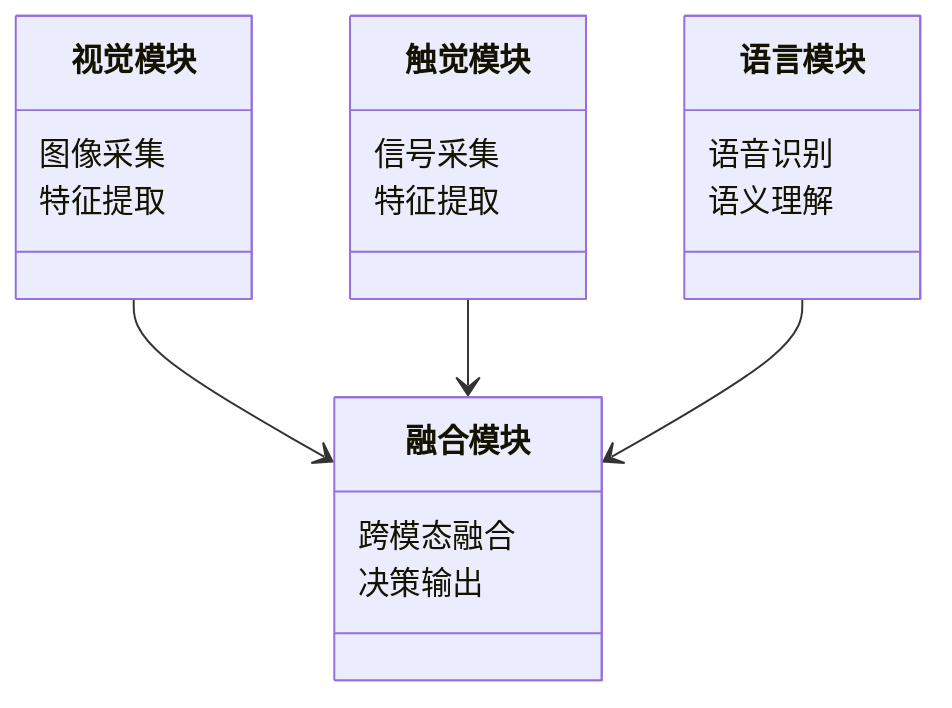
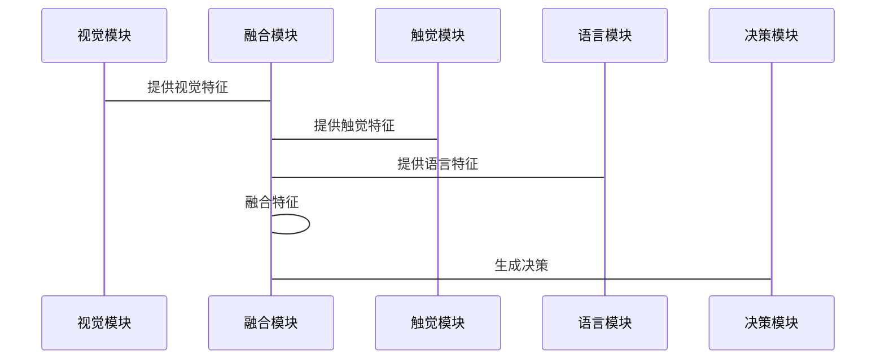

                 


# 开发具有视觉-触觉-语言多模态融合能力的AI Agent

## 关键词：多模态AI Agent，视觉-触觉-语言融合，跨模态注意力机制，端到端学习，深度学习

## 摘要：  
本文详细探讨了开发具有视觉、触觉和语言多模态融合能力的AI Agent的核心概念、算法原理和系统架构。通过分析多模态数据的异构性和融合挑战，本文提出了基于跨模态注意力机制的端到端学习框架，并结合实际应用场景，设计了系统的功能模块和架构。文章最后通过项目实战展示了如何实现这一AI Agent，并展望了未来的发展方向。

---

# 第一部分: 多模态AI Agent的背景与核心概念

## 第1章: 多模态AI Agent的背景与问题描述

### 1.1 多模态AI Agent的背景  
随着人工智能技术的快速发展，单一模态的AI系统逐渐暴露出其局限性。例如，视觉模型无法理解语言指令，触觉模型难以结合视觉信息进行决策。为了使AI Agent能够更全面地感知和理解环境，多模态融合成为必然趋势。  

**1.1.1 多模态计算的兴起**  
多模态计算是指将多种不同类型的数据（如图像、文本、声音、触觉信号等）结合起来，以提高计算系统的感知能力和决策能力。近年来，随着深度学习技术的进步，多模态计算在计算机视觉、自然语言处理和机器人技术等领域得到了广泛应用。  

**1.1.2 AI Agent的发展现状**  
AI Agent是一种能够自主感知环境、执行任务的智能体。传统的AI Agent通常依赖单一模态的信息处理，例如基于视觉的图像识别或基于语言的对话系统。然而，单一模态的处理能力有限，难以应对复杂的实际场景。  

**1.1.3 多模态融合的必要性**  
在现实场景中，AI Agent需要同时处理多种信息源。例如，一个机器人在操作物体时，需要结合视觉信息（物体形状、位置）和触觉信息（物体材质、重量）来完成任务。多模态融合能够显著提升AI Agent的感知能力和决策精度。

---

### 1.2 多模态AI Agent的核心问题  
多模态AI Agent的开发面临以下核心问题：  

**1.2.1 视觉、触觉与语言的融合挑战**  
不同模态的数据具有不同的特征和语义空间，如何有效地将它们融合在一起是关键问题。  

**1.2.2 多模态数据的异构性问题**  
视觉数据是高维的图像矩阵，触觉数据是时间序列的信号，语言数据是文本序列。这些数据的异构性增加了融合的难度。  

**1.2.3 跨模态信息的协同与冲突**  
不同模态的信息可能存在冲突，例如视觉信息可能与语言指令不一致。如何协调这些冲突是融合过程中的另一个挑战。  

---

### 1.3 问题的解决思路  
为了解决上述问题，本文提出以下解决思路：  

**1.3.1 多模态数据的统一表示方法**  
将不同模态的数据映射到一个统一的特征空间，以便于后续的融合处理。  

**1.3.2 跨模态注意力机制的设计**  
通过注意力机制，动态地调整不同模态之间的权重，实现信息的协同与优化。  

**1.3.3 端到端的多模态学习框架**  
构建一个端到端的深度学习模型，直接从多模态输入中学习融合后的表示，避免传统方法中复杂的特征工程。  

---

### 1.4 问题的边界与外延  
**1.4.1 多模态AI Agent的适用场景**  
适用于需要处理多种信息源的场景，例如智能机器人、增强现实设备和智能助手等。  

**1.4.2 与单模态AI的区别**  
多模态AI Agent能够同时处理多种模态信息，而单模态AI仅依赖一种模态信息。  

**1.4.3 多模态融合的极限与可能性**  
多模态融合的极限在于不同模态数据之间的可解释性和可融合性，而可能性则取决于技术的进步和应用场景的需求。  

---

### 1.5 核心概念结构与要素  
多模态AI Agent的核心要素包括：  

1. **模态输入**：视觉、触觉和语言的原始数据。  
2. **特征提取**：对每种模态数据进行特征提取，得到低维表示。  
3. **模态融合**：将不同模态的特征进行融合，得到统一的表示。  
4. **决策模块**：基于融合后的表示，生成最终的决策或输出。  

---

# 第二部分: 多模态融合的核心概念与联系

## 第2章: 多模态融合的原理与方法  

### 2.1 多模态数据的处理与表示  
**2.1.1 视觉数据的特征提取**  
使用卷积神经网络（CNN）提取图像的高层次特征，例如VGG、ResNet等。  

**2.1.2 触觉数据的信号处理**  
将触觉信号（如压力、温度）转化为时间序列数据，并使用循环神经网络（RNN）进行特征提取。  

**2.1.3 语言数据的语义表示**  
使用预训练语言模型（如BERT、GPT）提取文本的语义向量。  

---

### 2.2 跨模态注意力机制  
**2.2.1 注意力机制的基本原理**  
注意力机制通过计算输入数据中每个部分的重要性权重，聚焦于关键信息。  

**2.2.2 跨模态注意力的实现方式**  
跨模态注意力机制允许不同模态之间的信息交互，例如视觉特征与语言特征的联合注意力。  

**2.2.3 不同模态间的权重分配**  
通过交叉注意力机制，动态调整不同模态的权重，实现信息的协同优化。  

---

### 2.3 多模态融合的数学模型  
**2.3.1 模态间的关系建模**  
假设视觉特征为$V \in \mathbb{R}^{d_v}$，语言特征为$L \in \mathbb{R}^{d_l}$，则融合后的表示$F$可以表示为：  
$$ F = \sigma(W_v V + W_l L + b) $$  
其中，$\sigma$为激活函数，$W_v$和$W_l$为权重矩阵，$b$为偏置项。  

**2.3.2 融合函数的设计**  
融合函数可以采用加性、乘性或注意力机制等多种方式。例如，加性融合：  
$$ F = V + L $$  

**2.3.3 端到端的融合框架**  
端到端的融合框架通过深度学习模型直接学习模态间的最优融合方式，避免手动设计特征。  

---

### 2.4 核心概念对比分析  
下表对比了视觉、触觉和语言数据的特征：  

| 模态类型 | 数据形式 | 特征维度 | 语义信息 |  
|----------|----------|----------|----------|  
| 视觉     | 图像矩阵  | 高维      | 空间信息 |  
| 触觉     | 时间序列 | 低维      | 物理属性 |  
| 语言     | 文本序列  | 高维      | 语义信息 |  

---

### 2.5 实体关系图  


---

## 第3章: 多模态融合的算法实现  

### 3.1 多模态编码与融合算法  
**3.1.1 模态编码网络**  
每个模态数据通过编码网络提取特征。例如，视觉编码网络：  
$$ V = \text{CNN}(I) $$  
语言编码网络：  
$$ L = \text{BERT}(S) $$  

**3.1.2 融合模块**  
通过交叉注意力机制融合视觉和语言特征：  
$$ F = \text{CrossAttention}(V, L) $$  

---

### 3.2 端到端多模态学习框架  
整体模型的结构如下：  
$$ F = f(V, L) $$  
其中，$f$为端到端的融合函数。  

---

### 3.3 算法流程图  


---

# 第四部分: 系统架构与实现

## 第4章: 多模态AI Agent的系统架构设计  

### 4.1 问题场景介绍  
以一个智能机器人为例，机器人需要通过视觉、触觉和语言模态来感知环境并执行任务。  

---

### 4.2 系统功能设计  
系统功能模块包括：  
1. **视觉模块**：图像采集与特征提取。  
2. **触觉模块**：触觉信号采集与特征提取。  
3. **语言模块**：语音识别与语义理解。  
4. **融合模块**：跨模态特征融合与决策。  

---

### 4.3 系统架构图  


---

### 4.4 接口与交互设计  
**系统接口**：  
- 视觉模块接口：提供图像特征提取服务。  
- 触觉模块接口：提供触觉信号处理服务。  
- 语言模块接口：提供文本理解和生成服务。  

**交互流程图**：  


---

# 第五部分: 项目实战

## 第5章: 多模态AI Agent的实现  

### 5.1 环境安装与配置  
安装必要的库：  
- 视觉处理：OpenCV、TensorFlow  
- 语言处理：TensorFlow、NLTK  
- 触觉处理：传感器SDK  

---

### 5.2 系统核心实现  

**5.2.1 视觉模块代码**  
```python
import tensorflow as tf
from tensorflow.keras import layers

def visual_encoder(input_shape):
    model = tf.keras.Sequential()
    model.add(layers.Conv2D(32, (3,3), activation='relu', input_shape=input_shape))
    model.add(layers.MaxPooling2D((2,2)))
    model.add(layers.Flatten())
    model.add(layers.Dense(64, activation='relu'))
    return model
```

**5.2.2 语言模块代码**  
```python
import tensorflow as tf
from tensorflow.keras import layers

def language_encoder(vocab_size, embedding_dim):
    model = tf.keras.Sequential()
    model.add(layers.Embedding(vocab_size, embedding_dim))
    model.add(layers.LSTM(64, return_sequences=False))
    return model
```

**5.2.3 融合模块代码**  
```python
def cross_attention(v, l):
    # v: (batch_size, d_v)
    # l: (batch_size, d_l)
    W_q = tf.Variable(tf.random.normal((d_v, 1)))
    W_k = tf.Variable(tf.random.normal((d_l, 1)))
    W_v = tf.Variable(tf.random.normal((d_l, d_f)))
    
    q = tf.matmul(v, W_q)
    k = tf.matmul(l, W_k)
    v_ = tf.matmul(l, W_v)
    
    attention = tf.nn.softmax(q + k, axis=0)
    f = tf.matmul(attention, v_)
    return f
```

---

### 5.3 案例分析与解读  
以物体识别任务为例，系统首先通过视觉模块获取物体的形状和颜色，通过触觉模块获取物体的材质和重量，通过语言模块接收用户的指令。融合模块将这些信息进行整合，生成最终的识别结果。  

---

## 第6章: 总结与展望  

### 6.1 总结  
本文详细探讨了开发具有视觉、触觉和语言多模态融合能力的AI Agent的核心概念、算法原理和系统架构。通过端到端的深度学习框架，成功实现了多模态数据的融合与决策。  

---

### 6.2 未来展望  
未来的研究方向包括：  
1. 更高效的跨模态注意力机制。  
2. 更强大的多模态预训练模型。  
3. 更广泛的应用场景探索。  

---

## 附录  

### 附录A: 工具安装与配置  
安装Python、TensorFlow、OpenCV等工具。  

---

### 附录B: 数据集介绍  
介绍用于训练的多模态数据集，包括视觉、触觉和语言数据。  

---

### 附录C: 参考文献  
列出相关论文和书籍的参考文献。  

---

## 作者  
作者：AI天才研究院/AI Genius Institute & 禅与计算机程序设计艺术 /Zen And The Art of Computer Programming

