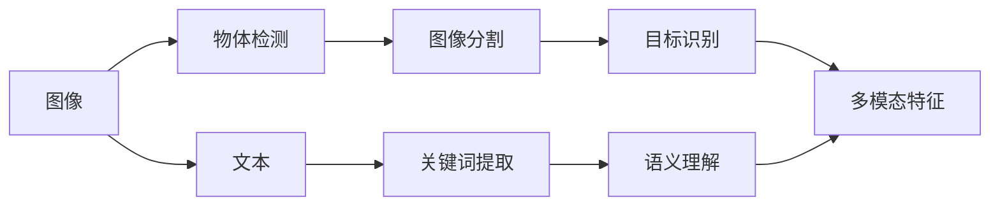
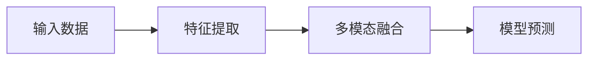
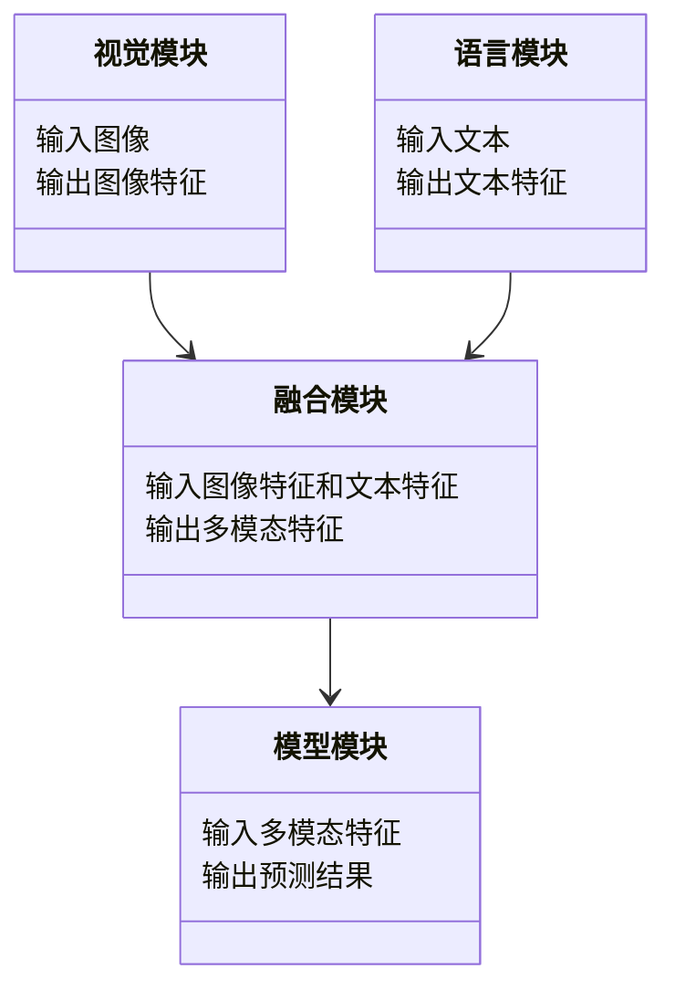
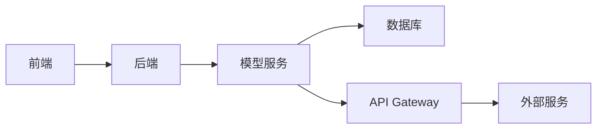
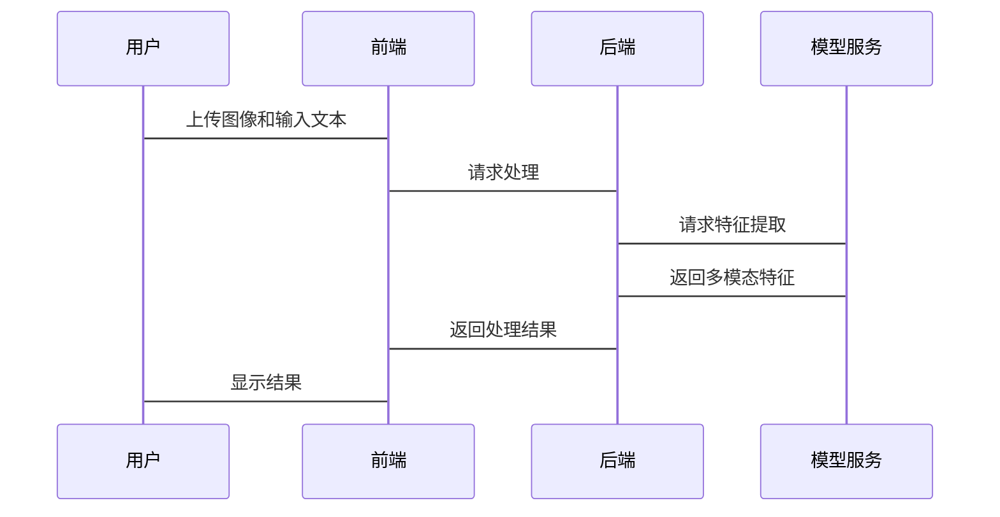

                 


```markdown
# 开发具有视觉-语言多模态理解能力的AI Agent

> 关键词：视觉-语言多模态、AI Agent、多模态理解、深度学习、计算机视觉、自然语言处理

> 摘要：本文将详细探讨开发具有视觉-语言多模态理解能力的AI Agent的各个方面，从基础概念到算法原理，再到系统设计和项目实战。我们将涵盖多模态数据的处理流程、多模态模型的构建与训练、系统架构设计以及实际案例分析，帮助读者全面理解并掌握这一前沿技术。

---

## 第1章: 视觉-语言多模态AI Agent概述

### 1.1 问题背景与定义
#### 1.1.1 多模态AI的定义
多模态AI是指能够处理和理解多种数据类型的智能系统，如文本、图像、语音、视频等。视觉-语言多模态AI Agent专注于同时处理视觉和语言信息，以实现更复杂的理解和交互能力。

#### 1.1.2 视觉-语言多模态的核心概念
视觉-语言多模态AI Agent需要将图像信息与文本信息进行深度融合，通过联合学习的方式，提升对复杂场景的理解能力。例如，在图像描述生成任务中，AI Agent需要能够识别图像内容并生成相应的文字描述。

#### 1.1.3 问题背景与应用前景
随着人工智能技术的快速发展，多模态AI Agent在多个领域展现出巨大潜力，如智能客服、图像描述生成、自动驾驶等。然而，如何高效地融合视觉和语言信息，仍然是一个具有挑战性的研究课题。

### 1.2 多模态理解的关键技术
#### 1.2.1 视觉数据处理
视觉数据处理包括图像识别、目标检测、图像分割等技术，目的是从图像中提取有用的信息，如物体的位置、形状、颜色等。

#### 1.2.2 语言数据处理
语言数据处理包括自然语言理解、文本生成等技术，旨在从文本中提取语义信息，理解上下文关系。

#### 1.2.3 多模态数据融合方法
多模态数据融合方法包括基于特征的融合、基于决策的融合以及基于模型的融合。其中，基于模型的融合方法通过构建多模态神经网络模型，实现对视觉和语言信息的联合建模。

### 1.3 多模态AI Agent的应用场景
#### 1.3.1 智能助手
多模态AI Agent可以作为智能助手，帮助用户完成日常任务，如图像搜索、信息查询等。

#### 1.3.2 智慧教育
在教育领域，多模态AI Agent可以用于智能辅导系统，通过理解学生的视觉和语言输入，提供个性化的学习建议。

#### 1.3.3 智慧医疗
在医疗领域，多模态AI Agent可以辅助医生进行诊断，通过分析医学图像和病历文本，提供更准确的诊断建议。

### 1.4 本章小结
本章介绍了视觉-语言多模态AI Agent的基本概念、关键技术以及应用场景，为后续章节的深入探讨奠定了基础。

---

## 第2章: 视觉-语言多模态理解的核心概念与联系

### 2.1 多模态数据的处理流程
#### 2.1.1 数据采集与预处理
数据采集包括图像采集和文本获取，预处理步骤包括归一化、增强等，以提高模型的泛化能力。

#### 2.1.2 数据表示与特征提取
通过卷积神经网络（CNN）提取图像特征，通过词嵌入模型（如Word2Vec）提取文本特征。

#### 2.1.3 数据融合方法
将图像特征和文本特征进行融合，可以采用拼接、加权融合等方式。

### 2.2 多模态模型的构建与训练
#### 2.2.1 模型架构设计
基于Transformer的多模态模型，如ViT和BERT的结合，可以有效地处理视觉和语言信息。

#### 2.2.2 模型训练策略
采用端到端的训练方式，利用多任务学习策略，同时优化视觉和语言任务的损失函数。

#### 2.2.3 模型评估与优化
通过准确率、F1分数等指标评估模型性能，采用数据增强、超参数调优等方法进行优化。

### 2.3 多模态数据的实体关系图


### 2.4 本章小结
本章详细探讨了视觉-语言多模态数据的处理流程和模型构建方法，并通过实体关系图展示了数据之间的联系。

---

## 第3章: 多模态AI Agent的算法原理

### 3.1 多模态模型的数学基础
#### 3.1.1 线性代数基础
包括矩阵运算、向量空间等，是理解多模态模型的基础。

#### 3.1.2 概率论与统计基础
包括概率分布、贝叶斯定理等，用于模型的不确定性建模。

#### 3.1.3 深度学习基础
包括神经网络、反向传播等，是多模态模型的核心技术。

### 3.2 多模态融合的数学模型
#### 3.2.1 强对偶损失函数
$$L = L_{\text{image}} + L_{\text{text}} + \lambda L_{\text{sim}}$$

#### 3.2.2 多模态注意力机制
$$\alpha_i = \frac{\exp(s_i)}{\sum_j \exp(s_j)}$$

### 3.3 多模态模型的训练流程


### 3.4 本章小结
本章详细介绍了多模态AI Agent的数学基础和算法原理，为后续的系统设计和项目实战提供了理论支持。

---

## 第4章: 系统分析与架构设计

### 4.1 问题场景介绍
在开发视觉-语言多模态AI Agent时，需要考虑数据输入、模型推理、结果输出等多个环节。

### 4.2 系统功能设计
#### 4.2.1 领域模型


### 4.3 系统架构设计


### 4.4 系统接口设计
#### 4.4.1 视觉接口
支持图像上传和处理，返回图像特征。

#### 4.4.2 语言接口
支持文本输入和处理，返回文本特征。

#### 4.4.3 融合接口
将图像特征和文本特征进行融合，返回多模态特征。

### 4.5 系统交互流程


### 4.6 本章小结
本章通过系统分析和架构设计，明确了视觉-语言多模态AI Agent的实现流程和技术选型。

---

## 第5章: 项目实战

### 5.1 环境安装与配置
#### 5.1.1 安装依赖
使用Python 3.8及以上版本，安装TensorFlow、PyTorch、Keras等深度学习库。

#### 5.1.2 配置开发环境
配置Jupyter Notebook或IDE，如PyCharm，安装必要的开发工具。

### 5.2 系统核心实现
#### 5.2.1 视觉模块实现
使用OpenCV进行图像处理，使用ResNet50提取图像特征。

#### 5.2.2 语言模块实现
使用自然语言处理库如spaCy进行文本处理，使用BERT模型提取文本特征。

#### 5.2.3 多模态融合实现
将图像特征和文本特征进行拼接，使用全连接层进行融合。

#### 5.2.4 模型训练与优化
使用Adam优化器，设置合适的学习率，进行模型训练。

### 5.3 代码实现与解读
```python
import tensorflow as tf
from tensorflow.keras import layers

# 视觉模块：图像特征提取
def image_feature_extractor():
    model = tf.keras.Sequential([
        layers.Conv2D(32, (3,3), activation='relu'),
        layers.MaxPooling2D((2,2)),
        layers.Conv2D(64, (3,3), activation='relu'),
        layers.MaxPooling2D((2,2)),
        layers.Flatten(),
        layers.Dense(128, activation='relu')
    ])
    return model

# 语言模块：文本特征提取
def text_feature_extractor():
    model = tf.keras.Sequential([
        layers.Embedding(10000, 128),
        layers.LSTM(64, return_sequences=False)
    ])
    return model

# 多模态融合模块
def multimodal_fusion():
    image_input = layers.Input(shape=(None, 128))
    text_input = layers.Input(shape=(None, 64))
    image_dense = layers.Dense(64, activation='relu')(image_input)
    text_dense = layers.Dense(64, activation='relu')(text_input)
    concatenated = layers.Concatenate()([image_dense, text_dense])
    output = layers.Dense(1, activation='sigmoid')(concatenated)
    model = tf.keras.Model(inputs=[image_input, text_input], outputs=output)
    return model
```

### 5.4 项目小结
本章通过实际项目案例，详细讲解了视觉-语言多模态AI Agent的开发流程，包括环境配置、模块实现、模型训练等。

---

## 第6章: 最佳实践与小结

### 6.1 最佳实践
#### 6.1.1 数据处理
确保数据的多样性和平衡性，采用数据增强技术提高模型的鲁棒性。

#### 6.1.2 模型优化
采用早停法、学习率衰减等技术优化模型性能。

#### 6.1.3 系统设计
注重模块化设计，便于后续扩展和维护。

### 6.2 小结
本文详细探讨了开发具有视觉-语言多模态理解能力的AI Agent的各个方面，从理论到实践，帮助读者全面掌握这一技术。

---

## 附录

### 附录A: 进一步学习的资源
推荐书籍、论文、在线课程等资源，供读者深入学习。

### 附录B: 工具与库
列出开发过程中使用的工具和库，如TensorFlow、PyTorch、OpenCV等。

---

## 作者

作者：AI天才研究院/AI Genius Institute & 禅与计算机程序设计艺术 /Zen And The Art of Computer Programming
```

