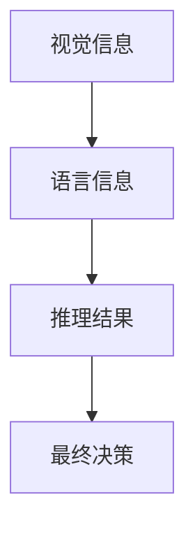
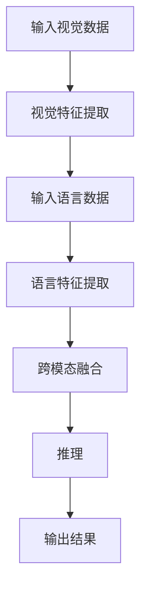
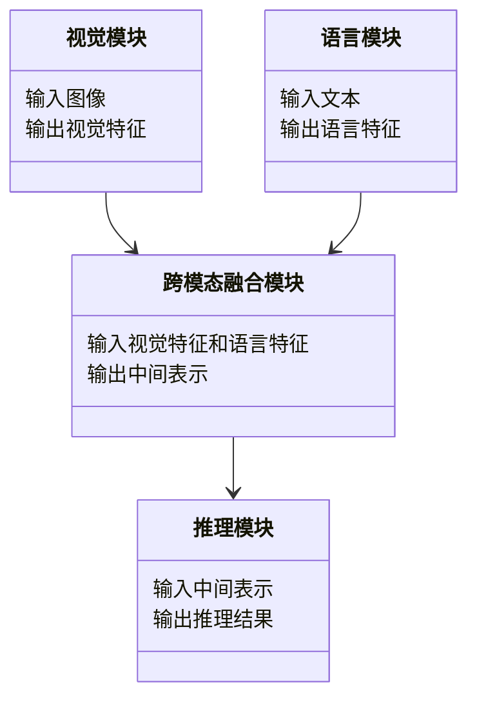
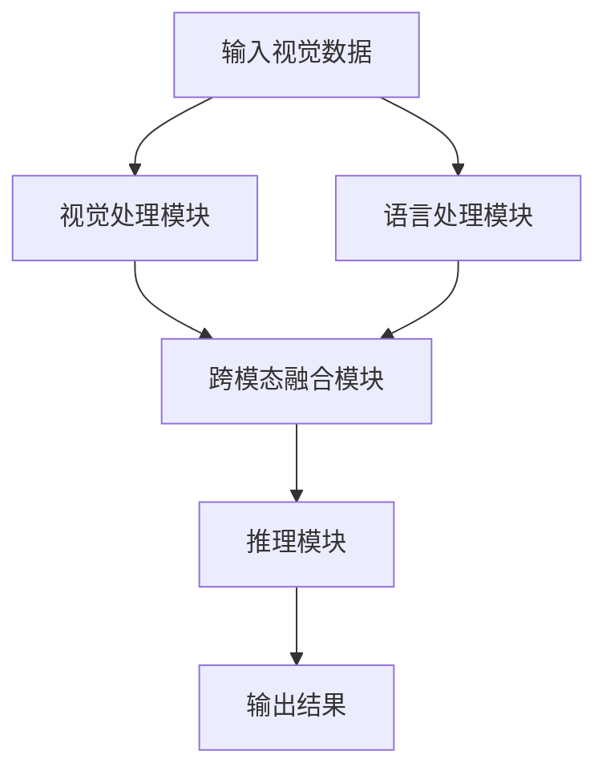
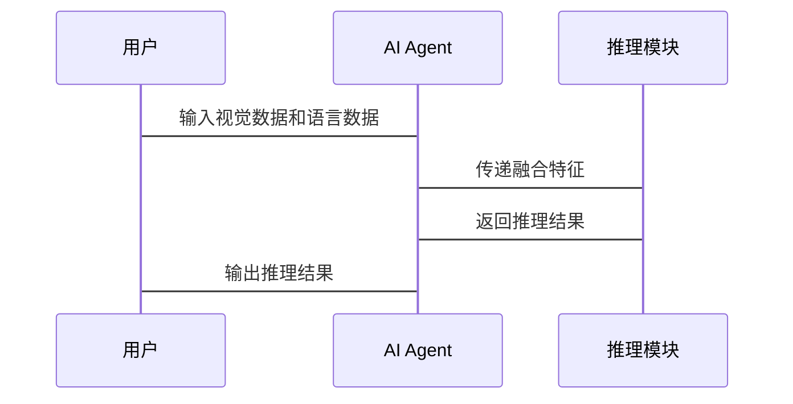

                 


# 开发具有视觉-语言跨模态推理能力的AI Agent

## 关键词：AI Agent, 跨模态推理, 视觉语言, 推理能力, 多模态模型, 系统架构

## 摘要：本文详细探讨了开发具有视觉-语言跨模态推理能力的AI Agent的关键技术，从理论基础到系统架构，再到实战案例，系统性地阐述了实现这一目标的各个方面。通过本文，读者将能够理解并掌握如何设计和实现一个能够处理视觉和语言信息，并具备推理能力的AI Agent。

---

# 第1章: 背景介绍

## 1.1 问题背景
### 1.1.1 视觉-语言跨模态推理的定义
视觉-语言跨模态推理是一种AI技术，旨在使AI Agent能够同时处理视觉和语言信息，并在两者之间建立联系，从而实现更复杂的推理和决策能力。

### 1.1.2 问题描述：AI Agent的多模态能力需求
传统的AI系统通常只能处理单一类型的数据（如文本或图像），但在现实场景中，信息往往是多模态的。因此，AI Agent需要能够处理多种数据类型，并通过跨模态推理来理解和解决复杂问题。

### 1.1.3 问题解决：视觉-语言跨模态推理的意义
通过结合视觉和语言信息，AI Agent可以更全面地理解环境，并做出更准确的推理和决策。这种能力在机器人、自动驾驶、智能助手等领域具有重要应用价值。

### 1.1.4 边界与外延：AI Agent能力的局限性
尽管跨模态推理能力可以显著提升AI Agent的智能水平，但其仍面临数据融合难度大、推理复杂性高、计算资源需求高等挑战。

### 1.1.5 核心要素组成：视觉、语言、推理三者的结合
视觉-语言跨模态推理的核心在于将视觉信息和语言信息进行有效融合，并通过推理过程得出最终结论。

## 1.2 跨模态推理的核心概念
### 1.2.1 视觉与语言的结合方式
视觉信息（如图像）和语言信息（如文本）需要通过某种方式结合，以便AI Agent能够理解两者之间的关系。

### 1.2.2 推理能力的层次划分
跨模态推理可以分为低级推理（如简单关联）和高级推理（如复杂逻辑推理）。

### 1.2.3 AI Agent的多模态能力框架
AI Agent的多模态能力框架包括数据输入、特征提取、跨模态融合、推理和输出决策五个主要环节。

## 1.3 本章小结
本章通过对视觉-语言跨模态推理的背景、定义、意义和核心要素的介绍，为读者理解AI Agent的多模态能力奠定了基础。

---

# 第2章: 核心概念与联系

## 2.1 跨模态推理的原理
### 2.1.1 视觉信息的处理流程
视觉信息的处理流程包括图像采集、特征提取、语义理解等步骤。

### 2.1.2 语言信息的处理流程
语言信息的处理流程包括文本输入、分词、句法分析、语义理解等步骤。

### 2.1.3 跨模态信息的融合方式
跨模态信息的融合方式包括基于注意力机制的融合、基于图神经网络的融合等。

## 2.2 核心概念属性对比
### 2.2.1 视觉与语言信息的特征对比
视觉信息具有空间性，语言信息具有语义性。

### 2.2.2 推理能力的量化指标
推理能力的量化指标包括推理速度、推理精度等。

### 2.2.3 AI Agent能力的评估标准
AI Agent能力的评估标准包括准确率、响应时间、用户体验等。

## 2.3 ER实体关系图


## 2.4 本章小结
本章通过对比和分析视觉、语言信息的特征，以及推理能力的量化指标，帮助读者更好地理解跨模态推理的核心概念。

---

# 第3章: 算法原理讲解

## 3.1 跨模态推理算法概述
### 3.1.1 编码器-解码器架构
编码器-解码器架构是一种常用的跨模态推理模型，编码器用于提取视觉和语言特征，解码器用于生成推理结果。

### 3.1.2 注意力机制在跨模态推理中的应用
注意力机制可以帮助模型聚焦于重要的视觉或语言信息，从而提升推理效果。

### 3.1.3 图神经网络在跨模态推理中的应用
图神经网络可以将视觉和语言信息建模为图结构，从而实现跨模态信息的高效融合。

## 3.2 算法实现细节
### 3.2.1 视觉特征提取网络
视觉特征提取网络通常采用卷积神经网络（CNN）或区域卷积神经网络（RCNN）等模型。

### 3.2.2 语言特征提取网络
语言特征提取网络通常采用循环神经网络（RNN）或 transformer 模型。

### 3.2.3 跨模态融合网络
跨模态融合网络通过将视觉和语言特征进行融合，生成中间表示。

### 3.2.4 推理网络
推理网络基于中间表示进行推理，生成最终的推理结果。

## 3.3 算法流程图


## 3.4 算法实现代码
```python
def cross_modal_fusion视觉特征, 语言特征):
    # 具体实现代码
    pass
```

## 3.5 本章小结
本章详细讲解了跨模态推理算法的原理和实现细节，为后续的系统设计和项目实战奠定了基础。

---

# 第4章: 系统架构设计

## 4.1 问题场景介绍
AI Agent需要在复杂环境中处理多种数据类型，并通过跨模态推理做出决策。

## 4.2 系统功能设计
### 4.2.1 领域模型


## 4.3 系统架构设计


## 4.4 系统接口设计
### 4.4.1 输入接口
AI Agent需要接收视觉和语言输入。

### 4.4.2 输出接口
AI Agent需要输出推理结果。

## 4.5 系统交互


## 4.6 本章小结
本章通过系统架构设计，展示了AI Agent在视觉-语言跨模态推理中的整体结构和交互流程。

---

# 第5章: 项目实战

## 5.1 环境安装
### 5.1.1 安装Python和相关库
安装Python和TensorFlow、PyTorch等深度学习框架。

### 5.1.2 安装视觉处理库
安装OpenCV、 PIL等库。

### 5.1.3 安装语言处理库
安装NLTK、spaCy等库。

## 5.2 系统核心实现
### 5.2.1 视觉特征提取代码
```python
import cv2

def extract_visual_features(image):
    # 具体实现代码
    pass
```

### 5.2.2 语言特征提取代码
```python
import nltk

def extract_language_features(text):
    # 具体实现代码
    pass
```

### 5.2.3 跨模态融合代码
```python
def cross_modal_fusion(visual_feature, language_feature):
    # 具体实现代码
    pass
```

### 5.2.4 推理代码
```python
def inference(cross_modal_feature):
    # 具体实现代码
    pass
```

## 5.3 案例分析
### 5.3.1 案例场景
AI Agent在图像描述生成中的应用。

### 5.3.2 案例实现
详细讲解案例的实现过程。

### 5.3.3 案例结果与分析
展示推理结果并进行分析。

## 5.4 项目总结
总结项目实现的关键点和经验教训。

## 5.5 本章小结
本章通过实战项目，详细展示了AI Agent在视觉-语言跨模态推理中的具体实现过程。

---

# 第6章: 最佳实践与小结

## 6.1 最佳实践 tips
### 6.1.1 开发注意事项
确保数据质量和多样性，避免过拟合。

### 6.1.2 性能优化技巧
优化模型结构和训练策略，降低计算成本。

## 6.2 未来趋势展望
跨模态推理技术将朝着更高效、更智能的方向发展。

## 6.3 本章小结
本章总结了开发具有视觉-语言跨模态推理能力的AI Agent的最佳实践，并展望了未来的发展趋势。

---

# 附录

## 附录A: 参考文献
列出相关文献和资源。

## 附录B: 工具资源
推荐相关工具和资源。

---

# 作者：AI天才研究院/AI Genius Institute & 禅与计算机程序设计艺术 /Zen And The Art of Computer Programming

