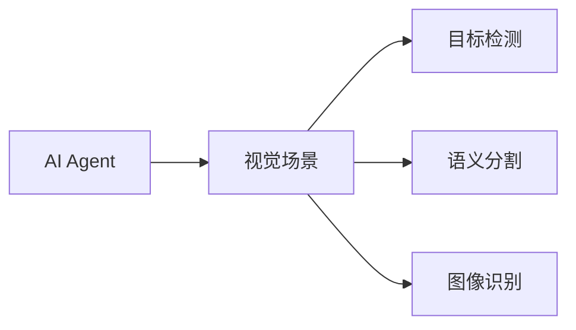
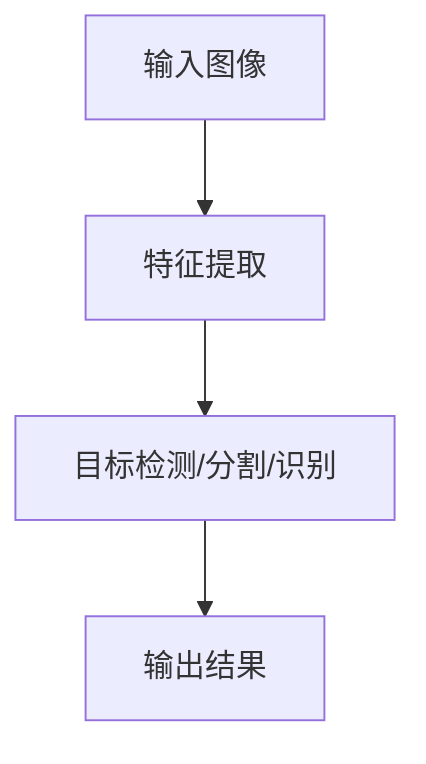
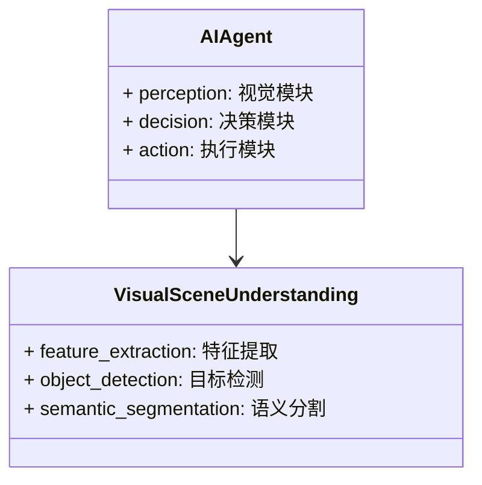
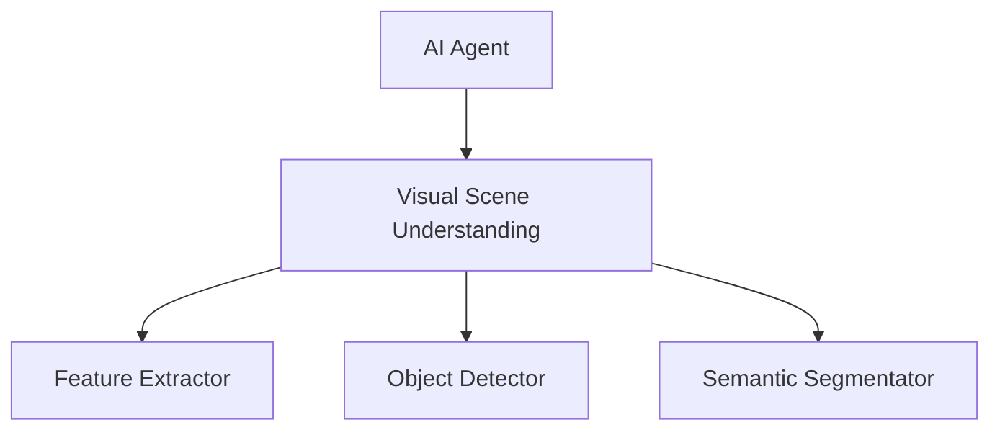
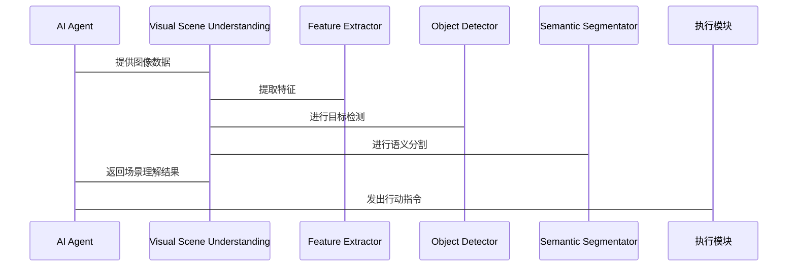

                 


# 开发具有视觉场景理解能力的AI Agent

> 关键词：AI Agent，视觉场景理解，计算机视觉，机器学习，深度学习

> 摘要：本文深入探讨了开发具有视觉场景理解能力的AI Agent的关键技术，包括AI Agent的基本概念、视觉场景理解的核心问题、相关算法原理、系统架构设计以及实际项目实现。文章从理论到实践，详细介绍了如何构建一个能够理解视觉场景的智能体，并提供了具体的代码实现和案例分析。

---

# 第一部分: AI Agent与视觉场景理解的背景介绍

## 第1章: AI Agent与视觉场景理解的背景介绍

### 1.1 问题背景与问题描述

#### 1.1.1 AI Agent的基本概念
AI Agent（人工智能代理）是指能够感知环境、自主决策并执行任务的智能实体。AI Agent可以是软件程序、机器人或其他智能系统，其核心目标是通过与环境的交互来实现特定的任务目标。AI Agent可以根据智能水平分为弱人工智能（专注于特定任务）和强人工智能（具备广泛认知能力）。

#### 1.1.2 视觉场景理解的核心问题
视觉场景理解是指通过计算机视觉技术对图像或视频中的场景进行分析和理解，包括目标检测、语义分割、图像识别等任务。视觉场景理解的核心问题是如何将低层次的图像特征（如边缘、纹理）转化为高层次的语义信息（如物体类别、场景布局）。

#### 1.1.3 问题的边界与外延
AI Agent与视觉场景理解的结合，意味着AI Agent需要具备通过视觉输入理解环境的能力，并在此基础上做出决策和行动。这种能力的边界包括但不限于图像处理的精度、场景复杂度以及AI Agent的决策能力。外延则涉及多模态数据融合、实时性要求以及跨领域应用。

### 1.2 核心概念与联系

#### 1.2.1 AI Agent的定义与属性
AI Agent的定义包括以下几个关键属性：
- **自主性**：能够在没有外部干预的情况下自主运行。
- **反应性**：能够感知环境并实时做出反应。
- **目标导向性**：具备明确的目标，并通过行动来实现目标。
- **学习能力**：能够通过经验改进自身的性能。

#### 1.2.2 视觉场景理解的特征与挑战
视觉场景理解的特征包括：
- **多尺度性**：需要同时理解图像中的局部特征和全局结构。
- **多样性**：场景可能包含多种物体、布局和光照条件。
- **语义性**：需要将低层次的视觉特征转化为高层次的语义信息。

视觉场景理解的挑战包括：
- **计算复杂性**：高分辨率图像的处理需要大量的计算资源。
- **数据多样性**：需要处理各种不同类型的场景和物体。
- **实时性要求**：在某些应用场景中，需要实时处理视觉数据。

#### 1.2.3 对比分析与总结
通过对比AI Agent和视觉场景理解的核心概念，可以发现AI Agent需要依赖视觉场景理解来获取环境信息，而视觉场景理解则需要结合上下文和任务目标来提升理解的准确性。两者的协同关系是实现AI Agent视觉场景理解能力的关键。

---

## 第2章: AI Agent与视觉场景理解的核心概念

### 2.1 核心概念原理

#### 2.1.1 AI Agent的智能体模型
AI Agent的智能体模型通常包括以下组成部分：
- **感知模块**：负责获取环境中的信息，如视觉、听觉等多模态数据。
- **决策模块**：基于感知信息和任务目标，生成行动策略。
- **执行模块**：将决策结果转化为具体的行动，与环境进行交互。

#### 2.1.2 视觉场景理解的数学模型
视觉场景理解的数学模型通常包括特征提取、目标检测、语义分割等模块。特征提取可以通过卷积神经网络（CNN）实现，目标检测可以采用区域建议网络（RPN）结合分类器，语义分割则需要基于分割网络（如U-Net）。

#### 2.1.3 两者的协同机制
AI Agent与视觉场景理解的协同机制主要体现在信息流的双向传递上。AI Agent通过视觉模块获取环境信息，视觉场景理解模块则通过任务目标优化自身的理解能力。

### 2.2 核心概念属性对比

#### 2.2.1 AI Agent的属性特征
| 属性 | 描述 |
|------|------|
| 自主性 | 能够自主运行，无需外部干预 |
| 反应性 | 能够实时感知环境并做出反应 |
| 目标导向性 | 具备明确的目标，并通过行动实现目标 |
| 学习能力 | 能够通过经验改进自身性能 |

#### 2.2.2 视觉场景理解的属性特征
| 属性 | 描述 |
|------|------|
| 多尺度性 | 需要同时理解图像的局部和全局特征 |
| 多样性 | 场景可能包含多种物体、布局和光照条件 |
| 语义性 | 需要将低层次的视觉特征转化为高层次的语义信息 |

#### 2.2.3 对比分析与总结
通过对AI Agent和视觉场景理解的核心概念进行对比分析，可以发现两者在目标导向性和信息处理方式上的相似性。AI Agent需要依赖视觉场景理解来获取环境信息，而视觉场景理解则需要结合任务目标来优化自身的理解能力。

### 2.3 实体关系图



---

## 第3章: 视觉场景理解的算法原理

### 3.1 算法原理概述

#### 3.1.1 目标检测算法
目标检测算法的主要步骤包括：
1. **特征提取**：通过卷积神经网络提取图像的特征。
2. **区域建议**：生成可能包含目标的区域建议。
3. **目标分类与定位**：对每个区域建议进行目标分类和位置回归。

#### 3.1.2 语义分割算法
语义分割算法的主要步骤包括：
1. **特征提取**：通过编码器提取图像的深层特征。
2. **上采样**：通过解码器将深层特征上采样到原始图像分辨率。
3. **像素分类**：对每个像素进行语义类别预测。

#### 3.1.3 图像识别算法
图像识别算法的主要步骤包括：
1. **特征提取**：通过卷积神经网络提取图像的深层特征。
2. **分类器**：基于提取的特征进行图像分类。

### 3.2 算法流程图



### 3.3 算法实现代码

#### 3.3.1 目标检测代码示例

```python
import tensorflow as tf
from tensorflow.keras import layers

model = tf.keras.Sequential([
    layers.Conv2D(32, (3,3), activation='relu'),
    layers.MaxPooling2D((2,2)),
    layers.Conv2D(64, (3,3), activation='relu'),
    layers.MaxPooling2D((2,2)),
    layers.Flatten(),
    layers.Dense(128, activation='relu'),
    layers.Dense(num_classes, activation='softmax')
])
```

#### 3.3.2 语义分割代码示例

```python
import tensorflow as tf
from tensorflow.keras import layers

model = tf.keras.Sequential([
    layers.Conv2D(64, (3,3), activation='relu', padding='same'),
    layers.Conv2D(64, (3,3), activation='relu', padding='same'),
    layers.MaxPooling2D((2,2)),
    layers.Conv2DTranspose(64, (2,2), strides=(2,2), padding='same'),
    layers.Conv2DTranspose(num_classes, (2,2), strides=(2,2), padding='same')
])
```

### 3.4 数学模型与公式

#### 3.4.1 损失函数
目标检测中的损失函数通常包括分类损失和定位损失：

$$ \text{loss} = \alpha \cdot \text{classification\_loss} + (1-\alpha) \cdot \text{regression\_loss} $$

其中，$\alpha$ 是平衡参数，用于调节分类损失和定位损失的权重。

---

# 第四部分: 系统分析与架构设计方案

## 第4章: 系统分析与架构设计方案

### 4.1 问题场景介绍
本文将围绕一个AI Agent在室内环境中的视觉场景理解任务展开，目标是通过视觉数据理解场景布局、物体位置等信息，并指导AI Agent完成特定任务（如物体识别、路径规划等）。

### 4.2 系统功能设计

#### 4.2.1 领域模型


#### 4.2.2 系统架构


#### 4.2.3 系统接口设计
系统接口主要包括：
- **输入接口**：接收图像数据和任务目标。
- **输出接口**：输出场景理解结果和行动指令。

#### 4.2.4 系统交互序列图


---

## 第5章: 项目实战

### 5.1 环境安装
需要安装以下环境和库：
- Python 3.8+
- TensorFlow 2.0+
- OpenCV 4.0+
- Matplotlib 3.0+

### 5.2 系统核心实现源代码

#### 5.2.1 视觉场景理解模块代码

```python
import cv2
import numpy as np
import tensorflow as tf

# 加载预训练模型
model = tf.keras.models.load_model('scene_understanding_model.h5')

# 图像预处理
def preprocess_image(image):
    image = cv2.resize(image, (224, 224))
    image = image / 255.0
    return image[np.newaxis, :, :, :]

# 场景理解
def understand_scene(image):
    preprocessed = preprocess_image(image)
    prediction = model.predict(preprocessed)
    return prediction[0]
```

#### 5.2.2 AI Agent核心模块代码

```python
import cv2
import numpy as np
import tensorflow as tf

# 加载视觉场景理解模型
scene_model = tf.keras.models.load_model('scene_understanding_model.h5')

# AI Agent核心模块
class AI_Agent:
    def __init__(self):
        self.scene_model = scene_model
    
    def perceive(self, image):
        preprocessed = preprocess_image(image)
        prediction = self.scene_model.predict(preprocessed)
        return prediction[0]
    
    def decide(self, prediction):
        # 根据场景理解结果做出决策
        pass
    
    def act(self, decision):
        # 根据决策执行行动
        pass
```

### 5.3 代码应用解读与分析
通过对上述代码的解读，可以看出视觉场景理解模块和AI Agent核心模块之间的协作关系。AI Agent通过调用视觉场景理解模块，获取环境信息，并基于此做出决策和行动。

### 5.4 实际案例分析
以室内环境中的物体识别任务为例，AI Agent可以通过视觉场景理解模块识别出桌上的物体，并根据任务目标（如“找到红色物体”）做出相应的行动（如移动机械臂抓取物体）。

### 5.5 项目小结
通过本项目，我们可以看到AI Agent与视觉场景理解技术的结合能够实现复杂的场景理解任务，并指导智能体完成实际的行动。

---

## 第6章: 最佳实践、小结、注意事项与拓展阅读

### 6.1 最佳实践 tips
- 在实际应用中，建议使用预训练模型来提升视觉场景理解的效率和准确性。
- 确保AI Agent的决策模块具备良好的可解释性和鲁棒性。
- 在多模态数据融合中，需要考虑不同数据源的时空一致性。

### 6.2 小结
本文详细探讨了开发具有视觉场景理解能力的AI Agent的关键技术，包括核心概念、算法原理、系统架构设计以及实际项目实现。通过理论与实践的结合，为读者提供了一个完整的开发框架。

### 6.3 注意事项
- 在实际应用中，需要考虑计算资源的限制，优化算法的计算效率。
- 注意数据隐私和安全问题，特别是在处理用户敏感数据时。
- 确保系统的实时性和可靠性，特别是在需要实时响应的应用场景中。

### 6.4 拓展阅读
- 《Deep Learning》（Ian Goodfellow 等著）
- 《Computer Vision: A Modern Approach》（Richard Szeliski 著）
- 《Reinforcement Learning: Theory and Algorithms》（Sutton & Barto 著）

---

作者：AI天才研究院/AI Genius Institute & 禅与计算机程序设计艺术/Zen And The Art of Computer Programming

