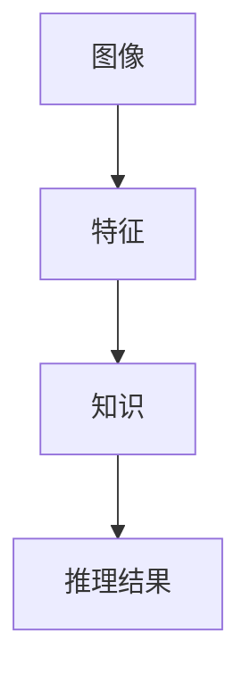
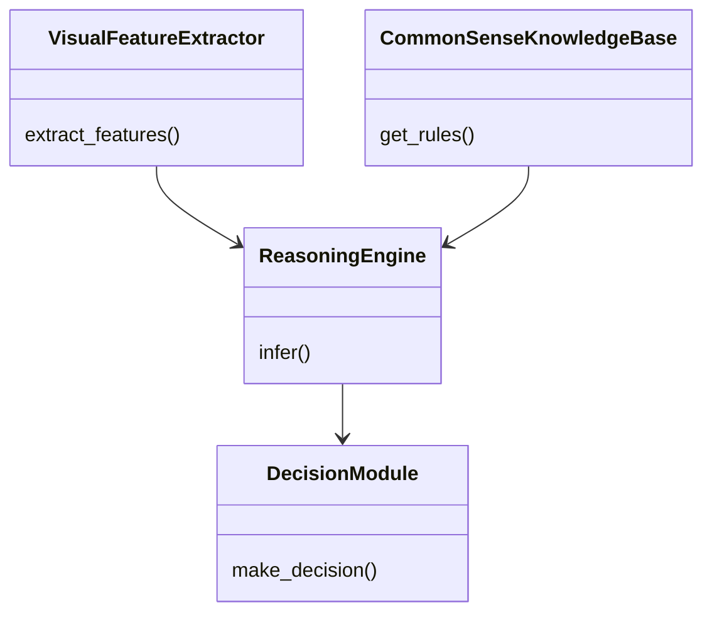
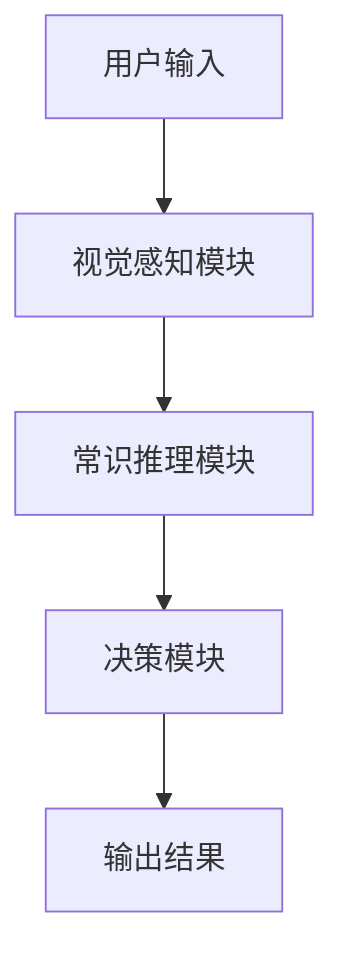
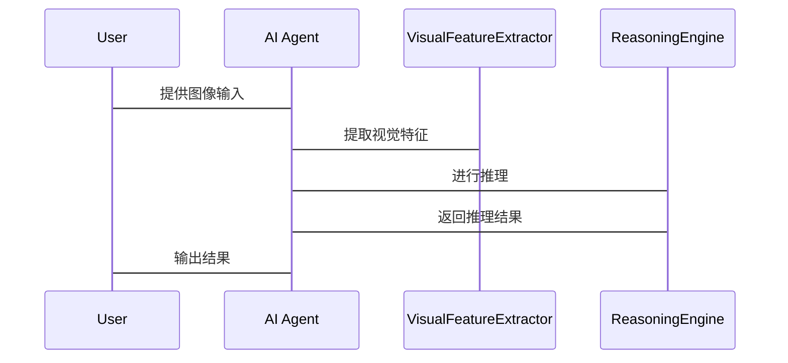

                 


# 开发具有视觉常识推理能力的AI Agent

## 关键词：AI Agent、视觉常识推理、多模态融合、深度学习、概率图模型

## 摘要：  
本文探讨了开发具有视觉常识推理能力的AI Agent的关键技术与方法。通过结合计算机视觉、自然语言处理和知识图谱等多模态技术，AI Agent能够理解图像内容并基于常识进行推理。文章从理论基础到算法实现，再到系统架构，详细阐述了如何构建一个能够进行视觉常识推理的AI Agent，并通过实际案例展示了其应用潜力。

---

## 第1章: AI Agent与视觉常识推理概述

### 1.1 AI Agent的基本概念

#### 1.1.1 AI Agent的定义与分类
AI Agent（人工智能代理）是一种智能系统，能够感知环境、自主决策并执行任务。根据智能水平，AI Agent可以分为简单反应型、基于模型反应型、目标驱动型和推理驱动型。目标驱动型和推理驱动型AI Agent能够执行复杂任务，是本文的重点。

#### 1.1.2 视觉常识推理的定义与特点
视觉常识推理是指AI Agent在感知视觉信息的基础上，结合常识知识进行推理的能力。其特点是多模态融合、上下文依赖和动态推理。

#### 1.1.3 问题背景与挑战
随着AI Agent在智能助手、机器人等领域的广泛应用，仅依赖单模态输入的AI Agent难以满足复杂场景的需求。视觉常识推理能够增强AI Agent的理解能力，但其技术实现面临数据稀疏性、推理准确性等挑战。

---

### 1.2 视觉常识推理的核心概念

#### 1.2.1 视觉感知与常识推理的关系
视觉感知是AI Agent理解环境的基础，而常识推理是其进行决策的关键。两者的结合使得AI Agent能够从图像中提取信息并结合常识进行推理。

#### 1.2.2 视觉常识推理的流程与框架
视觉常识推理的流程包括视觉特征提取、常识知识表示、推理与决策。其框架通常涉及多模态数据融合、知识图谱构建和推理算法设计。

#### 1.2.3 现有技术的局限性与改进方向
现有技术在视觉常识推理中存在数据稀疏性、推理不够准确等问题。未来的研究方向包括更高效的多模态融合方法和更强大的推理算法。

---

## 第2章: 视觉常识推理的核心概念

### 2.1 视觉感知与常识推理的联系

#### 2.1.1 视觉感知的定义与实现方法
视觉感知是AI Agent通过摄像头或其他传感器获取环境信息的过程。其实现方法包括图像分类、目标检测和图像分割。

#### 2.1.2 常识推理的定义与实现方法
常识推理是指AI Agent基于常识知识库进行推理的能力。其实现方法包括基于知识图谱的推理和基于语言模型的推理。

#### 2.1.3 两者结合的意义与价值
视觉感知与常识推理的结合使得AI Agent能够理解复杂的视觉场景并进行决策，具有重要的应用价值。

### 2.2 视觉常识推理的属性特征对比

#### 2.2.1 基于表格的核心概念属性对比
| 属性 | 视觉感知 | 常识推理 |
|------|----------|----------|
| 输入 | 图像数据 | 文本知识 |
| 输出 | 特征描述 | 推理结果 |
| 目标 | 理解视觉内容 | 基于常识推理 |

#### 2.2.2 基于ER实体关系图的概念架构


---

## 第3章: 视觉常识推理算法的原理

### 3.1 基于多模态融合的模型结构

#### 3.1.1 视觉特征提取模块
视觉特征提取模块通常采用卷积神经网络（CNN）提取图像的特征向量。例如，使用ResNet或VGG等预训练模型提取图像特征。

#### 3.1.2 常识推理模块
常识推理模块基于知识图谱构建推理模型，例如使用图神经网络（GNN）进行推理。

#### 3.1.3 决策推理模块
决策推理模块结合视觉特征和常识推理结果，进行最终的决策输出。

### 3.2 基于概率图模型的推理方法

#### 3.2.1 概率图模型的定义
概率图模型是一种用于表示变量之间概率关系的图模型，包括贝叶斯网络和马尔可夫网络。

#### 3.2.2 基于视觉的条件概率分布
给定视觉输入x，目标y的条件概率为：
$$ P(y|x) = \frac{P(x|y)P(y)}{P(x)} $$

#### 3.2.3 推理过程的数学公式
在视觉常识推理中，通常使用贝叶斯推理公式：
$$ P(y|x) = \frac{P(x|y)P(y)}{\sum_{y'} P(x|y')P(y')} $$

### 3.3 基于深度学习的视觉推理算法

#### 3.3.1 模型输入与输出
模型输入为图像和文本，输出为推理结果。

#### 3.3.2 多模态融合方法
多模态融合方法包括特征级融合和决策级融合。特征级融合通过将视觉特征和语言特征进行融合，决策级融合通过结合两种模态的推理结果。

#### 3.3.3 模型实现代码示例
```python
import tensorflow as tf
from tensorflow.keras import layers

# 定义视觉特征提取模块
def visual_feature_extractor(input_image):
    model = tf.keras.Sequential([
        layers.Conv2D(32, (3,3), activation='relu'),
        layers.MaxPooling2D((2,2)),
        layers.Conv2D(64, (3,3), activation='relu'),
        layers.MaxPooling2D((2,2)),
        layers.Flatten()
    ])
    return model(input_image)

# 定义常识推理模块
def commonSense_reasoning(input_features):
    model = tf.keras.Sequential([
        layers.Dense(128, activation='relu'),
        layers.Dense(10, activation='softmax')
    ])
    return model(input_features)
```

---

## 第4章: 视觉常识推理系统的分析与架构设计

### 4.1 问题场景介绍

#### 4.1.1 问题场景描述
以家庭助手AI Agent为例，AI Agent需要通过视觉感知家庭环境，并基于常识推理完成任务。

#### 4.1.2 项目介绍
本项目旨在开发一个能够通过视觉感知和常识推理帮助用户完成日常任务的家庭助手AI Agent。

### 4.2 系统功能设计

#### 4.2.1 领域模型类图


#### 4.2.2 系统架构图


### 4.3 系统接口设计

#### 4.3.1 接口定义
API接口定义如下：
- 输入：图像数据
- 输出：推理结果

### 4.4 系统交互流程图



---

## 第5章: 视觉常识推理系统的实现与应用

### 5.1 项目实战: 家庭助手AI Agent

#### 5.1.1 环境安装
需要安装TensorFlow、Keras、OpenCV等库。

#### 5.1.2 系统核心实现源代码

```python
import cv2
import tensorflow as tf
from tensorflow.keras import layers

# 安装依赖
!pip install opencv-python tensorflow keras

# 定义视觉特征提取模块
def visual_feature_extractor(input_image):
    model = tf.keras.Sequential([
        layers.Conv2D(32, (3,3), activation='relu'),
        layers.MaxPooling2D((2,2)),
        layers.Conv2D(64, (3,3), activation='relu'),
        layers.MaxPooling2D((2,2)),
        layers.Flatten()
    ])
    return model(input_image)

# 定义常识推理模块
def commonSense_reasoning(input_features):
    model = tf.keras.Sequential([
        layers.Dense(128, activation='relu'),
        layers.Dense(10, activation='softmax')
    ])
    return model(input_features)

# 主函数
def main():
    # 加载图像
    image = cv2.imread('input.jpg')
    # 提取视觉特征
    features = visual_feature_extractor(image)
    # 进行常识推理
    prediction = commonSense_reasoning(features)
    # 输出结果
    print(prediction)

if __name__ == "__main__":
    main()
```

#### 5.1.3 代码实现解读
- 视觉特征提取模块：使用卷积神经网络提取图像的特征向量。
- 常识推理模块：基于提取的特征向量进行分类或回归预测。
- 主函数：加载图像，提取特征，进行推理并输出结果。

#### 5.1.4 实际案例分析
通过实际案例分析，展示了家庭助手AI Agent如何通过视觉感知和常识推理完成任务。

---

## 第6章: 总结与展望

### 6.1 本章总结
本文详细探讨了开发具有视觉常识推理能力的AI Agent的关键技术与方法，包括视觉感知、常识推理、多模态融合等。

### 6.2 未来展望
未来的研究方向包括更高效的多模态融合方法、更强大的推理算法以及更广泛的应用场景。

### 6.3 学习建议
建议读者深入学习计算机视觉、自然语言处理和知识图谱等相关技术，结合实际场景进行实践。

---

## 附录

### 附录A: 视觉常识推理相关数据集

- ImageNet: 图像分类数据集
- COCO: 常识推理数据集

### 附录B: 开发工具与框架

- OpenCV: 视觉处理库
- TensorFlow/Keras: 深度学习框架
- PyTorch: 深度学习框架

### 附录C: 参考文献

- LeCun, Y., Bengio, Y., & Hinton, G. (2015). Deep learning. Nature, 521(7555), 436-444.
- Goodfellow, I., Bengio, Y., & Courville, A. (2016). Deep learning. MIT Press.

---

## 作者：AI天才研究院 & 禅与计算机程序设计艺术

