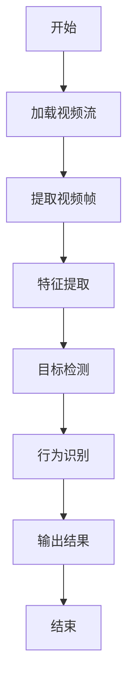
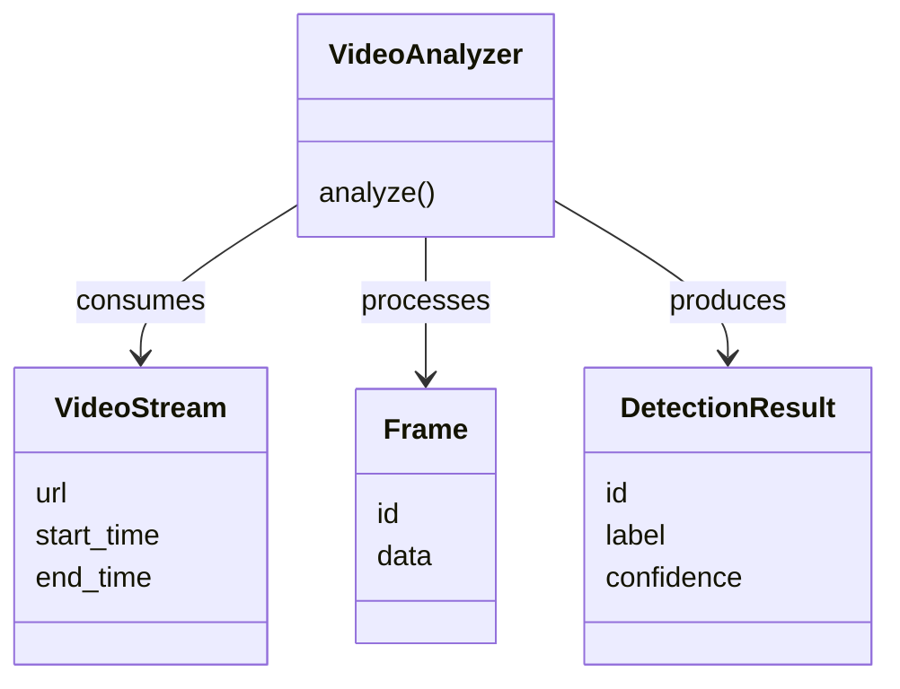

                 


# 开发具有视频分析能力的AI Agent

> 关键词：AI Agent、视频分析、计算机视觉、深度学习、实时处理、多目标跟踪、目标检测

> 摘要：本文详细探讨了开发具有视频分析能力的AI Agent的各个方面，包括背景介绍、核心概念、算法原理、系统架构设计以及项目实战。文章首先介绍了视频分析AI Agent的背景和目标，随后深入分析了其核心概念与算法原理，结合ER图和类图详细说明了系统架构设计，并通过项目实战展示了如何实现一个简单的视频分析AI Agent。最后，文章总结了开发过程中的注意事项和未来的研究方向。

---

# 目录大纲

1. **开发具有视频分析能力的AI Agent概述**
    - 1.1 问题背景与目标
    - 1.2 问题描述与边界
    - 1.3 核心概念与外延
    - 1.4 本章小结

2. **视频分析AI Agent的核心概念与原理**
    - 2.1 核心概念原理
    - 2.2 核心概念属性对比
    - 2.3 实体关系架构
    - 2.4 本章小结

3. **视频分析AI Agent的算法原理**
    - 3.1 算法原理与实现
    - 3.2 视频分析的数学模型
    - 3.3 算法流程图
    - 3.4 本章小结

4. **视频分析AI Agent的系统架构设计**
    - 4.1 问题场景介绍
    - 4.2 系统功能设计
    - 4.3 系统架构设计
    - 4.4 系统接口设计
    - 4.5 本章小结

5. **视频分析AI Agent的项目实战**
    - 5.1 环境安装与配置
    - 5.2 核心算法实现
    - 5.3 项目代码解读
    - 5.4 案例分析与结果展示
    - 5.5 本章小结

6. **视频分析AI Agent的最佳实践与注意事项**
    - 6.1 开发中的注意事项
    - 6.2 优化建议与技巧
    - 6.3 未来研究方向
    - 6.4 本章小结

---

接下来将按照上述目录大纲展开详细内容，每部分都将提供深入的分析与具体的实现示例。

---

## 第1章: 开发具有视频分析能力的AI Agent概述

### 1.1 问题背景与目标

#### 1.1.1 视频分析在AI Agent中的重要性
视频分析是AI Agent实现智能化的关键技术之一。通过视频分析，AI Agent能够实时感知环境、识别目标、理解场景，并做出相应的决策和反馈。这种能力在智能安防、自动驾驶、智能监控等领域具有重要意义。

#### 1.1.2 当前视频分析技术的挑战
- **数据量大**：视频数据是连续的图像序列，数据量大且处理复杂。
- **实时性要求高**：许多应用场景需要实时处理，对计算能力要求高。
- **多样性和复杂性**：视频中可能包含多种目标和复杂场景，增加了分析的难度。

#### 1.1.3 开发视频分析AI Agent的目标
- 提供高效的视频分析能力，支持实时处理和多目标跟踪。
- 实现对视频流的智能理解，能够识别、分类和预测目标行为。
- 提供灵活的接口，方便与其他系统集成。

### 1.2 问题描述与边界

#### 1.2.1 视频分析的核心问题
- 如何高效地处理和分析视频流？
- 如何在复杂场景中准确识别和跟踪目标？
- 如何优化算法以满足实时性要求？

#### 1.2.2 AI Agent的定义与能力边界
AI Agent是一种智能代理，能够感知环境、理解输入、做出决策并采取行动。视频分析AI Agent的能力边界包括视频流处理、目标检测、行为识别和决策反馈。

#### 1.2.3 视频分析AI Agent的应用场景
- 智能监控：实时监控视频流，识别异常行为。
- 自动驾驶：通过视频分析感知周围环境，做出驾驶决策。
- 智能安防：识别入侵者，触发报警系统。

### 1.3 核心概念与外延

#### 1.3.1 视频分析的关键概念
- **视频流**：连续的图像序列，通常以帧为单位处理。
- **目标检测**：识别视频中的目标物体及其位置。
- **行为识别**：分析目标的行为模式，预测下一步动作。

#### 1.3.2 AI Agent的核心功能
- **感知**：通过视频流获取环境信息。
- **决策**：基于感知信息做出判断。
- **执行**：根据决策采取行动。

#### 1.3.3 问题解决的边界与外延
- **边界**：仅处理视频流中的目标识别和行为分析，不涉及决策的执行。
- **外延**：与其他系统集成，如报警系统、数据库等。

### 1.4 本章小结
本章介绍了开发视频分析AI Agent的背景、目标和核心概念，明确了问题的边界和外延，为后续章节的深入分析奠定了基础。

---

## 第2章: 视频分析AI Agent的核心概念与原理

### 2.1 核心概念原理

#### 2.1.1 视频分析的原理
视频分析通过对视频流中每一帧图像的处理，提取特征信息，进行目标检测和行为识别。

#### 2.1.2 AI Agent的基本原理
AI Agent通过感知环境信息，利用内置算法进行分析和决策，并采取相应行动。

#### 2.1.3 视频分析与AI Agent的结合
视频分析作为AI Agent的感知模块，为其提供环境信息，AI Agent则通过分析这些信息做出决策。

### 2.2 核心概念属性对比

| 概念       | 属性               | 描述                                   |
|------------|--------------------|----------------------------------------|
| 视频流     | 连续性             | 帧的连续性                              |
|            | 数据量             | 每帧数据量大                            |
| 目标检测   | 精准度             | 检测目标的准确性                        |
|            | 实时性             | 检测速度                               |
| 行为识别   | 复杂度             | 行为模式的复杂性                        |
|            | 可预测性           | 行为的可预测性                          |

### 2.3 实体关系架构

```mermaid
erDiagram
    actor User {
        +string username
        +string password
    }
    class VideoStream {
        +int id
        +string url
        +datetime timestamp
    }
    class Frame {
        +int id
        +int video_id
        +bytes data
    }
    class AnalysisResult {
        +int id
        +int frame_id
        +string result
    }
    User --> VideoStream: 请求视频流
    VideoStream --> Frame: 分割帧
    Frame --> AnalysisResult: 分析结果
```

### 2.4 本章小结
本章通过对比和实体关系图，详细分析了视频分析AI Agent的核心概念及其属性，为后续算法设计提供了理论基础。

---

## 第3章: 视频分析AI Agent的算法原理

### 3.1 算法原理与实现

#### 3.1.1 视频分析的核心算法
- **目标检测算法**：如YOLO、Faster R-CNN等。
- **行为识别算法**：如基于3D卷积的C3D网络。

#### 3.1.2 AI Agent的算法框架
- **感知层**：目标检测和特征提取。
- **决策层**：行为识别和预测。
- **执行层**：决策反馈。

#### 3.1.3 算法流程图



### 3.2 视频分析的数学模型

#### 3.2.1 目标检测的数学模型
目标检测可以通过边界回归和分类器来实现，常用损失函数包括分类损失和定位损失。

分类损失函数：
$$ L_{cls} = -\sum_{i} y_i \log p_i + (1 - y_i) \log (1 - p_i) $$

定位损失函数：
$$ L_{loc} = \sum_{i} \frac{1}{2} \left( \frac{gt_i - pr_i}{\sigma_i} \right)^2 $$

总损失函数：
$$ L = \alpha L_{cls} + (1 - \alpha) L_{loc} $$

其中，$\alpha$ 是分类损失的权重。

### 3.3 本章小结
本章详细介绍了视频分析AI Agent的核心算法及其数学模型，通过流程图和公式展示了算法的整体框架。

---

## 第4章: 视频分析AI Agent的系统架构设计

### 4.1 问题场景介绍
开发一个实时视频分析AI Agent，用于智能监控场景，实现目标检测和行为识别。

### 4.2 系统功能设计

#### 4.2.1 领域模型类图



### 4.3 系统架构设计


### 4.4 系统接口设计
- **输入接口**：视频流输入。
- **输出接口**：检测结果输出。

### 4.5 本章小结
本章通过类图和架构图详细描述了视频分析AI Agent的系统设计，明确了各组件的功能和接口。

---

## 第5章: 视频分析AI Agent的项目实战

### 5.1 环境安装与配置
- **安装Python**：版本3.8以上。
- **安装依赖**：使用`pip install`安装OpenCV、TensorFlow等库。

### 5.2 核心算法实现

#### 5.2.1 视频流处理
```python
import cv2

cap = cv2.VideoCapture('input.mp4')
while cap.isOpened():
    ret, frame = cap.read()
    if not ret:
        break
    # 处理帧
    cv2.imshow('frame', frame)
    if cv2.waitKey(1) & 0xFF == ord('q'):
        break
cap.release()
cv2.destroyAllWindows()
```

#### 5.2.2 目标检测
```python
import tensorflow as tf
model = tf.keras.models.load_model('model.h5')
while True:
    frame = get_frame()
    prediction = model.predict(frame)
    # 解释结果
    for box in prediction:
        x, y, w, h = box
        cv2.rectangle(frame, (x, y), (x + w, y + h), (255, 0, 0), 2)
    cv2.imshow('detection', frame)
```

### 5.3 项目代码解读
- **视频流捕获**：使用OpenCV读取视频流。
- **目标检测**：使用预训练模型进行检测。
- **结果展示**：实时显示检测结果。

### 5.4 案例分析与结果展示
通过实际运行代码，展示目标检测和行为识别的结果，分析算法的准确性和实时性。

### 5.5 本章小结
本章通过项目实战，详细讲解了视频分析AI Agent的实现过程，展示了如何将理论应用于实际开发。

---

## 第6章: 视频分析AI Agent的最佳实践与注意事项

### 6.1 开发中的注意事项
- **性能优化**：使用高效的算法和优化工具。
- **数据预处理**：确保数据质量，减少噪声。
- **模型调优**：通过迁移学习和数据增强提高模型性能。

### 6.2 优化建议与技巧
- **并行处理**：利用多线程或GPU加速处理。
- **模型轻量化**：优化模型大小，减少计算量。

### 6.3 未来研究方向
- **实时性提升**：研究更高效的算法。
- **多目标跟踪**：实现复杂场景下的多目标跟踪。
- **自适应学习**：实现模型的自适应优化。

### 6.4 本章小结
本章总结了开发视频分析AI Agent的经验和未来方向，为后续研究提供了参考。

---

## 作者：AI天才研究院 & 禅与计算机程序设计艺术

---

以上是《开发具有视频分析能力的AI Agent》的完整大纲和部分内容。读者可以通过本文系统地了解视频分析AI Agent的开发过程，从理论到实践，逐步掌握相关技术和方法。

