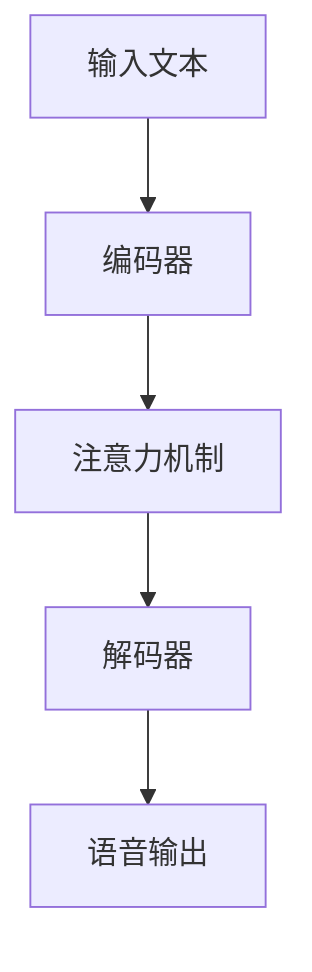
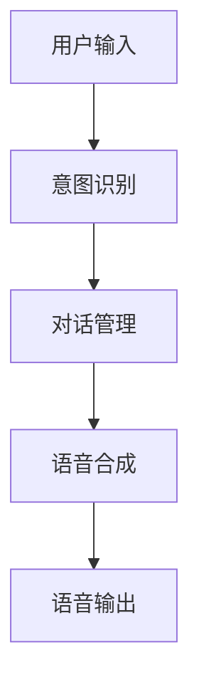

                 


# 开发具有语音合成能力的AI Agent

> 关键词：AI Agent，语音合成，文本到语音（TTS），深度学习，自然语言处理，强化学习

> 摘要：  
本文详细讲解了如何开发具有语音合成能力的AI Agent。从背景介绍、核心概念、算法原理、系统架构设计到项目实战，全面剖析了AI Agent与语音合成技术的结合方式。通过分析TTS技术、深度学习模型、系统架构设计、项目实现等关键环节，为读者提供了从理论到实践的完整指南。文章最后还总结了开发经验，并展望了未来的发展方向。

---

## 第1章: 背景介绍

### 1.1 问题背景
AI Agent（人工智能代理）是一种能够感知环境、执行任务并与用户交互的智能实体。随着自然语言处理（NLP）和语音技术的进步，AI Agent正在从文本交互向多模态交互转变，语音合成技术成为其核心能力之一。  

**语音合成技术**，即Text-to-Speech（TTS），是将文本转换为自然流畅的语音的技术。近年来，基于深度学习的TTS模型（如Tacotron、FastSpeech等）显著提升了语音合成的质量和自然度。然而，如何将语音合成技术无缝集成到AI Agent中，使其具备实时语音交互能力，仍是一个具有挑战性的任务。

### 1.2 问题描述
AI Agent的核心目标是通过语音或文本与用户进行交互，提供智能化的服务。然而，当前大多数AI Agent仅支持文本交互，用户体验较为单一。通过集成语音合成技术，AI Agent可以实现语音交互，显著提升用户体验。  

**关键问题**包括：  
1. 如何选择和实现高效的语音合成模型？  
2. 如何将语音合成技术与AI Agent的其他功能模块（如意图识别、对话管理）结合？  
3. 如何优化语音合成的实时性、准确性和自然度？  

### 1.3 问题解决
本文提出了一种基于深度学习的语音合成方案，并将其集成到AI Agent中。具体步骤如下：  
1. 使用TTS模型生成高质量的语音信号。  
2. 将语音信号通过AI Agent的交互模块传递给用户。  
3. 结合意图识别模块，实现语音驱动的交互流程。  

### 1.4 概念结构与核心要素
AI Agent的语音合成能力依赖于以下几个核心要素：  
1. **文本预处理**：将输入文本转化为适合TTS模型的格式。  
2. **语音合成模型**：生成符合上下文语境的语音信号。  
3. **语音后处理**：对生成的语音信号进行优化（如降噪、语调调整）。  
4. **交互模块**：将合成的语音传递给用户，并实时反馈交互结果。  

---

## 第2章: 核心概念与联系

### 2.1 AI Agent的核心要素
AI Agent由以下几个关键模块组成：  
1. **感知模块**：负责接收用户的输入（文本或语音）。  
2. **意图识别模块**：分析用户的输入，提取意图和需求。  
3. **对话管理模块**：根据意图生成响应内容。  
4. **语音合成模块**：将响应内容转化为语音输出。  

### 2.2 语音合成技术的关键要素
语音合成技术主要包括以下步骤：  
1. **文本分析**：提取文本的情感、语调等特征。  
2. **语音生成**：基于深度学习模型生成语音信号。  
3. **语音优化**：对生成的语音信号进行降噪、语调调整等处理。  

### 2.3 两者的结合与协同机制
AI Agent与语音合成技术的结合主要体现在以下几个方面：  
1. **意图识别与语音生成的协同**：AI Agent根据用户的意图生成响应内容，语音合成技术将响应内容转化为语音。  
2. **实时交互**：用户通过语音输入与AI Agent交互，AI Agent通过语音输出反馈结果。  
3. **多模态交互**：结合文本和语音交互，提升用户体验。  

---

## 第3章: 算法原理讲解

### 3.1 语音合成算法原理
基于深度学习的语音合成技术主要采用以下几种模型：  
1. **Tacotron模型**：一种基于注意力机制的端到端TTS模型。  
2. **FastSpeech模型**：一种基于Transformer的快速TTS模型。  
3. **VITS模型**：一种基于生成对抗网络的高质量语音生成模型。  

#### Tacotron模型的工作流程


#### Tacotron模型的数学公式
编码器将输入文本映射到隐状态空间：  
$$ \text{Encoder}(x) = \{h_1, h_2, ..., h_n\} $$  

解码器通过注意力机制生成语音信号：  
$$ y_t = \text{Decoder}(h_t, y_{t-1}) $$  

### 3.2 AI Agent算法原理
AI Agent的核心算法包括：  
1. **意图识别**：基于Transformer的NLP模型（如BERT、GPT）。  
2. **对话管理**：基于强化学习的策略网络（如REINFORCE算法）。  
3. **语音合成**：基于深度学习的TTS模型（如Tacotron、FastSpeech）。  

#### 对话管理算法的数学公式
策略网络的目标是最优化对话的奖励函数：  
$$ J(\theta) = \mathbb{E}_{\tau \sim \pi_\theta} [R(\tau)] $$  

---

## 第4章: 系统分析与架构设计

### 4.1 系统架构设计
AI Agent的系统架构包括以下几个模块：  
1. **用户交互模块**：接收用户的输入（文本或语音）。  
2. **意图识别模块**：分析用户的意图。  
3. **对话管理模块**：生成响应内容。  
4. **语音合成模块**：将响应内容转化为语音输出。  

#### 系统架构图


### 4.2 系统功能设计
1. **文本预处理**：将输入文本转化为适合TTS模型的格式。  
2. **语音生成**：使用FastSpeech模型生成语音信号。  
3. **语音优化**：对生成的语音信号进行降噪处理。  
4. **交互反馈**：将生成的语音传递给用户，并实时反馈交互结果。  

---

## 第5章: 项目实战

### 5.1 项目介绍
本项目旨在开发一个支持语音交互的AI Agent，用户可以通过语音与AI Agent进行对话。  

### 5.2 环境配置
1. 安装Python和PyTorch框架。  
2. 下载FastSpeech模型和预训练权重。  
3. 配置语音合成环境（如安装pyworld库）。  

### 5.3 核心代码实现
```python
import torch
import numpy as np
from fastspeech.model import FastSpeech

# 初始化模型
model = FastSpeech(vocab_size=1000, 
                   d_model=512, 
                   d_ff=2048, 
                   n_layer=4, 
                   n_head=8)
model.load_weights("fastspeech.pth")

# 语音合成函数
def synthesize_speech(text):
    with torch.no_grad():
        input = model.encoder(text)
        mel, mel_lengths = model.decoder(input)
        return mel, mel_lengths
```

### 5.4 代码解读与分析
1. **模型初始化**：加载FastSpeech模型并加载预训练权重。  
2. **语音合成函数**：将输入文本传递给编码器，生成Mel谱。  

### 5.5 实际案例分析
通过实际案例（如智能客服场景），展示AI Agent如何通过语音合成技术与用户交互。  

---

## 第6章: 总结与展望

### 6.1 总结
本文详细讲解了如何开发具有语音合成能力的AI Agent，包括背景介绍、核心概念、算法原理、系统架构设计和项目实战。通过本文的学习，读者可以掌握AI Agent与语音合成技术的结合方式，并能够实际操作相关技术。

### 6.2 展望
未来，随着深度学习技术的不断进步，AI Agent的语音合成能力将更加智能化和个性化。例如，支持多语言语音合成、情感语音合成等功能将成为可能。

---

## 作者：AI天才研究院/AI Genius Institute & 禅与计算机程序设计艺术 /Zen And The Art of Computer Programming

