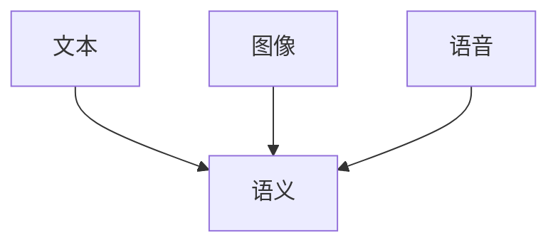
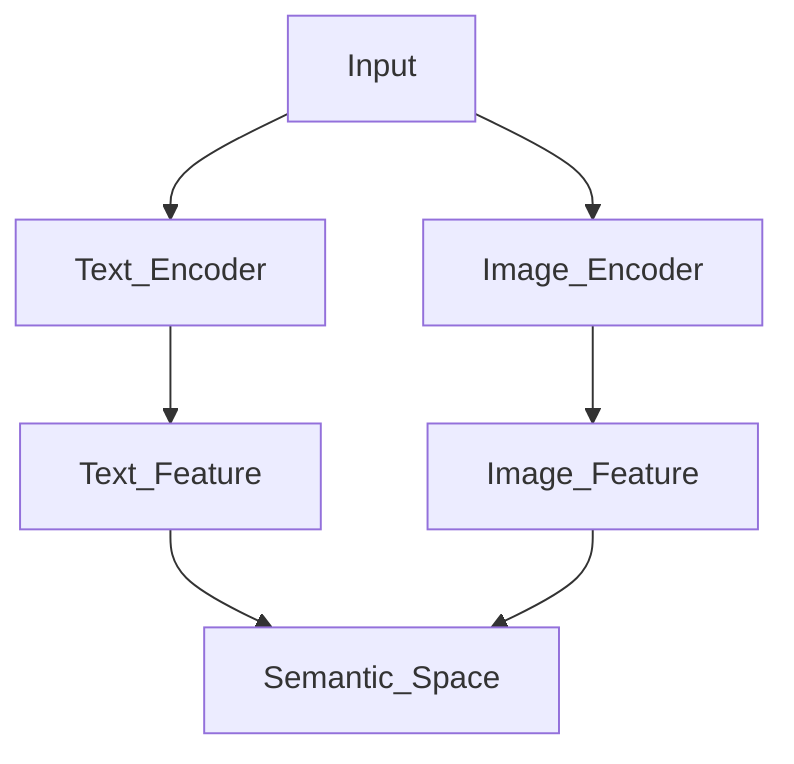
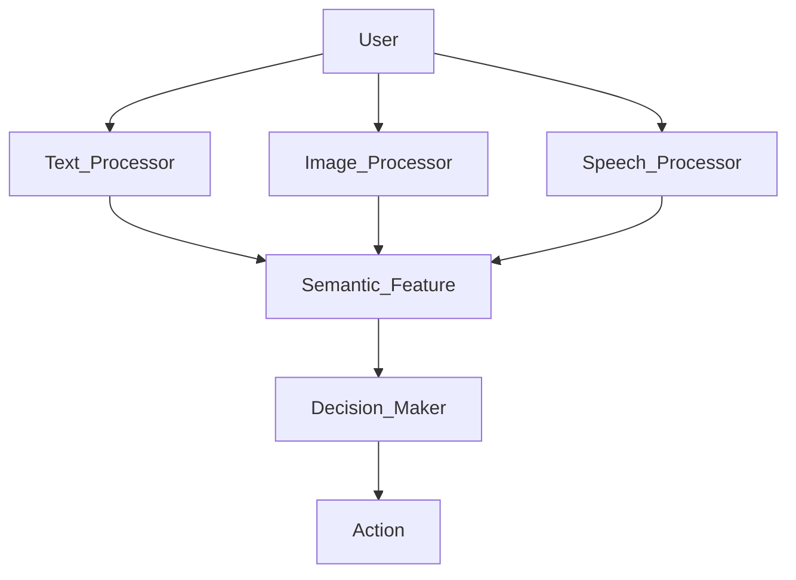

                 


# 开发具有跨模态学习能力的AI Agent

> **关键词**：跨模态学习、AI Agent、多模态数据、深度学习、信息融合、模态对齐  
> **摘要**：本文详细探讨了开发具有跨模态学习能力的AI Agent的核心概念、算法原理、系统架构及实现方法。通过分析多模态数据的处理与融合，结合深度学习技术，提出了一种高效的跨模态学习框架，并通过实际案例展示了其在AI Agent中的应用。文章内容涵盖背景介绍、核心概念、算法实现、系统设计及项目实战，旨在为读者提供一个全面的跨模态AI Agent开发指南。

---

## 第一部分：跨模态学习与AI Agent背景

### 第1章：跨模态学习与AI Agent概述

#### 1.1 多模态数据的定义与特点
- **多模态数据**：指来自不同感官渠道的数据，如文本、图像、语音、视频、传感器数据等。
- **数据特点**：
  - 异构性：不同模态的数据具有不同的特征和表示方式。
  - 完整性：多模态数据能够提供更全面的信息。
  - 互补性：不同模态的数据可以互补，提供更准确的语义理解。

#### 1.2 AI Agent的基本概念与功能
- **AI Agent**：智能体，是指在环境中能够感知并自主行动以实现目标的实体。
- **AI Agent的核心功能**：
  - 感知环境：通过多模态数据感知环境信息。
  - 学习与推理：基于感知数据进行学习和推理。
  - 行动决策：根据推理结果做出决策并执行行动。

#### 1.3 跨模态学习的核心概念
- **跨模态学习**：通过多模态数据进行学习，利用不同模态之间的关联性来提升模型的语义理解和表达能力。
- **核心目标**：
  - 实现不同模态数据之间的信息对齐。
  - 提升模型在多模态数据上的泛化能力。

#### 1.4 跨模态学习的应用场景
- **典型场景**：
  - 多模态对话系统：结合文本和语音进行交互。
  - 视觉-语言模型：结合图像和文本进行理解。
  - 跨模态推荐系统：基于用户行为数据和物品属性进行推荐。

---

## 第二部分：跨模态学习的核心概念与联系

### 第2章：跨模态学习的核心概念与联系

#### 2.1 多模态数据的表示方法
- **文本表示**：如词嵌入（Word2Vec）、BERT等。
- **图像表示**：如CNN提取的特征向量。
- **语音表示**：如MFCC特征或端到端语音模型的输出。

#### 2.2 模态间信息交互机制
- **对齐机制**：通过对比学习或注意力机制实现模态间信息对齐。
- **融合机制**：通过编码器或解码器结构实现多模态信息的融合。

#### 2.3 ER实体关系图


---

## 第三部分：跨模态学习的算法原理与数学模型

### 第3章：跨模态学习的算法原理

#### 3.1 多模态编码器的原理
- **多模态编码器结构**：
  - 输入多模态数据，分别提取特征。
  - 使用编码器将不同模态的特征映射到统一的语义空间。
- **Mermaid流程图**：


#### 3.2 对比学习算法
- **对比学习数学模型**：
  $$ L = \frac{1}{N} \sum_{i=1}^{N} \text{CE}(\text{sim}(x_i, y_i), \text{sim}(x_i, y_j)) $$
  其中，$x_i$和$y_i$是正样本，$y_j$是负样本，$\text{CE}$表示交叉熵损失。
- **Python实现代码示例**：
```python
import torch
import torch.nn as nn

class ContrastiveLoss(nn.Module):
    def __init__(self, temperature=0.1):
        super(ContrastiveLoss, self).__init__()
        self.temperature = temperature

    def forward(self, features, labels):
        # 计算相似性
        sim = torch.mm(features, features.t()) / self.temperature
        # 获取正样本和负样本的索引
        pos_pairs = (labels == labels.unsqueeze(1)).float()
        neg_pairs = 1 - pos_pairs
        # 计算损失
        loss = (sim * pos_pairs).sum() / (pos_pairs.sum() + 1e-10) - \
               (sim * neg_pairs).sum() / (neg_pairs.sum() + 1e-10)
        return loss
```

#### 3.3 注意力机制
- **注意力机制数学公式**：
  $$ \text{Attention}(q, k, v) = \text{softmax}(\frac{qk^T}{\sqrt{d}})v $$
  其中，$q$是查询向量，$k$是键向量，$v$是值向量，$d$是向量维度。

---

## 第四部分：跨模态学习的系统分析与架构设计

### 第4章：跨模态AI Agent的系统架构

#### 4.1 系统功能设计
- **多模态数据处理模块**：
  - 输入多模态数据，进行预处理和特征提取。
- **跨模态学习模块**：
  - 实现模态间信息对齐和融合。
- **AI Agent决策模块**：
  - 基于融合后的语义信息做出决策。

#### 4.2 系统架构设计
- **Mermaid架构图**：


---

## 第五部分：项目实战与拓展

### 第5章：跨模态AI Agent的实现案例

#### 5.1 多模态对话系统实现
- **环境配置**：
  - Python 3.8+
  - PyTorch 1.9+
  - Transformers库
- **核心代码实现**：
```python
from transformers import BertTokenizer, BertModel
import torch
import torch.nn as nn

class MultiModalAgent:
    def __init__(self):
        self.text_model = BertModel.from_pretrained('bert-base-uncased')
        self.image_model = ...  # 图像编码器
        self.semantic_space = nn.Linear(768, 512)  # 文本特征维度到语义空间的映射
```

#### 5.2 代码解读与分析
- **文本编码器**：使用BERT模型提取文本特征。
- **图像编码器**：使用预训练的CNN模型提取图像特征。
- **语义空间映射**：将不同模态的特征映射到统一的语义空间。

#### 5.3 实际案例分析
- **案例描述**：实现一个多模态对话系统，结合文本和图像进行交互。
- **系统流程**：
  1. 用户输入文本和图像。
  2. 系统提取文本和图像的特征。
  3. 将特征映射到语义空间，进行语义理解。
  4. 根据语义信息生成回复。

---

## 第六部分：最佳实践与总结

### 6.1 最佳实践
- **数据预处理**：确保不同模态的数据格式一致。
- **模型调优**：通过对比学习和注意力机制优化模型性能。
- **系统优化**：采用分布式训练和并行计算提升训练效率。

### 6.2 小结
本文详细介绍了开发具有跨模态学习能力的AI Agent的核心概念、算法原理、系统架构及实现方法。通过理论与实践结合，为读者提供了一个全面的开发指南。

### 6.3 注意事项
- 跨模态学习的模型训练需要大量标注数据。
- 模态间信息对齐是模型性能提升的关键。

### 6.4 拓展阅读
- 推荐阅读《多模态学习的数学基础》。
- 推荐学习“可解释性AI”相关知识。

---

**作者：AI天才研究院/AI Genius Institute & 禅与计算机程序设计艺术 /Zen And The Art of Computer Programming**

---

以上是关于《开发具有跨模态学习能力的AI Agent》的技术博客文章的完整目录大纲和内容概述。

