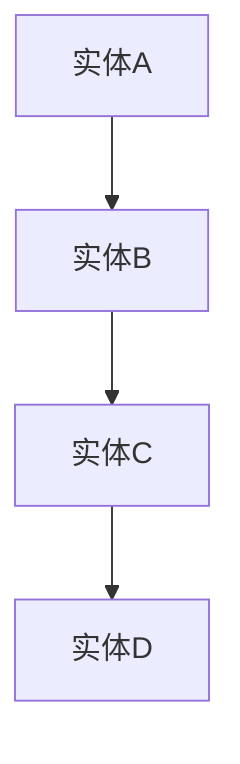
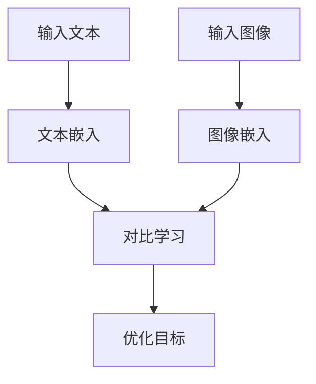
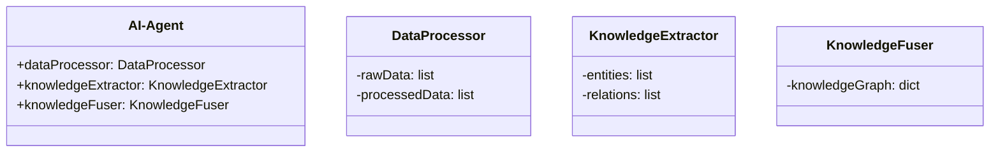
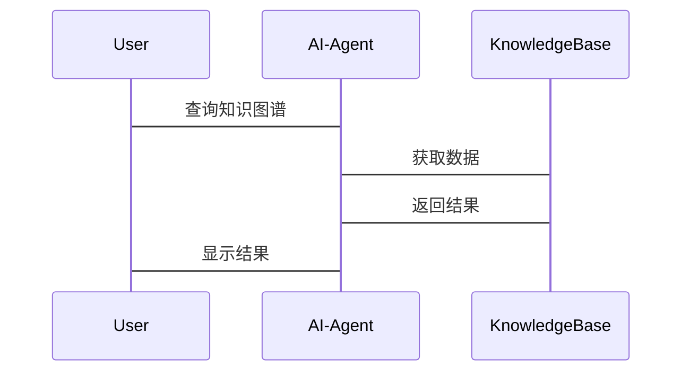

                 


# 开发具有跨模态知识图谱构建能力的AI Agent

## 关键词：AI Agent，跨模态知识图谱，多模态数据，知识图谱构建，深度学习

## 摘要：本文将详细探讨如何开发具有跨模态知识图谱构建能力的AI Agent。通过分析跨模态数据处理的核心概念、算法原理、系统架构设计以及项目实战，我们将揭示AI Agent如何整合不同数据源，构建强大的知识图谱，并在实际应用中展示其能力。本文旨在为开发者提供从理论到实践的全面指导，帮助他们掌握开发此类AI Agent的关键技术。

---

## 第一部分：背景介绍

### 第1章：跨模态知识图谱与AI Agent概述

#### 1.1 跨模态知识图谱的定义与特点
跨模态知识图谱是一种整合多种数据类型（如文本、图像、语音等）的知识表示形式，能够捕捉数据间的语义关联，克服单一模态的局限性。

#### 1.2 AI Agent的基本概念
AI Agent是一种智能代理，能够感知环境、执行任务并做出决策，广泛应用于自然语言处理、计算机视觉等领域。

#### 1.3 跨模态知识图谱构建的背景与意义
随着AI技术的发展，整合多模态数据的需求日益增加，跨模态知识图谱为AI Agent提供了更强大的理解和推理能力。

---

## 第二部分：核心概念与联系

### 第2章：跨模态数据处理与知识图谱构建原理

#### 2.1 跨模态数据的表示方法
- 文本数据的表示：使用词嵌入（如Word2Vec）或句向量（如BERT）。
- 图像数据的表示：通过CNN提取特征向量。
- 融合策略：使用注意力机制或对比学习进行模态间对齐。

#### 2.2 知识图谱构建的关键步骤
- 数据预处理：清洗和标注数据。
- 实体识别与链接：使用NLP技术提取实体并建立关联。
- 关系抽取：利用规则或深度学习模型提取语义关系。

#### 2.3 跨模态数据融合策略
- 特征融合：将文本和图像的特征向量进行线性组合。
- 注意力机制：根据模态的重要性动态调整权重。

#### 2.4 核心概念对比表
| 概念       | 文本模态       | 图像模态       | 融合策略       |
|------------|---------------|---------------|----------------|
| 表示方法   | Word2Vec      | CNN           | 注意力机制     |
| 优势       | 高语义         | 高辨识度       | 综合信息优势     |

#### 2.5 实体关系图


---

## 第三部分：算法原理

### 第3章：跨模态知识图谱构建的算法实现

#### 3.1 多模态嵌入算法
- **算法流程**：
  1. 对文本和图像分别提取特征向量。
  2. 使用对比学习优化跨模态对齐。
- **数学模型**：
  $$ L = \text{ContrastiveLoss}(f_{text}, f_{image}) $$
  其中，$f_{text}$和$f_{image}$分别是文本和图像的嵌入向量。

#### 3.2 对比学习算法
- **代码实现**：
  ```python
  import torch

  def contrastive_loss(f_text, f_image, label):
      similarity = torch.cosine_similarity(f_text, f_image)
      loss = (1 - similarity * label + similarity * (1 - label)).mean()
      return loss
  ```

#### 3.3 算法流程图


---

## 第四部分：系统分析与架构设计

### 第4章：AI Agent的系统架构

#### 4.1 系统功能模块设计
- 数据处理模块：负责数据预处理和标注。
- 知识抽取模块：提取实体和关系。
- 知识融合模块：整合多模态数据，构建知识图谱。

#### 4.2 系统架构图


#### 4.3 接口设计与交互流程
- 接口：提供API供外部调用。
- 流程：数据输入 -> 数据处理 -> 知识抽取 -> 知识融合 -> 知识图谱输出。

#### 4.4 系统交互图


---

## 第五部分：项目实战

### 第5章：开发跨模态知识图谱AI Agent

#### 5.1 环境配置
- 安装必要的库：TensorFlow、PyTorch、NetworkX、Falcon。

#### 5.2 核心代码实现
```python
import networkx as nx

class KnowledgeGraph:
    def __init__(self):
        self.graph = nx.Graph()

    def add_edge(self, entity1, entity2):
        self.graph.add_edge(entity1, entity2)

    def get_neighbors(self, entity):
        return list(self.graph.neighbors(entity))
```

#### 5.3 案例分析
- 实际案例：构建一个多模态知识图谱，整合文本和图像数据，展示实体间的关联关系。

#### 5.4 项目总结
- 成果展示：通过代码和图表展示构建的知识图谱。
- 问题与优化：讨论当前实现的不足及未来改进方向。

---

## 第六部分：最佳实践与小结

### 第6章：开发注意事项与未来展望

#### 6.1 最佳实践
- 数据预处理：确保数据质量和多样性。
- 模型选择：根据任务需求选择合适的算法。
- 跨模态对齐：采用有效的对齐策略提高性能。

#### 6.2 小结
本文全面介绍了开发具有跨模态知识图谱构建能力的AI Agent的关键技术，从理论到实践为读者提供了详尽的指导。

#### 6.3 注意事项
- 数据隐私：注意数据安全和隐私保护。
- 算法优化：持续优化算法以提高效率和准确性。

#### 6.4 拓展阅读
推荐阅读相关领域的最新论文和技术博客，深入了解前沿技术。

---

## 附录

### A. 工具与库

- TensorFlow: [https://tensorflow.org](https://tensorflow.org)
- PyTorch: [https://pytorch.org](https://pytorch.org)
- NetworkX: [https://networkx.org](https://networkx.org)

### B. 数据集

- Wikipedia：常用文本数据集。
- ImageNet：常用图像数据集。

---

## 作者

作者：AI天才研究院/AI Genius Institute & 禅与计算机程序设计艺术/Zen And The Art of Computer Programming

---

通过以上结构和内容，读者可以系统地了解开发具有跨模态知识图谱构建能力的AI Agent所需的知识和技能，从理论到实践，逐步掌握相关技术。

