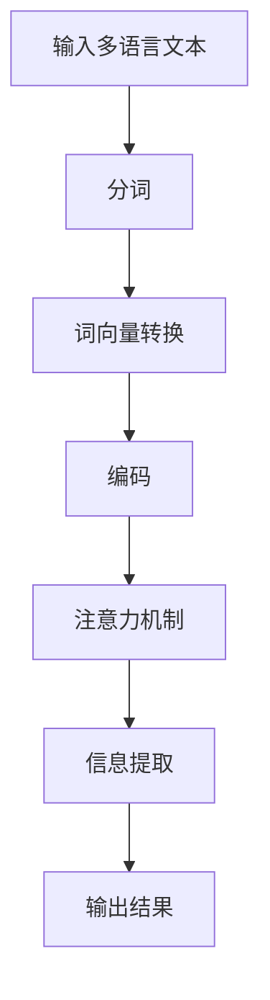
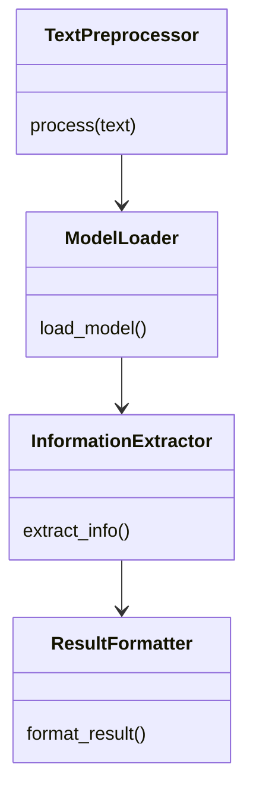
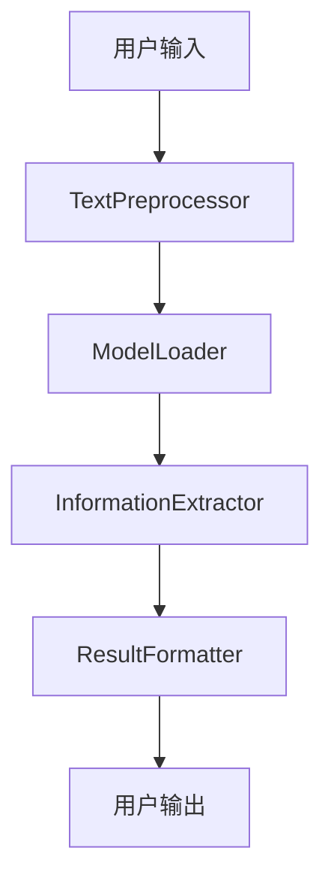
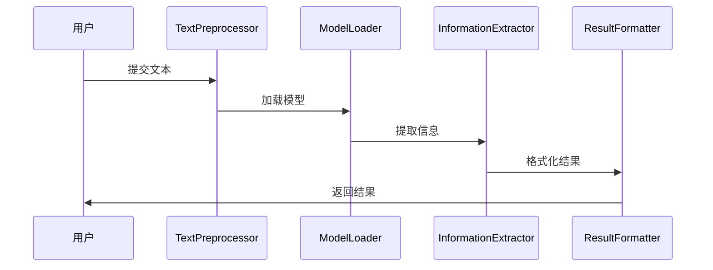

                 


# 开发具有跨语言信息提取能力的AI Agent

## 关键词：跨语言信息提取、AI Agent、自然语言处理、多语言模型、信息抽取

## 摘要：  
本文详细探讨了开发具有跨语言信息提取能力的AI Agent的各个方面，从背景介绍到系统架构设计，再到实际项目实现。文章首先介绍了跨语言信息提取的背景和AI Agent的核心概念，然后深入讲解了跨语言信息提取的核心原理和AI Agent的架构设计，最后通过实际案例展示了如何实现一个具备跨语言信息提取能力的AI Agent，并提供了相关的代码实现和性能优化建议。通过本文，读者将能够全面理解跨语言信息提取的技术细节，并掌握如何将其应用于实际项目中。

---

## 第1章: 背景介绍

### 1.1 跨语言信息提取的背景  
跨语言信息提取是指从多种语言的文本中提取有用的信息，例如关键词、实体或情感。随着全球化的加剧，企业需要处理来自不同语言的用户请求，传统的单语言信息提取方法已无法满足需求。跨语言信息提取技术能够帮助企业在多语言环境中高效处理信息，提升用户体验。

#### 1.1.1 问题背景  
在现实场景中，许多企业需要处理来自不同语言的用户咨询或文档，例如跨国公司的客服系统、多语言新闻聚合平台等。传统的单语言信息提取方法只能处理一种语言的数据，无法满足跨语言的需求。

#### 1.1.2 问题描述  
跨语言信息提取的核心问题是如何在多种语言的文本中准确提取信息。由于不同语言的语法结构、词汇差异较大，直接使用单语言模型会导致性能下降。

#### 1.1.3 问题解决  
通过引入多语言自然语言处理模型，结合AI Agent的技术，可以实现跨语言信息提取。多语言模型能够同时处理多种语言的文本，AI Agent则负责协调信息提取过程，并将结果返回给用户。

#### 1.1.4 边界与外延  
跨语言信息提取的边界包括：仅处理文本数据，不涉及语音或图像；仅提取结构化信息，不进行情感分析。其外延包括多语言文本分类、实体链接等高级任务。

#### 1.1.5 核心概念结构与组成  
跨语言信息提取的核心概念包括：多语言模型、信息提取算法、AI Agent架构。三者共同作用，实现跨语言信息处理。

---

## 第2章: 核心概念与联系

### 2.1 跨语言信息提取的核心原理  
跨语言信息提取依赖于多语言模型，如BERT、XLM等。这些模型能够同时处理多种语言的文本，并通过跨语言的表示学习，提取共享的语义信息。

#### 2.1.1 多语言模型的工作原理  
多语言模型通过共享参数的方式，同时处理多种语言的文本。输入文本经过分词、编码、注意力机制等步骤，最终输出信息提取结果。

#### 2.1.2 跨语言信息提取的关键技术  
关键技术包括：跨语言表示学习、多任务学习、注意力机制等。这些技术帮助模型在多种语言中保持一致的语义表示。

#### 2.1.3 跨语言信息提取的挑战与解决方案  
挑战包括语言间的语义差异、数据稀缺性等。解决方案包括使用预训练模型、跨语言对比学习等。

### 2.2 AI Agent与信息提取的联系  
AI Agent负责接收输入、处理信息并输出结果。跨语言信息提取作为AI Agent的核心模块，为其提供多语言的语义理解能力。

#### 2.2.1 AI Agent的信息处理流程  
AI Agent接收多语言文本，通过跨语言信息提取模块提取关键词、实体等信息，并结合上下文进行推理，最终输出结果。

#### 2.2.2 跨语言信息提取在AI Agent中的应用  
应用场景包括多语言客服、跨语言数据分析、多语言内容审核等。

#### 2.2.3 跨语言信息提取对AI Agent性能的影响  
跨语言信息提取的性能直接影响AI Agent的响应速度和准确性。优化提取算法可以提升整体性能。

### 2.3 核心概念对比  
通过对比跨语言信息提取与单语言信息提取，AI Agent与其他信息处理系统，帮助读者理解其独特性和优势。

#### 2.3.1 跨语言信息提取与单语言信息提取的对比  
| 对比维度 | 跨语言信息提取 | 单语言信息提取 |
|----------|-----------------|----------------|
| 适用场景 | 多语言环境       | 单语言环境     |
| 数据需求 | 数据多样         | 数据单一       |
| 性能挑战 | 语义差异大       | 语义一致       |

#### 2.3.2 AI Agent与其他信息处理系统的对比  
| 对比维度 | AI Agent          | 传统信息处理系统 |
|----------|--------------------|------------------|
| 自主性   | 高度自主           | 依赖人工干预     |
| 可扩展性 | 支持多语言扩展     | 语言受限         |

#### 2.3.3 跨语言信息提取与机器翻译的联系  
跨语言信息提取依赖于机器翻译技术，但目标不同。机器翻译注重语言转换，而跨语言信息提取注重信息抽取。

---

## 第3章: 跨语言信息提取的算法原理

### 3.1 转换器模型的核心算法  
转换器模型（如BERT、XLM）是跨语言信息提取的核心算法。其通过自注意力机制，捕捉文本中的语义信息。

#### 3.1.1 转换器模型的结构  
转换器模型由编码器和解码器组成。编码器负责将输入文本转换为语义向量，解码器负责生成输出结果。

#### 3.1.2 跨语言信息提取的数学模型  
跨语言信息提取的数学模型如下：

$$
f(x) = \text{attention}(x) + \text{position}(x)
$$

其中，$x$ 是输入文本，$\text{attention}$ 是注意力机制，$\text{position}$ 是位置编码。

#### 3.1.3 注意力机制的公式推导  
注意力机制公式如下：

$$
\text{score}(i,j) = \frac{\exp(e_{i,j})}{\sum_{k} \exp(e_{i,k})}
$$

其中，$e_{i,j}$ 是查询与键的点积。

### 3.2 跨语言信息提取的流程图  


### 3.3 转换器模型的代码实现  
以下是使用Python实现的跨语言信息提取代码示例：

```python
import torch
from transformers import XLMTokenizer, XLMModel

# 初始化tokenizer和模型
tokenizer = XLMTokenizer.from_pretrained('microsoft/xlm-large-ende')
model = XLMModel.from_pretrained('microsoft/xlm-large-ende')

# 输入文本
text_en = "What is your address?"
text_zh = "您的地址是什么？"

# 分词
inputs_en = tokenizer(text_en, return_tensors='pt')
inputs_zh = tokenizer(text_zh, return_tensors='pt')

# 编码
outputs_en = model(**inputs_en)
outputs_zh = model(**inputs_zh)

# 提取信息
# （此处需要根据具体任务编写代码）
```

---

## 第4章: 系统分析与架构设计

### 4.1 系统功能设计  
系统功能包括：多语言文本输入、信息提取、结果输出、错误处理等。

#### 4.1.1 领域模型（Mermaid类图）  


#### 4.1.2 系统架构设计（Mermaid架构图）  


#### 4.1.3 系统接口设计  
接口设计包括：REST API、GraphQL等。

#### 4.1.4 系统交互设计（Mermaid序列图）  


---

## 第5章: 项目实战

### 5.1 环境安装  
安装Python和相关库，例如：

```bash
pip install torch transformers
```

### 5.2 系统核心实现源代码  
以下是核心代码实现：

```python
import torch
from transformers import XLMTokenizer, XLMModel

class TextPreprocessor:
    def process(self, text):
        # 分词和编码
        inputs = tokenizer(text, return_tensors='pt')
        return inputs

class ModelLoader:
    def load_model(self):
        # 加载预训练模型
        model = XLMModel.from_pretrained('microsoft/xlm-large-ende')
        return model

class InformationExtractor:
    def extract_info(self, model, inputs):
        # 调用模型进行信息提取
        outputs = model(**inputs)
        # 根据具体任务编写提取逻辑
        return extracted_info

class ResultFormatter:
    def format_result(self, extracted_info):
        # 格式化结果
        return formatted_result
```

### 5.3 代码应用解读与分析  
代码实现展示了如何将跨语言信息提取技术应用于实际项目中，包括文本预处理、模型加载、信息提取和结果格式化。

### 5.4 实际案例分析和详细讲解剖析  
以一个多语言客服系统为例，展示如何通过AI Agent实现跨语言信息提取，提升用户体验。

### 5.5 项目小结  
总结项目实现的关键点，强调代码实现与实际应用的结合。

---

## 第6章: 最佳实践、小结、注意事项、拓展阅读

### 6.1 最佳实践  
- 选择合适的多语言模型，如XLM、Marian等。
- 对模型进行微调，提升特定任务的性能。
- 处理语言间的差异，如语序、语法等。

### 6.2 小结  
本文详细介绍了开发具有跨语言信息提取能力的AI Agent的各个方面，从理论到实践，帮助读者掌握相关技术。

### 6.3 注意事项  
- 数据质量影响模型性能。
- 模型训练需要大量计算资源。
- 注意语言间的语义差异。

### 6.4 拓展阅读  
推荐书籍和论文，如《Attention Is All You Need》、《Pretrain

