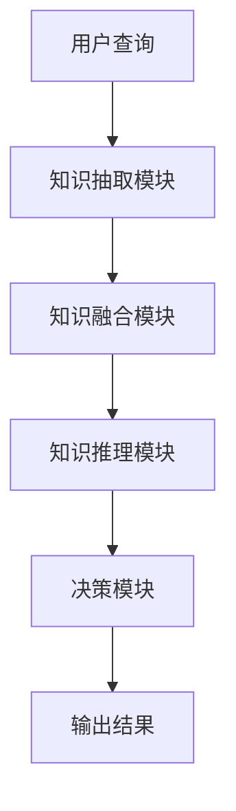

                 


# 开发具有跨领域知识融合能力的AI Agent

> 关键词：AI Agent，跨领域知识融合，知识图谱，算法原理，系统架构，项目实战

> 摘要：本文将详细探讨如何开发具有跨领域知识融合能力的AI Agent。首先介绍AI Agent的基本概念和跨领域知识融合的重要性，然后深入分析知识融合的核心原理和算法，接着讨论系统架构设计与实现，最后通过具体项目实战展示跨领域知识融合的实际应用。本文旨在为AI Agent的开发者提供一份从理论到实践的全面指南。

---

# 第一部分: AI Agent与跨领域知识融合概述

## 第1章: AI Agent的基本概念与背景

### 1.1 AI Agent的定义与分类
AI Agent（人工智能代理）是指能够感知环境、自主决策并执行任务的智能体。根据功能和应用场景的不同，AI Agent可以分为以下几类：
- **简单反射型代理**：基于预定义规则执行任务。
- **基于模型的反射型代理**：通过内部模型理解和决策。
- **目标驱动型代理**：以特定目标为导向。
- **效用驱动型代理**：通过最大化效用函数进行决策。

### 1.2 跨领域知识融合的必要性
在实际应用中，AI Agent往往需要处理来自不同领域（如文本、图像、语音、传感器数据等）的信息。跨领域知识融合能够帮助AI Agent更好地理解复杂场景，提升决策能力。例如，在医疗领域，AI Agent需要融合电子病历、医学影像和药物知识库等多种数据源。

### 1.3 当前AI Agent的发展趋势
随着深度学习和知识图谱技术的快速发展，AI Agent正朝着以下方向演进：
- **多模态融合**：整合多种数据类型的特征。
- **实时性增强**：支持快速决策和反馈。
- **可解释性提升**：提高用户对AI决策的信任度。

---

## 第2章: 跨领域知识融合的核心问题

### 2.1 知识融合的基本概念
知识融合是指将来自不同领域、格式或语义的信息进行整合，形成统一的知识表示。其核心目标是消除数据孤岛，提升信息的可利用性。

### 2.2 跨领域数据整合的挑战
跨领域数据整合面临以下主要挑战：
- **数据异构性**：不同领域数据的格式、语义和结构差异较大。
- **知识冲突**：同一实体在不同领域中的表示可能不一致。
- **数据质量**：部分数据可能存在噪声或缺失。

### 2.3 知识融合的目标与意义
知识融合的目标是通过技术手段将分散、异构的知识源整合为一致、完整的知识表示。其意义在于：
- 提高数据利用率。
- 支持跨领域决策。
- 降低信息孤岛问题。

---

# 第二部分: 跨领域知识融合的核心概念与原理

## 第3章: 知识表示与知识图谱

### 3.1 知识表示的基本概念
知识表示是将现实世界中的实体及其关系表示为数据结构的过程。常见的知识表示方法包括：
- **符号逻辑**：使用符号和规则表示知识。
- **向量表示**：通过高维向量表示实体和关系。
- **图结构表示**：使用图论中的节点和边表示知识。

### 3.2 知识图谱的构建方法
知识图谱的构建通常包括以下步骤：
1. 数据采集：从多个来源获取数据。
2. 数据清洗：去除噪声和冗余信息。
3. 实体识别与链接：识别实体并建立关联。
4. 知识融合：整合异构数据。
5. 知识存储：将知识图谱存储为结构化数据。

### 3.3 知识图谱的存储与管理
知识图谱的存储与管理需要考虑以下方面：
- **存储技术**：如图数据库（Neo4j）和关系型数据库。
- **查询效率**：优化知识图谱的查询性能。
- **数据更新**：支持动态更新知识图谱。

---

## 第4章: 知识融合的原理与算法

### 4.1 知识融合的原理
知识融合的核心在于解决异构数据的统一表示和语义对齐问题。常用的技术包括：
- **对齐算法**：通过特征匹配或学习模型对齐异构实体。
- **融合算法**：将多个知识源的信息整合为一致的表示。

### 4.2 知识融合的算法实现
以下是一个基于符号逻辑的知识融合算法示例：

```python
def align_entities(entity1, entity2):
    # 通过符号逻辑对齐实体
    if entity1['name'] == entity2['name']:
        return True
    elif entity1['id'] == entity2['id']:
        return True
    else:
        return False

def fuse_knowledge(knowledge1, knowledge2):
    aligned_entities = []
    for e1 in knowledge1['entities']:
        for e2 in knowledge2['entities']:
            if align_entities(e1, e2):
                aligned_entities.append((e1, e2))
    return aligned_entities
```

### 4.3 知识融合的数学模型
知识融合的数学模型可以通过图论表示。例如，两个实体的关联关系可以用以下公式表示：

$$
similarity(e1, e2) = \frac{1}{1 + |d(e1, e2)|}
$$

其中，$d(e1, e2)$ 表示实体 $e1$ 和 $e2$ 之间的距离。

---

# 第三部分: 系统架构与设计

## 第5章: 系统功能需求分析

### 5.1 系统目标与功能模块
AI Agent的系统目标是实现跨领域知识融合与智能决策。主要功能模块包括：
- **知识抽取模块**：从多源数据中提取实体和关系。
- **知识融合模块**：整合异构知识源。
- **知识推理模块**：基于知识图谱进行推理。
- **决策模块**：根据推理结果生成决策。

### 5.2 系统输入与输出
- **输入**：多源异构数据、用户查询。
- **输出**：融合后的知识表示、决策结果。

### 5.3 系统性能指标
- **响应时间**：系统处理查询的时间。
- **准确率**：知识融合的准确率。
- **可扩展性**：系统支持的数据规模。

---

## 第6章: 系统架构设计

### 6.1 分层架构设计
系统架构通常采用分层设计，包括数据层、逻辑层和应用层。

### 6.2 模块化设计
模块化设计有助于提高系统的可维护性和扩展性。例如：
- **数据预处理模块**：负责数据清洗和格式转换。
- **知识融合模块**：实现异构数据的对齐与融合。

### 6.3 系统交互流程
以下是一个简单的系统交互流程图：



---

# 第四部分: 项目实战

## 第7章: 项目实战与应用案例

### 7.1 项目背景与目标
以医疗领域为例，开发一个能够融合电子病历、医学影像和药物知识库的AI Agent。

### 7.2 环境安装与数据准备
- **环境安装**：安装Python、TensorFlow、Neo4j等工具。
- **数据准备**：收集电子病历、医学影像数据等。

### 7.3 核心实现
以下是知识融合模块的Python代码示例：

```python
import numpy as np
from tensorflow.keras import Model
import tensorflow as tf

def build_model(input_shape):
    inputs = tf.keras.Input(shape=input_shape)
    x = tf.keras.layers.Dense(64, activation='relu')(inputs)
    x = tf.keras.layers.Dense(32, activation='relu')(x)
    outputs = tf.keras.layers.Dense(1, activation='sigmoid')(x)
    return Model(inputs=inputs, outputs=outputs)

model = build_model((100, 100, 3))
model.compile(optimizer='adam', loss='binary_crossentropy', metrics=['accuracy'])
```

### 7.4 应用案例分析
通过实际案例分析，展示跨领域知识融合在医疗诊断中的应用效果。

---

## 第8章: 总结与展望

### 8.1 本章小结
本文详细探讨了开发具有跨领域知识融合能力的AI Agent的关键技术，包括知识表示、知识融合、系统架构设计和项目实战等内容。

### 8.2 未来展望
未来的研究方向包括：
- **更高效的知识融合算法**。
- **支持动态更新的知识图谱**。
- **多模态数据的深度融合**。

---

作者：AI天才研究院/AI Genius Institute & 禅与计算机程序设计艺术 /Zen And The Art of Computer Programming

