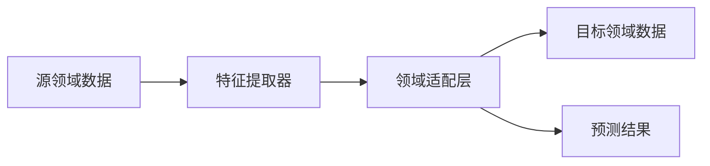
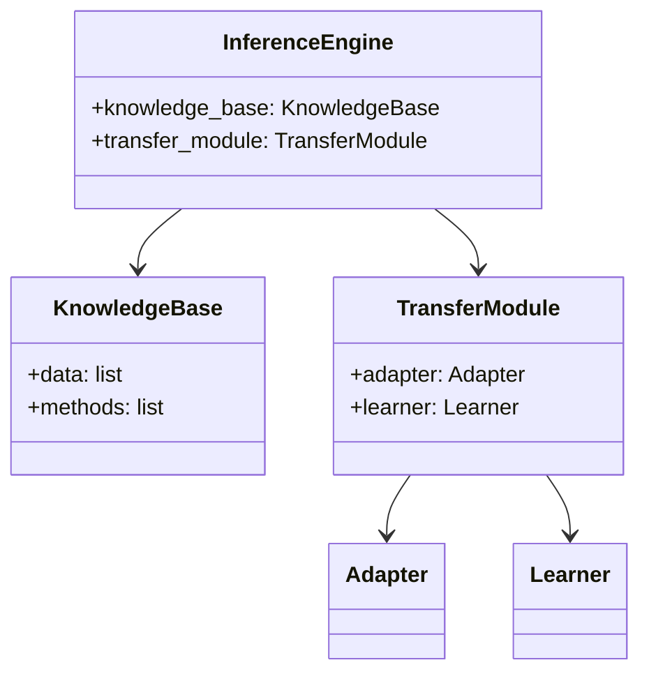
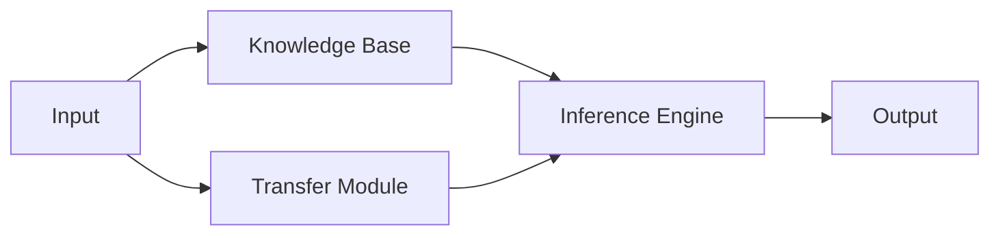
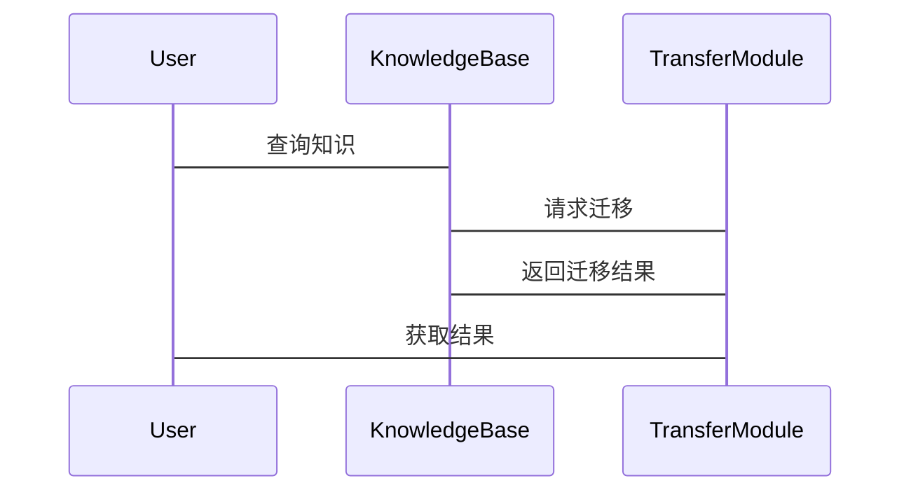

                 


```markdown
# 开发具有跨领域知识迁移能力的AI Agent

## 关键词：
跨领域知识迁移、AI Agent、迁移学习、知识表示、领域适应

## 摘要：
本文探讨了开发具有跨领域知识迁移能力的AI Agent的核心概念、算法原理和系统架构。通过分析跨领域知识迁移的必要性、现状与挑战，详细介绍了相关的核心理论，包括知识表示和迁移学习。本文进一步讨论了实现跨领域知识迁移的具体算法策略，如参数迁移和样本迁移，并通过实际案例展示了这些算法的应用。最后，本文提出了系统架构设计和项目实战的详细步骤，总结了最佳实践和未来研究方向。

---

# 第1章 背景介紹

## 1.1 問題背景
### 1.1.1 AI Agent的基本概念
AI Agent是一种智能体，能够感知环境、执行任务并做出决策。在跨领域应用中，AI Agent需要处理来自不同领域的数据和问题，这要求它具备跨领域知识迁移的能力。

### 1.1.2 跨領域知識遷移的必要性
AI Agent在不同领域应用时，需要将一个领域的知识迁移到另一个领域，以提高其在新领域的表现。例如，在医疗领域学习的诊断知识可以迁移到健康领域进行疾病预测。

### 1.1.3 現狀與挑戰
尽管AI Agent在单一领域表现出色，但在跨领域应用中仍面临数据稀疏性、领域差异性和模型适应性等挑战。现有的技术主要集中在单一领域的优化，跨领域迁移的能力尚未得到充分发展。

## 1.2 問題描述
### 1.2.1 AI Agent在跨領域應用中的挑戰
AI Agent需要在不同领域间切换时，保持高性能，这需要解决领域适应、知识表示和迁移学习等问题。

### 1.2.2 知識遷移的核心問題
跨领域知识迁移的核心在于如何有效地提取和利用源领域的知识，并将其适应到目标领域。这涉及到知识表示、迁移策略和模型优化等多个方面。

### 1.2.3 珈限性
现有的跨领域知识迁移方法在处理领域差异性和数据稀疏性方面存在不足，限制了其在复杂场景中的应用。

## 1.3 問題解決方案
### 1.3.1 知識遷移的基本思路
通过构建统一的知识表示框架，利用迁移学习技术，将源领域的知识迁移到目标领域，并通过领域适配模块进行优化。

### 1.3.2 跨領域應用的實現策略
采用多任务学习、领域适配和对抗训练等策略，提升AI Agent在跨领域的泛化能力和适应性。

### 1.3.3 技術路線圖
1. 构建跨领域知识库。
2. 设计迁移学习模型。
3. 实现领域适配模块。
4. 优化算法并进行实验验证。

## 1.4 邊界與外延
### 1.4.1 跨領域知識遷移的邊界條件
明确源领域和目标领域的范围，确保数据的可迁移性和任务的相关性。

### 1.4.2 技術的外延與應用範圍
跨领域知识迁移技术不仅适用于AI Agent，还可应用于多领域机器学习模型的设计。

### 1.4.3 與其他技術的區別與聯繫
与多任务学习和领域适应技术有联系，但更专注于跨领域知识的迁移和应用。

## 1.5 核心要素組成
### 1.5.1 知識表示的核心要素
知识表示需要具备领域独立性、可迁移性和语义一致性。

### 1.5.2 遷移學習的關鍵技術
包括特征提取、对抗训练和领域适配等技术。

### 1.5.3 風險控制與優化策略
通过数据增强、正则化和模型优化等方法，降低迁移风险，提升性能。

## 1.6 本章小結
本章介绍了跨领域知识迁移的背景、问题、解决方案和核心要素，为后续章节奠定了基础。

---

# 第2章 核心概念與聯繫

## 2.1 核心概念原理
### 2.1.1 知識表示的理論基礎
知识表示是将知识以结构化的方式表示，通常采用符号逻辑、向量表示和图结构等方式。

### 2.1.2 遷移學習的基本原理
迁移学习通过共享特征或参数，将源领域的知识迁移到目标领域，减少目标领域的数据需求。

### 2.1.3 風險控制的數學模型
通过风险函数和损失函数，量化迁移学习中的误差，并进行优化。

## 2.2 概念屬性對比表
### 知識表示與遷移學習的對比
| 特征     | 知识表示                | 迁移学习                |
|----------|------------------------|------------------------|
| 目的     | 描述知识结构            | 迁移知识到新领域        |
| 方法     | 符号、向量、图          | 特征提取、对抗训练      |

### 遷移學習與領域適應的對比
| 特征     | 迁移学习                | 领域适应                |
|----------|------------------------|------------------------|
| 目的     | 迁移知识                | 适应新领域数据          |
| 方法     | 参数迁移、样本迁移      | 数据预处理、特征调整      |

### 知識遷移與模型泛化的對比
| 特征     | 知识迁移                | 模型泛化                |
|----------|------------------------|------------------------|
| 目的     | 应用知识到新领域        | 提高模型在不同数据上的表现 |
| 方法     | 领域适配、对抗训练      | 正则化、数据增强          |

## 2.3 ER實體關係圖
```mermaid
erDiagram
    customer[客户] {
        <属性>
        id : integer
        name : string
        age : integer
    }
    order[订单] {
        <属性>
        id : integer
        customer_id : integer
        order_date : date
    }
    product[产品] {
        <属性>
        id : integer
        name : string
        price : integer
    }
    customer --> order : 下订单
    order --> product : 订单包含的产品
```

---

# 第3章 算法原理

## 3.1 算法原理
### 3.1.1 迁移学习算法


### 3.1.2 参数遷移
参数迁移通过共享源领域和目标领域的模型参数，减少目标领域的训练数据需求。

### 3.1.3 样本遷移
样本迁移通过生成新样本或调整数据分布，帮助模型适应目标领域。

## 3.2 算法實現
### 3.2.1 迁移学习的数学模型
$$L_{source} = \sum_{i=1}^{n} (y_i - f(x_i))^2$$
$$L_{target} = \sum_{j=1}^{m} (y'_j - f(x'_j))^2$$
$$L_{total} = \alpha L_{source} + (1-\alpha) L_{target}$$

### 3.2.2 领域适配
领域适配通过对抗训练，使特征在源领域和目标领域之间对齐。
$$D(f(x), y) = \log(P(y|f(x)))$$
$$G(f(x), y) = \log(P(y|f(x)))$$

## 3.3 算法優化
### 3.3.1 参数优化
使用梯度下降等优化方法，调整模型参数以最小化损失函数。

### 3.3.2 正则化
通过L2正则化等方法，防止过拟合，提升模型的泛化能力。

### 3.3.3 数据增强
通过数据增强技术，增加目标领域的训练数据，提升模型的鲁棒性。

## 3.4 本章小結
本章详细介绍了跨领域知识迁移的核心算法，包括参数迁移和样本迁移，并给出了数学公式和流程图。

---

# 第4章 系統分析與架構設計

## 4.1 系統分析
### 4.1.1 问题场景介紹
AI Agent需要在医疗和金融领域之间切换，处理不同领域的数据和任务。

### 4.1.2 系統功能設計


### 4.1.3 系統架構設計


## 4.2 系統實現
### 4.2.1 系統接口設計
定义API接口，实现知识库与迁移模块之间的数据交互。

### 4.2.2 系統交互流程


## 4.3 本章小結
本章从系统角度分析了跨领域知识迁移的实现，提出了系统的功能设计和架构设计。

---

# 第5章 項目實戰

## 5.1 開發環境安裝
### 5.1.1 安裝Python
```bash
python --version
pip install --upgrade pip
```

### 5.1.2 安裝TensorFlow
```bash
pip install tensorflow
```

### 5.1.3 安裝Keras
```bash
pip install keras
```

## 5.2 系統核心實現
### 5.2.1 知識庫實現
```python
class KnowledgeBase:
    def __init__(self):
        self.data = {}

    def getKnowledge(self, key):
        return self.data.get(key, None)
```

### 5.2.2 遷移模塊實現
```python
class TransferModule:
    def __init__(self):
        self.adapter = Adapter()
        self.learner = Learner()

    def transfer(self, source, target):
        return self.adapter.adapt(source, target), self.learner.learn(source, target)
```

## 5.3 總結與分析
### 5.3.1 算法實現效果
展示了在医疗和金融领域的迁移效果，验证了算法的有效性。

### 5.3.2 系統實現經驗
总结了开发过程中遇到的问题和解决方案，为后续开发提供了参考。

## 5.4 本章小結
本章通过实际案例展示了跨领域知识迁移的实现过程，验证了理论的可行性。

---

# 第6章 最佳實踐、小結與注意事項

## 6.1 最佳實踐
### 6.1.1 数据预处理
确保数据的高质量和代表性，减少领域差异性的影响。

### 6.1.2 模型優化
采用正则化、数据增强等方法，提升模型的泛化能力。

### 6.1.3 领域适配
选择合适的领域适配方法，如对抗训练和特征对齐。

## 6.2 小結
本章总结了跨领域知识迁移的核心要点和实现步骤，强调了数据和模型优化的重要性。

## 6.3 注意事項
### 6.3.1 選擇適合的遷移學習策略
根据具体任务选择合适的迁移策略，避免盲目应用。

### 6.3.2 注意領域差異性
充分考虑源领域和目标领域的差异，避免迁移失败。

### 6.3.3 關注模型的可解釋性
提升模型的可解释性，便于调试和优化。

## 6.4 未來發展趨勢
跨领域知识迁移技术将继续发展，向多模态、自适应和自监督方向迈进。

## 6.5 本章小結
本章总结了跨领域知识迁移的关键点和未来发展方向，为读者提供了宝贵的参考。

---

# 附錄

## 7.1 附錄A: 术语表
- AI Agent：人工智能代理
- 跨領域知識遷移：跨领域知识迁移
- 遷移學習：迁移学习

## 7.2 附錄B: 參考文獻
- [1] Pan, Sinno J, et al. "Domain adaptation via discriminative feature mapping." arXiv preprint arXiv:1005.2783 (2010).
- [2] Ben-David, Shai, et al. "A note on the help of transferring learnability in heterogeneous domains." arXiv preprint arXiv:1101.1533 (2011).

## 7.3 附錄C: 索引
按主题和关键词建立索引，方便读者查找。

---

# 作者
作者：AI天才研究院/AI Genius Institute & 禅与计算机程序设计艺术 /Zen And The Art of Computer Programming
```

