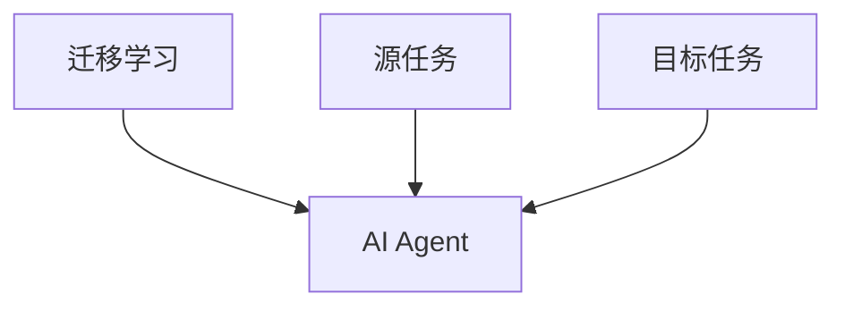
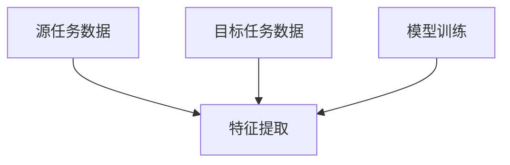
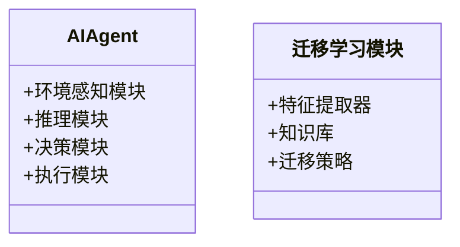
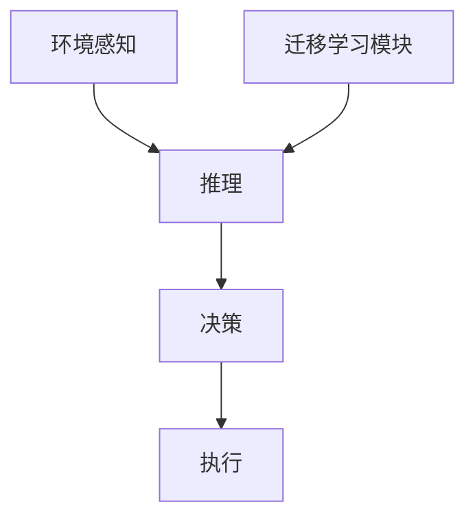
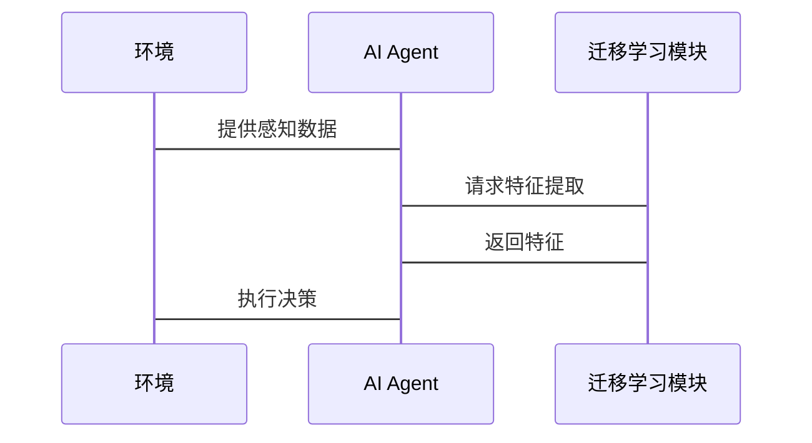

                 


# 开发具有迁移学习能力的AI Agent

> 关键词：迁移学习，AI Agent，深度学习，机器学习，知识迁移

> 摘要：本文详细探讨了开发具有迁移学习能力的AI Agent的背景、核心概念、算法原理、系统架构设计以及实际应用。通过理论分析和代码实现，展示了如何利用迁移学习提升AI Agent的性能和适应性。

---

## 第一部分: 开发具有迁移学习能力的AI Agent背景介绍

### 第1章: 迁移学习与AI Agent概述

#### 1.1 问题背景

##### 1.1.1 当前AI Agent的发展现状

AI Agent（人工智能代理）是一种能够感知环境、自主决策并执行任务的智能系统。随着技术的进步，AI Agent已经在多个领域得到广泛应用，如自动驾驶、智能客服、游戏AI等。然而，传统的AI Agent通常依赖大量的任务特定数据进行训练，这在实际应用中往往难以满足需求，尤其是在需要处理多种任务或动态变化的环境中。

##### 1.1.2 迁移学习在AI Agent中的必要性

在实际应用中，AI Agent需要处理的任务往往是多样化的，且数据获取可能存在成本高、数量少等问题。迁移学习作为一种能够利用已有知识和经验来提升新任务性能的技术，能够有效解决这些问题。通过迁移学习，AI Agent可以在新任务中快速适应，减少对新数据的依赖，从而提高效率和性能。

##### 1.1.3 问题解决的路径与目标

迁移学习的目标是将从源任务中学到的知识和经验应用到目标任务中，从而提高目标任务的性能。在AI Agent的开发中，迁移学习可以帮助代理更快地适应新环境、新任务或新数据，从而提升其智能性和实用性。

#### 1.2 核心概念与联系

##### 1.2.1 迁移学习的定义与原理

迁移学习是指将从一个任务或数据集中学到的知识应用到另一个任务或数据集中的过程。其核心在于找到源任务和目标任务之间的共同特征或规律，并通过这些特征来提升目标任务的性能。

##### 1.2.2 AI Agent的基本概念与功能

AI Agent是一种智能系统，能够感知环境、理解用户需求、做出决策并执行任务。AI Agent的核心功能包括感知、推理、决策和执行。

##### 1.2.3 迁移学习与AI Agent的结合

通过迁移学习，AI Agent可以在不同任务之间共享知识和经验，从而提高其在新任务中的表现。例如，在自动驾驶中，可以通过迁移学习将城市道路驾驶的经验应用到乡村道路环境中。

##### 1.2.4 核心概念对比分析表格

| 概念       | 描述                                                                 |
|------------|----------------------------------------------------------------------|
| 源任务     | 已知任务，用于迁移学习的起点                                           |
| 目标任务   | 新任务，迁移学习的目标                                                 |
| 迁移学习   | 利用源任务的知识提升目标任务的性能                                     |

##### 1.2.5 ER实体关系图架构



#### 1.3 本章小结

本章介绍了迁移学习和AI Agent的基本概念，分析了迁移学习在AI Agent中的必要性，并通过对比分析和实体关系图展示了核心概念之间的联系。

---

### 第2章: 迁移学习算法原理

#### 2.1 迁移学习的基本原理

##### 2.1.1 数据表示与特征提取

迁移学习的核心在于通过特征提取将源任务和目标任务的数据映射到一个共同的特征空间，从而实现知识的共享。

##### 2.1.2 知识迁移的数学模型

迁移学习的数学模型通常包括源任务和目标任务的损失函数，以及用于衡量两者之间相似性的度量。

##### 2.1.3 迁移学习的关键步骤



#### 2.2 基于深度学习的迁移学习

##### 2.2.1 深度神经网络的表示学习

深度神经网络通过多层的非线性变换，能够自动提取数据的高层次特征，从而实现有效的表示学习。

##### 2.2.2 预训练与微调策略

预训练是在大规模通用数据集上进行模型训练，微调是在目标任务数据上进行 fine-tuning。

##### 2.2.3 模型压缩与知识蒸馏

模型压缩通过减少模型参数数量来降低计算成本，知识蒸馏则通过将大模型的知识迁移到小模型中。

##### 2.2.4 实例对比分析

```python
import torch
class迁移学习模型:
    def __init__(self):
        self.encoder = ...  # 编码器
        self.decoder = ...  # 解码器
    def forward(self, x):
        features = self.encoder(x)
        output = self.decoder(features)
        return output
```

#### 2.3 数学模型与公式

##### 2.3.1 表示学习的损失函数

$$L = L_{source} + \lambda L_{target}$$

##### 2.3.2 知识蒸馏的损失函数

$$L = L_{student} + \alpha L_{teacher}$$

##### 2.3.3 对比学习的目标函数

$$L = -\sum_{i} \log \text{sim}(x_i, y_i)$$

#### 2.4 本章小结

本章详细讲解了迁移学习的基本原理，介绍了基于深度学习的迁移学习方法，并通过实例和公式展示了其具体实现。

---

### 第3章: AI Agent的系统架构设计

#### 3.1 问题场景介绍

##### 3.1.1 多任务学习的需求

AI Agent需要在多个任务之间切换，迁移学习能够帮助其快速适应新任务。

##### 3.1.2 动态环境的适应性

在动态变化的环境中，AI Agent需要通过迁移学习不断更新知识，以应对新的挑战。

#### 3.2 系统功能设计

##### 3.2.1 领域模型



##### 3.2.2 系统架构设计



##### 3.2.3 接口设计

AI Agent需要与外部环境进行交互，接口设计包括感知接口、决策接口和执行接口。

##### 3.2.4 交互流程



#### 3.3 本章小结

本章详细描述了AI Agent的系统架构设计，包括领域模型、系统架构图、接口设计和交互流程。

---

### 第4章: 项目实战

#### 4.1 环境安装

##### 4.1.1 安装Python和相关库

```bash
pip install torch numpy matplotlib
```

##### 4.1.2 安装深度学习框架

```bash
pip install torch torchvision
```

#### 4.2 核心代码实现

##### 4.2.1 特征提取器

```python
class FeatureExtractor(torch.nn.Module):
    def __init__(self):
        super(FeatureExtractor, self).__init__()
        self.conv1 = torch.nn.Conv2d(3, 64, kernel_size=3, stride=1, padding=1)
        self.conv2 = torch.nn.Conv2d(64, 128, kernel_size=3, stride=1, padding=1)
        self.pool = torch.nn.MaxPool2d(kernel_size=2, stride=2)
        self.fc1 = torch.nn.Linear(128 * 8 * 8, 512)
        self.fc2 = torch.nn.Linear(512, 256)
```

##### 4.2.2 迁移学习模块

```python
class迁移学习模型:
    def __init__(self):
        self.encoder = FeatureExtractor()
        self.decoder = torch.nn.Linear(256, 10)
    def forward(self, x):
        features = self.encoder(x)
        output = self.decoder(features)
        return output
```

#### 4.3 案例分析

##### 4.3.1 数据准备

```python
import torch.utils.data
class MyDataset(torch.utils.data.Dataset):
    def __init__(self, x, y):
        self.x = x
        self.y = y
    def __len__(self):
        return len(self.x)
    def __getitem__(self, idx):
        return self.x[idx], self.y[idx]
```

##### 4.3.2 训练过程

```python
model = 迁移学习模型()
criterion = torch.nn.CrossEntropyLoss()
optimizer = torch.optim.Adam(model.parameters(), lr=0.001)
for epoch in range(10):
    for inputs, labels in dataloader:
        outputs = model(inputs)
        loss = criterion(outputs, labels)
        optimizer.zero_grad()
        loss.backward()
        optimizer.step()
```

#### 4.4 本章小结

本章通过实例展示了如何在实际项目中应用迁移学习，包括环境安装、核心代码实现和案例分析。

---

## 第五部分: 最佳实践和小结

### 第5章: 最佳实践与注意事项

#### 5.1 最佳实践

##### 5.1.1 数据预处理

在迁移学习中，数据预处理是非常重要的一步，包括归一化、标准化等。

##### 5.1.2 模型选择

选择适合任务的模型，并根据需要进行调整和优化。

##### 5.1.3 参数调整

合理调整模型参数和超参数，以获得最佳性能。

#### 5.2 注意事项

##### 5.2.1 数据分布差异

注意源任务和目标任务的数据分布差异，避免迁移学习失败。

##### 5.2.2 过度迁移

防止过度依赖迁移学习，导致模型在目标任务上表现不佳。

##### 5.2.3 计算资源

迁移学习通常需要大量的计算资源，确保硬件配置充足。

#### 5.3 拓展阅读

推荐阅读迁移学习相关的论文和书籍，如《Deep Learning》。

### 第5章: 小结

本文详细探讨了开发具有迁移学习能力的AI Agent的背景、核心概念、算法原理、系统架构设计以及实际应用。通过理论分析和代码实现，展示了如何利用迁移学习提升AI Agent的性能和适应性。

---

## 作者：AI天才研究院/AI Genius Institute & 禅与计算机程序设计艺术 /Zen And The Art of Computer Programming

---

这篇文章详细介绍了开发具有迁移学习能力的AI Agent的各个方面，从理论到实践，为读者提供了全面的指导和深入的分析。

