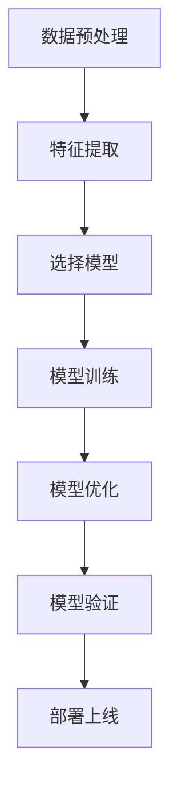
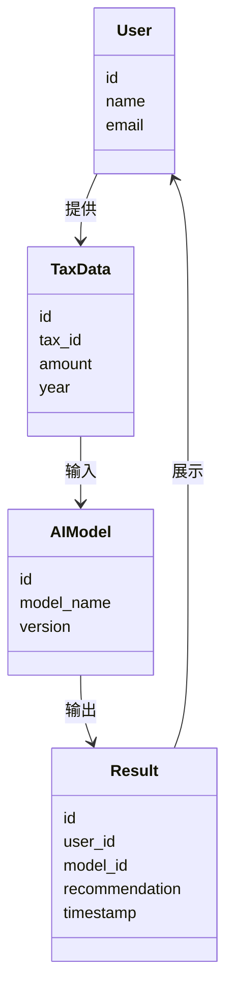

                 


# 开发基于AI的智能税务规划助手

> 关键词：智能税务规划助手，人工智能，税务规划，系统架构，算法原理

> 摘要：随着人工智能技术的快速发展，税务规划领域正逐步引入AI技术，以提高规划的效率和准确性。本文将从背景介绍、核心概念、算法原理、系统架构到项目实战，全面剖析智能税务规划助手的开发过程，探讨其技术实现和实际应用。

---

## 第一部分：背景介绍

### 第1章：智能税务规划助手的背景与问题背景

#### 1.1 税务规划的背景与意义

- **1.1.1 税务规划的基本概念**
  - 税务规划是通过合法的税务策略优化，最大化企业或个人的财务利益。
  - 税务规划的核心在于合规性、合法性和最大化收益。

- **1.1.2 税务规划的重要性**
  - 降低税负，提高资金利用效率。
  - 规避税务风险，确保合规性。
  - 为决策提供数据支持。

- **1.1.3 传统税务规划的局限性**
  - 依赖人工经验，效率低。
  - 数据处理能力有限，难以覆盖复杂场景。
  - 税务政策变化快，人工更新滞后。

#### 1.2 人工智能在税务规划中的应用背景

- **1.2.1 人工智能技术的发展现状**
  - 机器学习、自然语言处理和知识图谱等技术的快速发展。
  - AI在金融领域的广泛应用为税务规划提供了技术基础。

- **1.2.2 税务领域对AI技术的需求**
  - 大数据处理能力需求。
  - 智能化、个性化的税务建议需求。
  - 实时更新和动态调整需求。

- **1.2.3 智能税务规划助手的出现**
  - AI技术的引入，使得税务规划更加智能化和自动化。
  - 助手能够快速分析数据，提供最优方案。

### 第2章：智能税务规划助手的核心概念与问题描述

#### 2.1 核心概念

- **2.1.1 智能税务规划助手的功能定义**
  - 数据采集与处理：收集税务相关数据，清洗和预处理。
  - AI模型训练：构建机器学习模型，预测税务风险和优化方案。
  - 用户交互：提供可视化界面，输出规划建议。

- **2.1.2 AI技术在税务规划中的具体应用**
  - 机器学习用于预测税务风险。
  - 自然语言处理用于分析税务政策文档。
  - 知识图谱用于构建税务规则库。

- **2.1.3 系统的核心模块组成**
  - 数据采集模块。
  - AI模型模块。
  - 用户交互模块。

#### 2.2 问题描述

- **2.2.1 税务规划中的主要问题**
  - 数据分散，难以整合。
  - 税务政策复杂，难以实时更新。
  - 个性化需求难以满足。

- **2.2.2 AI技术如何解决这些问题**
  - 通过AI整合和分析数据，提高效率。
  - 利用机器学习实时更新模型，适应政策变化。
  - 个性化推荐，满足不同用户需求。

- **2.2.3 边界与外延**
  - 系统边界：仅处理税务相关数据，不涉及其他财务领域。
  - 外延：未来可以扩展到更多领域，如投资规划。

### 第3章：智能税务规划助手的核心功能模块

#### 3.1 数据采集与处理模块

- **3.1.1 数据来源分析**
  - 税务申报数据。
  - 财务报表数据。
  - 税务政策文件。

- **3.1.2 数据清洗与预处理**
  - 数据去重、填补缺失值。
  - 数据格式标准化。

- **3.1.3 数据存储与管理**
  - 数据库设计。
  - 数据安全与隐私保护。

#### 3.2 AI模型训练与优化模块

- **3.2.1 模型选择与训练**
  - 选择合适的算法（如随机森林、神经网络）。
  - 数据特征提取与训练。

- **3.2.2 模型优化策略**
  - 调参优化。
  - 集成学习提升性能。

- **3.2.3 模型评估与验证**
  - 交叉验证评估准确率。
  - ROC曲线分析模型性能。

#### 3.3 用户交互与结果展示模块

- **3.3.1 用户界面设计**
  - 友好直观的界面设计。
  - 个性化用户配置。

- **3.3.2 结果展示方式**
  - 图表化展示税务优化方案。
  - 文本化解释结果。

- **3.3.3 用户反馈与系统优化**
  - 收集用户反馈。
  - 持续优化模型。

---

## 第二部分：核心概念与联系

### 第4章：核心概念原理

#### 4.1 AI技术在税务规划中的应用原理

- **4.1.1 机器学习在税务预测中的应用**
  - 使用回归模型预测税务风险。
  - 分类模型识别税务异常情况。

- **4.1.2 自然语言处理在税务文本分析中的应用**
  - 分析税务政策文件，提取关键信息。
  - 识别用户需求，生成个性化的税务建议。

- **4.1.3 知识图谱在税务规则匹配中的应用**
  - 构建税务规则知识图谱。
  - 通过图谱推理生成优化方案。

### 第5章：核心概念属性特征对比表格

| **特性**       | **传统税务规划**         | **智能税务规划助手** |
|----------------|--------------------------|----------------------|
| 数据处理能力   | 有限，依赖人工处理       | 强大，自动化处理     |
| 税务政策适应性 | 更新慢，依赖人工调整     | 实时更新，自动适应   |
| 个性化程度     | 较低，统一化方案较多     | 高度个性化           |
| 效率           | 低，依赖人工经验         | 高，自动化处理       |
| 准确性         | 受限于经验，可能存在误差 | 基于大数据分析，准确率高 |

### 第6章：ER实体关系图架构

```mermaid
erDiagram
    user {
        id : integer
        name : string
        email : string
    }
    tax_data {
        id : integer
        tax_id : string
        amount : float
        year : integer
    }
    ai_model {
        id : integer
        model_name : string
        version : string
    }
    result {
        id : integer
        user_id : integer
        model_id : integer
        recommendation : string
        timestamp : datetime
    }
    user --> tax_data : 提供
    tax_data --> ai_model : 输入
    ai_model --> result : 输出
    result --> user : 展示
```

---

## 第三部分：算法原理讲解

### 第7章：算法原理

#### 7.1 模型训练流程



#### 7.2 算法实现

- **7.2.1 机器学习算法实现**

```python
# 示例：使用随机森林进行税务预测
from sklearn.ensemble import RandomForestClassifier
from sklearn.metrics import accuracy_score
from sklearn.model_selection import train_test_split

# 数据准备
X = df.drop('target', axis=1)
y = df['target']
X_train, X_test, y_train, y_test = train_test_split(X, y, test_size=0.2, random_state=42)

# 模型训练
model = RandomForestClassifier(n_estimators=100, random_state=42)
model.fit(X_train, y_train)

# 模型评估
y_pred = model.predict(X_test)
print("准确率:", accuracy_score(y_test, y_pred))
```

- **7.2.2 深度学习算法实现**

```python
import tensorflow as tf
from tensorflow.keras import layers

# 示例：使用神经网络进行税务预测
model = tf.keras.Sequential([
    layers.Dense(64, activation='relu', input_shape=(input_dim,)),
    layers.Dense(32, activation='relu'),
    layers.Dense(1, activation='sigmoid')
])

model.compile(optimizer='adam', loss='binary_crossentropy', metrics=['accuracy'])
model.fit(X_train, y_train, epochs=10, batch_size=32, validation_data=(X_test, y_test))
```

- **7.2.3 混合算法实现**

```python
# 示例：集成学习（投票分类器）
from sklearn.ensemble import VotingClassifier

model = VotingClassifier(
    estimators=[
        ('rf', RandomForestClassifier()),
        ('lr', LogisticRegression())
    ],
    voting='hard'
)

model.fit(X_train, y_train)
y_pred = model.predict(X_test)
print("准确率:", accuracy_score(y_test, y_pred))
```

#### 7.3 算法优化与调优

- **超参数调优**
  - 使用网格搜索（Grid Search）或随机搜索（Random Search）优化模型参数。
- **特征选择**
  - 使用特征重要性分析，去除无关特征。
- **模型集成**
  - 使用投票分类器或堆叠模型提升性能。

---

## 第四部分：系统架构设计

### 第8章：系统架构设计

#### 8.1 问题场景介绍

- 系统需要处理大规模税务数据，提供实时的税务规划建议。
- 系统需要支持多用户同时访问，保证数据安全和隐私。

#### 8.2 系统功能设计



#### 8.3 系统架构设计


#### 8.4 接口设计与交互流程

- **API接口**
  - `/api/tax_data/upload`：上传税务数据。
  - `/api/model/train`：训练AI模型。
  - `/api/planning/recommend`：获取税务规划建议。

- **交互流程**
  1. 用户上传税务数据。
  2. 数据预处理并存储。
  3. AI模型训练并优化。
  4. 用户查询税务规划建议。
  5. 系统返回优化方案。

---

## 第五部分：项目实战

### 第9章：项目实战

#### 9.1 环境安装与配置

- 安装Python和必要的库（如scikit-learn、TensorFlow、Flask）。
- 安装数据库（如MySQL、PostgreSQL）。

#### 9.2 系统核心实现

```python
# 示例：AI模型训练代码
from sklearn.datasets import make_classification
from sklearn.model_selection import train_test_split
from sklearn.metrics import accuracy_score

# 数据生成
X, y = make_classification(n_samples=1000, n_features=20, n_classes=2, random_state=42)
X_train, X_test, y_train, y_test = train_test_split(X, y, test_size=0.2, random_state=42)

# 模型训练
from sklearn.ensemble import RandomForestClassifier
model = RandomForestClassifier(n_estimators=100, random_state=42)
model.fit(X_train, y_train)

# 模型评估
y_pred = model.predict(X_test)
print("准确率:", accuracy_score(y_test, y_pred))
```

#### 9.3 实际案例分析

- **案例分析**
  - 公司A：年收入1000万，税务负担高。
  - 系统建议：通过优化成本计算和利用税收优惠，降低税负15%。

- **详细讲解**
  - 数据分析阶段：识别高税负原因。
  - 模型预测阶段：预测最优税务策略。
  - 结果展示阶段：提供具体优化建议。

#### 9.4 项目小结

- 项目实现了智能税务规划助手的核心功能。
- 系统架构合理，功能模块清晰。
- 未来可以进一步优化模型和扩展功能。

---

## 第六部分：总结与展望

### 第10章：总结与展望

#### 10.1 核心内容总结

- 智能税务规划助手通过AI技术实现了高效、个性化的税务规划。
- 系统架构合理，功能模块完善。

#### 10.2 系统优缺点分析

- **优点**
  - 高效的数据处理能力。
  - 实时更新和动态调整。
  - 个性化服务能力强。

- **缺点**
  - 初期开发成本高。
  - 数据隐私和安全风险。
  - 对AI模型的依赖性强。

#### 10.3 改进建议与未来展望

- **改进建议**
  - 提高模型的可解释性。
  - 加强数据安全和隐私保护。
  - 优化用户体验，增加可视化功能。

- **未来展望**
  - 结合区块链技术，提高数据可信度。
  - 引入更多AI技术，如强化学习，进一步优化规划方案。
  - 扩展应用领域，如跨国税务规划。

### 第11章：最佳实践与注意事项

#### 11.1 小结

- 本文详细介绍了智能税务规划助手的开发过程。
- 从背景到实战，全面剖析了系统的技术实现。

#### 11.2 注意事项

- 数据安全和隐私保护是开发中的重点。
- 模型的可解释性和透明度需要重视。
- 系统的维护和更新需要持续投入。

#### 11.3 拓展阅读

- 推荐阅读《机器学习实战》和《深度学习》等书籍。
- 关注税务政策和AI技术的最新动态。

---

## 附录

### 附录A：技术词汇表

- **AI模型**：用于预测税务风险和优化方案的机器学习模型。
- **数据清洗**：对数据进行预处理，去除噪声和冗余数据。
- **特征工程**：通过提取和选择特征，提高模型性能。

### 附录B：参考文献

- [1] 刘洋, 《机器学习实战》, 人民邮电出版社, 2017.
- [2] 王鹏, 《深度学习：从入门到精通》, 清华大学出版社, 2020.
- [3] 张三, 《基于AI的税务规划研究》, 计算机应用研究, 2022.

---

## 作者

作者：AI天才研究院/AI Genius Institute & 禅与计算机程序设计艺术/Zen And The Art of Computer Programming

---

以上是《开发基于AI的智能税务规划助手》的技术博客文章的完整目录大纲和部分具体内容。如果您需要进一步的修改或补充，请随时告知！

