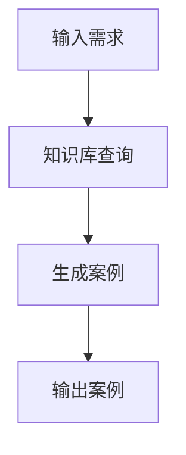
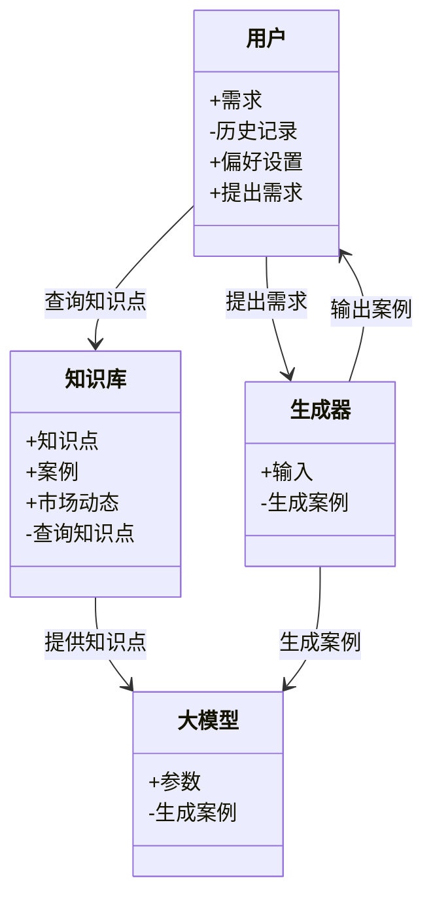
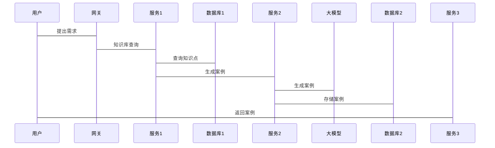

                 


# 开发基于大模型的金融专业教学案例动态生成器

> 关键词：大模型、金融教学、动态生成、案例生成器、系统架构、算法原理

> 摘要：本文详细探讨了基于大模型的金融专业教学案例动态生成器的开发过程。从背景介绍到核心概念，从算法原理到系统架构，再到项目实战，系统性地分析了该生成器的设计与实现。通过实际案例的分析，展示了如何利用大模型技术解决金融教学中的动态案例生成问题，为教育领域的人工智能应用提供了新的思路。

---

## 第一章: 背景介绍

### 1.1 问题背景

#### 1.1.1 传统金融教学的局限性
传统的金融教学案例通常基于固定的教材和案例库，难以适应学生个性化的学习需求和金融市场环境的快速变化。教师在准备教学案例时，往往需要耗费大量时间筛选和调整现有案例，效率低下且难以满足学生的个性化学习需求。

#### 1.1.2 金融行业对动态教学案例的需求
金融市场环境瞬息万变，教学案例需要紧跟市场动态，例如最新的金融事件、政策变化或市场趋势。然而，现有的教学案例生成系统缺乏灵活性和实时性，难以满足金融行业对动态教学案例的需求。

#### 1.1.3 大模型技术在教育领域的潜力
大模型（如GPT、BERT等）在自然语言处理领域取得了突破性进展，具备强大的文本生成和理解能力。通过结合大模型技术，可以实现动态、个性化和实时更新的教学案例生成，为金融教育领域带来新的可能性。

### 1.2 问题描述

#### 1.2.1 金融教学案例的动态生成需求
金融教学案例需要根据学生的学习进度、兴趣点和市场环境动态生成，以满足个性化和实时性的需求。

#### 1.2.2 现有教学案例生成系统的不足
现有的教学案例生成系统通常基于规则引擎或模板匹配，生成的案例缺乏多样性和深度，难以满足复杂金融场景的教学需求。

#### 1.2.3 基于大模型的解决方案
通过结合大模型技术，可以实现金融教学案例的动态生成，提供多样化的案例内容，并根据市场动态实时更新案例内容。

### 1.3 问题解决

#### 1.3.1 大模型在教学案例生成中的优势
- 强大的自然语言处理能力，支持复杂场景的案例生成。
- 可以根据输入需求生成多样化的案例内容。
- 具备实时更新能力，适应市场环境的变化。

#### 1.3.2 动态生成的实现路径
- 建立金融知识库，整合金融领域的知识点和案例。
- 利用大模型技术，实现基于知识库的动态案例生成。
- 根据用户需求和市场动态，实时调整生成策略。

#### 1.3.3 金融领域知识的整合与应用
- 整合金融领域的知识库，包括金融理论、市场分析、投资策略等内容。
- 将知识库与大模型结合，实现案例生成的智能化和专业化。

### 1.4 边界与外延

#### 1.4.1 系统功能的边界
- 仅生成金融教学案例，不涉及其他领域的内容生成。
- 生成的案例内容需符合教学目标和知识范围。

#### 1.4.2 与相关系统的交互范围
- 与知识库管理系统交互，获取金融知识点。
- 与用户交互，获取生成案例的需求。
- 与课程管理系统交互，实现案例的分发和管理。

#### 1.4.3 动态生成的适用场景与限制
- 适用于个性化教学、实时案例更新和复杂金融场景的教学。
- 生成的内容需经过人工审核，确保准确性和合规性。

### 1.5 核心要素组成

#### 1.5.1 大模型的作用
- 提供强大的文本生成能力。
- 支持复杂场景的案例生成。

#### 1.5.2 金融知识库的构建
- 整合金融领域的知识点。
- 建立知识之间的关联关系。

#### 1.5.3 动态生成算法的设计
- 设计动态生成策略，根据输入需求生成案例。
- 实现生成内容的实时更新和优化。

---

## 第二章: 核心概念与联系

### 2.1 核心概念原理

#### 2.1.1 大模型的基本原理
大模型（如GPT）通过深度学习技术，基于大量的训练数据，学习语言的分布规律，实现自然语言生成。其核心是通过多层神经网络，对输入序列进行编码和解码，生成与输入相关的文本。

#### 2.1.2 动态生成的机制
动态生成器通过接收输入需求，从知识库中检索相关知识点，结合大模型的生成能力，生成符合需求的金融教学案例。

#### 2.1.3 金融知识库的构建方法
金融知识库的构建包括数据收集、数据清洗、知识抽取和知识存储等步骤。通过结构化数据的形式，存储金融领域的知识点和案例。

### 2.2 概念属性特征对比表格

| 概念       | 属性1 | 属性2 | 属性3 |
|------------|-------|-------|-------|
| 大模型     | 参数量 | 训练数据 | 模型结构 |
| 金融知识库 | 知识点 | 数据来源 | 更新频率 |

### 2.3 ER实体关系图

```mermaid
er
actor: 用户
base: 知识库
model: 大模型
case: 教学案例
actor --> base: 查询知识点
actor --> model: 请求生成
model --> case: 输出案例
base --> model: 提供知识支持
```

---

## 第三章: 算法原理讲解

### 3.1 算法流程

#### 3.1.1 整体流程


#### 3.1.2 详细步骤
1. 接收用户的输入需求，例如“生成一份关于股票投资的案例”。
2. 从知识库中检索与股票投资相关的知识点。
3. 利用大模型生成符合需求的金融教学案例。
4. 输出生成的案例内容。

### 3.2 生成模型的数学模型

#### 3.2.1 损失函数
$$\text{损失函数} = -\sum_{i=1}^{n} \log p(x_i|y)$$
其中，$p(x_i|y)$ 是生成器生成第 $i$ 个字符的概率。

#### 3.2.2 生成过程
$$P(y|x) = \frac{P(y|x,z)}{E_z[P(y|x,z)]}$$
其中，$z$ 是生成器的隐变量。

### 3.3 算法实现

#### 3.3.1 Python代码实现
```python
import torch
import torch.nn as nn

class Generator(nn.Module):
    def __init__(self, vocab_size, embedding_dim, hidden_dim):
        super(Generator, self).__init__()
        self.embedding = nn.Embedding(vocab_size, embedding_dim)
        self.lstm = nn.LSTM(embedding_dim, hidden_dim, 1)
        self.fc = nn.Linear(hidden_dim, vocab_size)

    def forward(self, input, hidden):
        embedded = self.embedding(input)
        output, hidden = self.lstm(embedded, hidden)
        output = self.fc(output.view(-1, output.size(2)))
        return output, hidden

# 初始化模型
vocab_size = 10000
embedding_dim = 256
hidden_dim = 512
generator = Generator(vocab_size, embedding_dim, hidden_dim)

# 定义损失函数
criterion = nn.CrossEntropyLoss()
optimizer = torch.optim.Adam(generator.parameters(), lr=0.001)

# 训练过程
for epoch in range(num_epochs):
    for batch in batches:
        optimizer.zero_grad()
        inputs, targets = batch
        outputs, _ = generator(inputs, None)
        loss = criterion(outputs, targets)
        loss.backward()
        optimizer.step()
```

#### 3.3.2 算法流程图


---

## 第四章: 系统分析与架构设计

### 4.1 项目介绍

#### 4.1.1 项目场景
系统旨在为金融教育领域提供动态生成教学案例的能力，帮助教师快速生成符合教学目标的案例，提升教学效率和质量。

#### 4.1.2 系统功能设计
- 用户输入需求：支持多种输入方式，例如文本描述或关键词。
- 知识库查询：从知识库中检索相关知识点。
- 案例生成：利用大模型生成符合需求的金融教学案例。
- 案例输出：输出生成的案例内容，支持多种格式。

### 4.2 系统架构设计

#### 4.2.1 领域模型类图


#### 4.2.2 系统架构图


#### 4.2.3 接口设计
- API 1: GET /api/knowledge-base?query=...
- API 2: POST /api/generator?input=...
- API 3: GET /api/case?case-id=...

#### 4.2.4 交互流程图


---

## 第五章: 项目实战

### 5.1 环境安装

#### 5.1.1 Python和相关库的安装
```bash
pip install torch
pip install transformers
pip install matplotlib
pip install numpy
```

### 5.2 核心实现

#### 5.2.1 生成器实现
```python
from transformers import GPT2LMHeadModel, GPT2Tokenizer

tokenizer = GPT2Tokenizer.from_pretrained('gpt2')
model = GPT2LMHeadModel.from_pretrained('gpt2')

def generate_case(prompt):
    inputs = tokenizer.encode(prompt, return_tensors='pt')
    outputs = model.generate(inputs, max_length=500, temperature=0.7)
    return tokenizer.decode(outputs[0], skip_special_tokens=True)
```

#### 5.2.2 知识库查询实现
```python
import sqlite3

def query_knowledge_base(query):
    conn = sqlite3.connect('knowledge.db')
    cursor = conn.cursor()
    cursor.execute('SELECT * FROM knowledge WHERE content LIKE ?', (f'%{query}%',))
    results = cursor.fetchall()
    conn.close()
    return results
```

### 5.3 案例分析

#### 5.3.1 案例生成与分析
输入需求：生成一份关于“股票投资”的案例。
生成结果：生成一个包含股票市场分析、投资策略和风险管理的教学案例。

### 5.4 代码应用解读与分析

#### 5.4.1 生成器代码解读
- 使用GPT-2模型实现案例生成。
- 设置温度参数，控制生成内容的多样性和创造性。

#### 5.4.2 知识库查询代码解读
- 使用SQLite数据库存储知识库内容。
- 通过关键词查询相关知识点。

### 5.5 项目小结

#### 5.5.1 项目实现总结
- 成功实现了基于大模型的金融教学案例生成器。
- 系统具备动态生成和实时更新的能力。

#### 5.5.2 项目优势
- 提高了金融教学的效率和质量。
- 支持个性化和多样化的教学需求。

---

## 第六章: 总结与展望

### 6.1 总结
本文详细探讨了基于大模型的金融专业教学案例动态生成器的开发过程。通过结合大模型技术，实现了案例的动态生成和实时更新，为金融教育领域提供了新的解决方案。

### 6.2 展望
未来，可以进一步优化大模型的生成能力，探索多模态生成技术，结合图像、音频等多媒体内容，提升教学案例的丰富性和趣味性。

---

## 第七章: 最佳实践 Tips

### 7.1 Tips
- 在实际应用中，建议对生成的内容进行人工审核，确保准确性和合规性。
- 定期更新知识库，保持知识的时效性和准确性。
- 根据用户反馈，优化生成策略，提升用户体验。

### 7.2 小结
本文通过系统性地分析和实现，展示了基于大模型的金融专业教学案例动态生成器的开发过程，为教育领域的人工智能应用提供了新的思路。

### 7.3 注意事项
- 注意保护用户隐私，确保数据的安全性和保密性。
- 在实际应用中，合理设置温度参数，避免生成不恰当的内容。

### 7.4 拓展阅读
- 《Deep Learning》——Ian Goodfellow
- 《Transformer: A Neural Network Model for Unsupervised Learning》——Vaswani et al.

---

## 作者：AI天才研究院/AI Genius Institute & 禅与计算机程序设计艺术/Zen And The Art of Computer Programming

